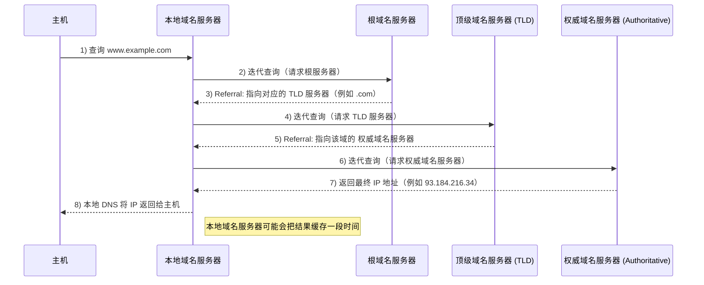
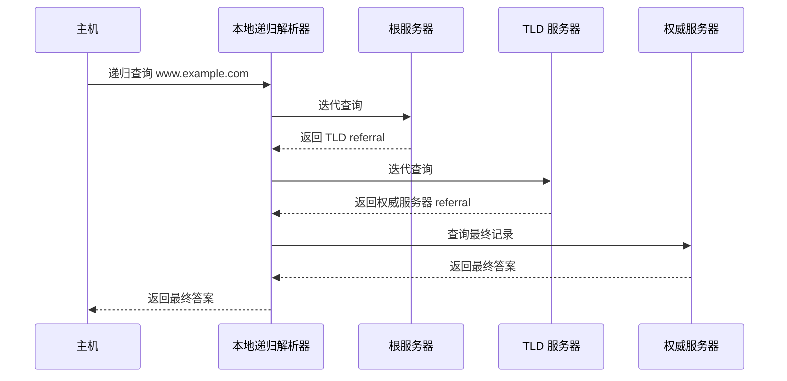

> **复习优先级：低。**
重点掌握 DNS 的层次域名空间、服务器层级、递归/迭代查询以及缓存机制。

> **真题考察**
> - 选择题：2010 年第 40 题、2016 年第 40 题、2020 年第 40 题
>
> 真题题号用于标记考查范围；原题库与视频链接已移除。

### 层次域名空间

**DNS** 使用层次化域名空间。完整域名从右向左体现由高到低的层级：最右侧隐含根域 `.`，其左侧是顶级域（TLD），再向左依次是二级域及更低层级的子域。

例如在 `www.example.com` 中，`com` 是顶级域，`example.com` 属于其下的二级域，`www` 是 `example.com` 域中的一个主机/子域标签。

<InlineSvg src="/images/computer-network/computer-network-application-dns-001.svg" alt={"DNS 图 1"} />

**DNS** **层次域名空间** 的设计使得域名分布在不同的管理区域中，每个管理区域负责管理其自己的域名空间。这种分层结构有助于提高可扩展性和效率。

### 域名服务器

<InlineSvg src="/images/computer-network/computer-network-application-dns-002.svg" alt={"DNS 图 2"} />

在 DNS 体系结构中，服务器按照层级划分，每一层负责不同的职责。下面按照从最高层到最低层的顺序，对四类常见的域名服务器进行说明：

1. **根域名服务器** (*Root Name Servers*):
   * 这些服务器位于 DNS 解析的最顶端。它们不直接回答关于哪个域名映射到哪个 IP 地址的查询，而是告诉查询者下一步应该询问哪个顶级域名（TLD）服务器。
   * DNS 根区由 13 个逻辑根服务器标识（A～M）提供服务，并通过 Anycast 等方式部署为全球大量实例。对 408 来说，重点理解其“返回下一层委派信息”的角色。
2. **顶级域名服务器** (*Top-Level Domain Name Servers, TLD*):
   * 这些服务器负责特定的顶级域名（如 `.com`, `.org`, `.net` 等）。它们为下一级的域名（如 `example.com`）提供有关权威名称服务器的信息。
3. **权威域名服务器** (*Authoritative Name Servers*):
   * 这些服务器为特定的域名（如 `example.com`）提供详细的 DNS 记录信息（例如 A 记录、MX 记录等）。权威 DNS 服务器保存并对其负责区域的数据给出权威应答。
   * 大多数组织拥有权威 DNS 服务器来为他们的域名提供解析服务。
4. **本地域名服务器** (*Local Name Server*)
   * 通常指主机配置使用的本地递归解析器，它负责接收客户端查询、利用缓存并在需要时继续向 DNS 层次结构查询。
   * 每个 **ISP** 或一所大学都可以有一个本地域名服务器。

### 域名解析过程

<InlineSvg src="/images/computer-network/computer-network-application-dns-003.svg" alt={"DNS 图 3"} />

域名解析分为 **递归查询** 和 **迭代查询** 两种。

* **递归查询**：查询者要求被查询服务器返回最终答案（或明确的失败结果），不需要自己继续逐级追问。
* **迭代查询**：服务器若没有最终答案，会返回下一步应查询的服务器信息，查询者再自行继续查询。

#### 迭代查询

<InlineSvg src="/images/computer-network/computer-network-application-dns-004.svg" alt={"DNS 图 4"} />

在域名解析过程中，**本地域名服务器** 向根域名服务器发送的通常是迭代查询。

当 **根域名服务器** 收到查询请求后，不会代替本地域名服务器继续查询，而是返回结果中的两种情况之一：

* 若能解析出所需的 IP 地址，则直接返回；
* 若不能解析，则告知本地域名服务器应当联系的下一级顶级域名服务器。

随后，本地域名服务器根据指引，向对应的 **顶级域名服务器** 继续查询。顶级域名服务器的处理方式类似：

* 若能解析出所需的 IP 地址，则返回结果；
* 否则告知本地域名服务器应当访问的下一步权威域名服务器。

权威域名服务器的处理流程类似，这里不再重复展开。最终，当本地域名服务器获得目标域名对应的 IP 地址后，会将结果返回给最初发起请求的主机。

#### 递归查询与迭代查询如何组合

<InlineSvg src="/images/computer-network/computer-network-application-dns-005.svg" alt={"DNS 递归与迭代查询组合示意"} />

实际互联网中最常见的是**两种查询方式组合使用**：

1. 主机上的 stub resolver 向本地递归解析器发送**递归查询**。
2. 若缓存没有答案，本地递归解析器依次向根、TLD、权威 DNS 服务器进行**迭代查询**。
3. 本地递归解析器得到最终记录后缓存结果，并把最终答案返回给主机。

DNS 递归查询和迭代查询的不同点如下表所示：

| **特点** | **递归查询** | **迭代查询** |
| --- | --- | --- |
| **查询责任** | 被查询服务器负责给出最终答案或失败结果 | 查询者根据 referral 逐级继续查询 |
| **查询复杂度** | 查询者只需等待最终结果 | 查询者需要根据返回的委派信息继续查询 |
| **使用场景** | 主机 → 本地递归解析器最常见 | 本地递归解析器 → 根/TLD/权威服务器最常见 |
| **性能** | 服务器负担较大 | 服务器负担较小 |

### DNS 缓存

<InlineSvg src="/images/computer-network/computer-network-application-dns-006.svg" alt={"DNS 图 6"} />

无论是浏览器、操作系统，还是本地的递归 DNS 服务器，在接收到域名解析结果之后，都会将其暂时保存在本地 **缓存** 中。这样，如果同一个域名在短时间内被多次请求，就可以直接从 **缓存** 中获取结果，而不需要再次向外部服务器发送查询请求。

**DNS** 记录中包含一个名为 **TTL**（Time to Live）的字段，用于指定这条记录可以在缓存中 **保存多久**。比如 **TTL** 为 ***3600*** 表示记录在缓存中可保留 **3600** 秒（即一小时）。在这段时间内，只要有查询，就可以直接使用缓存的结果。当 **TTL** 到期后，缓存记录会被丢弃，下一次查询将重新走完整的解析流程。
