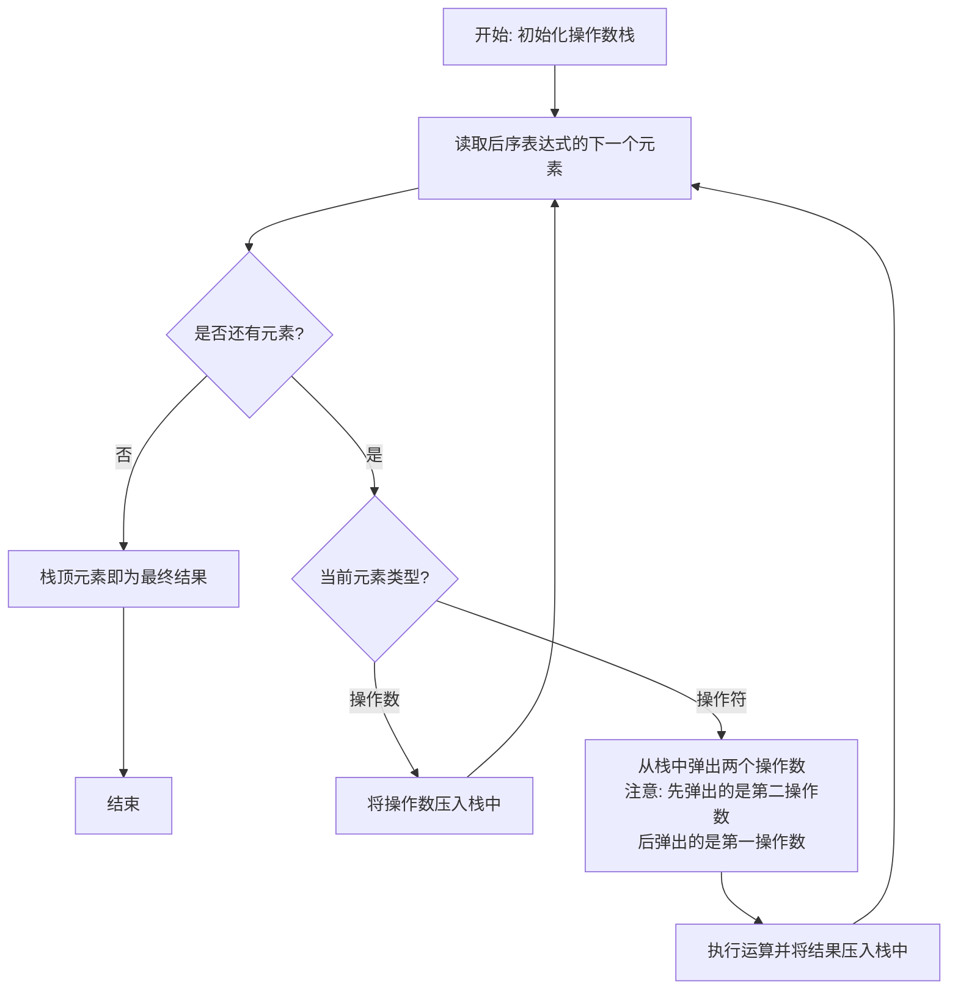
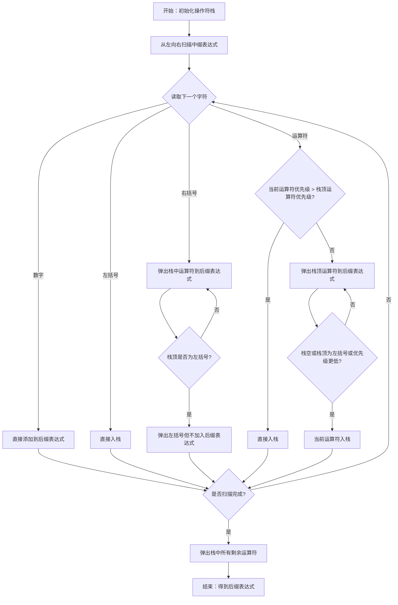

> **复习优先级：高。**
本节的几个知识点经常在选择题考察：中序表达式求值、中序转后序、后序表达式求值、入栈出栈序列。

### 二叉表达式树

**二叉表达式树**（Expression Tree）是一种特殊的二叉树，用于表示算术或逻辑表达式。它的每个 **叶子节点** 通常存放 **操作数**（Operand，如数字或变量），每个 **非叶子节点** 存放 **操作符**（Operator，如 `+`、`-`、`*`、`/`）。

表达式中的每一个 **运算** 都对应二叉树中的一个 **内部节点**，该运算所作用的两个对象分别对应它的 **左子树** 和 **右子树**。

例如，对于表达式：
```
(3 + 4) × (5 - 2) ÷ 7
```

可以按照运算顺序拆分：

1. 先计算 `3 + 4`
2. 再计算 `5 - 2`
3. 然后计算 `(3 + 4) × (5 - 2)`
4. 最后计算 `((3 + 4) × (5 - 2)) ÷ 7`

因此对应的表达式树中：

- 根节点为 `÷`
- 根节点的左子树表示 `(3 + 4) × (5 - 2)`
- 根节点的右子树为操作数 `7`
- 左子树的根节点为 `×`
- `×` 的左右子树分别表示 `3 + 4` 和 `5 - 2`
- 数字 `3`、`4`、`5`、`2`、`7` 都是叶子节点

<InlineSvg src="/images/data-structure/data-structure-array-application-001.svg" alt={"ExpressionTree"} />

可以发现，**表达式树描述的是表达式的运算顺序，而不是书写顺序**。越靠近叶子节点的运算越先进行，越靠近根节点的运算越后进行，也就是 **子表达式先计算，再逐层合成为整个表达式**。

由于表达式树具有明确的层次结构，因此对它采用不同的遍历方式，就能够得到不同形式的表达式。

### 表达式种类

前序表达式（Prefix，波兰表示法）、中序表达式（Infix）和后序表达式（Postfix，逆波兰表示法）是根据二叉表达式树的不同遍历方式得到的表达式结果。具体来说：

- 前序表达式：**前序遍历** 得到的序列。
- 中序表达式：**中序遍历** 得到的序列。
- 后序表达式：**后序遍历** 得到的序列。

<InlineSvg src="/images/data-structure/data-structure-array-application-002.svg" alt={"表达式树与前序、中序、后序表达式"} />

这三种表达式的 **操作符** 和 **操作数** 间的相对位置有所不同：

| 表达式类型 | 描述 | 示例表达式 | 对应的公式 |
| --- | --- | --- | --- |
| 前序 | 操作符位于其操作数之前 | `* + A B C` | `(A + B) * C` |
| 中序 | 操作符位于其两个操作数之间，最常见的表示法 | `(A + B) * C` | `(A + B) * C` |
| 后序 | 操作符位于其操作数之后 | `A B + C *` | `(A + B) * C` |

<InlineSvg src="/images/data-structure/data-structure-array-application-003.svg" alt={"ExpressionTypes"} />

### 中序表达式求值

中序表达式求值涉及到两个主要的数据结构：**操作符栈** 与 **操作数栈**。其核心思路是逐个读取中序表达式的字符，根据字符的类型（**操作数**、**操作符**、**括号**）进行不同的处理，最终得到表达式的值。

基本计算单元

在讲述中序表达式的求值流程之前，首先说明一下使用 操作数栈 和 操作符栈 的 **基本计算单元**：

- 从 **操作符栈** 中 **弹出一个操作符** `op`。
- 从 **操作数栈** 中弹出 **两个操作数** `B` 和 `A`。
- 执行该操作符对应的运算，得到结果 `res = A op B`。
- 将结果 `res` 压入 **操作数栈**。

<InlineSvg src="/images/data-structure/data-structure-array-application-004.svg" alt={"基本计算单元"} />

计算流程

1. **初始化两个栈**：
   - **操作数栈**：用来存储数字。
   - **操作符栈**：用来存储操作符和左括号。
2. **逐个读取中序表达式的字符**：
   - 如果是 **操作数**（数字），则直接压入 **操作数栈**。
   - 如果是 **左括号**，则直接压入 **操作符栈**。
   - 如果是 **右括号**，则：
     - 执行 基本计算单元
     - 重复以上步骤，直到从 **操作符栈** 中弹出一个左括号。
   - 如果是 **操作符**（常见的就是 `+`、`-`、`*`、`/`）：
     - 如果 **操作符栈** 为空，或栈顶是左括号，或当前操作符 **优先级** 高于栈顶操作符的 **优先级**，则直接压入 **操作符栈**。
       - 优先级：`*` 和 `/` 高于 `+` 和 `-`，`*` 和 `/` 相同，`+` 和 `-` 相同
     - 否则：
       - 基本计算单元
       - 重复以上步骤，直到满足上述的压栈条件。
3. **处理完所有字符后**：
   - 如果 **操作符栈** 不为空，则：
     - 执行 基本计算单元
   - 重复以上步骤，直到 **操作符栈** 为空。
4. **得到结果**：
   - 此时，**操作数栈** 中仅存一个数字，这就是整个中序表达式的值。

中序表达式求值的过程可以参照以下流程图进行理解：

<InlineSvg src="/images/data-structure/data-structure-array-application-005.svg" alt={"InfixEvaluation"} />

---

以表达式 `3 + (5 * 2 - 8)` 说明计算过程：

| 步骤 | 输入字符 | 操作 | 操作符栈 | 数据栈 |
| --- | --- | --- | --- | --- |
| 1 | `3` | 压入数据栈 |  | `3` |
| 2 | `+` | 压入 **操作符栈** | `+` | `3` |
| 3 | `(` | 压入 **操作符栈** | `+, (` | `3` |
| 4 | `5` | 压入数据栈 | `+, (` | `3, 5` |
| 5 | `*` | 压入 **操作符栈** | `+, (, *` | `3, 5` |
| 6 | `2` | 压入数据栈 | `+, (, *` | `3, 5, 2` |
| 7 | `-` | `*` **优先级** 高于 `-`，`*` 出栈计算后，将 `-` 入栈 | `+, (, -` | `3, 10` |
| 8 | `8` | 压入数据栈 | `+, (, -` | `3, 10, 8` |
| 9 | `)` | 处理到 `(` 之前的所有操作符 | `+` | `3, 2` |
| 10 |  | 用 `+` 运算符计算 |  | `5` |

### 后序表达式求值

> **真题考察**
> - 选择题：2018 年第 1 题

后序表达式求值主要依赖一个 **操作数栈**。其核心思路是逐个读取后序表达式的元素，并根据元素的类型（**操作数**或**操作符**）进行处理。

1. **初始化一个**操作数栈******：
   - 用于存储后序表达式中的数字。
2. **逐个读取后序表达式的元素**：
   - 如果是**操作数**，则直接压入 **操作数栈**。
   - 如果是**操作符**（如+、-、\*、/等）：
     - 从 **操作数栈** 中弹出所需的操作数。注意，因为操作符是后置的，所以先弹出的数字是第二操作数，后弹出的是第一操作数。
     - 根据操作符执行相应的运算。
     - 将计算结果压入 **操作数栈**。
3. **完成后序表达式的读取**：
   - **操作数栈** 中的顶部元素即为整个后序表达式的值。

基本计算单元

在后序表达式求值中，操作符直接触发基本计算流程：

<InlineSvg src="/images/data-structure/data-structure-array-application-006.svg" alt={"后序表达式求值中操作数栈的操作"} />

计算流程

后序表达式求值的过程可以参照以下流程图进行理解：


以表达式 `3 5 2 * 8 - +` 说明计算过程：

| 步骤 | 输入字符 | 操作 | 操作数栈 |
| --- | --- | --- | --- |
| 1 | `3` | 压入 **操作数栈** | `3` |
| 2 | `5` | 压入 **操作数栈** | `3, 5` |
| 3 | `2` | 压入 **操作数栈** | `3, 5, 2` |
| 4 | `*` | 弹出两个操作数并相乘，结果压入 **操作数栈** | `3, 10` |
| 5 | `8` | 压入 **操作数栈** | `3, 10, 8` |
| 6 | `-` | 弹出两个操作数并相减，结果压入 **操作数栈** | `3, 2` |
| 7 | `+` | 弹出两个操作数并相加，结果压入 **操作数栈** | `5` |

### 中序转后序

> **真题考察**
> - 选择题：2012 年第 2 题、2014 年第 2 题、2024 年第 2 题

将中缀表达式转换为后缀表达式的算法思想如下：

初始化一个 **操作符栈**，从左向右开始扫描中缀表达式；

- 遇到数字时，加入后缀表达式；
- 遇到运算符时：
  - 若为 `（`，入栈；
  - 若为 `）`，则依次把栈中的运算符加入后缀表达式中，直到出现 `（`，从栈中删除 `（`；
  - 若为除括号外的其他运算符
    - 当其 **优先级** 高于除 `（` 以外的栈顶运算符时，直接入栈；
    - 否则从栈顶开始，依次弹出 **优先级** 高于或等于当前运算符的运算符，直到遇到 **优先级** 更低的运算符或左括号为止。弹出的操作符会被加入后缀表达式。

中序转后序的过程可以参照以下流程图进行理解：


---

以中序表达式 `a/b+(c*d-e*f)/g` 为例，可以通过如下步骤将其转换为后续表达式：

| 待处理序列 | 栈 | 后缀表达式 | 当前扫描元素 | 动作 |
| --- | --- | --- | --- | --- |
| `a/b+(c*d-e*f)/g` |  |  | `a` | `a` 加入后缀表达式 |
| `/b+(c*d-e*t)/g` |  | `a` | `/` | `／` 入栈 |
| `b+(c*d-e*f)/g` | `/` | `a` | `b` | `b` 加入后缀表达式 |
| `+(c*d-e*f)/g` | `/` | `ab` | `+` | `＋` **优先级** 低于栈顶的 `/`，弹出 `／` |
| `+(c*d-e*f)/g` |  | `ab/` | `+` | `＋` 入栈 |
| `(c*d-e*f)/g` | `+` | `ab/` | `(` | `（` 入栈 |
| `c*d-e*f)/g` | `+(` | `ab/` | `c` | `c` 加入后缀表达式 |
| `*d-e*f)/g` | `+(` | `ab/c` | `*` | 栈顶为 `(`，`＊` 入栈 |
| `d-e*t)/g` | `+(*` | `ab/c` | `d` | `d` 加入后缀表达式 |
| `-e*f)/g` | `+(*` | `ab/cd` | `-` | `-` 先级低于栈顶的 `*`，弹出 `*` |
| `-e*f)/g` | `+(` | `ab/cd*` | `-` | 栈顶为 `(`，`－` 入栈 |
| `e*t)/g` | `+(-` | `ab/cd*` | `e` | `e` 加入后缀表达式 |
| `*f)/g` | `＋(-` | `ab/cd*e` | `＊` | `＊` **优先级** 高于栈顶的 `－`， `＊` 入栈 |
| `f)/g` | `+(-*` | `ab/cd*e` | `f` | `f` 加入后缀表达式 |
| `)/g` | `+(-*` | `ab/cd*ef` | `）` | 把栈中 `(` 之前的符号加入表达式 |
| `/g` | `＋` | `ab/cd*ef*-` | `/` | `/` **优先级** 高于栈顶的 `+`，`/` 入栈 |
| `g` | `+/` | `ab/cd*ef*-` | `g` | `g` 加入后缀表达式 |
|  | `+/` | `ab/cd*ef*-g` |  | 扫描完毕，运算符依次退栈加入表达式 |
|  |  | `ab/cd*ef*-g/+` | 完成 |  |

### 入栈出栈序列

> **真题考察**
> - 选择题：2009 年第 2 题、2010 年第 1 题、2011 年第 2 题、2013 年第 2 题、2015 年第 2 题、2017 年第 2 题、2018 年第 2 题、2020 年第 2 题、2022 年第 2 题
> - 解答题：2026 年第 42 题

入栈出栈序列问题是栈中最经典的一类题目。

在这类问题中，通常会给定一个 **入栈序列**（例如 `1,2,3,4,5`），元素必须按照该顺序依次入栈。在每完成一次入栈操作后，可以选择立即将 **栈顶元素** 出栈，也可以继续执行下一次入栈操作。整个过程中，栈始终遵循 **后进先出（LIFO）** 的规则，因此只有当前栈顶元素才能出栈。

例如，对于入栈序列 `1,2,3`，可以按如下顺序进行操作：
```
入栈 1 → 入栈 2 → 出栈 2 → 入栈 3 → 出栈 3 → 出栈 1
```

最终得到的出栈序列为：
```
2,3,1
```

由于每次入栈后都可以灵活选择是否立即出栈，因此对于同一个入栈序列，通常会对应多个不同的出栈序列。

这类题目通常可以归纳为以下两种：

- **给定一个入栈序列，判断某个出栈序列是否可能出现。**
- **给定一个入栈序列，求一共可以产生多少种不同的出栈序列。**

下面分别介绍这两类问题的解法。

#### 不可能的出栈序列

给定一个入栈序列，其出栈序列可能有很多种，因为一个元素的出栈时间比较灵活，比如它可以一入栈马上出栈，也可以等一会再出栈。要辨别不可能的出栈系列，需要 **抓住关键规则**：只有 **栈顶元素** 能够最先出栈。

也就是说，对于下图这种情况，A 被 B 压住了，在出栈序列中，A 一定在 B 的后面。如果某个出栈序列中 A 在 B 的前面，则这种出栈序列是不可能出现的。

<InlineSvg src="/images/data-structure/data-structure-array-application-007.svg" alt={"A B • • • • • • A B • • • B 出栈 A • • • A 出栈 出栈序列： • • • B A • • • A 一定在 B 之后出栈"} />

#### 卡特兰数

> **真题考察**
> - 选择题：2015 年第 2 题
> - 解答题：2026 年第 42 题

若 $n$ 个互异元素按固定顺序依次入栈，每个元素恰好入栈一次、出栈一次，则所有合法出栈序列的数量为第 $n$ 个卡特兰数：

$$
C_n=\frac{1}{n+1}\binom{2n}{n}=\frac{(2n)!}{n!(n+1)!}.
$$

<InlineSvg src="/images/data-structure/data-structure-array-application-008.svg" alt={"卡特兰数及其典型计数问题"} />

可以把入栈记为 $+1$、出栈记为 $-1$。完整过程一共包含 $n$ 次入栈和 $n$ 次出栈，并且任意前缀中都必须满足“已入栈次数不少于已出栈次数”，否则会出现空栈出栈。这正对应卡特兰数计数的经典约束。

卡特兰数还满足递推关系：

$$
C_0=1,\qquad
C_n=\sum_{i=0}^{n-1}C_iC_{n-1-i}\quad(n\ge 1).
$$

典型等价计数问题包括：

- 固定入栈顺序下的合法出栈序列数；
- $n$ 对括号的合法匹配方案数；
- 含 $n$ 个结点的不同二叉树**形状**数。

> **注意：** 若 $n$ 个结点带有互不相同的标签，并允许任意标签分配到树结点上，则还要考虑标签排列，不能直接只用 $C_n$。
