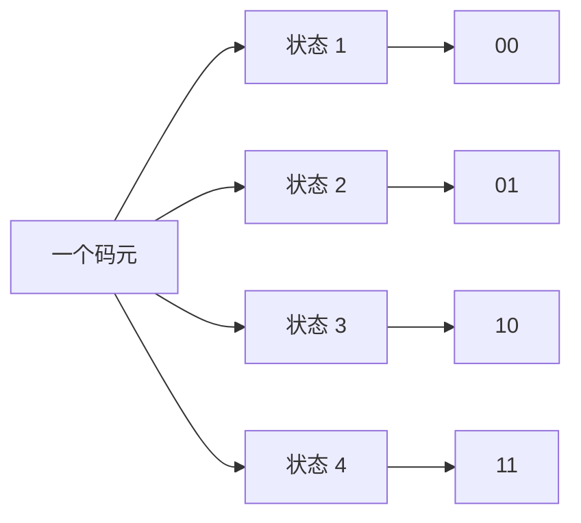

物理层解决的核心问题是：**如何把比特转换为能够在真实传输介质中传播的物理信号，并将这些信号可靠地送到链路另一端。**

本章在 408 中的重点主要集中在：

* 码元、波特率、比特率之间的关系；
* 发送时延、传播时延及总时延计算；
* 时延带宽积；
* 奈奎斯特定理与香农定理；
* 常见数字编码和模拟调制方法；
* 电路交换、报文交换、分组交换及其时延；
* 数据报与虚电路；
* 中继器、集线器、网卡和常见传输介质。

> **复习建议**
>
> 本章公式不多，但概念极易混淆。408 中应重点训练“看到题目条件后判断该使用哪个公式”，而不是单纯背公式。

### 一、物理层的基本任务

物理层位于计算机网络体系结构的最底层，直接面对真实的传输介质。

它关心的是：

* 一个比特怎样表示成电信号、光信号或无线电波；
* 发送端和接收端采用什么接口；
* 信号以什么速率传输；
* 信号经过什么传输介质；
* 如何解决长距离传输导致的信号衰减；
* 如何将数字数据编码或调制后发送出去。

物理层本身并不理解帧、IP 地址、端口号等高层语义，它主要负责**透明地传送比特流**。

### 二、物理层接口特性

> **真题考察**
>
> * 2012 年第 34 题
> * 2018 年第 34 题

<InlineSvg src="/images/computer-network/computer-network-physical-concept-001.svg" alt={"通信概念 图 1"} />

物理层接口通常从四个方面描述。

| 特性   | 核心问题      | 典型内容              |
| ---- | --------- | ----------------- |
| 机械特性 | 接口长什么样    | 接口形状、尺寸、引脚数量、排列方式 |
| 电气特性 | 信号是什么电气形式 | 电压、电流、电平范围、传输速率   |
| 功能特性 | 每根线做什么    | 数据线、控制线、发送线、接收线   |
| 过程特性 | 通信按什么顺序进行 | 信号时序、事件顺序、同步过程    |

#### 1. 机械特性

机械特性规定接口的物理结构，例如：

* 接口形状；
* 接口尺寸；
* 引脚数量；
* 引脚排列；
* 电缆种类。

例如 RJ45、USB 等接口在外观和引脚布局方面都属于机械特性的范畴。

#### 2. 电气特性

电气特性规定信号的电气参数，例如：

* 高、低电平范围；
* 电压幅值；
* 电流大小；
* 信号持续时间；
* 允许的传输速率和距离。

#### 3. 功能特性

功能特性说明接口中的每根线分别负责什么。

例如：

* Tx：发送数据；
* Rx：接收数据；
* RTS/CTS：控制通信过程。

#### 4. 过程特性

过程特性规定通信过程中各种信号出现的先后顺序和配合方式，例如：

* 什么时候开始发送；
* 什么时候停止发送；
* 怎样进行同步；
* 控制信号按照什么顺序出现。

> **易错点**
>
> * “接口长什么样”属于**机械特性**。
> * “某引脚负责什么”属于**功能特性**。
> * “电压是多少”属于**电气特性**。
> * “通信步骤和时序”属于**过程特性**。

---

### 三、数据通信基本概念

> **真题考察**
>
> * 2014 年第 35 题
> * 2023 年第 33 题
> * 2026 年第 34 题

#### 1. 信源、信宿、信号与信道

数据通信中有四个基本概念。

* **信源（Source）**：产生并发送信息的一方。
* **信宿（Destination / Sink）**：最终接收信息的一方。
* **信号（Signal）**：信息在物理介质中的具体表现形式。
* **信道（Channel）**：信号传播所经过的通路或媒介。

例如一台计算机通过网线向另一台计算机发送数据：

* 发送计算机是信源；
* 接收计算机是信宿；
* 网线构成信道；
* 网线中的电信号是信号。

---

### 四、码元、波特率与比特率

这是本章最容易混淆的一组概念。

#### 1. 码元

**码元（Symbol）**是数字通信中用来表示数据的一个基本信号单位。

一个码元不一定只能表示一个比特。

如果一种码元共有 $V$ 种可能状态，那么一个码元最多能够携带的信息量为：

$$
\log_2 V
$$

bit。

例如存在 4 种不同的信号状态：

| 信号状态 | 表示的数据 |
| ---- | ----- |
| 状态 1 | 00    |
| 状态 2 | 01    |
| 状态 3 | 10    |
| 状态 4 | 11    |

此时一个码元可以携带 2 bit。

#### 2. 波特率

**波特率（Baud Rate）**表示每秒传输多少个码元，单位为 Baud。

设码元速率为：

$$
R_s
$$

其单位为：

$$
\text{Baud}
$$

例如每秒发送 1000 个码元，则波特率为 1000 Baud。

#### 3. 比特率

**比特率（Bit Rate）**表示每秒传输多少个二进制比特，单位通常为 bit/s 或 b/s。

如果每个码元有 $V$ 种状态，则每个码元携带：

$$
\log_2 V
$$

bit，因此：

$$
R_b=R_s\log_2V
$$

其中：

* $R_b$：比特率；
* $R_s$：码元速率；
* $V$：码元状态数。

<InlineSvg src="/images/computer-network/computer-network-physical-concept-002.svg" alt={"通信概念 图 2"} />

#### 4. 常见关系

如果一个码元携带 1 bit：

$$
R_b=R_s
$$

如果一个码元携带 2 bit：

$$
R_b=2R_s
$$

如果一个码元携带 4 bit：

$$
R_b=4R_s
$$

> **408 解题关键**
>
> “每秒发送多少个码元”问的是**波特率**。
>
> “每秒发送多少个二进制位”问的是**比特率**。
>
> 二者只有在一个码元恰好表示 1 bit 时才相等。

---

### 五、速率、带宽与吞吐量

#### 1. 数据传输速率

网络中的数据传输速率通常就是比特率。

常用单位：

$$
1\ \mathrm{kb/s}=10^3\ \mathrm{bit/s}
$$

$$
1\ \mathrm{Mb/s}=10^6\ \mathrm{bit/s}
$$

$$
1\ \mathrm{Gb/s}=10^9\ \mathrm{bit/s}
$$

注意这里采用通信领域中的十进制换算。

#### 2. 带宽

“带宽”有两种常见语境。

##### 通信原理中的带宽

表示信号能够通过的**频率范围**，单位是 Hz。

##### 计算机网络中的带宽

通常表示链路理论上的最大数据传输能力，单位是 bit/s。

例如：

> 某网络接口带宽为 100 Mb/s。

表示其理论数据传输速率最高约为：

$$
100\times10^6\ \mathrm{bit/s}
$$

换算成字节：

$$
\frac{100}{8}=12.5\ \mathrm{MB/s}
$$

因此理想情况下约为 12.5 MB/s。

#### 3. 带宽与吞吐量

| 指标  | 含义              |
| --- | --------------- |
| 带宽  | 链路理论或标称的最大传输能力  |
| 吞吐量 | 单位时间内实际成功传输的数据量 |

假设网络带宽为 100 Mb/s，但实际只能达到 70 Mb/s，则：

* 带宽：100 Mb/s；
* 吞吐量：70 Mb/s。

实际吞吐量可能受到以下因素限制：

* 网络拥塞；
* 协议开销；
* 设备处理能力；
* 丢包与重传；
* 上游链路瓶颈。

---

### 六、网络时延

时延是 408 高频计算内容。

<InlineSvg src="/images/computer-network/computer-network-physical-concept-003.svg" alt={"通信概念 图 3"} />

一个分组从源端到目的端通常需要经历：

1. 发送时延；
2. 传播时延；
3. 处理时延；
4. 排队时延。

因此：

$$
T_{\text{total}}
=
T_{\text{send}}
+
T_{\text{prop}}
+
T_{\text{proc}}
+
T_{\text{queue}}
$$

#### 1. 发送时延

发送时延又叫**传输时延**。

它表示发送设备把一个分组的全部比特逐个推入链路所需要的时间。

设：

* 分组长度为 $L$ bit；
* 链路发送速率为 $R$ bit/s。

则：

$$
T_{\text{send}}=\frac{L}{R}
$$

因此发送时延取决于：

* 分组长度；
* 链路传输速率。

#### 2. 传播时延

传播时延表示信号从链路的一端真正传播到另一端所需要的时间。

设：

* 链路长度为 $d$；
* 信号在介质中的传播速度为 $v$。

则：

$$
T_{\text{prop}}=\frac{d}{v}
$$

因此传播时延取决于：

* 传播距离；
* 介质中的传播速度。

与分组大小和带宽没有直接关系。

#### 3. 发送时延与传播时延对比

这是最常见的易错点之一。

| 比较项  | 发送时延      | 传播时延     |
| ---- | --------- | -------- |
| 本质   | 把比特推入链路   | 比特在链路中移动 |
| 主要因素 | 数据长度、发送速率 | 距离、传播速度  |
| 数据越大 | 增大        | 不变       |
| 带宽越高 | 减小        | 不变       |
| 距离越远 | 不变        | 增大       |

可以这样理解：

> **发送时延看“发得快不快”，传播时延看“路有多远”。**

#### 4. 处理时延

路由器等设备收到分组后，需要进行处理，例如：

* 检查首部；
* 进行差错检测；
* 查找转发表；
* 判断输出端口。

这些操作消耗的时间称为**处理时延**。

#### 5. 排队时延

当多个分组同时等待同一个输出链路时，分组需要在队列中等待。

等待时间称为**排队时延**。

排队时延受网络负载影响很大，因此通常最不稳定。

---

### 七、时延带宽积

时延带宽积描述一条链路中**最多能够同时“在路上”传播多少比特**。

<InlineSvg src="/images/computer-network/computer-network-physical-concept-004.svg" alt={"通信概念 图 4"} />

设：

* 链路带宽为 $R$；
* 传播时延为 $T_{\text{prop}}$。

则：

$$
\text{BDP}
=
R\times T_{\text{prop}}
$$

单位为 bit。

它可以理解成：

> 当第一个比特即将到达接收端时，发送端一共已经向链路中发送了多少比特。

如果将链路想象成一根水管：

* 管道长度对应传播时延；
* 管道横截面积对应带宽；
* 管道中能够容纳的“数据量”就是时延带宽积。

---

## 八、奈奎斯特定理

> **真题考察**
>
> * 2017 年第 34 题
> * 2022 年第 34 题
> * 2023 年第 34 题

<InlineSvg src="/images/computer-network/computer-network-physical-concept-005.svg" alt={"通信概念 图 5"} />

奈奎斯特定理研究的是：

> **理想、无噪声、带宽受限信道的最高数据传输速率。**

### 1. 最高码元速率

对于带宽为 $W$ Hz 的理想低通信道：

$$
R_{s,\max}=2W
$$

单位为 Baud。

这说明即使完全没有噪声，码元速率也不能无限提高。

### 2. 最高比特率

如果每个码元有 $V$ 种离散状态：

$$
C=2W\log_2V
$$

其中：

* $C$：最高数据率，bit/s；
* $W$：信道带宽，Hz；
* $V$：码元状态数。

其本质就是：

$$
\text{比特率}
=
\text{码元速率}
\times
\text{每码元携带的比特数}
$$

即：

$$
C
=
2W
\times
\log_2V
$$

### 3. 如何理解公式中的 2

公式中的 2 来源于：

$$
R_{s,\max}=2W
$$

也就是说：

> 一个带宽为 $W$ Hz 的理想低通信道，在无码间串扰条件下，最高码元速率为 $2W$ Baud。

### 4. 奈奎斯特定理考什么

奈奎斯特公式告诉我们提高数据率有两种方式：

* 提高信道带宽；
* 增加码元状态数。

但码元状态数不能无限增加。

状态越多，相邻信号状态越难区分，对噪声越敏感。

---

## 九、香农定理

> **真题考察**
>
> * 2014 年第 35 题
> * 2016 年第 34 题
> * 2026 年第 34 题

<InlineSvg src="/images/computer-network/computer-network-physical-concept-006.svg" alt={"通信概念 图 6"} />

香农定理研究的是：

> **存在噪声时，带宽受限信道理论上能够达到的最大信息传输速率。**

其公式为：

$$
C
=
B\log_2
\left(
1+\frac{S}{N}
\right)
$$

其中：

* $C$：信道容量，bit/s；
* $B$：信道带宽，Hz；
* $S$：信号平均功率；
* $N$：噪声平均功率；
* $S/N$：线性形式的信噪比。

### 1. 香农公式说明什么

信道容量随着以下两个量增大而提高：

* 带宽增大；
* 信噪比增大。

但是：

> 即使继续无限增加信号功率，信道容量也不会按线性速度无限增长，因为公式中存在对数。

### 2. 信噪比

线性信噪比定义为：

$$
\frac{S}{N}
=
\frac{\text{信号功率}}{\text{噪声功率}}
$$

很多题目给出的却是 dB。

dB 形式为：

$$
\mathrm{SNR}_{\mathrm{dB}}
=
10\log_{10}
\left(
\frac{S}{N}
\right)
$$

反过来：

$$
\frac{S}{N}
=
10^{\frac{\mathrm{SNR}_{\mathrm{dB}}}{10}}
$$

> **高频陷阱**
>
> 香农公式中的 $S/N$ 必须使用**线性值**。
>
> 如果题目给出的是 dB，必须先转换。

例如：

$$
\mathrm{SNR}=30\ \mathrm{dB}
$$

则：

$$
\frac{S}{N}
=
10^{30/10}
=
1000
$$

然后才能代入香农公式。

### 3. 香农定理的正确理解

香农定理并不是说：

> 速率低于信道容量就一定不会出错。

更准确地说：

> 当信息传输速率严格低于信道容量时，理论上存在足够好的编码方案，可以使误码概率任意小。

---

## 十、奈奎斯特与香农定理对比

| 项目        | 奈奎斯特          | 香农                 |
| --------- | ------------- | ------------------ |
| 信道条件      | 理想无噪声         | 存在噪声               |
| 主要限制      | 带宽、码元状态数      | 带宽、信噪比             |
| 是否涉及码元状态数 | 是             | 否                  |
| 是否涉及信噪比   | 否             | 是                  |
| 公式        | $2W\log_2V$ | $B\log_2(1+S/N)$ |

当题目同时给出：

* 带宽；
* 码元状态数；
* 信噪比；

通常应该分别计算奈奎斯特上限和香农上限。

实际可达到的理论最大速率不能超过二者中更小的那个：

$$
C_{\max}
=
\min
\left\{
2W\log_2V,\;
W\log_2\left(1+\frac{S}{N}\right)
\right\}
$$

> **快速判断**
>
> * 出现“无噪声”“码元状态数” → 优先想到奈奎斯特。
> * 出现“信噪比”“dB”“噪声” → 优先想到香农。
> * 两类条件都出现 → 两个上限都要考虑。

---
