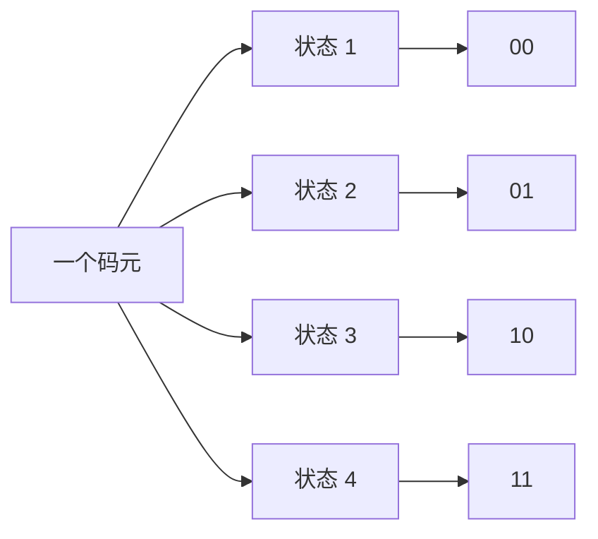

物理层解决的核心问题是：**如何把上层交付的比特转换为能够在真实传输介质中传播的物理信号，并在相邻结点之间透明传送这些比特。**

本章公式并不多，但“码元/比特”“发送/传播”“Hz/bit/s”“奈奎斯特/香农”非常容易混淆。做题时建议固定按下面的顺序判断：

1. 题目给的是**比特、码元、频率、功率、距离**中的哪一种量；
2. 问的是**发送过程、传播过程，还是信道理论上限**；
3. 信道条件是**理想无噪声**还是**存在噪声**；
4. 最后再选公式并统一单位。

<Callout type="info" title="本章计算主线">

- 码元与比特：$R_b=R_s\log_2V$
- 发送时延：$T_{\text{send}}=L/R$
- 传播时延：$T_{\text{prop}}=d/v$
- 时延带宽积：$R\cdot T_{\text{prop}}$
- 奈奎斯特：$C=2W\log_2V$
- 香农：$C=W\log_2(1+S/N)$

</Callout>

---

## 1. 物理层的基本任务

物理层位于网络体系结构的最底层，直接面向真实传输介质。它向数据链路层提供**透明的比特传输服务**：发送方交给它什么比特序列，接收方就应尽可能恢复出同样的比特序列。

物理层通常规定或解决：

- 比特怎样表示为电信号、光信号或无线电信号；
- 相邻设备采用什么物理接口；
- 接口的电气参数、信号时序与传输速率；
- 使用何种传输介质；
- 信号如何编码、调制、发送与接收；
- 信号衰减或畸变后如何通过再生等手段继续传输。

物理层并不理解这些比特在上层究竟构成帧、IP 数据报还是应用数据。

<Callout type="warning" title="物理层不负责的内容">

MAC 地址转发属于数据链路层，IP 路由属于网络层，端口号属于传输层。看到“MAC 表、路由表、端口号”等关键词时，不要判断为物理层功能。

</Callout>

---

## 2. 物理层接口的四类特性

<InlineSvg src="/images/computer-network/computer-network-physical-concept-001.svg" alt={"通信概念 图 1"} />

> **真题考察**
>
> * 2012 年第 34 题
> * 2018 年第 34 题

物理层接口通常从四个方面描述。

| 特性 | 核心问题 | 典型内容 |
| --- | --- | --- |
| **机械特性** | 接口“长什么样” | 形状、尺寸、引脚数量和排列 |
| **电气特性** | 信号“以什么电气形式出现” | 电压、电流、电平范围、阻抗等 |
| **功能特性** | 每根线“做什么” | 发送、接收、控制、时钟等功能 |
| **过程特性** | 各信号“按什么顺序工作” | 时序、事件先后、握手过程 |

### 2.1 机械特性

规定连接器、插头、引脚等物理结构，例如接口形状和尺寸、引脚数量与排列、线缆与连接器形式。

### 2.2 电气特性

规定电信号应满足的电气参数，例如高/低电平范围、电压、电流、阻抗、信号持续时间等。

### 2.3 功能特性

说明各信号线或引脚承担什么功能，例如发送、接收、控制、时钟等。

### 2.4 过程特性

规定不同功能信号在通信中的出现顺序和配合关系，例如何时建立连接、何时允许发送、何时结束。

> **速记**：机械看外形，电气看电平，功能看用途，过程看时序。

---

## 3. 数据通信模型与基本概念

> **真题考察**
>
> * 2014 年第 35 题
> * 2023 年第 33 题
> * 2026 年第 34 题

### 3.1 信源、信宿、信号与信道

- **信源（Source）**：产生并发送信息的一方；
- **信宿（Destination / Sink）**：最终接收信息的一方；
- **信号（Signal）**：数据在传输介质中的物理表现形式；
- **信道（Channel）**：信号传播所经过的逻辑或物理通路。

```mermaid
graph LR
    A[信源] -->|产生| B[信号]
    B -->|进入| C[信道]
    C -->|传播| D[信号]
    D -->|到达| E[信宿]
```

例如一台主机通过网线向另一台主机发送数据：发送主机是信源，接收主机是信宿，网线及其对应的通信通路构成信道，网线中的电信号则是信号。

### 3.2 数据、信号与信道不要混为一谈

“0 和 1”是抽象数据；“高低电平、光脉冲、不同载波状态”是信号；铜缆、光纤或无线空间则提供信号传播的物理环境。

同一份数字数据可以通过不同编码或调制方式变成完全不同的物理信号。

### 3.3 单工、半双工与全双工

| 通信方式 | 能否双向 | 能否同时双向 | 典型理解 |
| --- | --- | --- | --- |
| 单工 | 否，只能单向 | 否 | 方向固定 |
| 半双工 | 可以 | 不可以 | 双方轮流发送 |
| 全双工 | 可以 | 可以 | 双方可同时发送 |

<Callout type="warning" title="双向不等于全双工">

“双方都能发送”只能说明至少是半双工；只有**双方能够同时发送**才是全双工。

</Callout>

---

## 4. 模拟/数字数据与模拟/数字信号

“数据类型”和“信号类型”是两个维度，不要混为一谈。

| 数据 | 传输信号 | 常见过程 |
| --- | --- | --- |
| 数字数据 | 数字信号 | 数字编码 |
| 数字数据 | 模拟信号 | 数字调制 |
| 模拟数据 | 数字信号 | 采样、量化、编码 |
| 模拟数据 | 模拟信号 | 模拟调制 |

408 中最常考的是前两类：

> **编码**侧重“数字数据如何映射为数字基带信号”；**调制**侧重“数字数据如何改变模拟载波的振幅、频率或相位”。

---

## 5. 码元、波特率与比特率

这是物理层最重要的数量关系之一。

### 5.1 码元

**码元（Symbol）**&#x2060;是通信系统中承载信息的一个基本信号单元。一个码元不一定只表示 $1$ bit。

若一个码元具有 $V$ 种可区分状态，则一个码元最多承载：

$$
\log_2V
$$

bit。

例如共有 $4$ 种不同信号状态，则每个码元可以携带：

$$
\log_2 4=2\ \text{bit}
$$

| 信号状态 | 可表示的数据 |
| --- | --- |
| 状态 1 | 00 |
| 状态 2 | 01 |
| 状态 3 | 10 |
| 状态 4 | 11 |

```mermaid
graph LR
    A[一个码元] --> B[状态 1] --> C[00]
    A --> D[状态 2] --> E[01]
    A --> F[状态 3] --> G[10]
    A --> H[状态 4] --> I[11]
```

### 5.2 波特率

**波特率（Baud Rate）**&#x2060;又称码元速率，表示每秒传输多少个码元：

$$
R_s\quad (\text{Baud})
$$

波特率关注的是“每秒多少个**符号/码元**”，不是“每秒多少比特”。

### 5.3 比特率

<InlineSvg src="/images/computer-network/computer-network-physical-concept-002.svg" alt={"通信概念 图 2"} />

**比特率（Bit Rate）**&#x2060;表示每秒传输多少个二进制位：

$$
R_b\quad (\text{bit/s})
$$

若一个码元共有 $V$ 种状态，则：

$$
\boxed{R_b=R_s\log_2V}
$$

### 5.4 高频反推

已知 $R_b$ 与 $R_s$，先求每码元携带的信息量：

$$
\log_2V=\frac{R_b}{R_s}
$$

于是：

$$
V=2^{R_b/R_s}
$$

若题目问“至少需要多少种码元状态”，结果还必须满足**状态数为可实现的整数**。例如算得 $V\ge 5.2$，至少需要 $6$ 种状态；若题目只允许 $2^n$ 元调制，则要继续取到下一种允许的调制阶数。

<Callout type="warning" title="码元不等于比特">

只有当每个码元恰好表示 $1$ bit 时，数值上才有 $R_b=R_s$。只要一个码元可表示多个比特，比特率就会高于码元速率。

</Callout>

---

## 6. 速率、频带带宽、网络带宽与吞吐量

“带宽”在不同语境中含义不同，判断时先看单位。

### 6.1 数据传输速率

网络中的数据传输速率通常以 bit/s 表示：

$$
1\ \mathrm{kb/s}=10^3\ \mathrm{bit/s}
$$

$$
1\ \mathrm{Mb/s}=10^6\ \mathrm{bit/s}
$$

$$
1\ \mathrm{Gb/s}=10^9\ \mathrm{bit/s}
$$

通信速率中的 k、M、G 通常按十进制换算；这与存储容量题中常见的 $2^{10}$、$2^{20}$ 口径要区分。

### 6.2 频带带宽

在通信原理中，信道的频带宽度表示可通过的频率范围，单位为 Hz。

若信道可通过的频率范围为 $f_L$ 到 $f_H$，则：

$$
W=f_H-f_L
$$

奈奎斯特和香农公式中的 $W$ 或 $B$ 都是这种 **Hz 意义的频带宽度**。

### 6.3 网络语境中的“带宽”

在网络工程语境中，“链路带宽为 $100\ \mathrm{Mb/s}$”通常是在描述链路的标称数据传输能力。

若只做 bit/Byte 换算：

$$
100\ \mathrm{Mb/s}=12.5\ \mathrm{MB/s}
$$

这里忽略了帧首部、协议首部、帧间间隔等各种实际开销。

### 6.4 吞吐量

**吞吐量（Throughput）**&#x2060;表示单位时间内实际成功传输的数据量。端到端路径上通常受到瓶颈链路和协议机制限制，因此：

$$
\text{实际吞吐量}\le \text{可用瓶颈能力}
$$

协议开销、拥塞、丢包重传、接收端处理能力等都会使实际吞吐量低于链路标称速率。

> **看单位快速判断**：Hz 多半是频带宽度；bit/s 多半是数据传输能力或吞吐量。

---

## 7. 四类网络时延

<InlineSvg src="/images/computer-network/computer-network-physical-concept-003.svg" alt={"通信概念 图 3"} />

一个分组从源端到目的端通常会经历：

1. 发送时延；
2. 传播时延；
3. 处理时延；
4. 排队时延。

因此：

$$
T_{\text{total}}
=
T_{\text{send}}
+
T_{\text{prop}}
+
T_{\text{proc}}
+
T_{\text{queue}}
$$

### 7.1 发送时延

若分组长度为 $L$ bit，链路发送速率为 $R$ bit/s：

$$
\boxed{T_{\text{send}}=\frac{L}{R}}
$$

它表示**把整个分组逐比特推入链路**所需的时间。

### 7.2 传播时延

若链路长度为 $d$，信号在介质中的传播速度为 $v$：

$$
\boxed{T_{\text{prop}}=\frac{d}{v}}
$$

它表示一个已经进入链路的信号从链路一端传播到另一端所需的时间。

### 7.3 处理时延

路由器或交换设备收到数据后，需要执行差错检查、解析首部、查表等操作，这部分时间称为处理时延。

### 7.4 排队时延

若输出链路正在忙，新到分组需要在队列中等待，这段时间称为排队时延。它受网络负载影响最大，通常也最不稳定。

### 7.5 发送时延与传播时延辨析

| 比较项 | 发送时延 | 传播时延 |
| --- | --- | --- |
| 本质 | 将全部比特推入链路 | 信号在介质中前进 |
| 主要因素 | 数据长度、发送速率 | 距离、传播速度 |
| 数据更长 | 增大 | 不变 |
| 发送速率更高 | 减小 | 不变 |
| 距离更远 | 不变 | 增大 |

> **发送时延看“发完要多久”，传播时延看“跑过去要多久”。**

---

## 8. 时延带宽积与“在途数据”

<InlineSvg src="/images/computer-network/computer-network-physical-concept-004.svg" alt={"通信概念 图 4"} />

若链路发送速率为 $R$，单向传播时延为 $T_{\text{prop}}$，则：

$$
\boxed{\text{BDP}=R\cdot T_{\text{prop}}}
$$

单位为 bit。

它可以理解为：**链路被持续灌满时，在一个单向传播时延内能够注入链路的数据量，也就是链路中的“在途数据”规模。**

若已知距离 $d$ 与传播速度 $v$：

$$
\text{BDP}=R\frac{d}{v}
$$

<Callout type="warning" title="单向传播与 RTT 不要混用">

讨论一条单向链路中“正在传播多少比特”时使用单向传播时延。讨论滑动窗口、端到端未确认数据量等问题时，题目常转而使用 RTT；这时必须按题目语境重新建模，不能机械套同一个时延。

</Callout>

---

## 9. 奈奎斯特定理：理想无噪声信道上限

<InlineSvg src="/images/computer-network/computer-network-physical-concept-005.svg" alt={"通信概念 图 5"} />

> **真题考察**
>
> * 2017 年第 34 题
> * 2022 年第 34 题
> * 2023 年第 34 题

奈奎斯特定理讨论**理想、无噪声、带宽受限信道**中的无码间串扰极限。

### 9.1 最高码元速率

对于带宽为 $W$ Hz 的理想低通信道，常用 408 模型给出：

$$
\boxed{R_{s,\max}=2W}
$$

单位为 Baud。

这说明即使完全无噪声，带宽受限信道的码元变化速度也不是无限大的。

### 9.2 最高数据率

若每个码元具有 $V$ 种可区分状态，则每个码元最多携带 $\log_2V$ bit，因此：

$$
\boxed{C_{\text{Nyquist}}=2W\log_2V}
$$

其中：

- $W$：信道频带宽度，Hz；
- $V$：码元可区分状态数；
- $C$：最高数据率，bit/s。

### 9.3 常见反推

若已知目标数据率 $C$ 和信道带宽 $W$：

$$
\log_2V\ge \frac{C}{2W}
$$

于是：

$$
V\ge 2^{C/(2W)}
$$

最后再按题目的状态数约束取可实现值。

<Callout type="info" title="奈奎斯特公式中的两个限制因素">

提高理想信道数据率可以增大 $W$，也可以增加 $V$。但 $V$ 越大，各信号状态越难区分，对噪声和判决精度的要求越高，所以真实信道还要同时受香农容量限制。

</Callout>

---

## 10. 香农定理：有噪声信道容量

> **真题考察**
>
> * 2014 年第 35 题
> * 2016 年第 34 题
> * 2026 年第 34 题

香农定理给出带宽受限、有噪声信道的理论容量：

$$
\boxed{
C_{\text{Shannon}}
=
B\log_2\left(1+\frac{S}{N}\right)
}
$$

其中：

- $B$：信道带宽，Hz；
- $S$：平均信号功率；
- $N$：平均噪声功率；
- $S/N$：**线性**信噪比；
- $C$：信道容量，bit/s。

### 10.1 dB 与线性信噪比换算

题目常给出分贝形式：

$$
\mathrm{SNR}_{\mathrm{dB}}
=10\log_{10}\left(\frac{S}{N}\right)
$$

因此：

$$
\boxed{\frac{S}{N}=10^{\mathrm{SNR}_{\mathrm{dB}}/10}}
$$

例如 $30\ \mathrm{dB}$ 对应：

$$
\frac{S}{N}=10^{30/10}=1000
$$

再将 $1000$ 代入香农公式，而不是把 $30$ 直接代入。

### 10.2 香农定理的正确含义

<InlineSvg src="/images/computer-network/computer-network-physical-concept-006.svg" alt={"通信概念 图 6"} />

香农容量不是“低于这个速率就天然零误码”。更准确地说：

> 当传输速率严格低于信道容量时，理论上存在足够好的编码方法，使误码概率可以做到任意小。

同时要注意：香农公式本身不含码元状态数 $V$。仅靠无限增加调制状态数，不可能突破由带宽和信噪比共同决定的香农容量。

<Callout type="warning" title="香农公式不能直接代 dB">

公式中的 $S/N$ 必须是线性功率比；若题目给的是 dB，先换算，再代公式。

</Callout>

---

## 11. 奈奎斯特与香农的联合判断

两条定理限制的是不同方面：

| 项目 | 奈奎斯特 | 香农 |
| --- | --- | --- |
| 典型条件 | 理想、无噪声 | 有噪声 |
| 主要限制 | 带宽、码元状态数 | 带宽、信噪比 |
| 出现 $V$ | 是 | 否 |
| 出现 $S/N$ | 否 | 是 |
| 公式 | $2W\log_2V$ | $W\log_2(1+S/N)$ |

若题目同时给出 $W$、$V$ 与 $S/N$，系统既不能突破给定调制状态数对应的奈奎斯特上限，也不能突破信道的香农容量，因此：

$$
\boxed{
C_{\max}
=
\min\left\{
2W\log_2V,
\;W\log_2\left(1+\frac{S}{N}\right)
\right\}
}
$$

### 11.1 反求“至少需要多少种码元状态”

若目标速率为 $R$：

**第一步：先检查香农容量是否允许。**

$$
R\le C_{\text{Shannon}}
$$

如果连香农容量都达不到，则无论怎样增加 $V$ 都不可能实现目标速率。

**第二步：再由奈奎斯特约束状态数。**

$$
R\le 2W\log_2V
$$

得到：

$$
V\ge 2^{R/(2W)}
$$

**第三步：按题目允许的调制阶数取整。**

<Callout type="info" title="快速选公式">

- 出现“无码间串扰、码元状态数” → 奈奎斯特；
- 出现“噪声、信噪比、dB” → 香农；
- 两类条件同时出现 → 两个上限都算，取更严格者；
- 目标速率超过香农容量 → 增加码元状态数也无解。

</Callout>

### 11.2 计算题统一检查清单

做完公式题后最后检查四件事：

1. Hz 与 bit/s 是否混用；
2. dB 是否已经转换为线性 $S/N$；
3. $V$ 是否满足整数或题目给定的调制阶数约束；
4. 最终答案是否同时满足奈奎斯特与香农两个上限。
