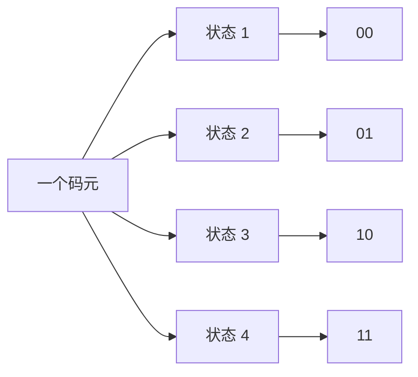

物理层解决的核心问题是：**如何把上层交付的比特转换成能够在真实传输介质中传播的物理信号，并把这些比特透明地送到链路另一端。**

这一章公式不多，但概念之间非常容易串线。做题时建议始终沿着下面的判断顺序：

1. 题目给的是**比特、码元、频率、功率、距离**中的哪一种量？
2. 问的是**发送能力、传播过程还是信道理论上限**？
3. 条件属于**理想无噪声**还是**有噪声信道**？
4. 最后再选择对应公式。

<Callout type="info" title="本章计算主线">

- 码元与比特：$R_b=R_s\log_2V$
- 发送时延：$L/R$
- 传播时延：$d/v$
- 时延带宽积：$R\cdot T_{\text{prop}}$
- 奈奎斯特：$2W\log_2V$
- 香农：$W\log_2(1+S/N)$

</Callout>

---

## 1. 物理层的基本任务

物理层位于网络体系结构的最底层，直接面向真实传输介质。

它主要规定或解决：

- 一个比特怎样表示为电信号、光信号或无线电信号；
- 相邻设备采用什么物理接口；
- 信号以什么速率发送；
- 采用什么传输介质；
- 发送端与接收端如何在物理层面配合；
- 信号衰减后如何通过再生等方式继续传输。

物理层的服务对象是数据链路层。它只负责**透明传送比特流**，并不理解这些比特在上层究竟构成帧、IP 数据报还是应用数据。

<Callout type="warning" title="物理层不负责的内容">

MAC 地址转发属于数据链路层，IP 路由属于网络层，端口号属于传输层。看到这些关键词时，不要再判断为物理层功能。

</Callout>

---

## 2. 物理层接口的四类特性

<InlineSvg src="/images/computer-network/computer-network-physical-concept-001.svg" alt={"通信概念 图 1"} />

> **真题考察**
>
> * 2012 年第 34 题
> * 2018 年第 34 题

物理层接口通常从四个方面描述。

| 特性 | 核心问题 | 典型内容 |
| --- | --- | --- |
| **机械特性** | 接口“长什么样” | 形状、尺寸、引脚数量和排列 |
| **电气特性** | 信号“以什么电气形式出现” | 电压、电流、电平范围、阻抗等 |
| **功能特性** | 每根线“做什么” | 发送、接收、控制、时钟等功能 |
| **过程特性** | 各信号“按什么顺序工作” | 时序、事件先后、握手过程 |

### 2.1 机械特性

规定连接器、插头、引脚等物理结构，例如：

- 接口形状和尺寸；
- 引脚数量与排列；
- 线缆与连接器形式。

### 2.2 电气特性

规定电信号应满足的参数，例如：

- 高、低电平范围；
- 电压、电流；
- 信号持续时间；
- 阻抗及相关电气要求。

### 2.3 功能特性

说明各信号线或引脚承担什么功能，例如发送、接收、控制、时钟等。

### 2.4 过程特性

规定不同功能信号在通信中的出现顺序和配合关系，例如何时建立、何时发送、何时结束。

> **速记**：机械看外形，电气看电平，功能看用途，过程看时序。

---

## 3. 数据通信模型与基本概念

> **真题考察**
>
> * 2014 年第 35 题
> * 2023 年第 33 题
> * 2026 年第 34 题

### 3.1 信源、信宿、信号与信道

- **信源（Source）**：产生并发送信息的一方；
- **信宿（Destination / Sink）**：最终接收信息的一方；
- **信号（Signal）**：数据在传输介质中的物理表现形式；
- **信道（Channel）**：信号传播所经过的通路。

```mermaid
graph LR
    A[信源] -->|产生| B[信号]
    B -->|进入| C[信道]
    C -->|传播| D[信号]
    D -->|到达| E[信宿]
```

例如一台主机通过网线向另一台主机发送数据：发送主机是信源，接收主机是信宿，网线构成物理传输通路，网线中的电信号则是信号。

### 3.2 数据、信号与信道不要混为一谈

“0 和 1”是抽象数据；“高低电平、光脉冲、不同载波状态”是信号；信号实际通过的铜缆、光纤或无线传播空间属于传输通路。

同一份数字数据可以通过不同编码或调制方式变成完全不同的物理信号。

### 3.3 单工、半双工与全双工

| 通信方式 | 能否双向 | 能否同时双向 | 典型理解 |
| --- | --- | --- | --- |
| 单工 | 否，只能单向 | 否 | 只有一个固定发送方向 |
| 半双工 | 可以 | 不可以 | 双方轮流发送 |
| 全双工 | 可以 | 可以 | 双方可同时发送 |

<Callout type="warning" title="双向不等于全双工">

“双方都能发送”只能说明至少是半双工；只有**双方能够同时发送**才是全双工。

</Callout>

---

## 4. 模拟/数字数据与模拟/数字信号

数据和信号是两个不同维度，因此可以出现多种组合：

- 数字数据 → 数字信号：通过**数字编码**；
- 数字数据 → 模拟信号：通过**数字调制**；
- 模拟数据 → 数字信号：典型过程包括采样、量化、编码；
- 模拟数据 → 模拟信号：可通过模拟调制传输。

408 中最常考的是前两类：

> **编码**侧重“数字数据如何变成数字信号”；**调制**侧重“数字数据如何改变模拟载波参数”。

---

## 5. 码元、波特率与比特率

这是物理层最重要的数量关系之一。

### 5.1 码元

**码元（Symbol）**&#x2060;是通信系统中承载信息的一个基本信号单元。一个码元不一定只表示 1 bit。

若一个码元具有 $V$ 种可区分状态，则每个码元最多可承载：

$$
\log_2V
$$

bit。

例如共有 4 种不同信号状态：

| 信号状态 | 表示的数据 |
| --- | --- |
| 状态 1 | 00 |
| 状态 2 | 01 |
| 状态 3 | 10 |
| 状态 4 | 11 |

此时每个码元可携带 $\log_24=2$ bit。

```mermaid
graph LR
    A[一个码元] --> B[状态 1] --> C[00]
    A --> D[状态 2] --> E[01]
    A --> F[状态 3] --> G[10]
    A --> H[状态 4] --> I[11]
```

### 5.2 波特率

**波特率（Baud Rate）**&#x2060;又称码元速率，表示每秒传输多少个码元：

$$
R_s\quad (\text{Baud})
$$

### 5.3 比特率

<InlineSvg src="/images/computer-network/computer-network-physical-concept-002.svg" alt={"通信概念 图 2"} />

**比特率（Bit Rate）**&#x2060;表示每秒传输多少个二进制位：

$$
R_b\quad (\text{bit/s})
$$

若一个码元共有 $V$ 种状态，则：

$$
\boxed{R_b=R_s\log_2V}
$$

### 5.4 高频反推

已知 $R_b$ 与 $R_s$，可以反推出一个码元承载的比特数：

$$
\log_2V=\frac{R_b}{R_s}
$$

进一步有：

$$
V=2^{R_b/R_s}
$$

<Callout type="warning" title="码元不等于比特">

只有当每个码元恰好表示 1 bit 时，数值上才有 $R_b=R_s$。只要一个码元可以表示多个比特，比特率就会高于波特率。

</Callout>

---

## 6. 速率、频带带宽、网络带宽与吞吐量

“带宽”在不同语境中含义不同，必须先看单位。

### 6.1 数据传输速率

网络中的数据传输速率通常以 bit/s 表示：

$$
1\ \mathrm{kb/s}=10^3\ \mathrm{bit/s}
$$

$$
1\ \mathrm{Mb/s}=10^6\ \mathrm{bit/s}
$$

$$
1\ \mathrm{Gb/s}=10^9\ \mathrm{bit/s}
$$

通信速率的 k、M、G 通常按十进制换算。

### 6.2 频带带宽

在通信原理中，信道带宽通常表示能够通过的频率范围，单位为 Hz。

若信道可通过的频率范围为 $f_L$ 到 $f_H$，则：

$$
W=f_H-f_L
$$

这一含义会出现在奈奎斯特和香农公式中。

### 6.3 网络语境中的“带宽”

在计算机网络工程语境中，“链路带宽 100 Mb/s”通常是在描述链路的标称数据传输能力。

例如：

$$
100\ \mathrm{Mb/s}=100\times10^6\ \mathrm{bit/s}
$$

若只做 bit/Byte 换算：

$$
\frac{100}{8}=12.5\ \mathrm{MB/s}
$$

这只是忽略协议开销后的理论换算值。

### 6.4 吞吐量

**吞吐量（Throughput）**&#x2060;表示单位时间内实际成功传输的数据量。

通常有：

$$
\text{实际吞吐量}\leq\text{瓶颈链路能力}
$$

协议开销、拥塞、丢包重传、设备处理能力等都会使实际吞吐量低于标称速率。

> **看单位快速判断**：Hz 多半是频带宽度；bit/s 多半是数字传输能力或吞吐量。

---

## 7. 四类网络时延

<InlineSvg src="/images/computer-network/computer-network-physical-concept-003.svg" alt={"通信概念 图 3"} />

一个分组从源端到目的端通常经历：

1. 发送时延；
2. 传播时延；
3. 处理时延；
4. 排队时延。

因此：

$$
T_{\text{total}}
=
T_{\text{send}}
+
T_{\text{prop}}
+
T_{\text{proc}}
+
T_{\text{queue}}
$$

### 7.1 发送时延

若分组长度为 $L$ bit，链路发送速率为 $R$ bit/s：

$$
\boxed{T_{\text{send}}=\frac{L}{R}}
$$

它表示**把整个分组逐比特推入链路**所需的时间。

### 7.2 传播时延

若链路长度为 $d$，信号在介质中的传播速度为 $v$：

$$
\boxed{T_{\text{prop}}=\frac{d}{v}}
$$

它表示一个已进入链路的信号从一端传播到另一端所需的时间。

### 7.3 处理时延

路由器或交换设备收到数据后，可能需要执行差错检查、解析首部、查表等操作，这部分时间称为处理时延。

### 7.4 排队时延

若输出链路正在忙，新到分组需要在队列中等待，这段时间称为排队时延。它与网络负载高度相关，最不稳定。

### 7.5 发送时延与传播时延辨析

| 比较项 | 发送时延 | 传播时延 |
| --- | --- | --- |
| 本质 | 将比特推入链路 | 信号在介质中传播 |
| 主要因素 | 数据长度、发送速率 | 距离、传播速度 |
| 数据更长 | 增大 | 不变 |
| 发送速率更高 | 减小 | 不变 |
| 距离更远 | 不变 | 增大 |

> **发送时延看“发完要多久”，传播时延看“跑过去要多久”。**

---

## 8. 时延带宽积与“在途数据”

<InlineSvg src="/images/computer-network/computer-network-physical-concept-004.svg" alt={"通信概念 图 4"} />

若链路发送速率为 $R$，单向传播时延为 $T_{\text{prop}}$，则：

$$
\boxed{\text{BDP}=R\cdot T_{\text{prop}}}
$$

单位为 bit。

它可以理解为：**链路被持续灌满时，最多有多少比特同时处在传播途中。**

例如在发送端持续发送的情况下，当最早发送的比特即将到达接收端时，发送端在这一个传播时延内已经发出的比特数正是：

$$
R\cdot T_{\text{prop}}
$$

<Callout type="warning" title="不要机械把 RTT 代入时延带宽积">

讨论一条单向链路中“正在传播多少比特”时使用单向传播时延；讨论滑动窗口要维持端到端链路持续忙碌时，则常结合 RTT 分析允许的在途未确认数据量。

</Callout>

---

## 9. 奈奎斯特定理：理想无噪声信道上限

<InlineSvg src="/images/computer-network/computer-network-physical-concept-005.svg" alt={"通信概念 图 5"} />

> **真题考察**
>
> * 2017 年第 34 题
> * 2022 年第 34 题
> * 2023 年第 34 题

奈奎斯特定理讨论**理想、无噪声、带宽受限信道**中的无码间串扰极限。

### 9.1 最高码元速率

对于带宽为 $W$ Hz 的理想低通信道：

$$
\boxed{R_{s,\max}=2W}
$$

单位为 Baud。

### 9.2 最高数据率

若每个码元具有 $V$ 种可区分状态，则每个码元最多携带 $\log_2V$ bit，所以：

$$
\boxed{C_{\text{Nyquist}}=2W\log_2V}
$$

其中：

- $W$：信道频带宽度，Hz；
- $V$：码元状态数；
- $C$：最高数据率，bit/s。

### 9.3 常见反推

若已知目标数据率 $C$ 和信道带宽 $W$：

$$
\log_2V=\frac{C}{2W}
$$

从而：

$$
V=2^{C/(2W)}
$$

实际调制状态数应满足题目给出的离散约束，不能把任意非整数状态数直接当作可实现方案。

<Callout type="info" title="奈奎斯特公式中的两个限制因素">

提高理想信道数据率可以提高 $W$，也可以增加 $V$。但实际系统中 $V$ 越大，星座点越密集，对噪声和接收判决精度的要求越高，因此还必须受到香农极限约束。

</Callout>

---

## 10. 香农定理：有噪声信道容量

> **真题考察**
>
> * 2014 年第 35 题
> * 2016 年第 34 题
> * 2026 年第 34 题

香农定理给出带宽受限、有噪声信道的理论容量：

$$
\boxed{
C_{\text{Shannon}}
=
B\log_2\left(1+\frac{S}{N}\right)
}
$$

其中：

- $B$：信道带宽，Hz；
- $S$：平均信号功率；
- $N$：平均噪声功率；
- $S/N$：**线性**信噪比；
- $C$：信道容量，bit/s。

### 10.1 dB 与线性信噪比换算

题目常直接给：

$$
\mathrm{SNR}_{\mathrm{dB}}
=
10\log_{10}\left(\frac{S}{N}\right)
$$

因此：

$$
\boxed{
\frac{S}{N}=10^{\mathrm{SNR}_{\mathrm{dB}}/10}
}
$$

例如 $30\ \mathrm{dB}$ 对应：

$$
\frac{S}{N}=10^{30/10}=1000
$$

然后才能代入香农公式。

### 10.2 香农定理的正确含义

<InlineSvg src="/images/computer-network/computer-network-physical-concept-006.svg" alt={"通信概念 图 6"} />

香农容量不是“低于这个速率就天然零误码”。更准确地说：

> 当传输速率严格低于信道容量时，理论上存在足够好的编码方法，使误码概率可以做到任意小。

<Callout type="warning" title="香农公式不能直接代 dB">

公式里的 $S/N$ 必须是线性功率比；30 dB 不能把“30”直接代入 $S/N$。

</Callout>

---

## 11. 奈奎斯特与香农的联合判断

两条定理限制的角度不同：

| 项目 | 奈奎斯特 | 香农 |
| --- | --- | --- |
| 典型条件 | 理想、无噪声 | 有噪声 |
| 主要限制 | 带宽、码元状态数 | 带宽、信噪比 |
| 出现 $V$ | 是 | 否 |
| 出现 $S/N$ | 否 | 是 |
| 公式 | $2W\log_2V$ | $W\log_2(1+S/N)$ |

若题目同时给出 $W$、$V$ 与 $S/N$，则系统既不能突破给定调制状态数对应的奈奎斯特上限，也不能突破信道的香农容量，因此：

$$
\boxed{
C_{\max}
=
\min\left\{
2W\log_2V,
\;W\log_2\left(1+\frac{S}{N}\right)
\right\}
}
$$

### 11.1 反求“至少需要多少种码元状态”

若目标速率 $R$ 已确定，先检查：

$$
R\leq C_{\text{Shannon}}
$$

若连香农容量都达不到，则无论怎样增加 $V$ 都不可能实现。

若满足香农容量约束，再由：

$$
R\leq2W\log_2V
$$

求：

$$
V\geq2^{R/(2W)}
$$

<Callout type="info" title="快速选公式">

- 出现“无码间串扰、码元状态数” → 奈奎斯特；
- 出现“噪声、信噪比、dB” → 香农；
- 两类条件同时出现 → 两个上限都算，取更严格者。

</Callout>
