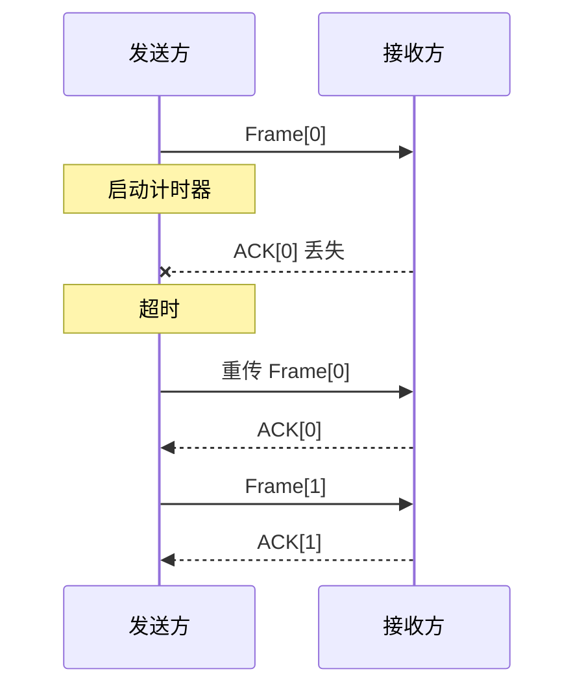
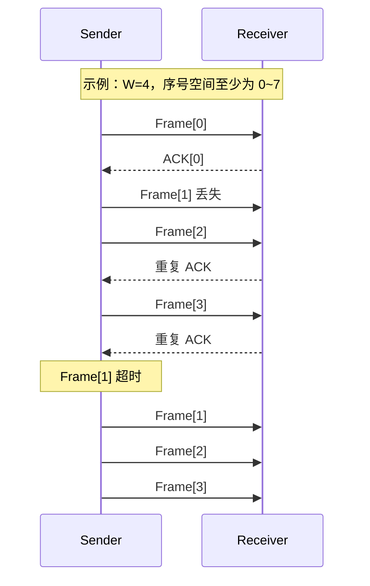
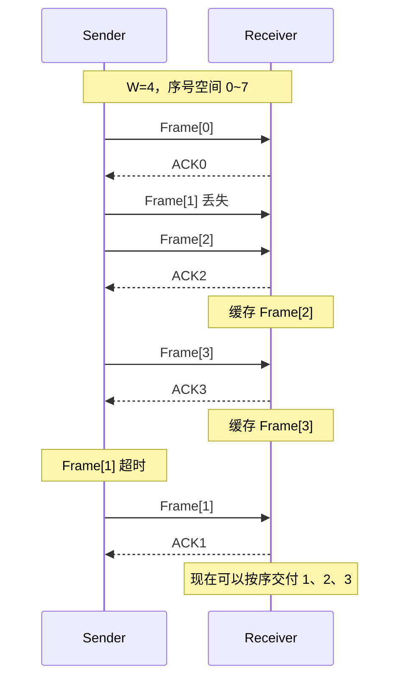

数据链路层解决的是**相邻节点之间如何以“帧”为单位传输数据**的问题。408 复习时，建议按照下面这条主线建立整体认识：

> **如何划分帧 → 如何发现/纠正错误 → 如何可靠重传 → 多个站点如何共享信道 → 局域网如何传帧 → 交换机如何根据 MAC 地址转发**

| 模块      | 核心问题             | 408 重点                        |
| ------- | ---------------- | ----------------------------- |
| 组帧      | 比特流中如何识别一帧的开始和结束 | 字符填充、零比特填充                    |
| 差错控制    | 如何发现或纠正传输错误      | CRC、海明码、海明距离                  |
| 可靠传输    | 帧丢失、出错时怎么办       | Stop-and-Wait、GBN、SR          |
| 流量控制    | 发送方可以连续发送多少帧     | 滑动窗口、窗口大小                     |
| MAC     | 多个站点如何共享一条介质     | CDMA、ALOHA、CSMA/CD、CSMA/CA    |
| LAN/WAN | 数据链路层协议如何实际应用    | Ethernet、802.11、VLAN、HDLC、PPP |
| 二层设备    | 帧在局域网中如何转发       | MAC 地址、交换机、自学习                |

> **高频综合题主线**
>
> 1. ARQ：先确定**序号位数、发送窗口、接收窗口、ACK 语义**。
> 2. CSMA/CD：先确定**传播时延、传输速率、最小帧长**。
> 3. 交换机：永远先学习**源 MAC**，然后再根据**目的 MAC**决定转发。
> 4. 802.11：注意区分 **RA/TA** 与 **SA/DA**，并掌握 DIFS、SIFS、NAV 和 RTS/CTS。

---

### 一、组帧与透明传输

数据链路层从网络层得到分组后，需要在其前后增加控制信息形成**帧（Frame）**。

组帧最核心的问题不是“加首部和尾部”，而是：

> **接收方如何从连续的比特流中准确识别一帧从哪里开始、在哪里结束？**

这就是**帧定界**。

<InlineSvg src="/images/computer-network/computer-network-datalink-framing-001.svg" alt={"组帧 图 1"} />

常见组帧方法包括：

| 方法     | 定界依据             | 为实现透明传输需要做什么       |
| ------ | ---------------- | ------------------ |
| 字符计数法  | 首部中的长度字段         | 无特殊填充              |
| 字符定界法  | 特殊字符 FLAG        | 字符填充 / ESC 转义      |
| 零比特填充法 | 特殊比特串 `01111110` | 连续 5 个 `1` 后插入 `0` |
| 违规编码法  | 物理编码中未使用的信号状态    | 利用非法编码作为边界         |

#### 1. 字符计数法

字符计数法在帧首部设置一个**长度字段**，直接指出当前帧包含多少字符或字节。

接收方：

1. 读取长度字段；
2. 根据长度继续读取指定数量的数据；
3. 到达指定长度后认为本帧结束；
4. 后面的内容属于下一帧。

<InlineSvg src="/images/computer-network/computer-network-datalink-framing-002.svg" alt={"组帧 图 2"} />

这种方法实现简单，但有明显缺陷：

> 如果长度字段本身发生错误，接收方可能失去帧同步，后续多个帧都可能被错误解析。

---

#### 2. 字符定界与字符填充

可以使用特殊控制字符表示：

* 帧开始；
* 帧结束。

问题在于：如果特殊定界字符本身出现在数据字段中，接收方就可能错误地把普通数据当成帧边界。

解决办法是使用**转义字符 `ESC`**。

发送端：

* 数据中出现 `FLAG` 时，在前面插入 `ESC`；
* 数据中本身出现 `ESC` 时，同样需要对 `ESC` 进行转义。

接收端再删除这些转义字符，还原原始数据。

<InlineSvg src="/images/computer-network/computer-network-datalink-framing-003.svg" alt={"组帧 图 3"} />

这就是**字符填充（Byte Stuffing）**。

---

#### 3. 零比特填充

零比特填充法使用：

```text
01111110
```

作为帧定界符。

为了防止数据字段内部恰好出现相同的比特串，发送端规定：

> 每当数据中连续出现 **5 个 `1`**，就在后面自动插入一个 `0`。

例如：

```text
原始：
01111110

填充后：
011111010
```

接收端执行相反操作：

> 如果发现连续 5 个 `1` 后紧跟一个填充 `0`，就删除这个 `0`。

这样数据中即使出现任意比特组合，也不会与帧边界混淆。

<InlineSvg src="/images/computer-network/computer-network-datalink-framing-004.svg" alt={"组帧 图 4"} />

> **408 记忆**
>
> 字符定界解决字符流中的透明传输 → **字符填充**。
>
> 比特定界解决比特流中的透明传输 → **零比特填充**。
>
> 看到 `01111110`，应立即想到 **连续 5 个 1 后插 0**。

---

#### 4. 违规编码法

某些物理层编码并没有使用全部可能的信号状态，因此可以把原本不会表示普通数据的状态作为帧边界。

例如曼彻斯特编码中，每个比特中间都必须发生跳变，因此某些“不发生跳变”的信号组合不会表示普通数据。

这些未被正常数据使用的信号状态就可以作为特殊定界标记。

<InlineSvg src="/images/computer-network/computer-network-datalink-framing-005.svg" alt={"组帧 图 5"} />

---

### 二、差错控制

数据在物理介质上传输时可能受到噪声、干扰等影响，从而产生**比特翻转**。

差错控制编码主要分为两类：

| 类型   | 能力         | 常见方法     |
| ---- | ---------- | -------- |
| 检错编码 | 判断数据是否出错   | 奇偶校验、CRC |
| 纠错编码 | 判断错误并定位/恢复 | 海明码      |

> **真题范围**
>
> 2013 年第 15 题、2023 年第 37 题、2025 年第 34 题。

---

#### 1. 奇偶校验

奇偶校验在原始数据中增加一个**校验位**，使数据与校验位中 `1` 的总数满足规定的奇偶性。

##### 奇校验

要求整个码字中：

> `1` 的总数为奇数。

如果原数据已有奇数个 `1`，校验位填 `0`。

如果原数据有偶数个 `1`，校验位填 `1`。

##### 偶校验

要求整个码字中：

> `1` 的总数为偶数。

| 校验方式 | 原数据中 `1` 的个数 | 校验位 |
| ---- | -----------: | --: |
| 奇校验  |           奇数 |   0 |
| 奇校验  |           偶数 |   1 |
| 偶校验  |           偶数 |   0 |
| 偶校验  |           奇数 |   1 |

<InlineSvg src="/images/computer-network/computer-network-datalink-error-001.svg" alt={"差错控制 图 1"} />

奇偶校验具有以下能力：

| 情况      | 能否检测 |
| ------- | ---- |
| 1 位错误   | 可以   |
| 任意奇数位错误 | 可以   |
| 偶数位错误   | 不保证  |
| 定位错误    | 不可以  |
| 纠正错误    | 不可以  |

> **易错点**
>
> 校验位本身不代表“奇”或“偶”。
>
> 它只是为了让**整个码字中 `1` 的数量**符合指定规则。

---

### 三、循环冗余校验 CRC

CRC（Cyclic Redundancy Check）是数据链路层最重要的**检错技术**之一。

基本思想：

> 把二进制比特串看成一个多项式，用双方约定的生成多项式进行**模 2 除法**，所得余数作为冗余校验位。

---

#### 1. 模 2 运算

CRC 除法与普通长除法形式相似，但减法不发生借位，而是使用 XOR。

规则：

```text
0 XOR 0 = 0
0 XOR 1 = 1
1 XOR 0 = 1
1 XOR 1 = 0
```

<InlineSvg src="/images/computer-network/computer-network-datalink-error-002.svg" alt={"差错控制 图 2"} />

---

#### 2. CRC 生成过程

假设生成多项式为 `G(x)`，其最高次数为 `r`。

发送端：

1. 原始数据后补 `r` 个 `0`；
2. 使用生成多项式进行模 2 除法；
3. 得到 `r` 位余数；
4. 用余数替换之前补入的 `r` 个 `0`；
5. 发送完整码字。

<InlineSvg src="/images/computer-network/computer-network-datalink-error-003.svg" alt={"差错控制 图 3"} />

例如原始数据：

```text
1010001101
```

生成比特串：

```text
110101
```

对应：

$$
G(x)=x^5+x^4+x^2+1
$$

生成多项式最高次数为 5，所以原数据后补 5 个 `0`：

```text
101000110100000
```

进行模 2 除法：

<InlineSvg src="/images/computer-network/computer-network-datalink-error-004.svg" alt={"差错控制 图 4"} />

得到余数：

```text
01110
```

因此最终发送：

```text
1010001101 01110
```

---

#### 3. CRC 接收端检验

接收端直接用收到的**完整码字**除以同一个生成多项式。

<InlineSvg src="/images/computer-network/computer-network-datalink-error-005.svg" alt={"差错控制 图 5"} />

如果：

$$
\text{接收码字}\bmod G(x)=0
$$

表示：

> **没有检测到错误。**

注意这不能理解成数学意义上的“绝对保证没有错误”，而是当前错误模式没有被 CRC 检出。

> **为什么接收方不重新补 0？**
>
> 因为发送端构造出的完整码字本来就满足：
>
> $$
> C(x)\bmod G(x)=0
> $$
>
> 所以接收方直接对收到的完整码字做除法即可。

---

### 四、海明码

海明码是一种经典的**纠错编码**。

基本思想：

> 在数据位之间插入若干校验位，使多个校验位共同形成一个“错误位置编号”。

---

#### 1. 校验位数量

假设：

* 数据位数为 `k`；
* 校验位数为 `r`。

为了既能表示每一个可能的错误位置，又能表示“没有错误”的情况，必须满足：

$$
2^r\ge k+r+1
$$

例如：

$$
k=4
$$

寻找最小的 `r`：

$$
2^3=8\ge4+3+1
$$

所以需要 3 个校验位。

---

#### 2. 校验位位置

海明码中校验位位于编号为 2 的整数次幂的位置：

```text
1, 2, 4, 8, 16, ...
```

以 4 位数据 `1011` 为例：

| 位置 | 7  | 6  | 5  | 4  | 3  | 2  | 1  |
| -- | -- | -- | -- | -- | -- | -- | -- |
| 类型 | d4 | d3 | d2 | p3 | d1 | p2 | p1 |

注意：

> 海明码的位置编号通常**从 1 开始**。

---

#### 3. 每个校验位负责哪些位置

把每个位置编号写成二进制：

| 位置 | 二进制 |
| -: | --- |
|  1 | 001 |
|  2 | 010 |
|  3 | 011 |
|  4 | 100 |
|  5 | 101 |
|  6 | 110 |
|  7 | 111 |

于是：

* `p1` 检查二进制最低位为 1 的位置：1、3、5、7；
* `p2` 检查第二位为 1 的位置：2、3、6、7；
* `p3` 检查第三位为 1 的位置：4、5、6、7。

采用偶校验时，对数据 `1011` 可得到：

$$
p_1=d_1\oplus d_2\oplus d_4
$$

$$
p_1=1\oplus0\oplus1=0
$$

$$
p_2=d_1\oplus d_3\oplus d_4
$$

$$
p_2=1\oplus1\oplus1=1
$$

$$
p_3=d_2\oplus d_3\oplus d_4
$$

$$
p_3=0\oplus1\oplus1=0
$$

<InlineSvg src="/images/computer-network/computer-network-datalink-error-006.svg" alt={"差错控制 图 6"} />

如果按**位置 1 → 7**书写，得到：

```text
0110011
```

> **易错点**
>
> 有的题目把海明码按照位置 `1 → n` 写，有的图表按照 `n → 1` 展示。
>
> 一定先确认题目采用的书写方向，不能只背最终比特串。

---

#### 4. 错误定位

接收方重新进行各组奇偶校验，形成**伴随式（Syndrome）**。

如果伴随式为：

```text
010
```

将其视为二进制位置编号：

$$
010_2=2
$$

说明第 2 位发生了单比特错误。

<InlineSvg src="/images/computer-network/computer-network-datalink-error-007.svg" alt={"差错控制 图 7"} />

将第 2 位翻转即可完成纠正。

---

### 五、海明距离

两个等长码字在多少个位置不同，这个数量就是它们的**海明距离**。

例如：

```text
101101
100111
```

有两个位置不同，因此距离为 2。

<InlineSvg src="/images/computer-network/computer-network-datalink-error-008.svg" alt={"差错控制 图 8"} />

若：

$$
x=x_1x_2\cdots x_n
$$

$$
y=y_1y_2\cdots y_n
$$

则海明距离记为：

$$
d(x,y)
$$

---

#### 1. 编码集

长度为 `k` 的原始信息共有：

$$
2^k
$$

种可能。

加入冗余后得到长度为 `n` 的码字，其中：

$$
n>k
$$

编码规则生成的全部合法码字构成一个**编码集**。

<InlineSvg src="/images/computer-network/computer-network-datalink-error-009.svg" alt={"差错控制 图 9"} />

例如：

$$
00\rightarrow000
$$

$$
01\rightarrow011
$$

$$
10\rightarrow101
$$

$$
11\rightarrow110
$$

因此合法编码集为：

```text
{000, 011, 101, 110}
```

接收端事先知道只可能收到合法码字。

如果收到不属于编码集的序列，就能判断发生了错误。

---

#### 2. 最小海明距离

编码集中任意两个不同合法码字之间距离的最小值称为：

$$
d_{\min}
$$

它决定编码的检错和纠错能力。

若只考虑**检错**，最多可以保证检测：

$$
d_{\min}-1
$$

位错误。

若要求**纠错**，最多保证纠正：

$$
t=
\left\lfloor
\frac{d_{\min}-1}{2}
\right\rfloor
$$

因为为了让接收到的序列仍然唯一地属于原码字的“最近邻区域”，必须有：

$$
2t<d_{\min}
$$

> **海明码**
>
> 普通海明码的：
>
> $$
> d_{\min}=3
> $$
>
> 因而理论上可以：
>
> * 纠正 1 位错误；
> * 若仅用于检错，可检测最多 2 位错误。
>
> 但普通海明码若直接使用单错纠正译码器，发生双比特错误时可能被误判为另一个单比特错误。因此工程中若要求可靠区分“单错”和“双错”，通常增加一个总体奇偶校验位构成 SECDED。

---

## 六、可靠传输与 ARQ

ARQ（Automatic Repeat reQuest，自动重传请求）通过：

> **编号 + ACK + 定时器 + 重传**

在不可靠链路上实现可靠传输。

主要包括：

* 停等协议 Stop-and-Wait；
* 回退 N 帧 Go-Back-N；
* 选择重传 Selective Repeat。

GBN 和 SR 又称**连续 ARQ**。

<InlineSvg src="/images/computer-network/computer-network-datalink-flow_control-001.svg" alt={"流量控制 图 1"} />

> **真题范围**
>
> 选择题：2009 年第 35 题、2011 年第 35 题、2012 年第 36 题、2014 年第 36 题、2018 年第 36 题、2019 年第 35 题、2020 年第 36 题、2023 年第 35 题、2024 年第 37 题。
>
> 解答题：2017 年第 47 题、2025 年第 47 题。

---

### 七、停等协议 Stop-and-Wait

发送方：

> 发一帧 → 停止 → 等 ACK → 收到 ACK 后再发下一帧。



工作过程：

1. 发送一个数据帧并启动计时器；
2. 接收方正确收到后返回 ACK；
3. 发送方收到 ACK 后发送下一帧；
4. 如果超时仍未收到 ACK，则重传；
5. 序号用于识别由于 ACK 丢失导致的重复帧。

<InlineSvg src="/images/computer-network/computer-network-datalink-flow_control-002.svg" alt={"流量控制 图 2"} />

停等协议简单可靠，但效率低。

其核心问题是：

> 在一个 RTT 内，大量时间都在等待 ACK，链路没有被充分利用。

---

## 八、回退 N 帧 GBN

GBN 使用**发送窗口**允许发送方在等待 ACK 时连续发送多个帧。

发送方不需要：

```text
发一帧 → 等 ACK → 再发
```

而可以：

```text
连续发 0、1、2、3... → 再根据 ACK 滑动窗口
```

---

### 1. GBN 窗口

假设序号字段为 `n` 位，则序号空间大小：

$$
2^n
$$

GBN 的：

$$
W_r=1
$$

发送窗口必须满足：

$$
W_s\le2^n-1
$$

因此最大：

$$
W_s^{\max}=2^n-1
$$

原因是必须至少留出一个序号，使新旧帧不会因序号回绕而发生歧义。

---

### 2. GBN 接收特点

接收方只接受：

> **当前正好期望的下一帧。**

假设正在等待 Frame 1：

```text
Frame 1 丢失
Frame 2 到达 → 丢弃
Frame 3 到达 → 丢弃
```

因为：

$$
W_r=1
$$

接收方不缓存乱序帧。

ACK 通常采用**累计确认**：

> ACK `k` 表示截至某个序号之前的数据已经连续正确接收。

具体 ACK 编号语义应以题目规定为准。

---

### 3. GBN 重传

发送方通常只为**最早尚未确认的帧**维护一个计时器。

如果它超时：

> 从该帧开始，把后面所有已经发送但尚未确认的帧全部重新发送。



<InlineSvg src="/images/computer-network/computer-network-datalink-flow_control-003.svg" alt={"流量控制 图 3"} />

> **GBN 一句话**
>
> 接收方**不收乱序**，所以只要前面缺一帧，后面的即使到了也全部白传，最终必须一起回退重发。

---

## 九、选择重传 SR

SR 的核心思想：

> **哪个帧丢了，只重传哪个帧。**

与 GBN 最大的不同是：

* 接收方可以接受乱序帧；
* 乱序帧可以缓存；
* 每个帧独立确认；
* 每个未确认帧通常拥有独立计时器。



<InlineSvg src="/images/computer-network/computer-network-datalink-flow_control-004.svg" alt={"流量控制 图 4"} />

---

### 1. SR 窗口大小

若序号字段为 `n` 位，为避免新旧窗口重叠：

$$
W_s+W_r\le2^n
$$

典型 SR 中：

$$
W_s=W_r
$$

所以：

$$
2W_s\le2^n
$$

得到：

$$
W_s\le2^{n-1}
$$

因此 SR 最大窗口通常为：

$$
2^{n-1}
$$

---

## 十、三种 ARQ 对比

<InlineSvg src="/images/computer-network/computer-network-datalink-flow_control-005.svg" alt={"流量控制 图 5"} />

| 特性      | Stop-and-Wait | GBN         | SR            |
| ------- | ------------- | ----------- | ------------- |
| 发送窗口    | 1             | 最大为 `2^n-1` | 最大为 `2^(n-1)` |
| 接收窗口    | 1             | 1           | 通常与发送窗口相同     |
| 是否接受乱序  | 否             | 否           | 是             |
| 是否缓存乱序帧 | 否             | 否           | 是             |
| ACK     | 单帧确认          | 累计确认        | 独立确认          |
| 计时器     | 一个            | 通常一个        | 每帧一个          |
| 超时      | 重发本帧          | 从丢失处开始全部重发  | 仅重发对应帧        |
| 实现复杂度   | 最低            | 中           | 最高            |
| 高误码链路效率 | 低             | 较低          | 较高            |

> **做题口诀**
>
> **GBN：收 1 个、错了往后全不要。**
>
> **SR：能缓存、缺哪个补哪个。**

---

## 十一、循环序号与窗口限制

滑动窗口题最容易混淆三种编号。

<InlineSvg src="/images/computer-network/computer-network-datalink-flow_control-006.svg" alt={"流量控制 图 6"} />

#### 1. 绝对编号

逻辑数据流：

```text
0,1,2,3,4,5,6,7,8,9,...
```

可以一直增加。

#### 2. 循环序号

实际协议首部只有有限位数。

如果序号字段是 `n` 位：

$$
0\sim2^n-1
$$

之后循环。

例如 `n=3`：

```text
0 1 2 3 4 5 6 7 0 1 2 3 ...
```

#### 3. 窗口

窗口只是当前允许发送或接受的**循环序号范围**。

为了避免新旧帧发生歧义，通常必须满足：

$$
W_s+W_r\le2^n
$$

<InlineSvg src="/images/computer-network/computer-network-datalink-flow_control-007.svg" alt={"流量控制 图 7"} />

于是：

GBN：

$$
W_r=1
$$

$$
W_s\le2^n-1
$$

SR：

$$
W_s=W_r
$$

$$
W_s\le2^{n-1}
$$

> **窗口题核心**
>
> 不要机械背 GBN 和 SR 两条公式。
>
> 先从：
>
> $$
> W_s+W_r\le2^n
> $$
>
> 理解“序号空间必须足够区分新帧和旧帧”，再代入协议特征。

---

## 十二、信道利用率

信道利用率表示：

> 信道有多少比例的时间真正用于传输有效数据。

定义：

$$
U=
\frac{T_{\text{data}}}
{T_{\text{total}}}
$$

设：

* 数据帧发送时间为 `T_d`；
* ACK 发送时间为 `T_a`；
* 单向传播时延为 `T_p`；
* 发送窗口大小为 `N`。

则：

$$
RTT=2T_p
$$

---

### 1. 停等协议

一个周期：

```text
发送 DATA → 传播 → ACK → ACK 传播回来
```

所以在忽略处理时间时：

$$
U=
\frac{T_d}
{T_d+2T_p+T_a}
$$

<InlineSvg src="/images/computer-network/computer-network-datalink-flow_control-008.svg" alt={"流量控制 图 8"} />

---

### 2. 连续 ARQ

若一个周期内能够连续发送 `N` 帧：

$$
U=
\min
\left(
1,
\frac{NT_d}
{T_d+2T_p+T_a}
\right)
$$

<InlineSvg src="/images/computer-network/computer-network-datalink-flow_control-009.svg" alt={"流量控制 图 9"} />

如果 ACK 很短，可以忽略：

$$
T_a\approx0
$$

定义：

$$
a=
\frac{T_p}{T_d}
$$

则：

$$
U=
\min
\left(
1,
\frac{N}{1+2a}
\right)
$$

想让信道达到满利用，应使：

$$
NT_d\ge T_d+2T_p+T_a
$$

> **高频易错**
>
> 信道利用率最终不能超过：
>
> $$
> U=1
> $$

---
