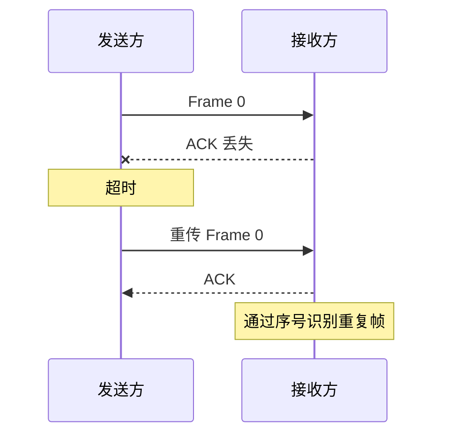

数据链路层面对的是**相邻结点之间的帧传输**。网络层关心“分组怎样跨越多个网络到达目标”，而数据链路层把其中的每一跳具体落实为“这一条链路上的帧怎样正确交付”。

从考纲角度，数据链路层的核心功能可归纳为：

| 功能 | 解决的问题 | 典型机制 |
| --- | --- | --- |
| 组帧 | 连续比特流中怎样划出一帧 | 字符计数、字符填充、零比特填充 |
| 差错控制 | 如何发现或纠正传输中的比特错误 | 奇偶校验、CRC、海明码 |
| 流量控制 | 如何避免发送方长期快于接收方 | 停等、滑动窗口 |
| 可靠传输 | 帧丢失、损坏、重复后如何恢复 | 序号、ACK、定时器、ARQ |
| 介质访问控制 | 多个站共享广播介质时谁先发送 | CSMA/CD、CSMA/CA、轮询等 |

<Callout type="warning" title="检错、流量控制、可靠传输不是同一件事">

- CRC、海明码回答“**比特有没有错 / 能否纠正**”；
- 流量控制回答“**发送速度是否超过接收能力**”；
- ARQ 可靠传输回答“**帧丢失、出错、重复后怎样恢复**”。

一个协议可以只具备其中一部分能力。例如 PPP 能用 FCS 检错，但并不因此自动具备可靠重传。

</Callout>

<Callout type="info" title="本章前半段做题主线">

1. **组帧**：怎样找到一帧的开始和结束？
2. **差错控制**：奇偶校验、CRC、海明码分别能做什么？
3. **可靠传输**：序号有多少位、发送窗口多大、接收窗口多大、ACK 表示什么？
4. **效率计算**：先画时间轴，再算发送数据真正占用链路的比例。

</Callout>

---

## 1. 数据链路层、帧与透明传输

<InlineSvg src="/images/computer-network/computer-network-datalink-framing-001.svg" alt={"组帧 图 1"} />

网络层把分组交给数据链路层后，数据链路层通常会在其前后增加控制信息，形成**帧（Frame）**。帧是数据链路层的协议数据单元（PDU）。

链路可粗分为两类：

- **点到点链路**：链路两端直接通信，例如 PPP；
- **广播链路**：多个站共享同一介质，需要额外解决介质访问控制，例如经典共享 Ethernet、WLAN。

不同链路层协议提供的服务并不完全相同：有的只负责成帧和检错，有的还提供可靠传输。因此不能把“数据链路层”机械等同于“必然可靠”。

组帧首先要解决**帧定界**：接收方必须能从连续的比特流中确定一帧从哪里开始、到哪里结束。

所谓**透明传输**，是指：

> 无论上层数据中出现怎样的比特或字节组合，都不能被误认为链路层控制信息或帧边界。

常见方法如下。

| 方法 | 帧边界依据 | 透明传输手段 | 典型风险/特点 |
| --- | --- | --- | --- |
| 字符计数法 | 首部长度字段 | 不依赖特殊填充 | 长度字段出错可能导致后续失步 |
| 字符定界法 | 特殊 FLAG 字符 | 字符填充、ESC 转义 | 面向字节/字符 |
| 零比特填充法 | 特殊比特串 `01111110` | 连续 5 个 `1` 后插 `0` | 面向比特 |
| 违规编码法 | 正常编码不会出现的信号状态 | 用非法编码作边界 | 依赖物理层编码 |

<Callout type="warning" title="先分清两件事">

**帧定界**解决“边界在哪里”；**透明传输**解决“数据里恰好出现边界模式怎么办”。

</Callout>

---

## 2. 字符计数、字符填充与零比特填充

### 2.1 字符计数法

<InlineSvg src="/images/computer-network/computer-network-datalink-framing-002.svg" alt={"组帧 图 2"} />

帧首部保存长度，接收方根据长度字段确定本帧结束位置。

它的主要缺点是：若长度字段本身发生错误，接收方可能错误地解释后续边界，造成连续多个帧失步。

### 2.2 字符定界与字符填充

<InlineSvg src="/images/computer-network/computer-network-datalink-framing-003.svg" alt={"组帧 图 3"} />

若使用特殊字符 `FLAG` 表示边界，而数据字段内也可能出现 `FLAG`，发送方可在控制字符前插入 `ESC`：

```text
数据中的 FLAG  -> ESC FLAG
数据中的 ESC   -> ESC ESC
```

接收方识别后删除用于转义的 `ESC`，还原原始数据。

### 2.3 零比特填充

<InlineSvg src="/images/computer-network/computer-network-datalink-framing-004.svg" alt={"组帧 图 4"} />

面向比特协议可使用：

```text
01111110
```

作为标志字段。发送端扫描数据字段，每遇到**连续 5 个 `1`**，就在其后自动插入一个 `0`；接收端执行相反操作。

例如：

```text
原数据：01111110
填充后：011111010
```

<Callout type="info" title="408 速记">

字符流透明传输 → **字符填充**；比特流透明传输 → **零比特填充**。看到 `01111110`，优先联想到 HDLC 与“5 个 1 后插 0”。

</Callout>

---

## 3. 违规编码法

<InlineSvg src="/images/computer-network/computer-network-datalink-framing-005.svg" alt={"组帧 图 5"} />

某些物理层线路编码只使用全部信号状态中的一部分，因此可以把正常数据中不会出现的**非法信号组合**保留为帧边界。

它与字符填充、零比特填充的区别在于：边界来自**物理编码中的保留状态**，而不是数据字段中的转义规则。

---

## 4. 差错控制：检错与纠错

传输过程中可能发生比特翻转。差错控制编码大体分为：

| 类别 | 目标 | 典型方法 |
| --- | --- | --- |
| 检错编码 | 判断“是否发生了可检测的错误” | 奇偶校验、CRC |
| 纠错编码 | 在能力范围内定位并恢复错误 | 海明码 |

> **真题范围**
>
> 2013 年第 15 题、2023 年第 37 题、2025 年第 34 题。

### 4.1 奇偶校验

<InlineSvg src="/images/computer-network/computer-network-datalink-error-001.svg" alt={"差错控制 图 1"} />

增加 1 个校验位，使**整个码字**中 `1` 的数量满足规定奇偶性。

| 校验方式 | 要求整个码字中 `1` 的个数 |
| --- | --- |
| 奇校验 | 奇数 |
| 偶校验 | 偶数 |

奇偶校验的能力：

- 一定能检测**任意奇数个比特错误**；
- 对偶数个比特错误**不保证检出**；
- 不能定位错误，因此不能仅靠一个奇偶位纠错。

<Callout type="warning" title="常见误区">

校验位本身不是固定的“奇校验填 1、偶校验填 0”。校验位取值由原数据中 `1` 的个数决定，目标是让**整个码字**满足规定奇偶性。

</Callout>

---

## 5. CRC：生成多项式与模 2 除法

<InlineSvg src="/images/computer-network/computer-network-datalink-error-002.svg" alt={"差错控制 图 2"} />

CRC（Cyclic Redundancy Check）把比特串视为二进制多项式，用约定的生成多项式进行**模 2 除法**。

模 2 加减法都等价于 XOR：

```text
0 XOR 0 = 0
0 XOR 1 = 1
1 XOR 0 = 1
1 XOR 1 = 0
```

设生成多项式最高次数为 $r$，则其二进制表示长度为 $r+1$ 位，CRC 余数长度为 $r$ 位。

例如生成比特串：

```text
110101
```

对应：

$$
G(x)=x^5+x^4+x^2+1
$$

因此 $r=5$，需要生成 5 位 CRC 余数。

---

## 6. CRC 的发送端生成与接收端校验

<InlineSvg src="/images/computer-network/computer-network-datalink-error-003.svg" alt={"差错控制 图 3"} />
<InlineSvg src="/images/computer-network/computer-network-datalink-error-004.svg" alt={"差错控制 图 4"} />
<InlineSvg src="/images/computer-network/computer-network-datalink-error-005.svg" alt={"差错控制 图 5"} />

设原数据为 $M$，生成多项式次数为 $r$。

### 6.1 发送端

1. 在原数据末尾补 $r$ 个 `0`；
2. 用生成比特串进行模 2 除法；
3. 得到 $r$ 位余数 $R$；
4. 用 $R$ 替换补入的 $r$ 个 `0`；
5. 发送“数据 + CRC”。

例如：

```text
原数据：1010001101
生成串：110101
补 5 个 0：101000110100000
余数：01110
发送码字：101000110101110
```

### 6.2 接收端

接收端直接用收到的**完整码字**除以同一生成多项式。

若余数为 0，表示：

> **没有检测到 CRC 能发现的错误。**

并不能据此声称“数学上绝对没有错误”。CRC 的检错能力取决于生成多项式 $G(x)$。常见结论包括：

- 若 $G(x)$ 含因子 $(x+1)$，则可检测任意**奇数个**比特错误；
- 若生成多项式次数为 $r$，则可以检测所有长度不超过 $r$ 的突发错误；
- 对更长突发错误并非绝对保证，因此“余数为 0”只能说明错误模式没有被当前 CRC 检出。

<Callout type="warning" title="CRC ≠ ARQ">

CRC 负责**发现错误**，不会自动重传；收到错误帧后是直接丢弃、请求重传还是交给上层处理，要看具体协议。

</Callout>

---

## 7. 海明码：校验位数量与位置

<InlineSvg src="/images/computer-network/computer-network-datalink-error-006.svg" alt={"差错控制 图 6"} />
<InlineSvg src="/images/computer-network/computer-network-datalink-error-007.svg" alt={"差错控制 图 7"} />

海明码通过多个校验位形成**伴随式（syndrome）**，在能力范围内定位错误位置。

设数据位数为 $k$，海明校验位数为 $r$。对普通单错纠正海明码，需要满足：

$$
2^r\ge k+r+1
$$

右边的 $k+r$ 对应所有码位，额外的 `1` 对应“无错误”状态。

校验位放在编号为 2 的整数次幂的位置：

```text
1, 2, 4, 8, 16, ...
```

其余位置依次放数据位。

例如 7 位码字：

| 位置 | 1 | 2 | 3 | 4 | 5 | 6 | 7 |
| ---: | --- | --- | --- | --- | --- | --- | --- |
| 类型 | $p_1$ | $p_2$ | $d_1$ | $p_3$ | $d_2$ | $d_3$ | $d_4$ |

---

## 8. 海明码分组、伴随式与纠错

把位置编号写成二进制：

| 位置 | 二进制 |
| ---: | --- |
| 1 | 001 |
| 2 | 010 |
| 3 | 011 |
| 4 | 100 |
| 5 | 101 |
| 6 | 110 |
| 7 | 111 |

于是：

- $p_1$ 检查最低位为 1 的位置：1、3、5、7；
- $p_2$ 检查第二位为 1 的位置：2、3、6、7；
- $p_3$ 检查第三位为 1 的位置：4、5、6、7。

接收端重新计算各组校验结果，按规定次序拼成伴随式。若得到：

```text
010
```

则：

$$
010_2=2
$$

表示第 2 位发生了单比特错误，可将该位翻转恢复。

<Callout type="warning" title="位序必须看题目">

有的题按位置 `1 -> n` 写码字，有的图从 `n -> 1` 展示；伴随式的高低位次序也可能由题目约定。先按题目编号再算，不要死背某个最终比特串。

</Callout>

---

## 9. 海明距离与编码能力

<InlineSvg src="/images/computer-network/computer-network-datalink-error-008.svg" alt={"差错控制 图 8"} />
<InlineSvg src="/images/computer-network/computer-network-datalink-error-009.svg" alt={"差错控制 图 9"} />

两个等长码字对应位置不同的个数称为**海明距离**。编码集中任意两个不同合法码字之间海明距离的最小值称为最小海明距离 $d_{\min}$。

若只要求保证检错，则最多可保证检测：

$$
d_{\min}-1
$$

位错误。

若要求保证纠正 $t$ 位错误，需要：

$$
2t<d_{\min}
$$

因此：

$$
t=\left\lfloor\frac{d_{\min}-1}{2}\right\rfloor
$$

普通海明码通常有：

$$
d_{\min}=3
$$

所以可保证**纠正 1 位错误**。从码距角度看可保证检出至多 2 位错误，但传统单错纠正译码器在双错时可能把伴随式误当成某个单错位置。

若在普通海明码之外再增加 1 个**总体奇偶校验位**，可构成扩展海明码 **SECDED（Single Error Correction, Double Error Detection）**。做题时可按“伴随式 + 总体奇偶”联合判断：

| 伴随式 | 总体奇偶检查 | 常见解释 |
| --- | --- | --- |
| 0 | 正常 | 无错误 |
| 非 0 | 异常 | 某一位单错，可按伴随式定位 |
| 0 | 异常 | 总体奇偶位自身出错 |
| 非 0 | 正常 | 通常判为双比特错误，不应按单错位置直接纠正 |

<Callout type="warning" title="码距结论与具体译码器要分开">

$d_{\min}=3$ 的码从数学上能保证检测 2 位错误，但若系统只按普通海明码的单错译码规则工作，双错可能被误纠。题目若强调“SECDED”，才应使用扩展海明码的双错检测逻辑。

</Callout>

---

## 10. 流量控制、可靠传输与停等 ARQ

<InlineSvg src="/images/computer-network/computer-network-datalink-flow_control-001.svg" alt={"流量控制 图 1"} />
<InlineSvg src="/images/computer-network/computer-network-datalink-flow_control-002.svg" alt={"流量控制 图 2"} />

**流量控制**的目标是限制发送方的发送节奏，使接收方来得及处理；**可靠传输**的目标是处理丢失、损坏、重复和乱序。停等与滑动窗口既可以承担流量控制，也常与 ARQ 机制结合实现可靠传输。

ARQ（Automatic Repeat reQuest）通常依靠：

> **序号 + ACK + 定时器 + 超时重传**

把可能丢帧、丢 ACK 或产生差错的链路变成可靠的数据交付服务。

> **真题范围**
>
> 选择题：2009 年第 35 题、2011 年第 35 题、2012 年第 36 题、2014 年第 36 题、2018 年第 36 题、2019 年第 35 题、2020 年第 36 题、2023 年第 35 题、2024 年第 37 题。
>
> 解答题：2017 年第 47 题、2025 年第 47 题。

停等协议中：

1. 发送 1 帧并启动计时器；
2. 正确收到 ACK 后再发下一帧；
3. 超时未收到 ACK，则重传当前帧；
4. 帧序号用于识别 ACK 丢失导致的重复帧。


```mermaid
sequenceDiagram
    participant S as 发送方
    participant R as 接收方
    S->>R: Frame 0
    R--xS: ACK 丢失
    Note over S: 超时
    S->>R: 重传 Frame 0
    R-->>S: ACK
    Note over R: 通过序号识别重复帧
```

停等协议的发送窗口和接收窗口均为 1，通常 1 bit 序号即可交替表示新旧帧。

<Callout type="info" title="为什么停等协议也要序号？">

若接收方已正确收到 `Frame 0`，但其 ACK 丢失，发送方超时后会再次发送 `Frame 0`。接收方必须借助序号判断这是**旧帧重传**而不是新的上层数据，否则会发生重复交付。

</Callout>

---

## 11. GBN、SR 与循环序号窗口

<InlineSvg src="/images/computer-network/computer-network-datalink-flow_control-003.svg" alt={"流量控制 图 3"} />
<InlineSvg src="/images/computer-network/computer-network-datalink-flow_control-004.svg" alt={"流量控制 图 4"} />
<InlineSvg src="/images/computer-network/computer-network-datalink-flow_control-005.svg" alt={"流量控制 图 5"} />
<InlineSvg src="/images/computer-network/computer-network-datalink-flow_control-006.svg" alt={"流量控制 图 6"} />

若序号字段为 $n$ 位，则循环序号空间大小为：

$$
N=2^n
$$

### 11.1 GBN（Go-Back-N）

GBN 的接收窗口：

$$
W_r=1
$$

接收方只接受当前正期望的帧，乱序帧通常直接丢弃；ACK 通常采用**累计确认**。发送端最早未确认帧超时后，从该帧开始重传后续所有已发送但未确认帧。

发送窗口必须满足：

$$
W_s\le2^n-1
$$

典型实现中，发送方通常只需为**最早未确认帧**维护核心超时逻辑；一旦它超时，就回退并重传从该帧开始的所有未确认帧。

### 11.2 SR（Selective Repeat）

SR 可接收并缓存接收窗口内的乱序帧，每个帧独立确认，超时后通常只重传对应帧。

安全窗口条件可写为：

$$
W_s+W_r\le2^n
$$

典型 SR 中：

$$
W_s=W_r
$$

因此：

$$
W_s\le2^{n-1}
$$

| 特性 | Stop-and-Wait | GBN | SR |
| --- | ---: | ---: | ---: |
| 发送窗口 | 1 | $\le2^n-1$ | 通常 $\le2^{n-1}$ |
| 接收窗口 | 1 | 1 | 通常等于发送窗口 |
| 接收乱序 | 否 | 否 | 是 |
| 缓存乱序 | 否 | 否 | 是 |
| 确认方式 | 单帧 | 通常累计 ACK | 通常独立 ACK |
| 超时重传 | 当前帧 | 从超时帧起回退 | 仅相应帧 |

例如序号字段为 3 bit，则序号空间为 $0\sim7$：

- GBN 最大安全发送窗口为 $7$；
- 典型 SR 最大安全发送/接收窗口均为 $4$。

其本质不是“背 7 和 4”，而是防止**新一轮序号与仍可能在网络中的旧帧产生歧义**。

<Callout type="warning" title="ACK 编号语义以题目为准">

有的题规定 `ACK k` 表示“帧 k 已收到”，有的题规定表示“下一帧期望 k”。做窗口题前必须先读清 ACK 的定义，否则即使窗口公式正确也会整体错位。

</Callout>

---

## 12. 滑动窗口协议的信道利用率

<InlineSvg src="/images/computer-network/computer-network-datalink-flow_control-007.svg" alt={"流量控制 图 7"} />

设：

- 数据帧发送时延为 $T_d$；
- ACK 发送时延为 $T_a$；
- 单向传播时延为 $T_p$；
- 发送窗口大小为 $N$。

则：

$$
RTT=2T_p
$$

### 12.1 停等协议

<InlineSvg src="/images/computer-network/computer-network-datalink-flow_control-008.svg" alt={"流量控制 图 8"} />

忽略处理时延时，一个发送周期约为：

$$
T_d+2T_p+T_a
$$

因此数据发送利用率：

$$
U=\frac{T_d}{T_d+2T_p+T_a}
$$

### 12.2 连续 ARQ

<InlineSvg src="/images/computer-network/computer-network-datalink-flow_control-009.svg" alt={"流量控制 图 9"} />

若窗口内可连续发 $N$ 帧，在常见题设下：

$$
U=\min\left(1,\frac{NT_d}{T_d+2T_p+T_a}\right)
$$

若 ACK 很短可忽略，令：

$$
a=\frac{T_p}{T_d}
$$

则：

$$
U=\min\left(1,\frac{N}{1+2a}\right)
$$

达到满利用的常用判据为：

$$
NT_d\ge T_d+2T_p+T_a
$$

因此在上述模型下，想让发送端尽量不断流，所需最小窗口可写成：

$$
N_{\min}=\left\lceil\frac{T_d+2T_p+T_a}{T_d}\right\rceil
$$

若 ACK 发送时延忽略，则：

$$
N_{\min}=\left\lceil1+2a\right\rceil
$$

理想情况下有效数据吞吐量还可写为：

$$
\text{Throughput}=U\times R
$$

其中 $R$ 为链路发送速率。若题目存在误码和重传，上述 $U$ 只是**无差错理想模型**，应再按实际成功传输周期修正。

> **真题范围**
>
> 2025 年第 47 题：由 GBN 的目标信道利用率反推最小发送窗口，再由 GBN 窗口上限反推最少序号位数。

<Callout type="info" title="利用率题最稳的方法">

先画**第一帧从开始发送到其 ACK 回来的时间轴**，再判断窗口中的帧是否足够填满这段等待时间。不要只套公式；若题目给出了 ACK 捎带、处理时延、多个链路或特殊确认规则，应按时间轴重建分母。

</Callout>
