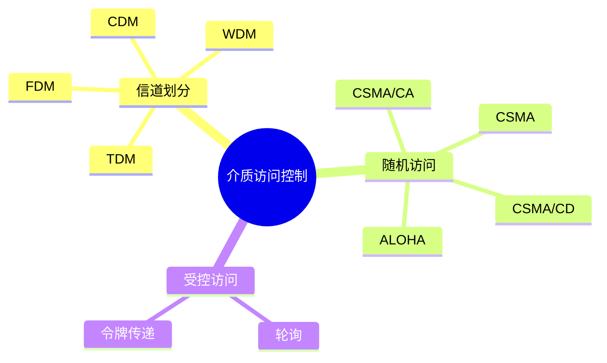
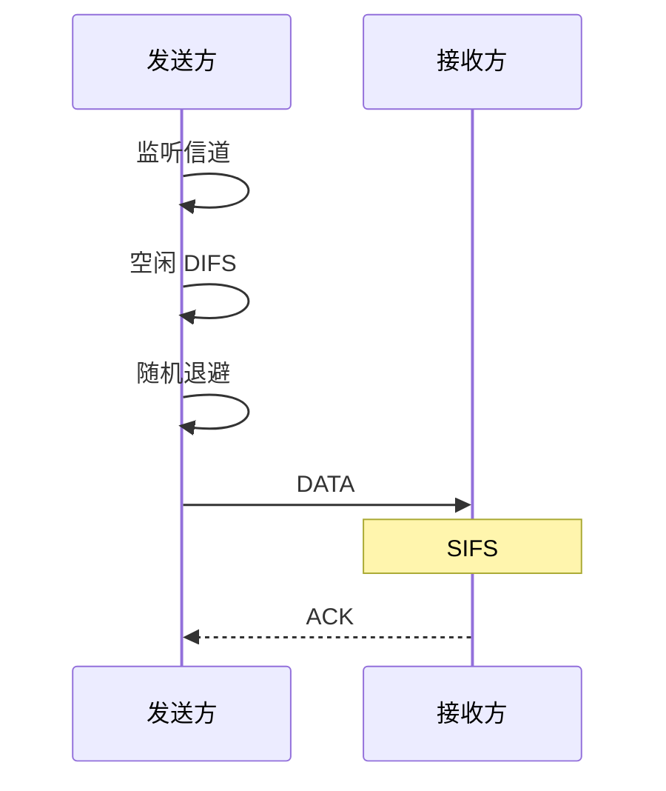

## 十三、介质访问控制 MAC

MAC（Media Access Control）主要解决：

> **多个设备共享同一个通信介质时，谁可以在什么时候发送？**

<InlineSvg src="/images/computer-network/computer-network-datalink-mac-001.svg" alt={"介质访问控制 图 1"} />

在传统共享以太网模型中：

* 所有设备共享一条介质；
* 一台设备发送的信号会沿介质传播；
* 两台设备同时发送可能产生碰撞。

408 中一旦看到：

```text
CSMA/CD
碰撞
传播时延
最小帧长
```

应立即切换为：

> **共享介质 + 广播传播 + 半双工**

现代交换式全双工以太网通常不存在这种碰撞问题，但考试中的 CSMA/CD 仍基于经典共享以太网模型。

---

### 十四、介质访问控制分类



---

## 十五、信道划分

### 1. FDM 频分复用

把频率范围划分成多个互不重叠的频带。

各用户：

> 同时使用信道，但占用不同频率。

<InlineSvg src="/images/computer-network/computer-network-datalink-mac-002.svg" alt={"介质访问控制 图 2"} />

---

### 2. TDM 时分复用

把时间划分为不同的时隙。

用户：

> 使用相同频率，但轮流占用不同时间片。

<InlineSvg src="/images/computer-network/computer-network-datalink-mac-003.svg" alt={"介质访问控制 图 3"} />

---

### 3. WDM 波分复用

WDM 可以看成**光纤上的 FDM**。

不同信号使用不同波长的光。

<InlineSvg src="/images/computer-network/computer-network-datalink-mac-004.svg" alt={"介质访问控制 图 4"} />

---

## 十六、CDMA 与码片

CDMA 使用不同的**码片序列**区分用户。

<InlineSvg src="/images/computer-network/computer-network-datalink-mac-005.svg" alt={"介质访问控制 图 5"} />

把码片中的：

```text
1  → +1
0  → -1
```

表示为向量。

不同站点的码片必须相互正交。

若站点 `S` 和 `T` 的码片长度为 `m`：

$$
S\cdot T
=
\frac{1}{m}
\sum_{i=1}^{m}
S_iT_i
=
0
$$

自身：

$$
S\cdot S=1
$$

反码：

$$
S\cdot(-S)=-1
$$

---

### CDMA 示例

令：

$$
S=(+1,+1,-1,-1)
$$

$$
T=(+1,-1,+1,-1)
$$

A 发送 `1`：

$$
S
$$

B 发送 `0`，所以发送其反码：

$$
-T=(-1,+1,-1,+1)
$$

信道中叠加：

$$
S-T
=
(0,+2,-2,0)
$$

<InlineSvg src="/images/computer-network/computer-network-datalink-mac-006.svg" alt={"介质访问控制 图 6"} />

恢复 A：

$$
\frac{1}{4}
(0,+2,-2,0)
\cdot
(+1,+1,-1,-1)
=+1
$$

所以 A 发送 `1`。

恢复 B：

$$
\frac{1}{4}
(0,+2,-2,0)
\cdot
(+1,-1,+1,-1)
=-1
$$

所以 B 发送 `0`。

> **CDMA 做题步骤**
>
> 1. 把比特序列转换成 `+1/-1`；
> 2. 发送 `1` 用原码；
> 3. 发送 `0` 用反码；
> 4. 各站信号相加；
> 5. 与目标站码片做规格化内积；
> 6. `+1 → 1`，`-1 → 0`，`0 → 该站未发送`。

---

## 十七、ALOHA

ALOHA 是最简单的随机接入思想。

核心特点：

> **不先监听，直接发送。**

如果没有正确收到 ACK，则认为传输失败，随机等待后重传。

---

### 1. 纯 ALOHA

任何时刻都可以发送。

<InlineSvg src="/images/computer-network/computer-network-datalink-mac-007.svg" alt={"介质访问控制 图 7"} />

因为开始时间完全随机，所以碰撞概率较高。

经典吞吐量：

$$
S=Ge^{-2G}
$$

最大值：

$$
S_{\max}=\frac{1}{2e}\approx18.4\%
$$

---

### 2. 时隙 ALOHA

所有站点只能在**时隙边界**开始发送。

<InlineSvg src="/images/computer-network/computer-network-datalink-mac-008.svg" alt={"介质访问控制 图 8"} />

吞吐量：

$$
S=Ge^{-G}
$$

最大值：

$$
S_{\max}=\frac{1}{e}\approx36.8\%
$$

因此时隙 ALOHA 的理论最高利用率约为纯 ALOHA 的两倍。

---

## 十八、CSMA

CSMA：

> Carrier Sense Multiple Access
> **载波监听多路访问**

核心改进：

> **发送前先听。**

<InlineSvg src="/images/computer-network/computer-network-datalink-mac-009.svg" alt={"介质访问控制 图 9"} />

但是：

> **先听后发并不能保证绝对不碰撞。**

原因是存在传播时延。

假设：

* A 和 B 相距很远；
* A 刚刚开始发送；
* A 的信号还没有传播到 B；
* B 此时监听自己的位置，仍然认为信道空闲；
* B 也开始发送。

于是仍然发生碰撞。

---

### CSMA 三种坚持方式

| 协议        | 信道空闲                | 信道忙       |
| --------- | ------------------- | --------- |
| 1-坚持 CSMA | 立即发送                | 持续监听      |
| 非坚持 CSMA  | 立即发送                | 随机等待后重新监听 |
| p-坚持 CSMA | 以概率 `p` 发送，否则等待下一时隙 | 等待空闲      |

其中：

* 1-坚持：延迟低，但多个等待站容易同时发送；
* 非坚持：降低碰撞概率，但增加等待；
* p-坚持：用于时隙化信道，在碰撞与延迟之间折中。

> **注意**
>
> p-坚持 CSMA 不能简单等同于 Wi-Fi。
>
> IEEE 802.11 使用的是更复杂的 **CSMA/CA + 随机退避**。

---

## 十九、CSMA/CD

CSMA/CD：

> Carrier Sense Multiple Access with Collision Detection
> **载波监听多路访问 / 碰撞检测**

特点：

> **先听后发、边发边听、冲突停止、随机退避。**

<InlineSvg src="/images/computer-network/computer-network-datalink-mac-010.svg" alt={"介质访问控制 图 10"} />

由于传播时延：

> 碰撞实际发生的时刻，与发送站发现碰撞的时刻并不相同。

<InlineSvg src="/images/computer-network/computer-network-datalink-mac-011.svg" alt={"介质访问控制 图 11"} />

---

### 1. CSMA/CD 流程

1. 准备发送帧；
2. 监听信道；
3. 忙 → 继续监听；
4. 空闲 → 开始发送；
5. 发送过程中继续监听；
6. 若检测到碰撞：

   * 立即停止；
   * 发送强化碰撞的 Jam 信号；
   * 执行二进制指数退避；
   * 重新竞争信道；
7. 达到最大失败次数后放弃。

<InlineSvg src="/images/computer-network/computer-network-datalink-mac-012.svg" alt={"介质访问控制 图 12"} />

---

### 2. 二进制指数退避

假设已经发生第 `i` 次碰撞：

$$
k=\min(i,10)
$$

随机选择整数：

$$
K\in
\left[
0,2^k-1
\right]
$$

等待：

$$
K\times512
$$

个**比特时间**。

典型过程：

|  碰撞次数 | 随机范围      |
| ----: | --------- |
|     1 | 0～1       |
|     2 | 0～3       |
|     3 | 0～7       |
|   ... | ...       |
|    10 | 0～1023    |
| 11～16 | 仍为 0～1023 |

经典 Ethernet 连续发生 16 次碰撞后放弃发送并报告失败。

---

## 二十、CSMA/CD 最小帧长

这是 408 数据链路层最重要公式之一。

设：

* 单向最大传播时延为 `T_p`；
* 帧发送时间为 `T_t`。

为了保证发送方**还在发送时**就能发现最远端产生的碰撞：

$$
T_t\ge2T_p
$$

<InlineSvg src="/images/computer-network/computer-network-datalink-mac-013.svg" alt={"介质访问控制 图 13"} />

又因为：

$$
T_t=
\frac{L}{R}
$$

其中：

* `L`：帧长；
* `R`：数据传输速率。

于是：

$$
\frac{L_{\min}}{R}\ge2T_p
$$

因此：

$$
L_{\min}\ge2T_pR
$$

> **一句话理解**
>
> 最坏情况下，碰撞信号必须走一个“来回”才能回到发送方。
>
> 所以发送一个最短帧所需时间必须至少覆盖：
>
> $$
> 2T_p
> $$

经典以太网规定最短帧：

$$
64\text{ B}=512\text{ bit}
$$

这正是经典以太网 slot time 为 512 bit times 的来源。

---

## 二十一、CSMA/CA

无线局域网不能直接照搬 CSMA/CD。

主要原因：

1. 无线设备发送时很难同时可靠检测微弱的其他无线信号；
2. 无线信号容易受到衰减、遮挡和干扰；
3. 存在隐藏节点。

因此 IEEE 802.11 使用：

> **CSMA/CA：碰撞避免**

而不是碰撞检测。

<InlineSvg src="/images/computer-network/computer-network-datalink-mac-014.svg" alt={"介质访问控制 图 14"} />

---

### 1. 基本概念

* **STA**：无线站点，例如手机、电脑；
* **AP**：无线接入点；
* **DS**：连接 AP 的分布式系统；
* **隐藏节点**：彼此听不到，但都能与同一接收方通信的两个站点。

<InlineSvg src="/images/computer-network/computer-network-datalink-mac-015.svg" alt={"介质访问控制 图 15"} />

例如：

```text
A ───── B ───── C

A 能听到 B
C 能听到 B
A 与 C 互相听不到
```

A 和 C 都可能认为信道空闲，然后同时向 B 发送。

---

### 2. 普通 CSMA/CA

典型流程：

```text
监听信道
↓
等待 DIFS
↓
随机退避
↓
发送 DATA
↓
等待 SIFS
↓
接收方发送 ACK
```



随机退避过程中：

* 信道空闲 → 计数器递减；
* 信道变忙 → 暂停倒计时；
* 再次空闲并经过 DIFS → 从剩余值继续；
* 计数归零 → 发送。

如果未收到 ACK：

> 发送方认为本次传输失败，扩大竞争窗口后重新随机退避。

未收到 ACK 并不意味着一定发生了碰撞，还可能是：

* 无线干扰；
* DATA 损坏；
* ACK 损坏；
* 接收方未正确接收。

---

## 二十二、RTS/CTS

隐藏节点仅靠物理载波监听无法完全解决。

802.11 因此提供可选的：

* RTS：Request To Send；
* CTS：Clear To Send。

流程：

```text
DIFS
→ Backoff
→ RTS
→ SIFS
→ CTS
→ SIFS
→ DATA
→ SIFS
→ ACK
```

<InlineSvg src="/images/computer-network/computer-network-datalink-mac-016.svg" alt={"介质访问控制 图 16"} />

RTS/CTS 的作用：

* 缓解隐藏节点问题；
* 预约信道；
* 让其他站点提前避让；
* 把可能的碰撞尽量限制在较短的 RTS 帧上。

它：

> **降低碰撞概率和碰撞代价，但不能彻底消除碰撞。**

例如多个站点仍可能同时发送 RTS。

---

## 二十三、NAV 与虚拟载波监听

802.11 有两种载波监听：

1. **物理载波监听**：直接检测当前无线信号；
2. **虚拟载波监听**：通过 NAV 判断未来的信道是否已被预约。

NAV：

> Network Allocation Vector，网络分配向量。

本质是一个倒计时计时器。

<InlineSvg src="/images/computer-network/computer-network-datalink-mac-017.svg" alt={"介质访问控制 图 17"} />

附近站点收到 RTS 或 CTS 后，会根据其中的 Duration 字段设置 NAV。

只有：

```text
物理信道空闲
AND
NAV = 0
```

时，站点才认为信道真正空闲。

---

### 1. RTS 中的 NAV

忽略传播时延，RTS 之后还需要：

```text
SIFS
CTS
SIFS
DATA
SIFS
ACK
```

所以：

$$
NAV_{\mathrm{RTS}}
=
3T_{\mathrm{SIFS}}
+
T_{\mathrm{CTS}}
+
T_{\mathrm{DATA}}
+
T_{\mathrm{ACK}}
$$

---

### 2. CTS 中的 NAV

CTS 之后还剩：

```text
SIFS
DATA
SIFS
ACK
```

因此：

$$
NAV_{\mathrm{CTS}}
=
2T_{\mathrm{SIFS}}
+
T_{\mathrm{DATA}}
+
T_{\mathrm{ACK}}
$$

> **NAV 做题原则**
>
> Duration 表示的通常是：
>
> **当前帧发送完以后，本次交换剩余过程还需要占用信道多长时间。**

---

## 二十四、IFS 帧间间隔

802.11 使用不同长度的 IFS 控制优先级。

三种主要 IFS：

| IFS  | 含义        | 用途             |
| ---- | --------- | -------------- |
| SIFS | Short IFS | ACK、CTS 等立即响应帧 |
| PIFS | PCF IFS   | PCF            |
| DIFS | DCF IFS   | 普通数据竞争         |

长度关系：

$$
SIFS<PIFS<DIFS
$$

<InlineSvg src="/images/computer-network/computer-network-datalink-mac-018.svg" alt={"介质访问控制 图 18"} />

因此：

> SIFS 最短 → ACK、CTS 可以比其他站点的新 DATA 更早获得信道。

---

## 二十五、802.11 数据帧地址

802.11 帧头比 Ethernet 更复杂，因为除了真正的源和目的之外，还要描述：

> **这一跳的无线发送方和接收方是谁。**

<InlineSvg src="/images/computer-network/computer-network-datalink-mac-019.svg" alt={"介质访问控制 图 19"} />

常见概念：

* **RA**：Receiver Address，当前这一跳的接收者；
* **TA**：Transmitter Address，当前这一跳的发送者；
* **SA**：Source Address，数据链路层数据的原始源；
* **DA**：Destination Address，当前二层转发域中的最终目的 MAC；
* **BSSID**：基本服务集标识，基础设施网络中通常与 AP 有关。

| To DS | From DS | Address 1  | Address 2  | Address 3 | Address 4 |
| ----: | ------: | ---------- | ---------- | --------- | --------- |
|     0 |       0 | DA / RA    | SA / TA    | BSSID     | 无         |
|     1 |       0 | BSSID / RA | SA / TA    | DA        | 无         |
|     0 |       1 | DA / RA    | BSSID / TA | SA        | 无         |
|     1 |       1 | RA         | TA         | DA        | SA        |

408 最常见的是前往 AP 和来自 AP 两种。

#### STA → AP

```text
To DS = 1
From DS = 0
```

* Address 1：AP/BSSID，RA；
* Address 2：无线站点，SA/TA；
* Address 3：DA。

#### AP → STA

```text
To DS = 0
From DS = 1
```

* Address 1：目的无线站点，DA/RA；
* Address 2：AP/BSSID，TA；
* Address 3：SA。

> **重要易错**
>
> 如果 IP 目的主机在 Internet 上，Address 3 中并不会写远程 Internet 主机的 MAC。
>
> MAC 地址不能跨越路由器传播。此时二层目的地址通常是当前局域网中**下一跳网关/路由器接口的 MAC 地址**。
>
> 记忆：
>
> **RA/TA 看当前无线这一跳，SA/DA 看当前二层帧的源和目的。**

---
