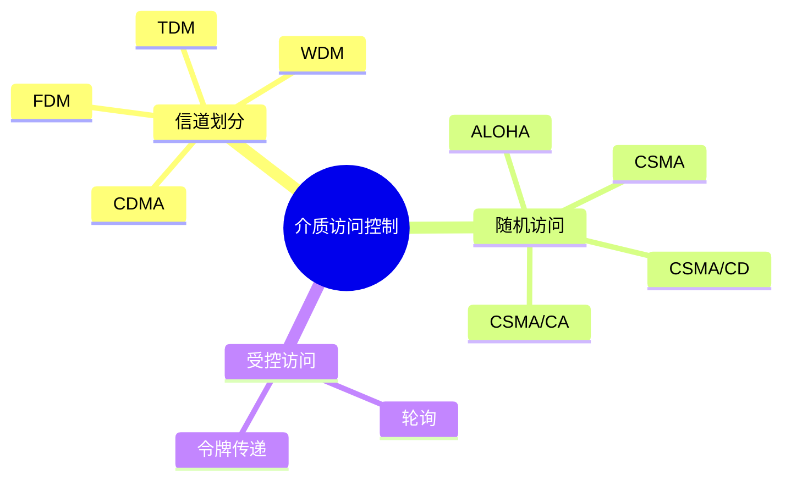

介质访问控制（MAC）的核心问题是：

> **当多个站点共享同一条广播介质时，谁能在什么时候发送？**

经典共享以太网和无线局域网都需要解决竞争问题，但处理思路不同：有线共享以太网可以“边发边检测碰撞”，无线网络更强调“发送前尽量避免碰撞”。

---

## 13. MAC 与介质访问控制分类

<InlineSvg src="/images/computer-network/computer-network-datalink-mac-001.svg" alt={"介质访问控制 图 1"} />

介质访问控制方法可分为三大类：


```mermaid
mindmap
  root((介质访问控制))
    信道划分
      FDM
      TDM
      WDM
      CDMA
    随机访问
      ALOHA
      CSMA
      CSMA/CD
      CSMA/CA
    受控访问
      轮询
      令牌传递
```

| 类别 | 核心思想 | 典型方法 |
| --- | --- | --- |
| 信道划分 | 预先把资源拆分给不同用户 | FDM、TDM、WDM、CDMA |
| 随机访问 | 有数据时竞争发送 | ALOHA、CSMA、CSMA/CD、CSMA/CA |
| 受控访问 | 由控制机制决定发送权 | 轮询、令牌传递 |

看到 `CSMA/CD + 碰撞 + 最小帧长` 时，应立即切换到**共享、半双工、存在传播时延**的经典 Ethernet 模型；现代交换式全双工 Ethernet 通常没有碰撞，也不需要执行 CSMA/CD。

### 13.1 受控访问：轮询与令牌传递

考纲中的“轮询访问”属于受控访问。它与随机访问最大的区别是：**发送权不是靠碰撞竞争，而是由控制规则明确授予**。

| 方法 | 发送权如何产生 | 优点 | 主要代价 |
| --- | --- | --- | --- |
| 轮询 Polling | 主站依次询问各从站 | 无碰撞、顺序明确 | 轮询开销；主站故障影响大 |
| 令牌传递 Token Passing | 令牌按逻辑顺序在站点间传递 | 无碰撞、公平性较好 | 令牌维护开销；令牌丢失需恢复 |

在高负载时，受控访问可以避免随机竞争造成的大量碰撞；但在低负载时，即使只有一个站有数据，也可能要承担轮询或等待令牌的额外延迟。

<Callout type="warning" title="随机访问与受控访问的判题关键词">

- “有数据就争抢、可能碰撞” → 随机访问；
- “主站依次询问” → 轮询；
- “拿到令牌才能发” → 令牌传递。

</Callout>

---

## 14. FDM、TDM 与 WDM

### 14.1 FDM：频分复用

<InlineSvg src="/images/computer-network/computer-network-datalink-mac-002.svg" alt={"介质访问控制 图 2"} />

把可用频带划分为多个互不重叠的子频带，各用户可以**同时发送，但占用不同频率**。

### 14.2 TDM：时分复用

<InlineSvg src="/images/computer-network/computer-network-datalink-mac-003.svg" alt={"介质访问控制 图 3"} />

把时间划分为时隙，各用户使用相同信道资源，但**在不同时间片发送**。

### 14.3 WDM：波分复用

<InlineSvg src="/images/computer-network/computer-network-datalink-mac-004.svg" alt={"介质访问控制 图 4"} />

WDM 可看作**光纤上的频分思想**：不同数据流使用不同光波长同时传输。

<Callout type="info" title="区分维度">

FDM/WDM 主要按频率或波长区分；TDM 按时间区分。它们的目标不是“碰撞后怎么办”，而是从资源划分上让用户互不冲突。

</Callout>

---

## 15. CDMA 与正交码片

<InlineSvg src="/images/computer-network/computer-network-datalink-mac-005.svg" alt={"介质访问控制 图 5"} />
<InlineSvg src="/images/computer-network/computer-network-datalink-mac-006.svg" alt={"介质访问控制 图 6"} />

CDMA 使用不同的**码片序列**区分用户。常把二进制：

```text
1 -> +1
0 -> -1
```

映射为向量。

不同站点的码片序列要求正交。若码片长度为 $m$，两个不同站 $S,T$ 满足：

$$
S\cdot T=\frac{1}{m}\sum_{i=1}^{m}S_iT_i=0
$$

同一站与自身、反码的规格化内积分别为：

$$
S\cdot S=1
$$

$$
S\cdot(-S)=-1
$$

若多个站同时发送，信道中的信号向量直接叠加。接收方用叠加向量与目标站码片做规格化内积：

- 结果为 $+1$：目标站发送 1；
- 结果为 $-1$：目标站发送 0；
- 结果为 0：目标站未发送。

### 15.1 计算示例

令：

$$
S=(+1,+1,-1,-1)
$$

$$
T=(+1,-1,+1,-1)
$$

若 $S$ 发送 1，而 $T$ 发送 0，则叠加信号为：

$$
S-T=(0,+2,-2,0)
$$

与 $S$ 做规格化内积：

$$
\frac14(0,+2,-2,0)\cdot(+1,+1,-1,-1)=+1
$$

说明 $S$ 发送 1。

---

## 16. ALOHA

ALOHA 的特点是：**不先监听，直接发送**；若未正确获得确认，则随机等待后重传。

### 16.1 纯 ALOHA

<InlineSvg src="/images/computer-network/computer-network-datalink-mac-007.svg" alt={"介质访问控制 图 7"} />

任何时刻都可以开始发送。经典模型的吞吐量：

$$
S=Ge^{-2G}
$$

最大值：

$$
S_{\max}=\frac{1}{2e}\approx18.4\%
$$

### 16.2 时隙 ALOHA

<InlineSvg src="/images/computer-network/computer-network-datalink-mac-008.svg" alt={"介质访问控制 图 8"} />

只允许在时隙边界开始发送：

$$
S=Ge^{-G}
$$

最大值：

$$
S_{\max}=\frac{1}{e}\approx36.8\%
$$

时隙化把“易发生碰撞的时间区间”缩短，因此最大理论吞吐量约为纯 ALOHA 的两倍。

---

## 17. CSMA 与三种坚持策略

<InlineSvg src="/images/computer-network/computer-network-datalink-mac-009.svg" alt={"介质访问控制 图 9"} />

CSMA（Carrier Sense Multiple Access）的基本思想是：

> **先监听信道，再决定是否发送。**

但监听到空闲并不意味着绝对不会碰撞，因为别的站点刚发出的信号可能还没传播到本地。

| 策略 | 监听为空闲 | 监听为忙 |
| --- | --- | --- |
| 1-坚持 | 立即发送 | 持续监听，空闲立即发 |
| 非坚持 | 立即发送 | 随机等待后重新监听 |
| p-坚持 | 每个允许发送的时隙以概率 $p$ 发送 | 等待信道空闲 |

- 1-坚持：等待小，但多个等待站容易一起发；
- 非坚持：降低碰撞概率，但增加平均等待；
- p-坚持：在时隙化模型中折中碰撞与等待。

<Callout type="warning" title="p-坚持 CSMA ≠ Wi-Fi">

802.11 使用的是更完整的 CSMA/CA、随机退避、ACK，以及可选 RTS/CTS，不能把它简单等同于 p-坚持 CSMA。

</Callout>

---

## 18. CSMA/CD 的工作过程

<InlineSvg src="/images/computer-network/computer-network-datalink-mac-010.svg" alt={"介质访问控制 图 10"} />
<InlineSvg src="/images/computer-network/computer-network-datalink-mac-011.svg" alt={"介质访问控制 图 11"} />
<InlineSvg src="/images/computer-network/computer-network-datalink-mac-012.svg" alt={"介质访问控制 图 12"} />

CSMA/CD（Carrier Sense Multiple Access with Collision Detection）常概括为：

> **先听后发，边发边听，冲突停止，随机退避。**

典型流程：

1. 发送前监听；
2. 忙则等待，空闲则发送；
3. 发送过程中继续检测碰撞；
4. 检测到碰撞后立即停止正常发送，并发送 Jam 信号强化碰撞；
5. 执行二进制指数退避；
6. 重新竞争，超过规定失败次数则报告发送失败。

<Callout type="warning" title="碰撞发生与碰撞被发现不是同一时刻">

碰撞可能在远端先发生，碰撞信号还需要传播回发送方。正是这个传播过程决定了 CSMA/CD 的“争用期”和最小帧长。

</Callout>

---

## 19. 二进制指数退避

经典 Ethernet 中，第 $i$ 次碰撞后取：

$$
k=\min(i,10)
$$

随机选择：

$$
K\in\{0,1,\dots,2^k-1\}
$$

等待：

$$
K\times512
$$

个**比特时间**后重新尝试。

| 已发生碰撞次数 | 随机整数 $K$ 的范围 |
| ---: | --- |
| 1 | 0～1 |
| 2 | 0～3 |
| 3 | 0～7 |
| ... | ... |
| 10～16 | 0～1023 |

经典 Ethernet 的退避窗口只增长到 $k=10$；之后即使继续碰撞，随机范围仍为 $0\sim1023$ 个时隙。达到协议规定的最大重传次数后，MAC 向上报告本次发送失败。

> **真题范围**
>
> 2025 年第 35 题：10BASE-T 连续发生 11 次冲突后，退避指数已封顶，最大等待为 $1023$ 个 slot time。

<Callout type="info" title="10 Mb/s Ethernet 的退避单位">

经典 Ethernet 一个 slot time 为 512 bit times。若速率为 10 Mb/s，则：

$$
T_{slot}=\frac{512}{10\times10^6}=51.2\ \mu s
$$

所以题目问“最大退避时间”时，先确定 $K_{\max}$，再乘 slot time。

</Callout>

---

## 20. CSMA/CD 最小帧长与争用期

<InlineSvg src="/images/computer-network/computer-network-datalink-mac-013.svg" alt={"介质访问控制 图 13"} />

设最远两端之间的**单向最大传播时延**为 $T_p$，帧发送时延为 $T_t$。

为了让发送站在发送完毕前仍能检测到最坏情况下从远端返回的碰撞：

$$
T_t\ge2T_p
$$

而：

$$
T_t=\frac{L}{R}
$$

所以：

$$
\boxed{L_{\min}\ge2T_pR}
$$

$2T_p$ 常称为争用期或冲突窗口的核心时间尺度。

经典 10 Mb/s Ethernet 的 slot time 为 512 bit times，对应最短 MAC 帧：

$$
512\text{ bit}=64\text{ B}
$$

### 20.1 高频反推

- 已知最长站间距离和传播速率：先求 $T_p=d/v$，再代 $L_{\min}=2T_pR$；
- 已知最短帧长和速率：可反推允许的最大往返传播时间；
- 若题目额外给中继器/设备处理时延，应把这些会影响碰撞反馈的时延一并纳入时间轴。

---

## 21. CSMA/CA 与无线碰撞避免

<InlineSvg src="/images/computer-network/computer-network-datalink-mac-014.svg" alt={"介质访问控制 图 14"} />
<InlineSvg src="/images/computer-network/computer-network-datalink-mac-015.svg" alt={"介质访问控制 图 15"} />

无线局域网难以像共享同轴 Ethernet 那样可靠地“边发边检测碰撞”，还存在衰减、遮挡和隐藏结点，因此 IEEE 802.11 采用 **CSMA/CA**。

常见概念：

- **STA**：无线站点；
- **AP**：接入点；
- **DS**：分布式系统；
- **隐藏结点**：两个发送站彼此听不到，却都能与同一接收站通信。

例如：

```text
A ----- B ----- C
A、C 互相听不到，但都能向 B 发送
```

A 与 C 都可能在本地判断信道空闲，从而同时向 B 发送。

---

## 22. 802.11 DCF：DIFS、退避、DATA 与 ACK

竞争发送的典型思路可概括为：

```text
监听信道
-> 等待 DIFS
-> 随机退避
-> DATA
-> SIFS
-> ACK
```

退避计数的核心规则：

- 信道保持空闲：按时隙递减；
- 信道变忙：冻结当前计数；
- 之后重新空闲并满足规定间隔：从剩余值继续倒计时；
- 计数到 0：获得发送机会。

未收到 ACK 表示本次传输未成功，原因可能是 DATA/ACK 损坏、干扰或碰撞，并不能仅凭“无 ACK”断言一定发生碰撞。

> **真题范围**
>
> 2026 年第 35 题：题目从“**开始发送数据帧**”计时，因此之前的 DIFS 与退避不计入，最短完成时间只统计 DATA 发送时延、SIFS 和题目未忽略的 ACK/传播时延。

<Callout type="warning" title="802.11 时间题先圈出计时起点">

同一组 DIFS、SIFS、DATA、ACK 参数，若题目问“从开始竞争”“从开始发送 DATA”或“从收到 CTS”，分母和时间轴完全不同。先画事件顺序，再决定哪些区间要计入。

</Callout>

---

## 23. RTS/CTS 与隐藏结点

<InlineSvg src="/images/computer-network/computer-network-datalink-mac-016.svg" alt={"介质访问控制 图 16"} />

802.11 可选用 RTS/CTS 预约信道：

```text
DIFS
-> Backoff
-> RTS
-> SIFS
-> CTS
-> SIFS
-> DATA
-> SIFS
-> ACK
```

作用包括：

- 缓解隐藏结点问题；
- 让周围站点提前知道信道将被占用；
- 将可能发生的竞争碰撞尽量限制在较短的 RTS 上。

RTS/CTS 只能**降低**碰撞概率与碰撞代价，不能数学上保证完全无碰撞，例如多个站仍可能同时发送 RTS。

---

## 24. NAV 与 IFS

### 24.1 NAV：虚拟载波监听

<InlineSvg src="/images/computer-network/computer-network-datalink-mac-017.svg" alt={"介质访问控制 图 17"} />

NAV（Network Allocation Vector）是站点根据帧中的 Duration 信息设置的倒计时，用于表示“这段时间已经被别人预约”。

站点通常需要同时满足：

```text
物理载波监听为空闲
AND
NAV = 0
```

才把介质视为可竞争状态。

忽略传播时延时，若 RTS 后还剩：

```text
SIFS + CTS + SIFS + DATA + SIFS + ACK
```

则：

$$
NAV_{\mathrm{RTS}}
=3T_{\mathrm{SIFS}}+T_{\mathrm{CTS}}+T_{\mathrm{DATA}}+T_{\mathrm{ACK}}
$$

CTS 发完后还剩：

```text
SIFS + DATA + SIFS + ACK
```

所以：

$$
NAV_{\mathrm{CTS}}
=2T_{\mathrm{SIFS}}+T_{\mathrm{DATA}}+T_{\mathrm{ACK}}
$$

> **真题范围**
>
> 2024 年第 36 题：隐藏站在**收到 CTS 后**设置 NAV，只计算 CTS 之后仍需占用介质的 `SIFS + DATA + SIFS + ACK`，不再重复计算 CTS 自身。

### 24.2 IFS

<InlineSvg src="/images/computer-network/computer-network-datalink-mac-018.svg" alt={"介质访问控制 图 18"} />

常见关系：

$$
SIFS<PIFS<DIFS
$$

SIFS 最短，使 CTS、ACK 等立即响应帧能优先于普通新 DATA 的竞争。

---

## 25. 802.11 数据帧地址字段

<InlineSvg src="/images/computer-network/computer-network-datalink-mac-019.svg" alt={"介质访问控制 图 19"} />

802.11 除了最终二层源/目的地址，还要表示**当前无线这一跳**的发送者和接收者。

- **RA**：Receiver Address，当前无线跳的接收者；
- **TA**：Transmitter Address，当前无线跳的发送者；
- **SA**：Source Address，当前二层帧的源；
- **DA**：Destination Address，当前二层帧的目的；
- **BSSID**：基本服务集标识，基础设施网络中通常与 AP 相关。

| To DS | From DS | Address 1 | Address 2 | Address 3 | Address 4 |
| ---: | ---: | --- | --- | --- | --- |
| 0 | 0 | DA / RA | SA / TA | BSSID | 无 |
| 1 | 0 | BSSID / RA | SA / TA | DA | 无 |
| 0 | 1 | DA / RA | BSSID / TA | SA | 无 |
| 1 | 1 | RA | TA | DA | SA |

### 25.1 STA -> AP

```text
To DS = 1
From DS = 0
```

- Address 1：AP/BSSID，即 RA；
- Address 2：STA，即 SA/TA；
- Address 3：DA。

### 25.2 AP -> STA

```text
To DS = 0
From DS = 1
```

- Address 1：目的 STA，即 DA/RA；
- Address 2：AP/BSSID，即 TA；
- Address 3：SA。

<Callout type="warning" title="Internet 远端 MAC 不会跨路由器出现">

若 IP 目的主机在远程网络，当前局域网帧的二层目的地址通常是**下一跳网关接口的 MAC**，而不是远端主机的 MAC。MAC 地址只负责当前链路/二层转发域中的交付。

</Callout>
