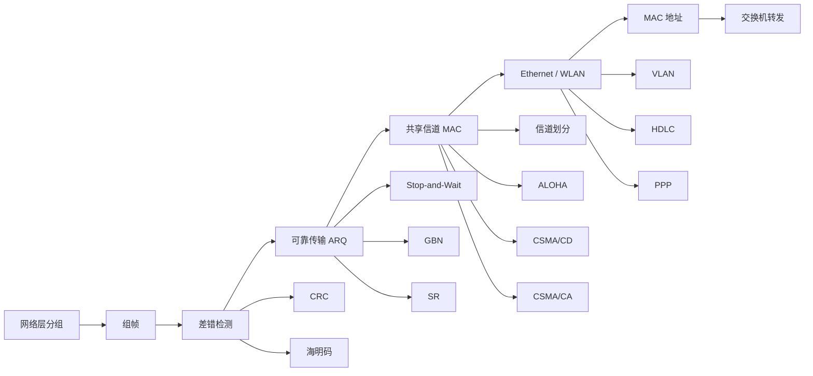

## 三十五、交换机

交换机可以理解为：

> **多端口网桥。**

它根据 MAC 地址进行二层帧转发。

与集线器相比：

* Hub：一个端口收到 → 其他端口重复发送；
* Switch：根据 MAC 地址表选择性转发。

> **真题范围**
>
> 交换机相关选择题：2009 年第 36 题、2014 年第 34 题、2015 年第 37 题、2024 年第 35 题、2026 年第 36 题。
>
> 解答题：2019 年第 47 题、2021 年第 47 题。

---

### 1. MAC 地址表

交换机维护：

```text
MAC 地址 → 端口
```

的映射。

<InlineSvg src="/images/computer-network/computer-network-datalink-dev-001.svg" alt={"数据链路层设备 图 1"} />

典型表项还可能包括：

* VLAN；
* 老化时间；
* 动态/静态状态。

---

### 2. 自学习

交换机收到一帧时，首先观察：

> **源 MAC 地址。**

因为：

> 这帧是从端口 `P` 进来的，因此源 MAC 对应的设备就在端口 `P` 方向。

于是学习：

```text
Source MAC → 入端口
```

随后再处理**目的 MAC**。

这是交换机题最重要的做题顺序：

> **先学源，后查目的。**

---

### 3. 转发规则

交换机收到帧后：

#### 情况 1：目的 MAC 已知，且对应其他端口

```text
转发到对应端口
```

#### 情况 2：目的 MAC 已知，而且对应的就是入端口

```text
过滤，不再转发
```

说明目的设备和源设备位于同一侧。

#### 情况 3：目的 MAC 未知

执行：

> **未知单播泛洪（Flooding）**

向除入端口之外的其他相关端口复制该帧。

#### 情况 4：广播地址

同样需要在当前 VLAN/广播域内进行泛洪。

<InlineSvg src="/images/computer-network/computer-network-datalink-dev-002.svg" alt={"数据链路层设备 图 2"} />

> **Flooding ≠ ARP**
>
> Flooding 是交换机的**转发行为**。
>
> ARP 是上层主机为了获取某个 IP 对应 MAC 地址而产生的协议消息。
>
> 交换机不知道目的 MAC 时进行泛洪，并不意味着交换机自己发出了 ARP。

---

## 三十六、碰撞域与广播域

这是交换机最容易混淆的概念之一。

#### Hub

所有端口：

> 一个碰撞域。

同时通常：

> 一个广播域。

#### Switch

每个交换机端口：

> 独立碰撞域。

但是如果没有 VLAN：

> 整台交换机仍通常属于同一个广播域。

#### Router

路由器不同接口：

> 分隔不同广播域。

因此：

| 设备     | 是否分隔碰撞域 | 是否分隔广播域 |
| ------ | ------- | ------- |
| Hub    | 否       | 否       |
| Switch | 是       | 默认否     |
| VLAN   | —       | 是       |
| Router | 是       | 是       |

---

## 三十七、交换机内部交换方式

这里说的“交换方式”是：

> **交换机收到一帧后，什么时候开始向目标端口转发。**

不要与：

* 电路交换；
* 报文交换；
* 分组交换；

混淆。

---

### 1. 直通交换 Cut-Through

只需读取到足够判断目的 MAC 的字段，就可以开始转发。

优点：

* 延迟低。

缺点：

* 无法等完整帧到达后再检查 FCS；
* 可能转发错误帧。

---

### 2. 存储转发 Store-and-Forward

先：

> 接收完整帧。

然后：

1. 检查 FCS；
2. 判断帧是否正确；
3. 查询 MAC 地址表；
4. 再转发。

优点：

* 可以过滤错误帧。

缺点：

* 延迟更高。

---

### 3. 碎片隔离 Fragment-Free

介于两者之间。

通常至少等待：

```text
64 B
```

后再开始转发。

这样可以过滤经典共享 Ethernet 中许多由碰撞产生的小于最短合法帧长度的碎片。

<InlineSvg src="/images/computer-network/computer-network-datalink-dev-003.svg" alt={"数据链路层设备 图 3"} />

---

## 三十八、网桥

网桥 Bridge 和交换机都工作在数据链路层，都可以：

* 学习 MAC 地址；
* 建立转发表；
* 过滤帧；
* 转发帧。

<InlineSvg src="/images/computer-network/computer-network-datalink-dev-004.svg" alt={"数据链路层设备 图 4"} />

交换机本质上可以理解为：

> **高速、多端口的网桥。**

| 对比       | 网桥         | 交换机       |
| -------- | ---------- | --------- |
| 端口数      | 较少         | 较多        |
| 历史定位     | 早期 LAN 互联  | 现代 LAN 核心 |
| 转发       | 传统实现可能依赖软件 | 通常硬件 ASIC |
| MAC 自学习  | 支持         | 支持        |
| VLAN 等扩展 | 通常较少       | 广泛支持      |

---

## 三十九、本章高频易错点

#### 1. CRC 能“纠错”吗？

不能。

CRC：

> **主要负责检错。**

发现错误后怎么处理，是 ARQ 等机制的事情。

---

#### 2. 奇偶校验能发现两个比特同时翻转吗？

不保证。

偶数个比特同时翻转可能使整体奇偶性不变。

---

#### 3. GBN 收到乱序帧会缓存吗？

不会。

$$
W_r=1
$$

乱序帧通常直接丢弃。

---

#### 4. SR 收到乱序帧呢？

如果位于接收窗口中：

> 可以接收、ACK 并缓存。

---

#### 5. 为什么 GBN 最大窗口是 `2^n-1`？

因为：

$$
W_r=1
$$

又要求：

$$
W_s+W_r\le2^n
$$

所以：

$$
W_s\le2^n-1
$$

---

#### 6. 为什么 SR 最大窗口只有序号空间一半？

因为通常：

$$
W_s=W_r
$$

所以：

$$
2W_s\le2^n
$$

得到：

$$
W_s\le2^{n-1}
$$

---

#### 7. 为什么 CSMA 监听空闲仍可能碰撞？

因为：

> **传播时延。**

本地观察到的“空闲”只代表其他站点的信号还没有传播到这里。

---

#### 8. CSMA/CD 最核心公式是什么？

$$
T_t\ge2T_p
$$

以及：

$$
L_{\min}\ge2T_pR
$$

---

#### 9. CSMA/CD 还用于现代全双工交换式 Ethernet 吗？

通常不需要。

因为点到点全双工链路没有共享介质碰撞。

---

#### 10. CSMA/CA 中 ACK 是“避免碰撞”的吗？

不是。

ACK 负责：

> **确认本次发送是否成功。**

真正降低碰撞概率的是：

* 监听；
* DIFS；
* 随机退避；
* 退避冻结；
* 竞争窗口；
* 可选 RTS/CTS。

---

#### 11. SIFS 和 DIFS 谁更短？

$$
SIFS<DIFS
$$

所以 ACK 和 CTS 能优先于普通 DATA 竞争。

---

#### 12. Ethernet 的 64 B 包含 Preamble 和 SFD 吗？

不包含。

最小帧：

$$
6+6+2+46+4=64\text{ B}
$$

---

#### 13. Ethernet MTU 1500 B 是整个帧吗？

不是。

MTU 通常指：

> **上层可以放进 Ethernet Payload 的最大数据长度。**

---

#### 14. Switch 会分隔广播域吗？

普通交换机默认不会。

交换机主要分隔：

> **碰撞域。**

VLAN 或路由器才可以进一步分隔广播域。

---

#### 15. 交换机到底根据源 MAC 还是目的 MAC 工作？

两者都用，但用途不同：

```text
源 MAC → 学习
目的 MAC → 转发
```

这是交换机综合题最重要的规律。

---

## 四十、408 速记表

| 考点                  | 结论                   |
| ------------------- | -------------------- |
| 零比特填充               | 连续 5 个 `1` 后填 `0`    |
| CRC                 | 模 2 除法，减法就是 XOR      |
| 海明校验位               | `2^r ≥ k+r+1`        |
| 检错能力                | `d_min-1`            |
| 纠错能力                | `floor((d_min-1)/2)` |
| Stop-and-Wait       | `Ws=Wr=1`            |
| GBN                 | `Wr=1`               |
| GBN 最大窗口            | `2^n-1`              |
| SR                  | `Ws=Wr`              |
| SR 最大窗口             | `2^(n-1)`            |
| 一般窗口条件              | `Ws+Wr ≤ 2^n`        |
| CSMA                | 先听后发                 |
| CSMA/CD             | 先听后发、边发边听            |
| CSMA/CA             | 监听 + 退避 + ACK        |
| CSMA/CD 争用期         | 约 `2Tp`              |
| 最小帧长                | `2Tp × R`            |
| Ethernet 最小帧        | 64 B                 |
| Ethernet 最大普通帧      | 1518 B               |
| Ethernet MTU        | 1500 B               |
| Ethernet 最小 Payload | 46 B                 |
| MAC 地址              | 48 bit               |
| 广播 MAC              | `FF:FF:FF:FF:FF:FF`  |
| VLAN Tag            | 4 B                  |
| VLAN ID             | 12 bit               |
| 交换机学习               | 看源 MAC               |
| 交换机转发               | 看目的 MAC              |
| Unknown Unicast     | Flooding             |
| Switch              | 每端口独立碰撞域             |
| HDLC                | 面向比特、零比特填充           |
| PPP                 | 点对点、FCS 检错，不负责可靠重传   |

---

### 本章复习主线



复习数据链路层时，可以始终围绕三个问题判断题目属于哪一类：

> **第一：一帧怎么被识别、怎么判断有没有错？**
>
> 对应组帧、CRC、海明码。

> **第二：帧丢失或出错以后怎么恢复？**
>
> 对应 Stop-and-Wait、GBN、SR、窗口与信道利用率。

> **第三：多个设备同时想发送怎么办，以及帧最终往哪个端口走？**
>
> 对应 MAC、CSMA/CD、CSMA/CA、Ethernet、VLAN 与交换机。

掌握这三条主线后，数据链路层绝大多数 408 题目都可以快速定位到对应模型，再根据协议规则计算或判断。
