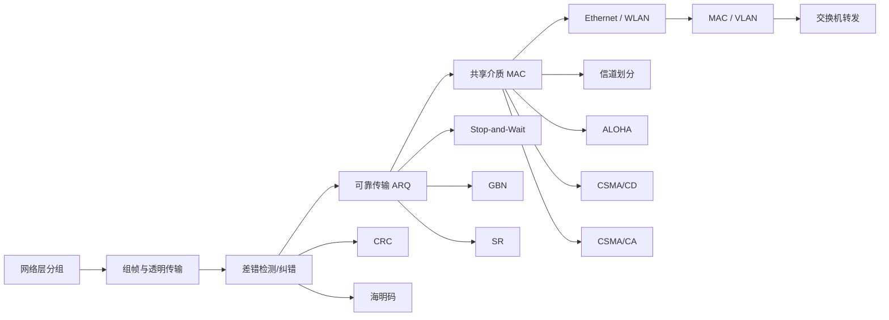

二层交换机题通常不是考“会不会背定义”，而是考你能否逐帧更新 MAC 表并判断转发端口。最稳的顺序始终是：

> **先学习源 MAC -> 再查目的 MAC -> 最后决定过滤、单播转发还是泛洪。**

---

## 35. 交换机、MAC 表与自学习

<InlineSvg src="/images/computer-network/computer-network-datalink-dev-001.svg" alt={"数据链路层设备 图 1"} />

交换机可理解为**高速多端口网桥**，依据 MAC 地址进行二层转发。

> **真题范围**
>
> 交换机相关选择题：2009 年第 36 题、2014 年第 34 题、2015 年第 37 题、2024 年第 35 题、2026 年第 36 题。
>
> 解答题：2019 年第 47 题、2021 年第 47 题。

交换机维护类似：

```text
MAC 地址 -> 端口
```

的转发表，真实表项还可能包含 VLAN、老化时间、动态/静态状态等信息。动态学习表项通常还会**老化**：若长期没有再次看到该源 MAC，表项会在超时后删除，以适应主机移动或拓扑变化。

在支持 VLAN 的交换机中，同一 MAC 地址的学习与转发还要结合 VLAN 语境理解，可把典型表项抽象成：

```text
(VLAN, MAC) -> Port
```

### 35.1 自学习

交换机收到一帧后，首先观察**源 MAC**。若帧从端口 $P$ 进入，就可学习：

```text
Source MAC -> P
```

因为源设备位于该入端口方向。

### 35.2 根据目的 MAC 转发

<InlineSvg src="/images/computer-network/computer-network-datalink-dev-002.svg" alt={"数据链路层设备 图 2"} />

完成源地址学习后，再查目的 MAC：

| 情况 | 行为 |
| --- | --- |
| 目的 MAC 已知，且在其他端口 | 只转发到对应端口 |
| 目的 MAC 已知，且正是入端口 | 过滤，不再向外转发 |
| 未知单播 | 除入端口外，在当前 VLAN 内泛洪 |
| 广播 MAC | 除入端口外，在当前 VLAN 内泛洪 |

<Callout type="warning" title="Flooding 不是 ARP">

**Flooding** 是交换机的帧转发行为；**ARP** 是主机/三层设备为解析 IP 与 MAC 映射而发送的协议消息。交换机不知道目的 MAC 时执行未知单播泛洪，并不等于交换机主动发 ARP。

</Callout>

---

## 36. 碰撞域与广播域

| 设备/机制 | 碰撞域 | 广播域 |
| --- | --- | --- |
| Hub | 所有端口通常共享 1 个 | 通常仍为 1 个 |
| Switch | 每个端口独立 | 默认不分隔 |
| VLAN | 交换端口仍各自独立 | **每个 VLAN 独立** |
| Router | 各接口分隔 | **各接口分隔** |

### 36.1 Hub

Hub 工作在物理层，本质上重复比特信号，因此不能学习 MAC，也不会选择性转发；所有端口仍处于同一共享碰撞域。

### 36.2 Switch

Switch 的每个端口形成独立碰撞域。现代全双工交换端口甚至不存在传统意义上的碰撞，但如果没有 VLAN，广播帧仍可在同一 VLAN 的多个端口传播。

### 36.3 Router

路由器终止当前二层广播域，不会把普通二层广播帧直接跨接口透明转发。

---

## 37. 交换机内部交换方式

这里的“交换方式”是指**交换机收到一帧后何时开始向目标端口发送**，不要与电路交换、报文交换、分组交换混淆。

### 37.1 直通交换 Cut-Through

读取到足够确定目的端口的信息后即可开始转发。

- 优点：延迟低；
- 缺点：没有等待完整帧，因此通常不能在转发前完成整帧 FCS 校验，可能传播错误帧。

### 37.2 存储转发 Store-and-Forward

先接收完整帧，再检查 FCS、查表并转发。

- 优点：能过滤检测到的错误帧；
- 缺点：必须等完整帧到齐，转发延迟较高。

### 37.3 碎片隔离 Fragment-Free

<InlineSvg src="/images/computer-network/computer-network-datalink-dev-003.svg" alt={"数据链路层设备 图 3"} />

介于两者之间，经典做法通常至少等待前 64 B，再开始转发，以过滤许多共享 Ethernet 中由早期碰撞产生的短碎片。

---

## 38. 网桥与交换机

<InlineSvg src="/images/computer-network/computer-network-datalink-dev-004.svg" alt={"数据链路层设备 图 4"} />

网桥（Bridge）和交换机都工作在数据链路层，可执行：

- MAC 地址学习；
- 建立转发表；
- 帧过滤与转发。

交换机通常可理解为**端口更多、硬件转发能力更强的多端口网桥**。

| 对比 | 网桥 | 交换机 |
| --- | --- | --- |
| 传统端口数 | 较少 | 较多 |
| 历史定位 | 早期 LAN 互联 | 现代 LAN 核心二层设备 |
| 转发实现 | 传统实现可能更多依赖软件 | 常使用专用硬件/ASIC |
| MAC 自学习 | 支持 | 支持 |
| VLAN 等功能 | 传统设备较少 | 现代设备广泛支持 |

<Callout type="info" title="交换机综合题做题模板">

对每一帧依次执行：

1. 写下“入端口”；
2. 用**源 MAC**更新表；
3. 查**目的 MAC**；
4. 判断过滤、定向转发或泛洪；
5. 再处理下一帧。

不要先查目的再学习源，否则容易在连续帧题中漏掉刚刚学到的表项。

</Callout>

---

## 39. 本章高频易错点

先补几条贯穿全章的判断：

- **流量控制 ≠ 可靠传输**：前者限制发送节奏，后者处理丢失/错误/重复；
- **随机访问 ≠ 轮询访问**：CSMA 属于竞争型随机访问，轮询/令牌属于受控访问；
- **交换机未知单播泛洪 ≠ 广播帧本身**：两者触发原因不同，但都会在当前 VLAN 内向除入端口外的相关端口发送；
- **PPP 有 FCS ≠ PPP 可靠**：能检错不代表会自动重传。

### 39.1 CRC 能纠错吗？

408 常规模型中，CRC 主要用于**检错**，不是自动纠错或重传机制。

### 39.2 奇偶校验能发现两个比特同时翻转吗？

不保证。任意奇数个错误一定改变奇偶性，但偶数个错误可能使整体奇偶性保持不变。

### 39.3 GBN 会缓存乱序帧吗？

通常不会。GBN 的接收窗口：

$$
W_r=1
$$

### 39.4 SR 会缓存乱序帧吗？

若帧序号位于当前接收窗口内，则可以接收、确认并缓存，待缺失帧到达后按序交付。

### 39.5 为什么 GBN 最大窗口是 $2^n-1$？

GBN 有 $W_r=1$，结合循环序号的安全约束：

$$
W_s+W_r\le2^n
$$

可得：

$$
W_s\le2^n-1
$$

### 39.6 为什么典型 SR 最大窗口只有序号空间的一半？

典型 SR 有：

$$
W_s=W_r
$$

因此：

$$
2W_s\le2^n
$$

即：

$$
W_s\le2^{n-1}
$$

### 39.7 CSMA 已监听到空闲，为什么还会碰撞？

因为存在**传播时延**。本地暂时听不到别人的信号，不代表远端此刻没有开始发送。

### 39.8 CSMA/CD 最重要的时间条件是什么？

$$
T_t\ge2T_p
$$

等价地：

$$
L_{\min}\ge2T_pR
$$

### 39.9 现代全双工交换式 Ethernet 还需要 CSMA/CD 吗？

通常不需要。点到点全双工链路没有共享介质碰撞。

### 39.10 CSMA/CA 中 ACK 的作用是“避免碰撞”吗？

不是。ACK 用来确认发送成功；碰撞避免主要依赖监听、IFS、随机退避、竞争窗口，以及可选 RTS/CTS。

### 39.11 SIFS 与 DIFS 谁更短？

$$
SIFS<DIFS
$$

因此 ACK、CTS 等立即响应帧能优先发送。

### 39.12 Ethernet 的 64 B 包含 Preamble 和 SFD 吗？

不包含。最短 MAC 帧为：

$$
6+6+2+46+4=64\text{ B}
$$

### 39.13 MTU 1500 B 是整个 Ethernet 帧吗？

不是。它通常指上层能放入 Ethernet 数据字段的最大数据长度。

### 39.14 Switch 默认会分隔广播域吗？

不会。Switch 主要分隔碰撞域；不同 VLAN 或路由器接口才进一步分隔广播域。

### 39.15 交换机看源 MAC 还是目的 MAC？

两者都看，但职责不同：

```text
源 MAC -> 学习
目的 MAC -> 转发决策
```

### 39.16 SR 为什么不能把窗口开到整个序号空间？

因为序号会循环使用。如果新一轮的序号进入接收窗口时，上一轮同序号旧帧仍可能滞留在网络中，接收方就无法区分新旧帧。典型对称 SR 因此要求：

$$
W_s=W_r\le2^{n-1}
$$

### 39.17 802.11 时间题为什么经常少算或多算一个 DIFS？

因为关键不是“协议里有没有 DIFS”，而是**题目从哪个事件开始计时**。若已明确“从 DATA 开始发送”，DIFS 和随机退避已经发生；若从“开始竞争信道”计时，则需要根据题设把它们纳入时间轴。

### 39.18 VLAN 后广播域怎样数？

先看 VLAN 划分，再看三层设备。通常每个 VLAN 是一个独立二层广播域；路由器或三层交换功能负责不同 VLAN 之间的三层转发。

---

## 40. 数据链路层速记表与复习主线

| 考点 | 核心结论 |
| --- | --- |
| 零比特填充 | 连续 5 个 `1` 后插 `0` |
| CRC | 模 2 除法；检错，不等于重传 |
| 海明校验位 | $2^r\ge k+r+1$ |
| 保证检错能力 | $d_{\min}-1$ |
| 保证纠错能力 | $\left\lfloor(d_{\min}-1)/2\right\rfloor$ |
| 流量控制 | 防止发送方长期快于接收方 |
| Stop-and-Wait | $W_s=W_r=1$ |
| GBN | $W_r=1$，累计确认，乱序丢弃 |
| GBN 最大窗口 | $2^n-1$ |
| SR | 窗口内乱序可缓存，选择重传 |
| 典型 SR 最大窗口 | $2^{n-1}$ |
| 一般循环序号约束 | $W_s+W_r\le2^n$ |
| 轮询/令牌 | 受控访问，不靠碰撞竞争发送权 |
| CSMA | 先听后发 |
| CSMA/CD | 边发边检测碰撞 |
| CSMA/CA | 监听 + 退避 + ACK，可选 RTS/CTS |
| CSMA/CD 最小帧 | $L_{\min}\ge2T_pR$ |
| Ethernet 最小帧 | 64 B |
| Ethernet 普通最大帧 | 1518 B |
| Ethernet MTU | 1500 B |
| Ethernet 最小 Payload | 46 B |
| MAC 地址 | 48 bit |
| 广播 MAC | `FF:FF:FF:FF:FF:FF` |
| VLAN Tag | 4 B |
| VLAN ID | 12 bit，常规 1～4094 |
| VLAN | 逻辑划分二层广播域 |
| 交换机学习 | 看源 MAC |
| 交换机转发 | 查目的 MAC |
| 未知单播 | 当前 VLAN 内泛洪 |
| HDLC | 面向比特、零比特填充 |
| PPP | 点到点；FCS 检错，但不负责可靠重传 |
| IEEE 802 LAN | 可从体系结构上理解为 LLC + MAC 子层 |


```mermaid
flowchart LR
    A[网络层分组] --> B[组帧与透明传输]
    B --> C[差错检测/纠错]
    C --> D[可靠传输 ARQ]
    D --> E[共享介质 MAC]
    E --> F[Ethernet / WLAN]
    F --> G[MAC / VLAN]
    G --> H[交换机转发]

    C --> C1[CRC]
    C --> C2[海明码]
    D --> D1[Stop-and-Wait]
    D --> D2[GBN]
    D --> D3[SR]
    E --> E1[信道划分]
    E --> E2[ALOHA]
    E --> E3[CSMA/CD]
    E --> E4[CSMA/CA]
```

复习时可把所有题目先归到三个问题：

1. **一帧怎么划出来、怎么判断是否出错？** → 组帧、CRC、海明码；
2. **帧丢失或出错以后怎样恢复？** → ARQ、窗口、利用率；
3. **多人共享介质时谁先发，以及帧最终往哪里走？** → MAC、Ethernet/WLAN、VLAN、交换机。
