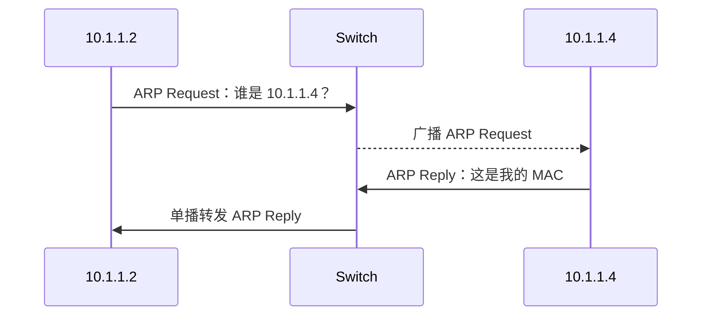

## 8. 路由器：路由与转发

> **真题考察**
>
> * 选择题：2012 年第 37 题、2015 年第 38 题
> * 解答题：2009 年第 47 题、2013 年第 47 题、2014 年第 42 题、2014 年第 43 题、2018 年第 42 题、2019 年第 47 题、2020 年第 47 题

**路由器（Router）** 是实现不同网络互连的网络层设备。

要特别区分两个概念：

| 概念                 | 含义                          |
| ------------------ | --------------------------- |
| **路由（Routing）**    | 计算应该选择什么路径，建立或更新路由信息        |
| **转发（Forwarding）** | 对已经到达路由器的数据报，根据表项决定从哪个接口送出去 |

简单来说：

```text
路由：算路
转发：按已经算好的路走
```

### 8.1 路由器组成

<InlineSvg src="/images/computer-network/computer-network-network-dev-001.svg" alt={"网络层设备 图 1"} />

主要包括：

* **输入端口**
* **输出端口**
* **交换结构**
* **路由处理器 / CPU**

其中：

* 数据平面负责高速分组转发。
* 控制平面运行路由协议、维护路由信息。

### 8.2 路由表与转发表

> **真题考察**
>
> * 选择题：2022 年第 36 题、2026 年第 37 题
> * 解答题：2015 年第 47 题、2024 年第 47 题

<InlineSvg src="/images/computer-network/computer-network-network-dev-002.svg" alt={"网络层设备 图 2"} />

路由表通常保存：

* 目的网络
* 网络前缀或子网掩码
* 下一跳
* 输出接口
* 路由度量值

例如：

| 目的网络             | 下一跳             | 接口     |
| ---------------- | --------------- | ------ |
| `192.168.1.0/24` | 直连              | `eth0` |
| `10.0.0.0/8`     | `192.168.1.254` | `eth0` |
| `0.0.0.0/0`      | `192.168.1.1`   | `eth0` |

严格来说：

* **路由表** 更多属于控制平面的路由计算结果。
* **转发表** 是数据平面实际高速查询的数据结构。

408 题目中经常把二者统称为“路由表”，应根据题意理解。

### 8.3 分组转发过程

<InlineSvg src="/images/computer-network/computer-network-network-dev-003.svg" alt={"网络层设备 图 3"} />

路由器收到一个 IPv4 数据报后，大致执行：

1. 检查并解析首部。
2. 将 TTL 减 1。
3. TTL 为 0 时丢弃，并发送 ICMP 超时报文。
4. 根据目的 IP 地址查询转发表。
5. 使用 **最长前缀匹配** 选择路由。
6. 根据下一跳确定数据链路层目的地址。
7. 必要时进行 IPv4 分片或 NAT。
8. 重新计算 IPv4 首部校验和。
9. 封装新的链路层帧并从输出接口发送。

> **易错点：路由器转发时什么会变？**
>
> 普通逐跳转发过程中：
>
> * IP **源地址通常不变**
> * IP **目的地址通常不变**
> * TTL 会变化
> * IPv4 Header Checksum 会变化
>
> 但是每经过一个链路，链路层帧都会重新封装，因此 **源 MAC 和目的 MAC 通常都会改变**。
>
> 如果经过 NAT，则 IP 地址甚至端口号也可能发生变化。

---

## 9. 最长前缀匹配

> **真题考察**
>
> * 选择题：2015 年第 38 题
> * 解答题：2014 年第 43 题

当目的 IP 地址同时匹配路由表中的多个网络前缀时，路由器选择：

> **匹配位数最多，也就是前缀最长的路由。**

例如：

| 网络前缀             | 下一跳  |
| ---------------- | ---- |
| `192.168.1.0/24` | 接口 A |
| `192.168.0.0/16` | 接口 B |
| `0.0.0.0/0`      | 接口 C |

目的地址：

```text
192.168.1.100
```

它同时匹配：

* `/24`
* `/16`
* `/0`

最终选择：

```text
192.168.1.0/24
```

因为 `/24` 最具体。

### 默认路由

```text
0.0.0.0/0
```

前缀长度为 0，因此能够匹配所有 IPv4 地址。

它只在没有更具体路由时作为“兜底路由”使用。

> **记忆**
>
> 最长前缀匹配不是比较路由表谁排在前面，也不是比较十进制地址谁更接近，而是比较 **二进制前缀连续匹配长度**。

---

## 10. 路由器接口地址

路由器的每个网络层接口通常都需要属于其所连接的 IP 子网。

<InlineSvg src="/images/computer-network/computer-network-network-dev-006.svg" alt={"网络层设备 图 6"} />

### 点对点链路

传统 IPv4 点对点链路经常使用：

```text
/30
```

一个 `/30` 地址块共有 4 个地址，其中传统意义上有两个可用主机地址，正好供链路两端使用。

### 局域网接口

如果路由器连接：

```text
192.168.1.0/24
```

接口地址可以配置为该子网中的某个可用地址，例如：

```text
192.168.1.1
```

或者：

```text
192.168.1.254
```

局域网主机通常将该路由器接口设置为 **默认网关**。

---

## 11. ARP：从 IP 地址得到 MAC 地址

> **真题考察**
>
> * 选择题：2012 年第 38 题、2024 年第 35 题
> * 解答题：2011 年第 47 题、2015 年第 47 题

ARP（Address Resolution Protocol，地址解析协议）解决的问题是：

```text
已知同一链路上下一跳的 IPv4 地址
↓
得到对应 MAC 地址
```

<InlineSvg src="/images/computer-network/computer-network-network-arp-001.svg" alt={"ARP 图 1"} />

### 11.1 ARP 基本流程

例如主机 `10.1.1.2` 想获得 `10.1.1.4` 的 MAC 地址：



具体过程：

1. 主机查询本地 ARP 缓存。
2. 若没有对应记录，发送 **ARP Request**。
3. ARP Request 的以太网目的 MAC 为：

```text
FF:FF:FF:FF:FF:FF
```

4. 交换机将广播帧扩散到当前广播域。
5. 与目标 IP 匹配的设备发送 ARP Reply。
6. ARP Reply 通常为 **单播**。
7. 请求方将结果加入 ARP 缓存。
8. 后续即可使用目标 MAC 封装以太网帧。

### 11.2 ARP 缓存

ARP 缓存保存：

```text
IPv4 地址 ↔ MAC 地址
```

例如：

| IP 地址         | MAC 地址              | 类型 | 接口    |
| ------------- | ------------------- | -- | ----- |
| `192.168.1.1` | `00:1A:2B:3C:4D:5E` | 动态 | eth0  |
| `192.168.1.2` | `00:1A:2B:3C:4D:5F` | 静态 | eth0  |
| `192.168.1.3` | `00:1A:2B:3C:4D:60` | 动态 | wlan0 |

动态条目一般存在老化时间。

### 11.3 同网段与跨网段：408 高频易错点

假设主机 A 要给 B 发送 IP 数据报。

#### A 与 B 在同一个子网

A 需要解析：

```text
B 的 IP → B 的 MAC
```

最终以太网帧的目的 MAC 是 **B 的 MAC**。

#### A 与 B 不在同一个子网

A **不会 ARP 查询远端主机 B 的 MAC 地址**。

它首先把数据报交给默认网关，因此解析的是：

```text
默认网关接口 IP → 默认网关接口 MAC
```

IP 数据报仍然是：

```text
源 IP = A
目的 IP = B
```

但当前链路中的帧为：

```text
源 MAC = A
目的 MAC = 默认网关
```

到达下一台路由器后，又会重新进行链路层封装。

> **核心结论**
>
> ARP 解析的是 **当前链路中的下一跳 MAC 地址**，不是“最终目的 IP 一定对应的 MAC 地址”。

ARP 通常作为网络层的辅助协议讨论，但其报文直接封装在数据链路层帧中。

---

## 12. DHCP：自动获得网络配置

> **真题考察**
>
> * 选择题：2025 年第 36 题
> * 解答题：2015 年第 47 题、2022 年第 47 题

DHCP（Dynamic Host Configuration Protocol，动态主机配置协议）用于自动为主机提供：

* IP 地址
* 子网掩码
* 默认网关
* DNS 服务器
* 租约时间等参数

<InlineSvg src="/images/computer-network/computer-network-network-dhcp-001.svg" alt={"DHCP 图 1"} />

DHCP 典型交互称为 **DORA**。

### 12.1 Discover

客户端刚接入网络，还没有合法 IP 地址，于是发送：

```text
DHCP DISCOVER
```

典型 IPv4 地址：

```text
源 IP：0.0.0.0
目的 IP：255.255.255.255
```

使用广播是因为客户端：

* 不知道 DHCP 服务器在哪里。
* 自己还没有可正常使用的 IP 地址。

### 12.2 Offer

DHCP 服务器发送：

```text
DHCP OFFER
```

其中可以包含：

* 提供给客户端的 IP 地址
* 子网掩码
* 默认网关
* DNS 地址
* 租期

### 12.3 Request

如果客户端收到多个 Offer，它选择其中一个，然后发送：

```text
DHCP REQUEST
```

通常使用广播，使所有 DHCP 服务器都知道客户端选择了哪一个方案。

### 12.4 ACK

被选中的 DHCP 服务器发送：

```text
DHCP ACK
```

确认租约。

若无法提供该地址，也可能返回：

```text
DHCP NAK
```

> **记忆：DORA**
>
> ```text
> Discover
> Offer
> Request
> ACK
> ```

DHCP 基于 UDP：

| 角色          | UDP 端口 |
| ----------- | -----: |
| DHCP Server |     67 |
| DHCP Client |     68 |

---

## 13. ICMP：网络层控制与差错报告

> **真题考察**
>
> * 选择题：2010 年第 36 题、2012 年第 33 题

ICMP（Internet Control Message Protocol）用于在 IP 主机和路由器之间传递 **差错报告与控制信息**。

ICMP 报文由 IP 数据报承载。

### 13.1 ICMP 首部

<InlineSvg src="/images/computer-network/computer-network-network-icmp-001.svg" alt={"ICMP 图 1"} />

主要字段：

| 字段       |     长度 | 作用               |
| -------- | -----: | ---------------- |
| Type     |  8 bit | 报文类型             |
| Code     |  8 bit | 对类型进一步细分         |
| Checksum | 16 bit | ICMP 报文校验        |
| 其他字段     |     可变 | 随 Type 和 Code 改变 |

例如：

* Echo Request：Type 8
* Echo Reply：Type 0

### 13.2 ICMP 报文分类

<InlineSvg src="/images/computer-network/computer-network-network-icmp-002.svg" alt={"ICMP 图 2"} />

大体可以分为：

* **差错报告报文**
* **查询 / 诊断报文**

### 13.3 常见差错报告报文

#### 终点不可达

Destination Unreachable。

可能表示：

* 网络不可达
* 主机不可达
* 协议不可达
* 端口不可达
* 需要分片但 DF 已置位等

#### 源点抑制

Source Quench。

用于表示网络发生拥塞、要求发送端降低速率。这属于传统 ICMP 内容，在现代互联网中已经废弃，但在经典教材分类中仍可能出现。

#### 重定向

Redirect。

路由器告诉主机：

> 存在更合适的下一跳。

#### 超时

Time Exceeded。

常见原因：

* TTL 减到 0。
* 分片重组超时。

#### 参数问题

Parameter Problem。

表示 IP 首部存在无法处理的问题。

### 13.4 查询报文

典型查询或诊断报文包括：

* Echo Request / Echo Reply
* Timestamp Request / Reply
* 传统 Address Mask Request / Reply

408 最需要掌握的是 Echo Request / Reply。

---

## 14. ping 与 traceroute

### 14.1 ping

Ping 用于：

* 测试目标是否可达。
* 测量 RTT。
* 粗略统计丢包率。


主要利用：

```text
ICMP Echo Request
ICMP Echo Reply
```

流程：

1. 源主机发送 Echo Request。
2. 目标主机收到后返回 Echo Reply。
3. 源主机根据发送和收到响应的时间计算 RTT。
4. 多次测试后可统计丢包率。

### 14.2 traceroute

Traceroute 用于发现从源主机到目标主机所经过的路由器。


核心原理是：

> **逐渐增大 TTL，并利用中间路由器返回的 ICMP Time Exceeded。**

例如：

```text
第 1 次：TTL = 1
第 2 次：TTL = 2
第 3 次：TTL = 3
...
```

TTL 为 1 时：

1. 第一个路由器把 TTL 减为 0。
2. 丢弃数据报。
3. 返回 ICMP Time Exceeded。
4. 源主机因此知道第一个路由器的地址。

TTL 为 2 时即可发现第二个路由器，以此类推。

不同系统的 traceroute 实现可能发送：

* UDP 数据报
* ICMP Echo Request

当最终到达目标时，可能通过：

* ICMP Echo Reply
* ICMP Port Unreachable

等信息判断探测结束。

> **高频联系**
>
> ```text
> ping → ICMP Echo Request / Reply
>
> traceroute → TTL + ICMP Time Exceeded
> ```

---

## 15. NAT：网络地址转换

> **真题考察**
>
> * 选择题：2023 年第 38 题、2025 年第 37 题
> * 解答题：2019 年第 47 题、2020 年第 47 题

NAT（Network Address Translation）用于在不同 IP 地址空间之间进行地址转换。

家庭和企业网络中最常见的情况是：

```text
私有 IPv4 地址
↓ NAT
公网 IPv4 地址
```

<InlineSvg src="/images/computer-network/computer-network-network-dev-004.svg" alt={"网络层设备 图 4"} />

NAT 的重要作用：

* 缓解 IPv4 公网地址不足。
* 允许大量内部主机共享少量公网地址。
* 隐藏内部地址结构。

但：

> **NAT 本身不能等同于防火墙。**

### 15.1 私有 IPv4 地址

| 私有地址块            | 范围                              |
| ---------------- | ------------------------------- |
| `10.0.0.0/8`     | `10.0.0.0 ~ 10.255.255.255`     |
| `172.16.0.0/12`  | `172.16.0.0 ~ 172.31.255.255`   |
| `192.168.0.0/16` | `192.168.0.0 ~ 192.168.255.255` |

这些地址可以在内部网络重复使用，但不能作为普通公网地址直接在 Internet 中路由。

### 15.2 NAT 表

典型 NAT/PAT 表可能记录：

| 私有 IP           |  私有端口 | 公网 IP          |  公网端口 | 协议  |
| --------------- | ----: | -------------- | ----: | --- |
| `192.168.100.3` | 12345 | `145.12.131.7` | 54321 | TCP |
| `192.168.100.4` |  8888 | `145.12.131.7` | 54322 | UDP |
| `192.168.100.5` | 15839 | `145.12.131.7` | 54323 | TCP |
| `192.168.100.3` |  7890 | `145.12.131.7` | 54324 | TCP |

利用不同的端口映射，同一个公网 IP 可以同时代表多台内部主机的大量连接。

### 15.3 内网到公网

<InlineSvg src="/images/computer-network/computer-network-network-dev-005.svg" alt={"网络层设备 图 5"} />

例如内部主机：

```text
192.168.100.3:12345
```

经过 NAT 后可能变成：

```text
145.12.131.7:54321
```

典型出站转换：

```text
源私有 IP + 源端口
↓
公网 IP + NAT 分配端口
```

### 15.4 公网返回内网

响应数据到达：

```text
145.12.131.7:54321
```

NAT 查询映射表，把目的地址和端口还原为：

```text
192.168.100.3:12345
```

然后转发给对应内网主机。

> **记忆**
>
> * 内网 → 公网：主要改写 **源地址/源端口**
> * 公网响应 → 内网：主要改写 **目的地址/目的端口**

严格来说，同时使用端口号复用公网地址的方式也常称为 **NAPT/PAT**。

---
