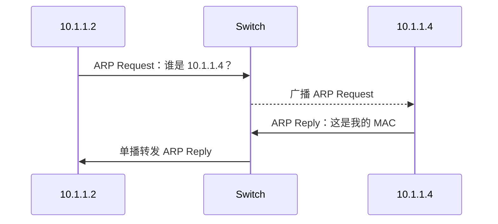

## 8. 路由器：路由与转发

<InlineSvg src="/images/computer-network/computer-network-network-dev-001.svg" alt={"网络层设备 图 1"} />

> **真题考察**
>
> * 选择题：2012 年第 37 题、2015 年第 38 题
> * 解答题：2009 年第 47 题、2013 年第 47 题、2014 年第 42 题、2014 年第 43 题、2018 年第 42 题、2019 年第 47 题、2020 年第 47 题

路由器是实现不同 IP 网络互连的网络层设备。必须区分：

| 概念 | 核心问题 | 典型所在平面 |
| --- | --- | --- |
| **路由（Routing）** | “路径信息怎样得到？” | 控制平面 |
| **转发（Forwarding）** | “这个到达的数据报从哪个接口发出？” | 数据平面 |

可以记成：

```text
路由：算路、学路
转发：查表、出接口
```

### 8.1 路由器结构

典型路由器由：

- 输入端口；
- 输出端口；
- 交换结构；
- 路由处理器/控制处理器；

组成。

| 部件 | 主要职责 |
| --- | --- |
| 输入端口 | 物理/链路层接收、查表前处理、可能形成输入排队 |
| 交换结构 | 把分组从输入侧搬到选定输出侧 |
| 输出端口 | 排队、调度、链路层封装并发送 |
| 路由处理器 | 运行路由协议与管理控制逻辑，维护路由信息 |

数据平面强调高速逐包转发；控制平面运行路由协议、维护拓扑/路由信息，并生成供转发使用的表项。

<Callout type="info" title="为什么路由器也会发生拥塞？">

若某段时间到达某输出端口的总速率长期超过该端口发送能力，分组会在缓冲区排队；缓存耗尽后就会丢包。**排队时延快速上升 + 缓冲溢出丢包**是网络拥塞最直观的表现。

</Callout>

### 8.2 路由表与转发表

<InlineSvg src="/images/computer-network/computer-network-network-dev-002.svg" alt={"网络层设备 图 2"} />

> **真题考察**
>
> * 选择题：2022 年第 36 题、2026 年第 37 题
> * 解答题：2015 年第 47 题、2024 年第 47 题

概念上：

- **路由表（RIB）**：更偏控制平面，保存路由学习和选路结果；
- **转发表（FIB）**：更偏数据平面，用于高速最长前缀匹配。

408 题目中常把它们统称为“路由表”，按题意处理即可。

典型表项包含：

```text
目的网络前缀 + 下一跳 + 输出接口 + 度量/属性
```

### 8.3 IPv4 分组转发流程

<InlineSvg src="/images/computer-network/computer-network-network-dev-003.svg" alt={"网络层设备 图 3"} />

路由器收到一个 IPv4 数据报后，可按以下思路理解：

1. 接收链路层帧并取得 IPv4 数据报；
2. 检查 IPv4 首部是否合法；
3. TTL 减 1，若失效则丢弃并通常返回 ICMP 超时；
4. 根据目的 IPv4 地址查转发表；
5. 执行最长前缀匹配；
6. 确定下一跳和输出接口；
7. 必要时解析下一跳链路层地址；
8. 必要时执行 IPv4 分片、NAT 等处理；
9. 更新 IPv4 首部校验和；
10. 封装新的链路层帧并发送。

<Callout type="warning" title="不要把 IP 地址和 MAC 地址的变化混在一起">

普通路由器逐跳转发时，**源/目的 IP 通常不变**；但每跨一条链路都重新封装，因此**源/目的 MAC 通常都会变化**。TTL 和 IPv4 首部校验和也会变化。

</Callout>

---

## 9. 最长前缀匹配与默认路由

> **真题考察**
>
> * 选择题：2015 年第 38 题
> * 解答题：2014 年第 43 题

当一个目的地址同时命中多条网络前缀时，选择 **匹配前缀最长** 的路由。

例如：

| 前缀 | 下一跳/接口 |
| --- | --- |
| `192.168.1.0/24` | A |
| `192.168.0.0/16` | B |
| `0.0.0.0/0` | C |

目的地址 `192.168.1.100` 同时命中 `/24`、`/16`、`/0`，最终选 `/24`。

### 9.1 判断是否匹配

对一条前缀 `P/n`：

$$
\text{Destination AND Mask}=P
$$

即可认为目的地址落在该前缀中。

做多表项题时，最稳的方法不是凭十进制直觉，而是先筛出所有“能匹配”的前缀，再比较 `/n` 中的 $n$：

```text
能匹配？ → 比前缀长度 → 取最大的 n
```

路由表按什么顺序书写并不决定结果。

### 9.2 默认路由

```text
0.0.0.0/0
```

前缀长度为 0，可匹配任意 IPv4 地址，因此只在没有更具体前缀可用时兜底。

<Callout type="info" title="同样长的前缀怎么办">

最长前缀匹配先解决“哪个目的前缀最具体”。若存在多条**同前缀长度、同目的前缀**的候选路由，实际设备还会继续依据管理距离、度量值、ECMP 等规则选路；408 一般会在题干中给出足够条件。

</Callout>

---

## 10. 路由器接口与默认网关

<InlineSvg src="/images/computer-network/computer-network-network-dev-006.svg" alt={"网络层设备 图 6"} />

路由器的每个三层接口通常属于其所连接的 IP 子网，因此一台路由器常有多个不同子网中的 IPv4 地址。

例如某局域网为：

```text
192.168.1.0/24
```

路由器接口可配置为：

```text
192.168.1.1/24
```

局域网主机便可把 `192.168.1.1` 设置为默认网关。

传统点对点 IPv4 链路常见 `/30`，可提供两个普通主机地址；现代网络也可以使用 `/31` 点对点前缀。408 若按经典子网模型给题，通常仍按题目给定的掩码计算。

---

## 11. ARP：解析当前链路下一跳的 MAC

<InlineSvg src="/images/computer-network/computer-network-network-arp-001.svg" alt={"ARP 图 1"} />

> **真题考察**
>
> * 选择题：2012 年第 38 题、2024 年第 35 题
> * 解答题：2011 年第 47 题、2015 年第 47 题

ARP（Address Resolution Protocol）解决：

```text
已知当前链路下一跳 IPv4 地址
             ↓
得到该接口对应的 MAC 地址
```

ARP 报文直接封装在链路层帧中，并不是封装在 IP 数据报中。

### 11.1 ARP 基本流程


```mermaid
sequenceDiagram
  participant A as 10.1.1.2
  participant SW as Switch
  participant B as 10.1.1.4

  A->>SW: ARP Request：谁是 10.1.1.4？
  SW-->>B: 广播 ARP Request
  B->>SW: ARP Reply：这是我的 MAC
  SW->>A: 单播转发 ARP Reply
```

若 A 的 ARP 缓存中没有目标记录：

1. A 发送 ARP Request；
2. 以太网目的 MAC 为 `FF:FF:FF:FF:FF:FF`；
3. 交换机在本广播域扩散；
4. 拥有被查询 IPv4 地址的接口返回 ARP Reply；
5. Reply 通常是单播；
6. A 缓存 `IPv4 ↔ MAC` 映射。

### 11.2 同网段发送

若 A 与 B 同网段：

```text
ARP 查询：B 的 IP → B 的 MAC
帧目的 MAC：B 的 MAC
IP 目的地址：B 的 IP
```

### 11.3 跨网段发送

若 A 与 B 不同网段：

```text
ARP 查询：默认网关 IP → 默认网关 MAC
帧目的 MAC：默认网关 MAC
IP 目的地址：仍然是 B 的 IP
```

A **不会在本地广播域里 ARP 查询远端 B 的 MAC**。

<Callout type="warning" title="ARP 题最关键的一句">

**ARP 解析的是“当前链路下一跳”的 MAC。** 下一跳可能是最终目的主机，也可能是默认网关/下一台路由器。

</Callout>

### 11.4 ARP 缓存

ARP 缓存保存：

```text
IPv4 地址 ↔ MAC 地址
```

动态条目会老化，避免永久保存已经失效的映射。

<Callout type="warning" title="ARP 缓存 ≠ 交换机 MAC 地址表">

- ARP 缓存：保存在主机/路由器中，记录 `IPv4 → MAC`；
- 交换机 MAC 地址表：保存在二层交换机中，记录 `MAC → 端口`。

ARP Request 的广播和交换机“自学习源 MAC”可能同时发生，但它们解决的是两个不同问题。

</Callout>

---

## 12. DHCP：自动获取 IPv4 网络配置

<InlineSvg src="/images/computer-network/computer-network-network-dhcp-001.svg" alt={"DHCP 图 1"} />

> **真题考察**
>
> * 选择题：2025 年第 36 题
> * 解答题：2015 年第 47 题、2022 年第 47 题

DHCP（Dynamic Host Configuration Protocol）可为主机提供：

- IPv4 地址；
- 子网掩码；
- 默认网关；
- DNS 服务器；
- 租约时间等。

经典初始获取流程称为 **DORA**：

```text
Discover → Offer → Request → ACK
```

### 12.1 Discover

客户端尚无可用 IPv4 地址，也不知道 DHCP 服务器位置，典型首个报文使用：

```text
源 IP：0.0.0.0
目的 IP：255.255.255.255
```

发送 DHCP DISCOVER。

### 12.2 Offer

服务器提供候选配置，例如：

- 可租用 IPv4 地址；
- 掩码；
- 网关；
- DNS；
- 租期。

### 12.3 Request

客户端从候选中选择一个方案，并发送 DHCP REQUEST。初始分配阶段常使用广播，使多个 DHCP 服务器都能知道客户端选择结果。

### 12.4 ACK

被选服务器返回 DHCP ACK 确认租约；若拒绝也可能返回 DHCP NAK。

DHCP 基于 UDP：

| 角色 | UDP 端口 |
| --- | ---: |
| Server | 67 |
| Client | 68 |

<Callout type="info" title="广播不是 DHCP 所有阶段的绝对要求">

初次获取地址时广播很典型，但 DHCP 后续续租、服务器响应等具体报文能否单播取决于客户端状态与报文字段。408 做题应以题干所处阶段为准，不要记成“DHCP 永远广播”。

</Callout>

### 12.5 DHCP Relay：服务器不必和客户端在同一广播域

路由器默认不会转发普通二层广播，因此 DHCP 服务器若部署在远端网络，需要 **DHCP Relay（中继代理）** 帮忙：

```text
客户端广播 DHCP 消息
        ↓
本地 DHCP Relay 接收
        ↓ 以单播等方式跨三层网络转发
远端 DHCP Server
```

这解释了为什么大型网络可以集中部署少量 DHCP 服务器，而不必每个子网各放一台。

<Callout type="warning" title="DHCP 与 ARP 的作用不要串台">

- DHCP：帮主机获得 IP、掩码、网关、DNS 等配置；
- ARP：主机已经知道某个同链路下一跳 IP 后，再解析其 MAC。

通常是“先有可用 IP 配置，再按需要 ARP 下一跳”。

</Callout>

---

## 13. ICMP：IP 的差错报告与控制协议

<InlineSvg src="/images/computer-network/computer-network-network-icmp-001.svg" alt={"ICMP 图 1"} />
<InlineSvg src="/images/computer-network/computer-network-network-icmp-002.svg" alt={"ICMP 图 2"} />

> **真题考察**
>
> * 选择题：2010 年第 36 题、2012 年第 33 题

ICMP（Internet Control Message Protocol）用于 IP 主机与路由器之间传递差错报告、诊断和控制信息。ICMP 报文由 IP 数据报承载；IPv4 中 Protocol 值为 1。

### 13.1 基本首部

最基本的公共字段包括：

| 字段 | 长度 | 作用 |
| --- | ---: | --- |
| Type | 8 bit | 报文大类 |
| Code | 8 bit | 对 Type 进一步细分 |
| Checksum | 16 bit | ICMP 报文校验 |
| 其余字段 | 可变 | 随具体类型改变 |

例如：

```text
Echo Request：Type 8
Echo Reply：Type 0
```

### 13.2 常见差错报告

常见类型包括：

- Destination Unreachable（目的不可达）；
- Redirect（重定向）；
- Time Exceeded（超时）；
- Parameter Problem（参数问题）。

经典教材还常列出 **Source Quench（源点抑制）**，但它已经被现代标准废弃。考试若按经典教材分类识别即可，不应把它理解为现代互联网常用拥塞控制机制。

经典差错报告还常强调一些“不再套娃报错”的限制，例如通常不会再针对 **ICMP 差错报文**生成新的 ICMP 差错报文。其目的之一是避免网络故障时产生无穷的差错报文风暴。题目若进一步给出广播/组播、分片等条件，应按教材规定判断是否产生 ICMP 差错报告。

### 13.3 ICMP 不是“保证可靠”的协议

ICMP 报告网络层问题，但它本身并不会：

- 自动重传丢失的数据；
- 保证应用数据可靠；
- 替代 TCP 的端到端可靠机制。

它的角色更接近“告诉源主机发生了什么”。

---

## 14. ping 与 traceroute

### 14.1 ping


`ping` 主要利用：

```text
ICMP Echo Request
ICMP Echo Reply
```

可以用于：

- 测试目标是否能够响应；
- 测量往返时间 RTT；
- 粗略观察丢包。

“ping 不通”不一定等价于“主机完全不可达”，因为中间设备或目标主机可能专门过滤 ICMP Echo。

### 14.2 traceroute


`traceroute` 的核心机制是 **逐步增加 TTL/Hop Limit，利用中间路由器产生的 ICMP Time Exceeded 暴露每一跳**。

```text
TTL=1 → 第 1 个路由器超时
TTL=2 → 第 2 个路由器超时
TTL=3 → 第 3 个路由器超时
...
```

不同系统实现可发送 UDP、ICMP Echo，甚至其他探测报文；到达最终目标后，也可能通过 Echo Reply 或 Port Unreachable 等方式判断结束。

<Callout type="info" title="408 速记">

```text
ping       → ICMP Echo Request / Reply
traceroute → TTL + ICMP Time Exceeded
```

</Callout>

---

## 15. NAT 与 PAT/NAPT

<InlineSvg src="/images/computer-network/computer-network-network-dev-004.svg" alt={"网络层设备 图 4"} />
<InlineSvg src="/images/computer-network/computer-network-network-dev-005.svg" alt={"网络层设备 图 5"} />

> **真题考察**
>
> * 选择题：2023 年第 38 题、2025 年第 37 题
> * 解答题：2019 年第 47 题、2020 年第 47 题

NAT（Network Address Translation）在不同 IPv4 地址空间之间改写地址。家庭/企业网络中常见：

```text
私有 IPv4 地址 → 公网 IPv4 地址
```

若还同时利用端口号区分大量内部连接，更准确地说属于 **NAPT/PAT**。

<Tabs items={["静态 NAT", "动态 NAT", "NAPT/PAT"]}>
<Tab value="静态 NAT">
建立固定的一对一私网地址 ↔ 公网地址映射，适合需要稳定映射的场景。
</Tab>
<Tab value="动态 NAT">
从公网地址池中临时选择公网地址做一对一映射，可复用地址池，但并不依靠端口让大量主机共享同一公网地址。
</Tab>
<Tab value="NAPT/PAT">
同时改写地址和端口，可让大量内部连接共享一个或少量公网 IPv4 地址，是家用路由器最常见的形式。
</Tab>
</Tabs>

### 15.1 私有 IPv4 地址

| 私有块 | 范围 |
| --- | --- |
| `10.0.0.0/8` | `10.0.0.0 ~ 10.255.255.255` |
| `172.16.0.0/12` | `172.16.0.0 ~ 172.31.255.255` |
| `192.168.0.0/16` | `192.168.0.0 ~ 192.168.255.255` |

这些地址可在不同私有网络重复使用，但不会作为普通公网单播前缀在 Internet 中全球路由。

### 15.2 典型 PAT 映射

| 内部地址 | 内部端口 | 公网地址 | 公网端口 | 协议 |
| --- | ---: | --- | ---: | --- |
| `192.168.100.3` | 12345 | `145.12.131.7` | 54321 | TCP |
| `192.168.100.4` | 8888 | `145.12.131.7` | 54322 | UDP |

出站时典型改写：

```text
源私有 IP:源端口
       ↓
公网 IP:NAT 分配端口
```

返回报文到达公网映射端口后，NAT 再查表恢复成内部目的 IP 与端口。

### 15.3 NAT 对首部的影响

改写 IP 地址或 TCP/UDP 端口后，与这些字段相关的校验信息也需要相应更新。因此综合题中不要只改地址，却忘记协议首部存在校验依赖。

<Callout type="warning" title="NAT ≠ 防火墙">

NAT 可以隐藏内部地址并限制“没有映射状态的返回流量”，但它的本质是**地址/端口转换**，不能简单等同于安全策略设备或防火墙。

</Callout>

### 15.4 NAT 综合题的字段变化链

以 NAPT 出站 TCP 报文为例，常见处理链可写成：

```text
内网源 IP:源端口
      ↓ 查 NAT 映射 / 分配公网端口
公网源 IP:公网端口
      ↓
重算 IPv4 首部校验和
      ↓
重算受伪首部影响的 TCP 校验和 / 已启用的 UDP 校验和
```

返回方向则反向查 NAT 表，把**目的公网 IP:端口**还原为内部主机地址与端口。

<Callout type="info" title="NAT 不替代路由">

NAT 解决“地址/端口如何改写”，路由仍要解决“改写后的数据报下一跳往哪里走”。一个设备可以同时完成 NAT 与路由，但两种功能不能互相替代。

</Callout>

---
