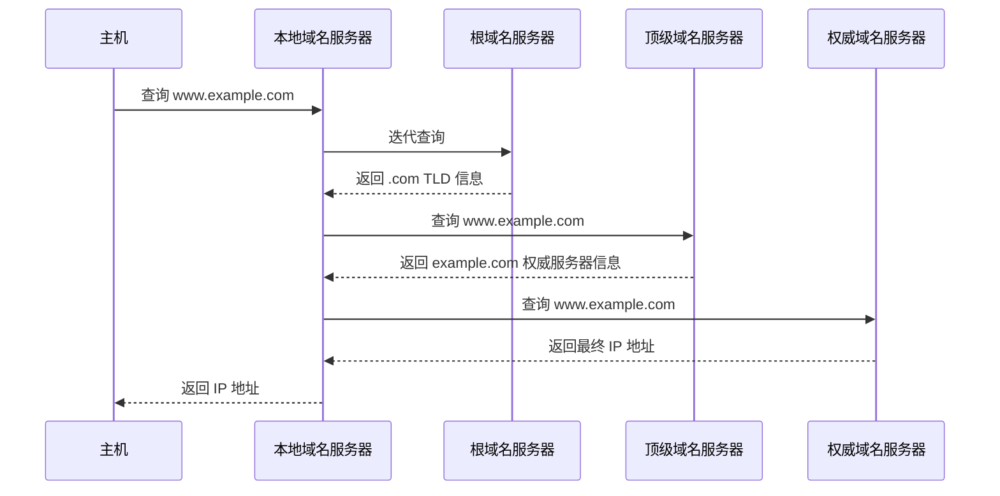
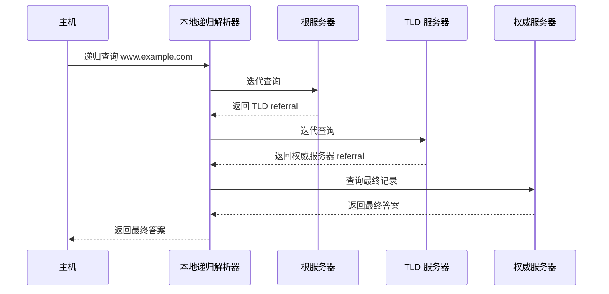

应用层直接面向用户和应用程序，是计算机网络体系结构中距离用户最近的一层。

408 对应用层的考查通常集中在以下几类问题：

* 某种应用层协议使用 **TCP 还是 UDP**；
* 协议对应的 **默认端口号**；
* 一个应用需要建立 **几条传输层连接**；
* 通信过程中 **谁主动发起连接**；
* 请求、响应、发送、接收的 **先后顺序**；
* DNS、FTP、SMTP、POP3/IMAP、HTTP 等协议的典型工作流程；
* HTTP 的持久连接、流水线、Cookie 等机制。

### 1. 本章考点总览

| 内容         | 核心考点                  | 真题考查                                        |
| ---------- | --------------------- | ------------------------------------------- |
| 网络应用模型     | C/S、P2P 的角色划分与特点      | 2019 第 40 题、2025 第 39 题                     |
| DNS        | 域名层次、域名服务器、递归/迭代查询、缓存 | 2010、2016、2020 第 40 题                       |
| FTP        | 控制连接、数据连接、主动/被动模式     | 2009、2017 第 40 题；2023 第 47 题                |
| 电子邮件       | SMTP、POP3、IMAP、MIME   | 2012、2013、2018、2025 第 40 题；2015 第 33 题      |
| WWW / HTTP | 请求响应、持久连接、流水线、Cookie  | 2014、2015、2022、2024、2026 第 40 题；2011 第 47 题 |

> **复习重点**
>
> 应用层不宜只背协议定义。遇到综合题时，要能够沿着
> **应用层协议 → 传输层协议 → 端口 → 建立连接 → 请求/响应过程**
> 这一条链分析。

#### 常用协议速查

| 协议           | 主要功能       | 传输层       |       常见端口 |
| ------------ | ---------- | --------- | ---------: |
| DNS          | 域名解析       | UDP / TCP |         53 |
| FTP 控制连接     | 命令与响应      | TCP       |         21 |
| FTP 主动模式数据连接 | 文件、目录数据    | TCP       | 服务器通常使用 20 |
| SMTP         | 发送、转发邮件    | TCP       |         25 |
| POP3         | 下载邮件       | TCP       |        110 |
| IMAP         | 在线管理、同步邮件  | TCP       |        143 |
| HTTP         | Web 资源传输   | TCP       |         80 |
| HTTPS        | HTTP + TLS | TCP       |        443 |

> **易错**
>
> 端口号描述的是服务器端提供服务时通常监听的端口。客户端一般使用系统临时分配的端口。

---

## 2. 网络应用模型

网络应用通常可以按照应用进程之间的组织方式分成 **客户/服务器模型（C/S）** 和 **对等模型（P2P）**。

<InlineSvg src="/images/computer-network/computer-network-application-model-001.svg" alt={"网络应用模型 图 1"} />

### 2.1 C/S 模型

C/S（Client/Server，客户/服务器）模型是一种以服务器为核心的网络应用模型。

基本通信过程为：

```text
客户端主动发出请求
        ↓
服务器接收并处理请求
        ↓
服务器返回响应
```

#### 特点

* **客户端**

  * 主动发起通信；
  * 向服务器请求资源或服务；
  * 可以间歇性接入网络。
* **服务器**

  * 通常长期运行；
  * 使用相对固定的地址提供服务；
  * 被动等待客户端请求。
* 整体结构相对 **中心化**；
* 服务质量和系统能力很大程度上依赖服务器。

典型应用包括：

* Web 浏览器与 Web 服务器；
* 邮件客户端与邮件服务器；
* FTP 客户端与 FTP 服务器。

#### 优缺点

| 特点    | C/S           |
| ----- | ------------- |
| 管理    | 集中，方便管理       |
| 服务稳定性 | 较高            |
| 数据管理  | 集中            |
| 扩展性   | 服务器可能成为瓶颈     |
| 服务器压力 | 客户端增加时服务器负载增加 |

---

### 2.2 P2P 模型

P2P（Peer to Peer，对等）模型中，各节点在逻辑地位上相对平等。

一个节点既可以作为：

* **客户端**，向其他节点请求资源；
* 也可以作为 **服务器**，向其他节点提供资源。

典型场景包括：

* BitTorrent 等文件共享；
* 一些点对点通信应用；
* 分布式资源共享系统。

> P2P 强调的是对等节点之间能够直接提供和获取资源，并不意味着整个系统中绝对不存在任何辅助服务器。

#### 特点

* 资源分散在多个节点；
* 节点之间可以直接通信；
* 系统具有较强的分布式特点；
* 新节点加入后，不仅产生新的需求，也可能提供新的资源和服务能力。

#### C/S 与 P2P 对比

| 对比项       | C/S         | P2P        |
| --------- | ----------- | ---------- |
| 节点关系      | 客户端、服务器角色明显 | 节点地位较对等    |
| 是否依赖中心服务器 | 较强          | 较弱         |
| 资源位置      | 主要集中在服务器    | 分散在各节点     |
| 扩展性       | 易受服务器能力限制   | 通常较好       |
| 管理        | 集中、方便       | 较分散        |
| 节点角色      | 通常固定        | 可同时是客户和服务器 |

> **408 易错点**
>
> “客户端主动发起连接、服务器被动等待请求”是典型 C/S 模型的重要特征。

---

## 3. DNS 域名系统

DNS（Domain Name System，域名系统）的核心作用是完成：

```text
域名 → IP 地址
```

例如用户访问：

```text
www.example.com
```

主机最终必须获得对应的 IP 地址，才能进一步进行网络层通信。

DNS 通常使用 **53 端口**。普通域名查询常使用 UDP，某些需要可靠传输或数据较大的场景也可以使用 TCP。

---

### 3.1 层次域名空间

DNS 使用 **层次化的域名空间**。

完整域名从右向左体现从高层到低层的组织关系。

例如：

```text
www.example.com
```

从右向左可以理解为：

```text
. → com → example → www
```

其中：

* 最右侧隐含的 `.` 为 **根域**；
* `com` 为 **顶级域名**；
* `example.com` 位于 `.com` 下一级；
* `www` 是 `example.com` 域中的主机或子域标签。

<InlineSvg src="/images/computer-network/computer-network-application-dns-001.svg" alt={"DNS 图 1"} />

这种层次结构将整个域名空间划分给不同组织管理，使 DNS 能够在全球范围内扩展。

---

## 4. DNS 域名服务器

<InlineSvg src="/images/computer-network/computer-network-application-dns-002.svg" alt={"DNS 图 2"} />

DNS 中常见的域名服务器可以分为以下几类。

### 4.1 根域名服务器

根域名服务器处在 DNS 层次结构最顶端。

其主要任务通常不是直接给出某个普通主机域名的 IP 地址，而是告诉查询者：

> 下一步应该询问哪个顶级域名服务器。

例如查询：

```text
www.example.com
```

根服务器可以返回负责 `.com` 的顶级域名服务器信息。

DNS 根区共有 **13 个逻辑根服务器标识 A～M**。这里的“13 个”不是全球只有 13 台物理服务器，而是 13 个逻辑标识，实际通过 Anycast 等技术部署了大量服务器实例。

> **408 重点**
>
> 根域名服务器最重要的作用是提供下一层的**委派信息（referral）**。

---

### 4.2 顶级域名服务器

顶级域名服务器（TLD Server）负责某个顶级域。

例如：

```text
.com
.org
.net
.cn
```

它通常负责告诉查询者：

> 某个具体域名应该继续询问哪个权威域名服务器。

例如：

```text
example.com
```

对应的 `.com` 顶级域服务器可以给出 `example.com` 的权威 DNS 服务器信息。

---

### 4.3 权威域名服务器

权威域名服务器（Authoritative Name Server）保存某个区域的权威 DNS 数据。

例如它可能保存：

* 域名对应 IP 的 **A 记录**；
* 邮件服务器对应的 **MX 记录**；
* 其他 DNS 资源记录。

因此最终查询：

```text
www.example.com → IP 地址
```

通常由目标域对应的权威服务器给出权威答案。

---

### 4.4 本地域名服务器

本地域名服务器通常是主机配置使用的 **本地递归解析器**。

它负责：

1. 接收主机发送的 DNS 查询；
2. 先检查自己的缓存；
3. 若缓存没有答案，再向其他 DNS 服务器查询；
4. 得到结果后返回给主机；
5. 将结果缓存一段时间。

本地域名服务器通常可以由：

* ISP；
* 学校；
* 企业；
* 公共 DNS 服务提供商

提供。

> **易混淆**
>
> 本地域名服务器不是 DNS 层次结构中类似“根 → TLD → 权威”的一个固定层级。它主要是站在主机一侧帮助完成递归解析。

---

## 5. DNS 域名解析

<InlineSvg src="/images/computer-network/computer-network-application-dns-003.svg" alt={"DNS 图 3"} />

DNS 查询方式主要有两种：

* **递归查询**
* **迭代查询**

理解两者时，最关键的是判断：

> **谁负责继续向下查？**

---

### 5.1 递归查询

递归查询中：

> 查询者要求被查询服务器负责获得最终结果。

被查询服务器最终应返回：

* 查询结果；
* 或明确的失败信息。

查询者不需要自己继续逐级寻找其他 DNS 服务器。

可以记成：

```text
我问你，你帮我查到底。
```

---

### 5.2 迭代查询

迭代查询中：

> 被查询服务器如果不知道最终答案，可以告诉查询者下一步应该去问谁。

查询者随后自己继续查询。

可以记成：

```text
我问你，你不知道，就告诉我下一站去问谁。
```

---

### 5.3 典型的迭代解析过程

<InlineSvg src="/images/computer-network/computer-network-application-dns-004.svg" alt={"DNS 图 4"} />

假设本地域名服务器需要解析：

```text
www.example.com
```

典型过程为：

1. 本地 DNS 查询根域名服务器；
2. 根服务器返回 `.com` 顶级域服务器的信息；
3. 本地 DNS 查询 `.com` 顶级域服务器；
4. TLD 服务器返回 `example.com` 权威服务器的信息；
5. 本地 DNS 查询 `example.com` 权威服务器；
6. 权威服务器返回最终的 IP 地址；
7. 本地 DNS 将结果返回给主机。



---

### 5.4 实际中递归查询与迭代查询的组合

<InlineSvg src="/images/computer-network/computer-network-application-dns-005.svg" alt={"DNS 递归与迭代查询组合示意"} />

实际网络中最常见的方式是：

```text
主机
 │
 │ 递归查询
 ↓
本地递归解析器
 │
 ├── 根服务器        ← 迭代
 ├── TLD 服务器      ← 迭代
 └── 权威服务器      ← 迭代
 │
 ↓
得到最终结果
 │
 ↓
返回主机
```

具体过程为：

1. 主机的 stub resolver 向本地递归解析器发送递归查询；
2. 本地 DNS 首先检查缓存；
3. 如果没有命中缓存，本地 DNS 向根服务器发起迭代查询；
4. 根服务器返回下一步应访问的 TLD 服务器；
5. 本地 DNS 查询 TLD 服务器；
6. TLD 返回目标域权威 DNS 服务器；
7. 本地 DNS 查询权威 DNS；
8. 权威 DNS 返回最终结果；
9. 本地 DNS 缓存结果并返回给主机。



#### 递归与迭代对比

| 特点       | 递归查询        | 迭代查询                  |
| -------- | ----------- | --------------------- |
| 谁负责继续查   | 被查询服务器      | 查询者                   |
| 查询者最终得到  | 最终答案或失败     | 最终答案或下一服务器地址          |
| 查询者负担    | 较小          | 较大                    |
| 被查询服务器负担 | 较大          | 较小                    |
| 典型场景     | 主机 → 本地 DNS | 本地 DNS → 根/TLD/权威 DNS |

> **一眼判断**
>
> 题目问“服务器替查询方继续查询” → **递归**。
> 题目问“服务器告诉查询者下一步去哪查” → **迭代**。

---

## 6. DNS 缓存

<InlineSvg src="/images/computer-network/computer-network-application-dns-006.svg" alt={"DNS 图 6"} />

DNS 查询结果通常会被缓存。

可能存在缓存的位置包括：

* 浏览器；
* 操作系统；
* 本地 DNS 服务器。

这样再次访问相同域名时，可以直接使用缓存结果，而不需要重新完成：

```text
根 DNS → TLD → 权威 DNS
```

的完整解析过程。

### 6.1 TTL

DNS 记录通常具有 **TTL（Time To Live）**。

TTL 表示：

> DNS 记录允许在缓存中保留的时间。

例如：

```text
TTL = 3600
```

表示该记录最多可以缓存：

```text
3600 秒 = 1 小时
```

TTL 有效期间：

```text
查询 → 缓存命中 → 直接返回
```

TTL 到期后：

```text
缓存失效 → 再次向 DNS 系统查询
```

#### DNS 高频易错点

> **易错 1：** DNS 并不是每次都从根服务器开始查询，首先应检查缓存。
>
> **易错 2：** 根服务器通常不直接保存普通主机域名对应的最终 IP，而是返回下一层服务器信息。
>
> **易错 3：** 主机向本地 DNS 常使用递归查询，而本地 DNS 向根、TLD、权威 DNS 常使用迭代查询。
>
> **易错 4：** 缓存不是永久有效，其有效时间受到 TTL 限制。

---
