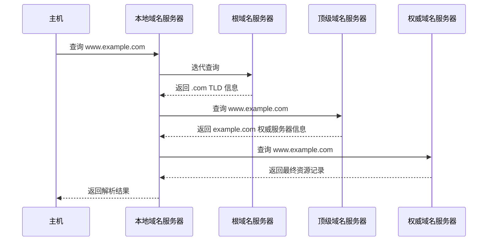
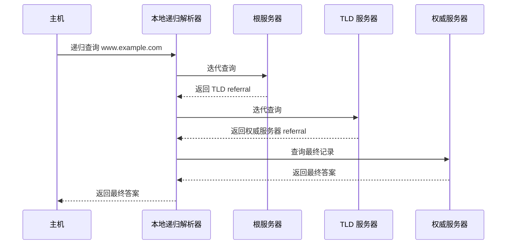

应用层直接面向用户和网络应用，是 408 中最容易与下层协议“串起来考”的一层。应用层题目通常不只问协议定义，而是要求从一次真实访问过程判断：**使用什么协议、依赖 TCP 还是 UDP、服务器端口是什么、谁主动发起连接、会建立几条连接、总时延是多少**。

建议始终沿下面的分析链做题：

```text
应用场景
→ 识别应用层协议
→ 判断 TCP / UDP
→ 确定服务器常用端口
→ 判断客户端/服务器及主动方
→ 判断连接数量与复用方式
→ 按时间顺序画通信过程
→ 累加真正串行发生的 RTT 与传输时延
```

## 1. 本章考点总览与协议速查

> **真题考察**
>
> - 网络应用模型：2019 年第 40 题、2025 年第 39 题
> - DNS：2010、2016、2020 年第 40 题
> - FTP：2009、2017 年第 40 题；2023 年第 47 题
> - 电子邮件：2012、2013、2018、2025 年第 40 题；2015 年第 33 题
> - WWW / HTTP：2014、2015、2022、2024、2026 年第 40 题；2011 年第 47 题

| 协议 | 主要功能 | 常见传输层 | 服务器常用端口 | 最关键考点 |
| --- | --- | --- | ---: | --- |
| DNS | 域名解析 | UDP / TCP | 53 | 层次、递归/迭代、缓存 |
| FTP 控制连接 | 命令与响应 | TCP | 21 | 控制与数据连接分离 |
| FTP 主动模式数据连接 | 文件/目录数据 | TCP | 服务器传统使用 20 | 服务器主动连接客户端 |
| SMTP | 发送、转发邮件 | TCP | 25 | Push |
| POP3 | 下载邮件 | TCP | 110 | Pull |
| IMAP | 在线访问、同步邮箱 | TCP | 143 | 服务器端状态同步 |
| HTTP | Web 资源传输 | TCP（HTTP/1.x、HTTP/2） | 80 | 请求/响应、无状态 |
| HTTPS | 加密 Web 访问 | 典型 408 场景为 TLS/TCP | 443 | HTTP + TLS |

<Callout type="warning" title="表中端口通常指服务器端口">

客户端主动建立连接时，一般使用操作系统临时分配的源端口。例如访问 HTTP 服务器时，典型四元组可能是：

```text
客户端IP:临时端口  →  服务器IP:80
```

所以“HTTP 使用 80 端口”不等于客户端源端口也必须是 80。端口号首先用于**标识接收主机上的应用进程/服务**。

</Callout>

<Callout type="info" title="关于现代 HTTP 版本">

HTTP/1.x 和 HTTP/2 的典型 408 分析都按 TCP 处理；HTTP/3 基于 QUIC/UDP。若题目明确给出协议版本，应按题设判断；传统 408 基础题没有特别说明时，不要主动套用 HTTP/3。

</Callout>

---

## 2. 网络应用模型：C/S 与 P2P

<InlineSvg src="/images/computer-network/computer-network-application-model-001.svg" alt={"网络应用模型 图 1"} />

网络应用按应用进程之间的组织方式，常分为**客户/服务器模型（C/S）**和**对等模型（P2P）**。

### 2.1 C/S 模型

C/S（Client/Server）中，服务器通常长期运行并等待请求，客户端按需主动访问服务器：

```text
客户端主动发起请求
        ↓
服务器接收并处理
        ↓
服务器返回响应/服务结果
```

| 角色 | 典型特点 |
| --- | --- |
| 客户端 | 主动发起通信；按需运行；通常需要知道服务器地址/域名 |
| 服务器 | 通常长期运行；地址相对稳定；监听已知服务端口；被动等待初始请求 |

典型应用：Web、FTP、电子邮件服务、DNS 查询等。

C/S 的优点是管理集中、权限控制方便；缺点是服务器可能成为性能瓶颈，核心服务器故障也可能影响大量客户端。

<Callout type="warning" title="客户端主动 ≠ 连接建立后服务器不能主动发数据">

“客户端”主要表示**谁主动请求服务/建立初始联系**。连接建立后，TCP 本身是全双工的，服务器当然可以向客户端发送数据；FTP 主动模式甚至会由服务器主动建立**数据连接**。

</Callout>

### 2.2 P2P 模型

P2P（Peer to Peer）中，各对等节点在逻辑地位上相对平等。同一个节点既可以请求资源，也可以向其他节点提供资源。

典型场景：BitTorrent 等分布式文件共享系统。

| 对比项 | C/S | P2P |
| --- | --- | --- |
| 节点角色 | 客户端、服务器相对明确 | 节点可同时是请求方和资源提供方 |
| 资源位置 | 主要集中于服务器 | 分散在多个节点 |
| 管理方式 | 较集中 | 较分散 |
| 扩展性 | 易受服务器能力限制 | 新节点也可能贡献存储/带宽 |
| 中心服务器 | 通常依赖明显 | 可弱化，但不要求绝对没有 |

<Callout type="info" title="P2P 不等于完全去中心化">

P2P 的核心是**对等节点之间可以直接交换资源**。系统仍可能使用目录服务器、追踪器、登录服务器等辅助组件，所以“存在服务器”不能直接判定它不是 P2P。

</Callout>

---

## 3. DNS：作用、域名空间与资源记录

> **真题考察**
>
> - 2010 年第 40 题
> - 2016 年第 40 题
> - 2020 年第 40 题

DNS（Domain Name System）是一个分布式、层次化的命名系统。408 最常考的功能是：

```text
域名 → IP 地址
```

但 DNS 并不是简单的一张“域名-IP 表”，其核心包括**层次域名空间、分布式数据库、域名服务器与解析过程**。

DNS 服务器通常监听 **53 端口**：

- 普通查询通常使用 UDP；
- 需要可靠传输的场景可使用 TCP，例如传统区域传送；
- 当响应过大、UDP 响应被截断等情况下，也可能改用 TCP。

### 3.1 层次域名空间

<InlineSvg src="/images/computer-network/computer-network-application-dns-001.svg" alt={"DNS 图 1"} />

以：

```text
www.example.com
```

为例，从右向左体现由高到低的层次：

```text
. → com → example → www
```

- `.`：根域；
- `com`：顶级域（TLD）；
- `example.com`：其下的域；
- `www`：更低层标签，常被用作主机名。

层次结构的意义是把命名管理权逐级分散，避免由单台服务器保存全球所有域名信息。

### 3.2 常见资源记录

| 记录 | 作用 |
| --- | --- |
| A | 名称对应 IPv4 地址 |
| AAAA | 名称对应 IPv6 地址 |
| NS | 指明某区域的权威域名服务器 |
| CNAME | 建立别名到规范名称的映射 |
| MX | 指明负责该域邮件接收的邮件服务器 |

<Callout type="warning" title="DNS 不只有“域名 → IP”">

题目若出现邮件服务器、别名、权威服务器，应先判断查询的资源记录类型，而不是机械地认为所有 DNS 查询都只是在找 A 记录。

</Callout>

---

## 4. DNS 域名服务器

<InlineSvg src="/images/computer-network/computer-network-application-dns-002.svg" alt={"DNS 图 2"} />
<InlineSvg src="/images/computer-network/computer-network-application-dns-003.svg" alt={"DNS 图 3"} />

408 常见的 DNS 角色包括：**根域名服务器、顶级域名服务器、权威域名服务器、本地域名服务器（递归解析器）**。

### 4.1 根域名服务器

根域名服务器位于权威 DNS 层次结构顶端。查询普通域名时，它通常不会直接返回目标主机 IP，而是告诉解析器“下一步应该去哪个 TLD 服务器问”。这类回答称为**委派（referral）**。

DNS 根区传统上有 **13 个逻辑根服务器标识 A～M**，并不表示全球只有 13 台物理设备；实际通过 Anycast 等技术部署了大量实例。

### 4.2 顶级域名服务器

TLD Server 负责 `.com`、`.org`、`.cn` 等顶级域。它通常进一步给出目标域对应的权威域名服务器信息。

```text
根服务器  → 告诉你 .com TLD 在哪里
.com TLD → 告诉你 example.com 权威 DNS 在哪里
```

### 4.3 权威域名服务器

权威域名服务器保存某个区域的权威 DNS 数据，可以对该区域的 A、AAAA、MX 等记录给出权威回答。

### 4.4 本地域名服务器 / 递归解析器

本地域名服务器通常由 ISP、学校、企业或公共 DNS 服务商提供。它靠近客户端，主要负责：

1. 接收主机的解析请求；
2. 检查本地缓存；
3. 缓存未命中时代表主机继续查询；
4. 获得最终结果后返回主机；
5. 按 TTL 缓存结果。

<Callout type="warning" title="本地 DNS 不是权威层次树中的固定一级">

“根 → TLD → 权威”是权威 DNS 的层次关系；本地递归解析器是客户端一侧的服务角色，不能把它固定画在“根”和“TLD”之间。

</Callout>

---

## 5. DNS 递归查询与迭代查询

判断递归还是迭代，只问一句：**收到查询的服务器是否负责继续查到底？**

### 5.1 递归查询

递归查询中，查询者要求被查询服务器替自己继续查询，并最终返回答案或失败结果。

```text
“我只问你；后面的查询由你负责。”
```

### 5.2 迭代查询

迭代查询中，被查询服务器如果没有最终答案，可以返回“下一步去问谁”，由查询者自己继续。

```text
“我问你；你不知道最终答案，就告诉我下一站。”
```

| 对比项 | 递归查询 | 迭代查询 |
| --- | --- | --- |
| 谁继续查询 | 被查询服务器 | 查询者 |
| 查询者得到 | 最终答案或失败 | 最终答案或下一服务器信息 |
| 查询者工作量 | 较小 | 较大 |
| 408 典型场景 | 主机 → 本地 DNS | 本地 DNS → 根/TLD/权威 |

### 5.3 典型迭代解析过程

<InlineSvg src="/images/computer-network/computer-network-application-dns-004.svg" alt={"DNS 图 4"} />

假设本地 DNS 需要解析 `www.example.com`，且相关缓存均未命中：

1. 查询根域名服务器；
2. 根服务器返回 `.com` TLD 信息；
3. 查询 `.com` TLD；
4. TLD 返回 `example.com` 权威服务器信息；
5. 查询权威服务器；
6. 权威服务器返回最终资源记录；
7. 本地 DNS 把结果返回主机。


```mermaid
sequenceDiagram
    participant Host as 主机
    participant Local as 本地域名服务器
    participant Root as 根域名服务器
    participant TLD as 顶级域名服务器
    participant Auth as 权威域名服务器

    Host->>Local: 查询 www.example.com
    Local->>Root: 迭代查询
    Root-->>Local: 返回 .com TLD 信息
    Local->>TLD: 查询 www.example.com
    TLD-->>Local: 返回 example.com 权威服务器信息
    Local->>Auth: 查询 www.example.com
    Auth-->>Local: 返回最终资源记录
    Local-->>Host: 返回解析结果
```

### 5.4 最典型的递归 + 迭代组合

<InlineSvg src="/images/computer-network/computer-network-application-dns-005.svg" alt={"DNS 递归与迭代查询组合示意"} />

408 常用模型是：

```text
主机 ──递归──> 本地递归解析器
                 │
                 ├──迭代──> 根服务器
                 ├──迭代──> TLD 服务器
                 └──迭代──> 权威服务器
```


```mermaid
sequenceDiagram
    participant Host as 主机
    participant Local as 本地递归解析器
    participant Root as 根服务器
    participant TLD as TLD 服务器
    participant Auth as 权威服务器

    Host->>Local: 递归查询 www.example.com
    Local->>Root: 迭代查询
    Root-->>Local: 返回 TLD referral
    Local->>TLD: 迭代查询
    TLD-->>Local: 返回权威服务器 referral
    Local->>Auth: 查询最终记录
    Auth-->>Local: 返回最终答案
    Local-->>Host: 返回最终答案
```

<Callout type="info" title="DNS RTT 题：只加真正串行等待的查询">

若所有缓存未命中，且若干查询必须依次等待完成，则可写为：

$$
T_{DNS}=RTT_1+RTT_2+\cdots+RTT_k
$$

若主机到本地 DNS 的往返也由题目单独给出，则同样按实际通信过程计入。若某一级缓存命中，后面的查询不会发生。

</Callout>

---

## 6. DNS 缓存、TTL 与综合题解法

<InlineSvg src="/images/computer-network/computer-network-application-dns-006.svg" alt={"DNS 图 6"} />

DNS 结果可以缓存在浏览器、操作系统、本地递归解析器等位置。再次解析相同名称时，只要缓存仍有效，就可能跳过完整的：

```text
根 DNS → TLD → 权威 DNS
```

### 6.1 TTL

资源记录通常带 TTL（Time To Live），表示缓存记录可以保持有效的时间。例如：

```text
TTL = 3600 s
```

在缓存尚未过期时可直接使用；TTL 到期后需要重新查询。TTL 的意义是平衡：

- 较大 TTL：降低 DNS 查询流量、提高命中率；
- 较小 TTL：记录变化后更快被客户端重新获取。

### 6.2 “输入 URL 到页面返回”的应用层主线

这是应用层综合题最有用的一条时间线：

```text
1. 浏览器解析 URL
2. 若没有可用 DNS 缓存：DNS 解析域名
3. 得到服务器 IP
4. 若 HTTP/1.x 或 HTTP/2：建立/复用 TCP 连接
5. 发送 HTTP 请求
6. 服务器返回基础 HTML
7. 浏览器解析 HTML，发现嵌入对象
8. 按连接复用、并行、流水线等条件请求其余对象
```

若题目同时涉及 ARP、路由器或交换机，则再把下层过程插入“向下一跳发送分组”之前，而不要混淆协议职责。

### 6.3 DNS 综合题固定检查顺序

1. **缓存是否命中**；
2. 主机先问谁——通常先问配置的本地 DNS；
3. 主机到本地 DNS 是递归还是迭代；
4. 本地 DNS 是否需要继续访问根、TLD、权威服务器；
5. DNS 使用 UDP 还是题设指定 TCP；
6. 只累加实际发生且串行等待的 RTT；
7. 解析出 IP 后，才进入 TCP/HTTP 等后续阶段。

<Callout type="warning" title="DNS 五个高频误区">

- DNS **不是每次**都从根服务器开始，先看缓存。
- 主机通常先查询配置的**本地 DNS**，而不是直接访问根服务器。
- 根服务器通常返回下一层委派信息，不直接返回普通主机最终 IP。
- “递归/迭代”由**谁继续查询**决定，而不是由查询了几台服务器决定。
- DNS 可以使用 UDP，也可以在特定情形使用 TCP，不能绝对说“DNS 只用 UDP”。

</Callout>
