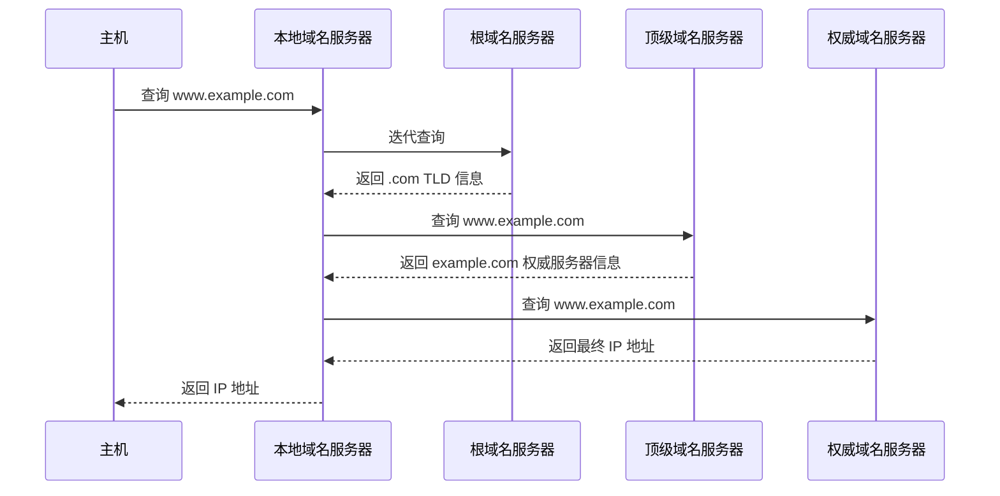
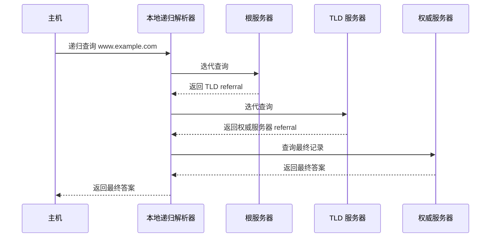

应用层直接面向用户和应用程序，是计算机网络体系结构中距离用户最近的一层。408 对应用层的考查很少停留在“协议名词解释”，更常见的是把多个协议串成一次完整通信过程，要求判断**传输层协议、端口、连接数量、通信方向和时延**。

复习时建议始终沿着下面这条链分析：

```text
应用场景
→ 选择应用层协议
→ 判断 TCP / UDP
→ 确定服务器常用端口
→ 判断谁主动建立连接
→ 按请求/响应顺序画时间线
→ 必要时计算 DNS、TCP、HTTP 的 RTT 与传输时延
```

## 1. 本章考点总览与协议速查

> **真题考察**
>
> - 网络应用模型：2019 年第 40 题、2025 年第 39 题
> - DNS：2010、2016、2020 年第 40 题
> - FTP：2009、2017 年第 40 题；2023 年第 47 题
> - 电子邮件：2012、2013、2018、2025 年第 40 题；2015 年第 33 题
> - WWW / HTTP：2014、2015、2022、2024、2026 年第 40 题；2011 年第 47 题

| 协议 | 主要功能 | 常见传输层 | 服务器常用端口 | 关键特征 |
| --- | --- | --- | ---: | --- |
| DNS | 域名解析 | UDP / TCP | 53 | 递归、迭代、缓存 |
| FTP 控制连接 | 命令与响应 | TCP | 21 | 整个会话通常持续存在 |
| FTP 主动模式数据连接 | 文件/目录数据 | TCP | 服务器传统上使用 20 | 与控制连接分离 |
| SMTP | 发送、转发邮件 | TCP | 25 | Push |
| POP3 | 下载邮件 | TCP | 110 | Pull |
| IMAP | 在线管理、同步邮件 | TCP | 143 | 服务器端状态同步 |
| HTTP | Web 资源传输 | TCP（HTTP/1.x、HTTP/2） | 80 | 请求/响应、无状态 |
| HTTPS | 加密 Web 访问 | 典型 408 场景为 TLS/TCP | 443 | HTTP + TLS |

<Callout type="warning" title="端口号的判断口径">

表中的端口通常指**服务器端的知名/注册端口**。客户端主动建立连接时，一般使用操作系统临时分配的源端口，因此不要把“HTTP 80 端口”误解为客户端源端口也必须是 80。

现代 HTTP/3 使用 QUIC/UDP，但 408 传统题目若明确考查 HTTP/1.1 或 HTTP/2，应按 TCP 分析。

</Callout>

---

## 2. 网络应用模型：C/S 与 P2P

<InlineSvg src="/images/computer-network/computer-network-application-model-001.svg" alt={"网络应用模型 图 1"} />

网络应用按应用进程之间的组织方式，常分为**客户/服务器模型（C/S）**和**对等模型（P2P）**。

### 2.1 C/S 模型

C/S（Client/Server）模型中，服务器通常长期运行并等待请求，客户端按需主动访问服务器：

```text
客户端主动请求
      ↓
服务器接收并处理
      ↓
服务器返回响应
```

| 角色 | 典型特点 |
| --- | --- |
| 客户端 | 主动发起通信；按需接入；请求资源或服务 |
| 服务器 | 通常长期运行；地址相对稳定；被动等待请求 |

典型应用包括 Web、电子邮件、FTP 等。

C/S 的优点是管理集中、数据和权限控制方便；缺点是服务器可能成为性能瓶颈或单点故障位置。

### 2.2 P2P 模型

P2P（Peer to Peer）中，各节点在逻辑地位上相对平等，一个节点既可以向其他节点请求资源，也可以向其他节点提供资源。

典型场景包括 BitTorrent 等分布式文件共享系统。

| 对比项 | C/S | P2P |
| --- | --- | --- |
| 节点角色 | 客户端与服务器较明确 | 同一节点可同时请求和提供资源 |
| 资源位置 | 主要集中于服务器 | 分散在多个对等节点 |
| 管理方式 | 较集中 | 较分散 |
| 扩展能力 | 易受服务器能力限制 | 新节点也可能贡献资源和带宽 |
| 中心服务器依赖 | 通常较强 | 通常较弱，但不代表绝对没有辅助服务器 |

<Callout type="info" title="P2P 不等于完全去中心化">

P2P 的核心是**对等节点之间能够直接提供和获取资源**。系统仍可能使用目录服务器、追踪器等辅助组件，所以“出现服务器”并不能直接否定 P2P 模型。

</Callout>

---

## 3. DNS：作用、域名空间与资源记录

> **真题考察**
>
> - 2010 年第 40 题
> - 2016 年第 40 题
> - 2020 年第 40 题

DNS（Domain Name System）最核心的任务是把人类易读的域名解析为主机通信所需的信息，最常见的是：

```text
域名 → IP 地址
```

DNS 服务器通常监听 **53 端口**。普通查询常使用 UDP；需要可靠的大规模传输、区域传送或响应无法直接放入普通 UDP 响应等场景可使用 TCP。

### 3.1 层次域名空间

<InlineSvg src="/images/computer-network/computer-network-application-dns-001.svg" alt={"DNS 图 1"} />

以：

```text
www.example.com
```

为例，从右向左体现从高层到低层的层次：

```text
. → com → example → www
```

- `.`：根域；
- `com`：顶级域（TLD）；
- `example.com`：其下的域；
- `www`：主机名或更低层标签。

域名空间采用层次化管理，避免由一台服务器保存全球所有名称信息。

### 3.2 常见资源记录

408 做题时至少要认识以下记录的作用：

| 记录 | 作用 |
| --- | --- |
| A | 域名对应 IPv4 地址 |
| AAAA | 域名对应 IPv6 地址 |
| NS | 指明某区域的权威域名服务器 |
| CNAME | 为主机设置规范名称/别名映射 |
| MX | 指明负责该域邮件接收的邮件服务器 |

<Callout type="warning" title="DNS 不只有“域名 → IP”">

“域名解析成 IP”是最常考的功能，但 DNS 实际保存的是多种资源记录。题目若出现邮件服务器、别名或权威服务器，应先判断记录类型，而不是机械寻找 A 记录。

</Callout>

---

## 4. DNS 域名服务器

<InlineSvg src="/images/computer-network/computer-network-application-dns-002.svg" alt={"DNS 图 2"} />
<InlineSvg src="/images/computer-network/computer-network-application-dns-003.svg" alt={"DNS 图 3"} />

DNS 解析中常见四类角色：**根域名服务器、顶级域名服务器、权威域名服务器、本地递归解析器**。

### 4.1 根域名服务器

根域名服务器位于 DNS 层次结构顶端。查询普通域名时，它通常不会直接返回最终主机 IP，而是返回下一步应访问的顶级域服务器信息，即**委派（referral）**。

DNS 根区有 **13 个逻辑根服务器标识 A～M**。这不表示全球只有 13 台物理服务器；实际由 Anycast 等技术部署了大量实例。

### 4.2 顶级域名服务器

TLD Server 负责 `.com`、`.org`、`.cn` 等顶级域。它通常向查询者提供目标域对应的权威域名服务器信息。

例如查询 `www.example.com` 时：

```text
根服务器 → 告诉你 .com TLD 在哪里
.com TLD → 告诉你 example.com 权威 DNS 在哪里
```

### 4.3 权威域名服务器

权威域名服务器保存某个区域的权威 DNS 数据，能够给出该区域资源记录的权威答案，例如 A、AAAA、MX 等记录。

### 4.4 本地域名服务器 / 递归解析器

本地域名服务器通常由 ISP、学校、企业或公共 DNS 服务提供商提供。它位于主机一侧，主要负责：

1. 接收主机查询；
2. 先检查缓存；
3. 缓存未命中时代表主机继续查询；
4. 得到结果后返回给主机；
5. 根据 TTL 缓存结果。

<Callout type="warning" title="本地 DNS 不是 DNS 层次树中的固定一层">

“根 → TLD → 权威”描述的是权威 DNS 的层次关系；本地递归解析器是站在客户端一侧代替主机完成解析的服务角色，不应画成根和 TLD 之间的固定层级。

</Callout>

---

## 5. DNS 递归查询与迭代查询

判断递归/迭代时只问一个问题：**谁负责继续查？**

### 5.1 递归查询

递归查询中，查询者要求被查询服务器替自己继续获得最终结果。被查询服务器最终返回答案或失败信息。

```text
“我问你，你负责查到底。”
```

### 5.2 迭代查询

迭代查询中，被查询服务器若没有最终答案，可以返回下一步应该询问的服务器，查询者自己继续查。

```text
“我问你；你不知道，就告诉我下一站问谁。”
```

| 对比项 | 递归查询 | 迭代查询 |
| --- | --- | --- |
| 谁继续查询 | 被查询服务器 | 查询者 |
| 查询者得到 | 最终答案或失败 | 最终答案或下一服务器信息 |
| 查询者负担 | 较小 | 较大 |
| 典型场景 | 主机 → 本地递归解析器 | 本地解析器 → 根/TLD/权威 |

### 5.3 典型迭代解析过程

<InlineSvg src="/images/computer-network/computer-network-application-dns-004.svg" alt={"DNS 图 4"} />

假设本地 DNS 要解析 `www.example.com`：

1. 查询根域名服务器；
2. 根服务器返回 `.com` TLD 信息；
3. 查询 `.com` TLD；
4. TLD 返回 `example.com` 的权威服务器信息；
5. 查询权威服务器；
6. 权威服务器返回最终记录；
7. 本地 DNS 把结果返回给主机。


```mermaid
sequenceDiagram
    participant Host as 主机
    participant Local as 本地域名服务器
    participant Root as 根域名服务器
    participant TLD as 顶级域名服务器
    participant Auth as 权威域名服务器

    Host->>Local: 查询 www.example.com
    Local->>Root: 迭代查询
    Root-->>Local: 返回 .com TLD 信息
    Local->>TLD: 查询 www.example.com
    TLD-->>Local: 返回 example.com 权威服务器信息
    Local->>Auth: 查询 www.example.com
    Auth-->>Local: 返回最终 IP 地址
    Local-->>Host: 返回 IP 地址
```

### 5.4 实际中常见的组合

<InlineSvg src="/images/computer-network/computer-network-application-dns-005.svg" alt={"DNS 递归与迭代查询组合示意"} />

最典型的考试模型是：

```text
主机 ──递归──> 本地递归解析器
                 │
                 ├──迭代──> 根服务器
                 ├──迭代──> TLD 服务器
                 └──迭代──> 权威服务器
```


```mermaid
sequenceDiagram
    participant Host as 主机
    participant Local as 本地递归解析器
    participant Root as 根服务器
    participant TLD as TLD 服务器
    participant Auth as 权威服务器

    Host->>Local: 递归查询 www.example.com
    Local->>Root: 迭代查询
    Root-->>Local: 返回 TLD referral
    Local->>TLD: 迭代查询
    TLD-->>Local: 返回权威服务器 referral
    Local->>Auth: 查询最终记录
    Auth-->>Local: 返回最终答案
    Local-->>Host: 返回最终答案
```

<Callout type="info" title="DNS 时延题的统一算法">

若缓存均未命中，并且查询过程依次等待多个服务器返回，那么 DNS 解析时延就是这些**串行查询 RTT 的和**：

$$
T_{DNS}=RTT_1+RTT_2+\cdots+RTT_k
$$

题目若还给出“主机到本地 DNS”的 RTT，也应按题目通信过程计入；若某一级缓存命中，则后续查询全部省去。

</Callout>

---

## 6. DNS 缓存、TTL 与做题顺序

<InlineSvg src="/images/computer-network/computer-network-application-dns-006.svg" alt={"DNS 图 6"} />

DNS 查询结果可以缓存在浏览器、操作系统、本地递归解析器等位置。再次解析相同名称时，若缓存仍有效，就无需重新走完整的：

```text
根 DNS → TLD → 权威 DNS
```

### 6.1 TTL

DNS 记录通常带有 TTL（Time To Live），表示缓存记录允许保持有效的时间。例如：

```text
TTL = 3600
```

表示记录可缓存约 3600 s。TTL 未过期时可以直接命中；过期后应重新解析。

### 6.2 DNS 综合题判断顺序

1. **先查缓存是否命中**；
2. 未命中再判断主机与本地 DNS 是递归还是迭代；
3. 画出根、TLD、权威服务器的查询顺序；
4. 需要算时间时，只累加真正发生且串行等待的 RTT；
5. 最终得到 IP 后，才进入 TCP/UDP 与应用层协议阶段。

<Callout type="warning" title="DNS 四个高频误区">

- DNS **不是每次**都从根服务器开始，先看缓存。
- 根服务器通常给出**下一层委派信息**，不是普通主机的最终 IP。
- 主机 → 本地 DNS 常按递归理解；本地 DNS → 根/TLD/权威常按迭代理解。
- TTL 约束缓存有效期，缓存并非永久正确。

</Callout>
