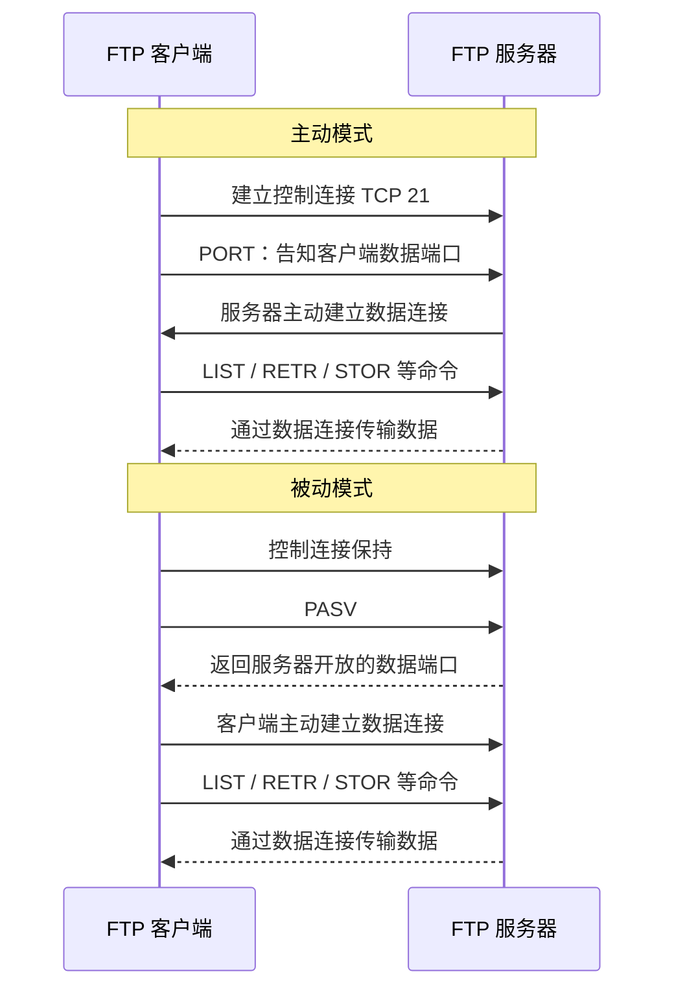

## 7. FTP 文件传输协议

FTP（File Transfer Protocol）是用于文件传输的应用层协议。

FTP 建立在 **TCP** 之上。

其最鲜明的特点是：

> **控制信息和数据分别使用不同的 TCP 连接。**

<InlineSvg src="/images/computer-network/computer-network-application-ftp-001.svg" alt={"FTP 图 1"} />

---

### 7.1 FTP 的两类连接

FTP 使用：

1. **控制连接**
2. **数据连接**

可以记成：

```text
控制连接：管“说什么”
数据连接：管“传什么”
```

---

### 7.2 控制连接

<InlineSvg src="/images/computer-network/computer-network-application-ftp-002.svg" alt={"FTP 图 2"} />

控制连接：

* 使用 **TCP**；
* FTP 服务器默认监听 **21 端口**；
* 客户端主动连接服务器；
* 负责传送：

  * 登录命令；
  * 文件操作命令；
  * 目录命令；
  * 状态码；
  * 响应信息。

例如：

```text
USER
PASS
LIST
RETR
STOR
QUIT
```

控制连接建立后一般会在整个 FTP 会话期间保持。

因此：

> **控制连接是持久的。**

只有在用户退出或会话结束时才关闭。

---

### 7.3 数据连接

数据连接用于真正的数据传输，例如：

* 文件内容；
* 目录列表。

与控制连接不同，数据连接通常：

> 在需要传输数据时建立，传输结束后关闭。

因此 FTP 中一次会话期间可能：

```text
1 条长期存在的控制连接
+
若干条按需建立的数据连接
```

---

## 8. FTP 工作过程

一个典型 FTP 会话可以分成以下阶段。

### 8.1 建立控制连接

客户端主动与服务器建立：

```text
TCP 控制连接
```

服务器默认端口：

```text
21
```

---

### 8.2 身份验证

客户端通过控制连接发送：

* 用户名；
* 密码。

部分 FTP 服务还支持匿名访问，常见用户名为：

```text
anonymous
```

---

### 8.3 发送命令与响应

FTP 命令和服务器响应全部通过：

> **控制连接**

进行传输。

例如用户请求：

```text
下载文件
上传文件
显示目录
切换目录
```

服务器通过状态码和文本信息返回执行结果。

---

### 8.4 建立数据连接

真正传输文件或目录列表之前，还要建立独立的：

> **数据连接**

数据连接有两种典型建立方式：

* 主动模式；
* 被动模式。

---

## 9. FTP 主动模式与被动模式

### 9.1 主动模式 Active Mode

主动模式中：

1. 客户端首先建立到服务器 21 端口的控制连接；
2. 客户端开放一个端口；
3. 客户端通过控制连接将该端口告诉服务器；
4. **服务器主动连接客户端的数据端口**；
5. 建立数据连接。

传统 FTP 主动模式下，服务器数据连接一侧通常使用 TCP **20 端口**。

记忆：

> **主动模式的“主动”是服务器主动建立数据连接。**

---

### 9.2 被动模式 Passive Mode

被动模式中：

1. 客户端首先建立控制连接；
2. 客户端发送 PASV 请求；
3. 服务器开放一个数据端口；
4. 服务器告诉客户端端口号；
5. **客户端主动连接服务器的数据端口**。

记忆：

> **被动模式的“被动”是服务器等待客户端建立数据连接。**

---

### 9.3 两种模式对比

| 项目        | 主动模式 | 被动模式   |
| --------- | ---- | ------ |
| 控制连接发起者   | 客户端  | 客户端    |
| 控制连接服务器端口 | 21   | 21     |
| 谁开放数据端口等待 | 客户端  | 服务器    |
| 谁主动建立数据连接 | 服务器  | 客户端    |
| 服务器传统数据端口 | 20   | 动态协商端口 |



> **408 高频陷阱**
>
> 无论主动模式还是被动模式，**控制连接都是客户端主动向服务器 21 端口建立**。
> 两者真正不同的是 **数据连接由谁主动发起**。

---

## 10. FTP 文件传输方式

FTP 可以按照文件内容采用不同传输方式。

### 10.1 ASCII 模式

适合：

* 普通文本文件。

传输过程中可以根据两端系统差异进行文本格式转换，例如换行符处理。

### 10.2 二进制模式

适合：

* 图片；
* 音频；
* 视频；
* 程序；
* 压缩包；
* 其他二进制文件。

数据按照原始字节传输，避免格式转换造成文件损坏。

---
