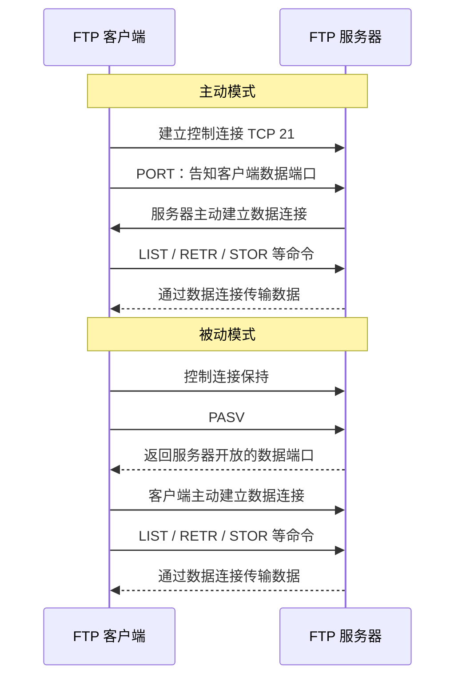

## 7. FTP：控制连接与数据连接

<InlineSvg src="/images/computer-network/computer-network-application-ftp-001.svg" alt={"FTP 图 1"} />

> **真题考察**
>
> - 2009 年第 40 题
> - 2017 年第 40 题
> - 2023 年第 47 题

FTP（File Transfer Protocol）建立在 **TCP** 之上，用于文件和目录信息传输。它最重要的结构特征是：

> **控制信息与实际数据使用不同的 TCP 连接。**

可以记成：

```text
控制连接：管“说什么”
数据连接：管“传什么”
```

### 7.1 控制连接

<InlineSvg src="/images/computer-network/computer-network-application-ftp-002.svg" alt={"FTP 图 2"} />

控制连接由客户端主动建立到服务器 TCP **21 端口**，负责传送：

- 用户登录信息；
- 文件与目录操作命令；
- 状态码与服务器响应。

常见命令包括：

```text
USER
PASS
LIST
RETR
STOR
QUIT
```

控制连接通常在整个 FTP 会话中保持，因此是**长期存在的会话控制通道**。

### 7.2 数据连接

数据连接用于真正传输：

- 文件内容；
- 目录列表等数据。

它通常在一次数据传输前建立，传输完成后关闭。因此一次 FTP 会话可概括为：

```text
1 条较长期存在的控制连接
+
若干条按需建立的数据连接
```

<Callout type="warning" title="不要把 21 端口当成文件数据端口">

TCP 21 主要对应 FTP **控制连接**。文件或目录数据通过独立的数据连接传输，这是 FTP 与许多“一条连接完成全部交互”的应用协议最明显的区别。

</Callout>

---

## 8. FTP 典型工作过程

一次 FTP 会话可以沿时间顺序分析：

1. 客户端主动连接服务器 TCP 21，建立控制连接；
2. 客户端通过控制连接完成用户身份验证；
3. 客户端发送 `LIST`、`RETR`、`STOR` 等命令；
4. 需要传文件或目录列表时，双方建立一条独立数据连接；
5. 数据传输结束后关闭该数据连接；
6. 后续再次传数据时可重新建立新的数据连接；
7. 用户退出后关闭控制连接。

部分 FTP 服务支持匿名登录，常见用户名为：

```text
anonymous
```

<Callout type="info" title="连接数题怎么数">

题目若问“一个 FTP 会话建立几条 TCP 连接”，必须结合进行了几次数据传输。控制连接通常只有 1 条，而每次独立文件/目录数据传输可能建立新的数据连接，所以不能机械回答“永远两条”。

</Callout>

---

## 9. FTP 主动模式与被动模式

主动/被动模式的名字描述的是**服务器在数据连接建立过程中的角色**。无论哪种模式，控制连接都仍由客户端主动连接服务器 21 端口。

### 9.1 主动模式（Active Mode）

典型过程：

1. 客户端建立控制连接；
2. 客户端开放数据端口；
3. 客户端通过控制连接把该端口告诉服务器；
4. **服务器主动连接客户端的数据端口**；
5. 数据连接建立后传输文件/目录信息。

传统主动模式下，服务器数据连接一侧通常使用 TCP **20 端口**。

> **记忆：主动模式 = 服务器主动发起数据连接。**

### 9.2 被动模式（Passive Mode）

典型过程：

1. 客户端建立控制连接；
2. 客户端发送 PASV 等请求；
3. 服务器开放一个数据端口并把端口号告诉客户端；
4. **客户端主动连接服务器的数据端口**；
5. 建立数据连接并传输数据。

> **记忆：被动模式 = 服务器被动等待客户端建立数据连接。**

### 9.3 两种模式对比

| 项目 | 主动模式 | 被动模式 |
| --- | --- | --- |
| 控制连接发起者 | 客户端 | 客户端 |
| 控制连接服务器端口 | 21 | 21 |
| 谁开放数据端口等待 | 客户端 | 服务器 |
| 谁主动建立数据连接 | 服务器 | 客户端 |
| 服务器传统数据端口 | 20 | 动态协商端口 |


```mermaid
sequenceDiagram
    participant Client as FTP 客户端
    participant Server as FTP 服务器

    Note over Client,Server: 主动模式
    Client->>Server: 建立控制连接 TCP 21
    Client->>Server: PORT：告知客户端数据端口
    Server->>Client: 服务器主动建立数据连接
    Client->>Server: LIST / RETR / STOR 等命令
    Server-->>Client: 通过数据连接传输数据

    Note over Client,Server: 被动模式
    Client->>Server: 控制连接保持
    Client->>Server: PASV
    Server-->>Client: 返回服务器开放的数据端口
    Client->>Server: 客户端主动建立数据连接
    Client->>Server: LIST / RETR / STOR 等命令
    Server-->>Client: 通过数据连接传输数据
```

<Callout type="warning" title="主动/被动只看数据连接">

“客户端主动连接服务器”不能据此判断为 FTP 主动模式，因为两种模式的**控制连接**都是客户端主动建立。真正的判断点是：数据连接由服务器主动发起，还是由客户端主动发起。

</Callout>

---

## 10. FTP 文件传输方式

FTP 传统上可以按文件类型采用不同传输方式。

### 10.1 ASCII 模式

适用于文本文件。传输时可以依据两端系统差异进行文本格式转换，例如换行符处理。

### 10.2 二进制模式

适用于图片、音频、视频、程序、压缩包等任意二进制文件。数据按原始字节序列传输，不进行文本格式转换。

| 模式 | 适合内容 | 关键特点 |
| --- | --- | --- |
| ASCII | 文本 | 可能进行文本格式转换 |
| Binary | 任意二进制数据 | 保持原始字节内容 |

> **做题结论**
>
> 传输可执行文件、压缩包、图片等时应选二进制模式；否则文本转换可能破坏原始字节序列。
