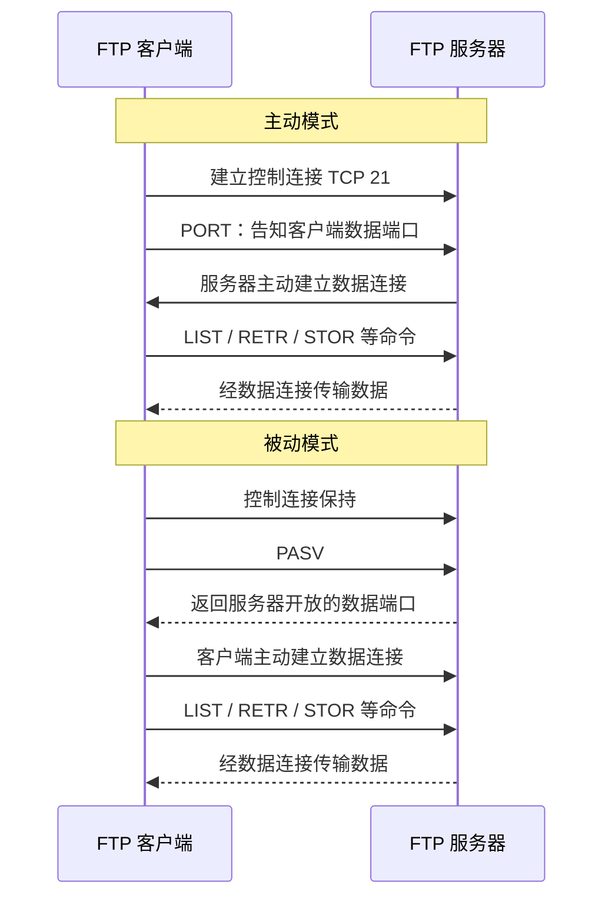

## 7. FTP：控制连接与数据连接

<InlineSvg src="/images/computer-network/computer-network-application-ftp-001.svg" alt={"FTP 图 1"} />

> **真题考察**
>
> - 2009 年第 40 题
> - 2017 年第 40 题
> - 2023 年第 47 题

FTP（File Transfer Protocol）基于 **TCP**，用于文件和目录信息传输。它最重要、也最常考的结构特征是：

> **控制信息与实际数据使用不同的 TCP 连接。**

可以记成：

```text
控制连接：管“命令与应答”
数据连接：管“文件/目录数据”
```

### 7.1 控制连接

<InlineSvg src="/images/computer-network/computer-network-application-ftp-002.svg" alt={"FTP 图 2"} />

控制连接由客户端主动建立到服务器 TCP **21 端口**，负责传送：

- 用户身份认证信息；
- 文件、目录操作命令；
- 状态码与服务器响应。

常见命令示例：

```text
USER
PASS
LIST
RETR
STOR
QUIT
```

控制连接通常贯穿整个 FTP 会话，因此属于**较长期存在的会话控制通道**。

### 7.2 数据连接

数据连接用于真正传输：

- 文件内容；
- 目录列表等数据。

它通常在一次数据传输前建立，传输结束后关闭。于是一次 FTP 会话可以抽象为：

```text
1 条长期控制连接
+
若干条按需建立的数据连接
```

<Callout type="warning" title="TCP 21 是控制端口，不是“所有 FTP 数据”的端口">

TCP 21 主要对应服务器端的 FTP **控制连接**。文件数据通过独立数据连接传输，这是 FTP 与许多“一条连接承载所有应用数据”的协议最显著区别。

</Callout>

---

## 8. FTP 典型工作过程与连接数量

一次典型 FTP 会话可按时间顺序分析：

1. 客户端主动连接服务器 TCP 21，建立控制连接；
2. 通过控制连接进行用户认证；
3. 客户端发送 `LIST`、`RETR`、`STOR` 等命令；
4. 若需要传目录列表或文件，建立独立数据连接；
5. 完成该次数据传输后关闭数据连接；
6. 后续再次传数据时，可能重新建立新的数据连接；
7. 用户退出后关闭控制连接。

部分 FTP 服务支持匿名登录，典型用户名：

```text
anonymous
```

### 8.1 连接数题的通用方法

不要直接背“FTP 有两条连接”，而应数**实际建立过的 TCP 连接**：

```text
总连接数
= 1 条控制连接
+ 实际发生的数据连接条数
```

例如一次会话中依次传送 2 个文件并获取 1 次目录列表，若三次数据操作分别建立数据连接，则：

```text
1 条控制连接 + 3 条数据连接 = 共建立 4 条 TCP 连接
```

<Callout type="info" title="“同时存在几条”与“总共建立几条”是两种问法">

控制连接可以一直保持，而数据连接按需创建、结束。题目问“某时刻同时存在几条连接”时，应看时间线；问“一次会话总共建立过几条连接”时，才累计各次数据连接。

</Callout>

---

## 9. FTP 主动模式与被动模式

主动/被动模式只描述**数据连接建立时服务器是否主动**。无论哪种模式，控制连接都由客户端主动连接服务器 21 端口。

### 9.1 主动模式（Active Mode）

典型过程：

1. 客户端先建立控制连接；
2. 客户端开放一个数据端口；
3. 客户端经控制连接把自己的数据端口告诉服务器；
4. **服务器主动连接客户端的数据端口**；
5. 数据连接建立后传输文件/目录数据。

传统主动模式下，服务器数据连接一侧通常使用 TCP **20 端口**。

```text
控制连接：客户端 → 服务器:21
数据连接：服务器:20 → 客户端:协商端口
```

> **记忆：主动模式 = 服务器主动发起数据连接。**

### 9.2 被动模式（Passive Mode）

典型过程：

1. 客户端保持控制连接；
2. 客户端发送 PASV 等请求；
3. 服务器开放一个数据端口并把端口号告诉客户端；
4. **客户端主动连接服务器的数据端口**；
5. 建立数据连接并传输数据。

```text
控制连接：客户端 → 服务器:21
数据连接：客户端 → 服务器:协商端口
```

> **记忆：被动模式 = 服务器被动等待客户端建立数据连接。**

### 9.3 两种模式对比

| 项目 | 主动模式 | 被动模式 |
| --- | --- | --- |
| 控制连接发起者 | 客户端 | 客户端 |
| 控制连接服务器端口 | 21 | 21 |
| 谁开放数据端口等待 | 客户端 | 服务器 |
| 谁主动建立数据连接 | 服务器 | 客户端 |
| 服务器传统数据端口 | 20 | 动态协商端口 |


```mermaid
sequenceDiagram
    participant Client as FTP 客户端
    participant Server as FTP 服务器

    Note over Client,Server: 主动模式
    Client->>Server: 建立控制连接 TCP 21
    Client->>Server: PORT：告知客户端数据端口
    Server->>Client: 服务器主动建立数据连接
    Client->>Server: LIST / RETR / STOR 等命令
    Server-->>Client: 经数据连接传输数据

    Note over Client,Server: 被动模式
    Client->>Server: 控制连接保持
    Client->>Server: PASV
    Server-->>Client: 返回服务器开放的数据端口
    Client->>Server: 客户端主动建立数据连接
    Client->>Server: LIST / RETR / STOR 等命令
    Server-->>Client: 经数据连接传输数据
```

<Callout type="warning" title="主动/被动只看数据连接">

“两种模式都是客户端主动连接服务器 21 端口”。因此不能看到“客户端主动连接服务器”就说是被动模式，必须看**数据连接由谁主动建立**。

</Callout>

---

## 10. FTP 文件传输方式与高频判断

FTP 传统上可以按内容类型采用不同传输方式。

### 10.1 ASCII 模式

主要用于文本文件。传输时可能依据两端系统差异进行文本格式转换，例如换行符处理。

### 10.2 二进制模式

适用于图片、音频、视频、可执行文件、压缩包等。数据按原始字节序列传输，不进行文本格式转换。

| 模式 | 适合内容 | 关键特点 |
| --- | --- | --- |
| ASCII | 文本 | 可能进行文本格式转换 |
| Binary | 任意二进制数据 | 保持原始字节内容 |

### 10.3 FTP 一页判断法

```text
看到 FTP：先想到 TCP
看到 21：先想到控制连接
看到文件/目录列表：想到独立数据连接
看到“主动/被动”：只看谁发起数据连接
看到“几条连接”：控制连接 + 实际数据连接逐次计数
```

> **做题结论**
>
> 传输可执行文件、压缩包、图片等应使用二进制方式；如果按文本方式转换，可能破坏原始字节序列。
