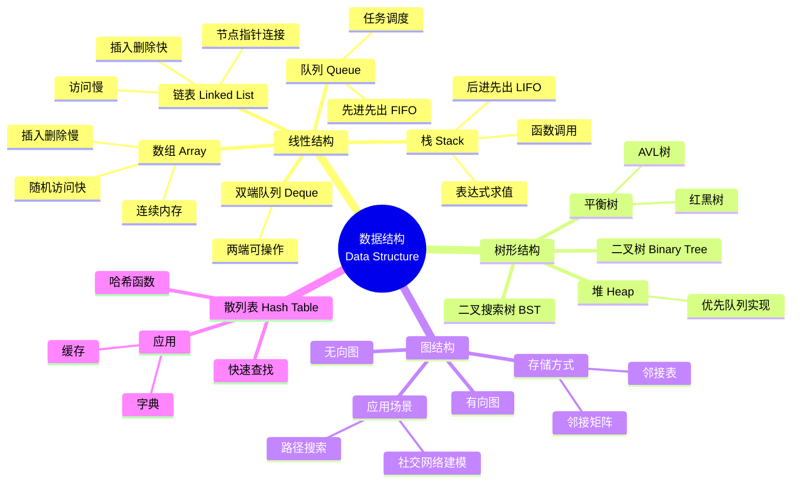

本章建立整门数据结构的分析框架。后续无论学习线性表、栈与队列、树、图、查找还是排序，都可以沿着同一条主线分析：

> **逻辑结构 → 存储结构 → 基本操作 → 算法实现 → 时间复杂度与空间复杂度**

其中，**复杂度分析**和**算法设计题的基本套路**是本章最需要掌握的内容。

| 模块       | 复习优先级 | 核心要求                     |
| -------- | ----- | ------------------------ |
| 数据结构基本概念 | 低     | 能区分逻辑结构、存储结构、数据类型与抽象数据类型 |
| 算法基本概念   | 中     | 掌握算法特性，能够独立分析时间复杂度和空间复杂度 |
| 算法设计题框架  | 高     | 会根据数组、链表、树、图等结构快速选择算法套路  |

---

## 一、数据结构基本概念

## 1. 什么是数据结构

数据结构（Data Structure）研究的是：

1. **数据元素之间存在什么关系**；
2. **这些关系如何在计算机中存储**；
3. **如何对这些数据执行查找、插入、删除、遍历等操作**。

因此，可以把数据结构理解为：

> **数据结构 = 数据元素 + 元素之间的关系 + 对数据的基本操作**

数据结构并不只是“数据放在哪里”，它还会直接影响算法的执行效率。

例如：

* 数组支持快速随机访问，但中间位置插入、删除通常需要移动大量元素；
* 链表不能随机访问，但已知结点位置时插入、删除比较方便；
* 堆能够快速取得当前最大值或最小值；
* 散列表在理想情况下能够实现接近常数时间的查找。

---

## 2. 数据结构中的基本术语

##### 数据

**数据（Data）**是能够被计算机识别、存储和处理的信息。

数据的形式不仅包括数字，还可以包括字符、图像、音频、视频等。

##### 数据元素

**数据元素（Data Element）**是数据的基本单位。

例如学生信息表中的一名学生，可以看作一个数据元素。

##### 数据项

一个数据元素通常由若干更小的数据项组成。

例如：

```text
学生
├─ 学号
├─ 姓名
├─ 年龄
└─ 成绩
```

这里“学生”是数据元素，“学号”“姓名”等是数据项。

##### 数据对象

**数据对象**是性质相同的数据元素的集合。

例如一个班级所有学生组成的集合。

---

## 3. 数据结构的三个层次

分析一种数据结构时，建议始终从以下三个角度考虑。

### 3.1 逻辑结构

逻辑结构描述的是：

> **数据元素之间在逻辑上的关系，与具体如何存储无关。**

常见逻辑结构包括：

* 线性结构；
* 树形结构；
* 图结构；
* 集合结构。

其中，408 的主要内容集中在线性结构、树和图。

### 3.2 存储结构

存储结构又称**物理结构**，描述数据在计算机内存中的实际组织方式。

常见存储方式包括：

| 存储方式 | 特点            | 典型结构   |
| ---- | ------------- | ------ |
| 顺序存储 | 数据在连续地址中存放    | 数组、顺序表 |
| 链式存储 | 通过指针建立元素之间的关系 | 链表     |
| 索引存储 | 建立额外索引表       | 索引查找   |
| 散列存储 | 根据关键字直接计算存储位置 | 散列表    |

> **易错点：**
>
> **逻辑结构和存储结构不是一一对应关系。**
>
> 同一种逻辑结构可以采用不同存储方式，例如线性表既可以用顺序表实现，也可以用链表实现。

### 3.3 数据运算

常见的数据运算包括：

* 创建；
* 销毁；
* 查找；
* 插入；
* 删除；
* 修改；
* 遍历；
* 排序。

学习后续每种数据结构时，都应重点关注：

> **这种结构最适合支持哪些操作？每个操作的时间复杂度是多少？**

---

## 二、常见数据结构分类



## 1. 线性结构

线性结构中的元素具有明显的前后顺序。

常见结构：

* **数组（Array）**

  * 通常采用连续存储；
  * 可以通过下标快速随机访问；
  * 中间位置插入、删除通常需要移动元素。

* **链表（Linked List）**

  * 结点之间通过指针连接；
  * 不要求物理地址连续；
  * 插入、删除较灵活；
  * 无法像数组一样通过下标直接随机访问。

* **栈（Stack）**

  * 后进先出，LIFO；
  * 常用于函数调用、递归、表达式求值等问题。

* **队列（Queue）**

  * 先进先出，FIFO；
  * 常用于 BFS、任务调度等问题。

* **双端队列（Deque）**

  * 两端均可插入、删除。

---

## 2. 树形结构

树形结构表示具有层次关系的数据。

408 中常见：

* 二叉树；
* 二叉搜索树 BST；
* 堆；
* AVL 树；
* 红黑树；
* 哈夫曼树；
* B 树、B+ 树等。

其中，树题往往与**递归、遍历、查找和排序性质**结合。

---

## 3. 图结构

图用于描述更加一般的网络关系。

按照边是否具有方向，可分为：

* 有向图；
* 无向图。

常见存储方式：

* 邻接矩阵；
* 邻接表。

常见应用：

* 连通性判断；
* 路径搜索；
* 最短路径；
* 最小生成树；
* 拓扑排序；
* AOE 网关键路径。

---

## 4. 散列表

散列表（Hash Table）通过**散列函数**将关键字映射到存储地址。

理想情况下可以快速完成：

* 插入；
* 删除；
* 查找。

常用于：

* 字典；
* 缓存；
* 集合；
* 去重；
* 出现性判断。

---

## 三、数据结构与算法的关系

## 1. 什么是算法

算法（Algorithm）是：

> **为解决某类问题而规定的一组有限、明确并且可以执行的步骤。**

数据结构解决的是：

> **数据如何组织。**

算法解决的是：

> **数据如何处理。**

二者相互依赖：

* 数据结构提供“容器”；
* 算法提供“操作方法”；
* 合适的数据结构可以显著提高算法效率；
* 算法设计也必须利用具体数据结构的性质。

例如：

| 数据结构 | 算法或应用        |
| ---- | ------------ |
| 数组   | 快速随机访问       |
| 链表   | 快速插入、删除      |
| 栈    | 表达式求值、函数调用   |
| 队列   | BFS、任务调度     |
| 堆    | 优先队列、Top-K   |
| 图    | BFS、DFS、最短路径 |
| BST  | 有序查找         |

例如：

> 用图表示网络，再使用 BFS，可以在无权图中寻找最短路径。

---

## 四、算法的基本特性

408 中应重点掌握以下五个性质。

## 1. 有穷性

算法必须在执行**有限步**之后结束。

一个永远执行下去的程序不是有效算法。

## 2. 确定性

算法中的每一步都必须具有明确含义。

在给定当前状态后，下一步操作应当确定。

## 3. 可行性

每一个基本操作都必须能够通过有限次已有操作完成。

## 4. 输入

算法可以有：

* 零个输入；
* 一个输入；
* 多个输入。

## 5. 输出

算法至少应产生一个与问题有关的输出结果。

> **记忆：**
>
> **有限、明确、可执行；可以有输入，必须有输出。**

不同教材对术语表述可能略有差异，但核心含义一致。

---

## 五、算法复杂度分析

> **复习优先级：高。**
>
> 复杂度几乎贯穿整个数据结构部分。看到任何算法，都应形成条件反射：
>
> **输入规模是什么？基本操作是什么？执行多少次？额外用了多少空间？**

#### 真题考察

复杂度相关选择题在历年 408 中反复出现，例如：

* 2011 年第 1 题；
* 2012 年第 1 题；
* 2013 年第 1 题；
* 2014 年第 1 题；
* 2016 年第 7 题；
* 2017 年第 1 题；
* 2019 年第 1 题；
* 2022 年第 1 题；
* 2025 年第 1 题；
* 2026 年第 6 题。

---

## 六、时间复杂度

设问题的输入规模为 $n$，算法中选定的基本操作执行次数为 $T(n)$。

复杂度分析关注的是：

> **当输入规模不断增大时，算法工作量增长得有多快。**

通常忽略：

* 常数系数；
* 低阶项。

例如：

$$
T(n)=3n^2+5n+7
$$

当 $n$ 足够大时，最高阶项 $n^2$ 决定增长趋势，因此：

$$
T(n)=O(n^2)
$$

## 1. 什么是基本操作

基本操作是为了分析算法复杂度而选定的、能够代表主要工作量的操作，例如：

* 比较一次；
* 赋值一次；
* 循环体执行一次；
* 访问一个数组元素一次。

> **易错点：**
>
> “基本操作”并不要求恰好对应一条 CPU 机器指令。

---

## 七、常用渐近记号

## 1. 大 O

$$
O(f(n))
$$

表示算法运行时间的**渐近上界**。

408 中一般直接用大 O 表示时间复杂度。

---

## 2. 大 Omega

$$
\Omega(f(n))
$$

表示渐近下界。

---

## 3. 大 Theta

$$
\Theta(f(n))
$$

表示算法与 $f(n)$ 同阶，即同时具有对应的渐近上界和渐近下界。

---

## 八、常见时间复杂度大小关系

常见复杂度从低到高：

$$
O(1)
<
O(\log n)
<
O(n)
<
O(n\log n)
<
O(n^2)
<
O(n^3)
<
O(2^n)
<
O(n!)
$$

| 复杂度          | 典型场景                |
| ------------ | ------------------- |
| `O(1)`       | 数组按下标访问             |
| `O(log n)`   | 折半查找、平衡搜索树单次查找      |
| `O(n)`       | 顺序扫描                |
| `O(n log n)` | 归并排序、平均情况下的快速排序     |
| `O(n²)`      | 简单选择排序、最坏情况下的直接插入排序 |
| `O(2ⁿ)`      | 未剪枝的子集枚举等           |
| `O(n!)`      | 全排列枚举               |

<InlineSvg src="/images/data-structure/data-structure-basic-algorithm-001.svg" alt={"常见复杂度增长速度比较"} />

#### 复杂度比较的关键

当 $n$ 足够大时：

* 常数项不重要；
* 常数倍不重要；
* 只保留增长最快的最高阶项。

例如：

$$
10000n+10=O(n)
$$

以及：

$$
n^2+100000n=O(n^2)
$$

---

## 九、常见循环复杂度分析

## 1. 单层循环

```c
for (int i = 0; i < n; ++i) {
    // O(1)
}
```

循环执行约 $n$ 次：

$$
T(n)=O(n)
$$

---

## 2. 两层独立嵌套循环

```c
for (int i = 0; i < n; ++i)
    for (int j = 0; j < n; ++j) {
        // O(1)
    }
```

执行次数约为：

$$
n\times n=n^2
$$

因此：

$$
T(n)=O(n^2)
$$

---

## 3. 三角形循环

```c
for (int i = 0; i < n; ++i)
    for (int j = 0; j <= i; ++j) {
        // O(1)
    }
```

执行次数：

$$
1+2+\cdots+n
=
\frac{n(n+1)}{2}
$$

因此：

$$
T(n)=O(n^2)
$$

---

## 4. 倍增型循环

```c
for (int i = 1; i < n; i *= 2) {
    // O(1)
}
```

设循环执行 $k$ 次：

$$
2^k\approx n
$$

所以：

$$
k\approx \log_2 n
$$

因此：

$$
T(n)=O(\log n)
$$

> **高频判断：**
>
> 如果循环变量每次**乘 2、除 2、乘常数或除常数**，通常应优先考虑对数复杂度。

---

## 十、空间复杂度

空间复杂度描述算法执行过程中所需空间随输入规模变化的增长量级。

应区分两个概念。

## 1. 总空间

包括：

* 输入数据本身；
* 程序运行所需空间。

## 2. 辅助空间

指除了输入数据以外，算法额外使用的空间。

408 中通常更加关注**辅助空间复杂度**。

常见额外空间来源：

* 临时变量；
* 辅助数组；
* 栈；
* 队列；
* 哈希表；
* 递归调用栈。

| 辅助空间复杂度    | 典型情况            |
| ---------- | --------------- |
| `O(1)`     | 只使用常数个临时变量      |
| `O(log n)` | 平衡递归树产生的调用栈     |
| `O(n)`     | 线性辅助数组、线性递归深度   |
| `O(n²)`    | 额外维护一个 n × n 矩阵 |

> **易错点：**
>
> 循环一般主要影响**时间复杂度**；
>
> 递归不仅影响时间复杂度，还必须考虑**最大递归深度对应的调用栈空间**。

---

## 十一、408 算法设计题总体框架

> **复习优先级：高。**
>
> 算法设计题综合考查数据结构操作、算法思想和复杂度分析。
>
> 考场上应优先保证**正确性**，再根据题目给定的时间、空间要求进行优化。

掌握常见模板后，即使暂时想不到最优算法，也可以先给出正确方案，再进一步优化。

---

## 十二、算法设计题答题格式

算法设计题通常包括三个部分：

1. **写出算法的基本设计思想**；
2. **使用 C/C++ 或伪代码描述算法，并在关键处给出注释**；
3. **分析时间复杂度和空间复杂度**。

常见分值结构可理解为：

* 设计思想：约 4 分；
* 算法代码：约 7～9 分；
* 复杂度分析：约 2 分。

具体分值以当年评分细则为准。

#### 推荐答题顺序

> ① 先写自然语言设计思想
> ② 再写核心代码
> ③ 最后单独分析复杂度

复杂度写法可采用：

```text
时间复杂度：O(n)
原因：数组只被完整扫描一次。

空间复杂度：O(1)
原因：只使用常数个辅助变量。
```

---

## 十三、历年算法题涉及的数据结构

| 年份   | 41 题                   | 42 题             |
| ---- | ---------------------- | ---------------- |
| 2009 | 图：最短路径判断               | 链表：倒数第 k 个结点，双指针 |
| 2010 | 散列表：构造                 | 顺序表：循环左移，三次逆置    |
| 2011 | 图：邻接矩阵 / 关键路径          | 顺序表：两升序序列中位数，二分  |
| 2012 | 哈夫曼树 / 归并排序            | 链表：共享后缀，找公共结点    |
| 2013 | 顺序表：主元素，Boyer-Moore 投票 | 查找：最优二叉查找树 / 散列表 |
| 2014 | 二叉树：WPL 计算，层序遍历        | 图：OSPF 最短路径，网络题  |
| 2015 | 链表：绝对值去重，哈希辅助          | 图：邻接矩阵，DFS / BFS |
| 2016 | 网络：TCP 拥塞控制            | 树：正则 k 叉树结点数推导   |
| 2017 | 二叉树：表达式树转中缀表达式         | 图：Prim 最小生成树     |
| 2018 | 顺序表：未出现的最小正整数，桶标记      | 图：最小生成树，城市光缆     |
| 2019 | 链表：重排 L'，快慢指针 + 逆置     | 队列：栈实现队列         |
| 2020 | 顺序表：三元组最小距离，三指针        | 前缀编码：哈夫曼 / 字典树   |
| 2021 | 图：EL 路径判断，度的统计         | 排序：分析某排序算法       |
| 2022 | 二叉排序树：顺序存储，层序恢复        | 顺序表：最小的 10 个数，堆  |
| 2023 | 图：邻接矩阵，DFS / BFS 应用    | 外部排序：置换-选择，归并段   |
| 2024 | 图：拓扑排序，邻接矩阵            | 散列表：构造与查找        |
| 2025 | 顺序表：子数组最大乘积，后缀最值       | 图：AOE 网，关键路径     |
| 2026 | 二叉搜索树：最近差值结点，中序        | AOE 网：关键活动       |

#### 规律

从历年题型可以发现：

* 41 题中，**图和顺序表/数组**出现频率较高；
* 链表、二叉树同样属于必须掌握的算法结构；
* 42 题中，图、排序、查找等综合内容较常出现；
* 相同思想可能在不同年份以完全不同的问题背景出现。

> **复习原则：**
>
> 不要根据某类题“上一年考过”就主动放弃。
>
> 真正需要掌握的是**算法模板和结构性质**，而不是记题目表面形式。

---

## 十四、算法设计题快速选型

<InlineSvg src="/images/data-structure/data-structure-basic-alg-design-001.svg" alt={"输入的数据结构是什么？ 数组 / 顺序表 链表 二叉树 图 有序数组 / 两端关系 双指针 / 二分查找 值域明确 / 出现性判断 桶标记 / 原地哈希 每个位置依赖左右信息 前缀 / 后缀预处理 排序兜底 O(n log n) 找中间 / 倒数 k 快慢双指针 需要逆序访问 原地逆置 两个链表共享后缀 长度对齐 / 换头 BST / 递增序列 中序遍历 找差值、合法性、第 k 小 按层处理 / 顺序存储 层序遍历 BFS 队列驱动 路径 / 统计 / 高度 递归 DFS"} />

```text
输入是数组 / 顺序表？
├─ 已经有序
│  ├─ 两端关系 → 双指针
│  └─ 查找位置 → 二分查找
│
├─ 元素值域明确
│  └─ 出现性判断 → 桶标记 / 原地哈希
│
├─ 每个位置依赖左边或右边的信息
│  └─ 前缀 / 后缀预处理
│
└─ 暂时没有线性方案
   └─ 排序兜底 O(n log n)

输入是链表？
├─ 中点 / 倒数第 k 个 → 快慢双指针
├─ 需要逆序访问 → 原地逆置
└─ 两链表共享后缀 → 长度对齐 / 双指针换头

输入是二叉树？
├─ BST / 需要递增序列
│  └─ 中序遍历
├─ 按层处理
│  └─ BFS / 层序遍历
└─ 路径 / 高度 / 统计
   └─ 递归 DFS

输入是图？
├─ 连通性 / 普通路径 → DFS / BFS
├─ 非负权单源最短路径 → Dijkstra
├─ 全源最短路径 → Floyd
├─ 最小生成树 → Prim / Kruskal
└─ 依赖关系 → 拓扑排序 / AOE 关键路径
```

---

## 十五、数组与顺序表常用套路

## 1. 排序兜底

面对无序数组，如果暂时没有更好的线性算法，可以考虑：

> **先排序，再使用双指针、二分查找或相邻比较。**

排序通常使时间复杂度达到：

$$
O(n\log n)
$$

例如：

```c
qsort(a, n, sizeof(int), cmp);

int left = 0;
int right = n - 1;

while (left < right) {
    if (condition)
        ++left;
    else
        --right;
}
```

排序后可以方便处理：

* 去重；
* 两数配对；
* 区间问题；
* 二分查找；
* 最小差值。

> **注意：**
>
> 排序通常会破坏原数组顺序。
>
> 如果题目明确要求保持原序，就不能直接使用排序。

---

## 2. 桶标记与原地哈希

当元素取值范围与数组长度相关时，可以考虑把**值映射为下标**。

例如：

$$
0\le a[i]<n
$$

或者：

$$
1\le a[i]\le n
$$

此时可以利用数组本身的下标、正负号等信息完成标记，从而避免额外申请长度为 $n$ 的辅助数组。

<InlineSvg src="/images/data-structure/data-structure-basic-alg-design-002.svg" alt={"图示"} />

#### 经典题：2018 年第 41 题——未出现的最小正整数

核心思想：

1. 只需关心区间 $[1,n]$；
2. 将无关元素改为 $n+1$；
3. 若数值 $v$ 出现，则把下标 $v-1$ 位置变为负数；
4. 最后第一个仍为正数的位置就是缺失值。

```c
int findMissMin(int a[], int n) {
    // 1. 排除不可能成为答案范围标记的信息
    for (int i = 0; i < n; ++i) {
        if (a[i] <= 0 || a[i] > n)
            a[i] = n + 1;
    }

    // 2. v 出现过，就把 v-1 位置标记为负数
    for (int i = 0; i < n; ++i) {
        int v = abs(a[i]);
        if (1 <= v && v <= n)
            a[v - 1] = -abs(a[v - 1]);
    }

    // 3. 找第一个没有被标记的位置
    for (int i = 0; i < n; ++i) {
        if (a[i] > 0)
            return i + 1;
    }

    return n + 1;
}
```

时间复杂度：

$$
O(n)
$$

辅助空间复杂度：

$$
O(1)
$$

#### 原地哈希的识别信号

题目若同时出现：

* 元素值域有限；
* 希望线性时间；
* 不允许使用额外数组或要求常数空间；

应优先考虑**值与下标之间是否可以建立映射**。

---

## 十六、前缀与后缀预处理

当题目要求“对每一个位置，都求其左边或右边某种统计值”时，直接重复扫描很容易变成：

$$
O(n^2)
$$

如果该统计量可以递推，则可以提前计算：

* 前缀最大值；
* 前缀最小值；
* 前缀和；
* 后缀最大值；
* 后缀最小值；
* 后缀积等。

从而将复杂度降为：

$$
O(n)
$$

#### 经典题：2025 年第 41 题——子数组乘积最大值

```c
void calMulMax(int A[], int res[], int n) {
    int maxVal = INT_MIN;
    int minVal = INT_MAX;

    // 从右向左维护后缀最大值和最小值
    for (int i = n - 1; i >= 0; --i) {
        if (A[i] > maxVal)
            maxVal = A[i];

        if (A[i] < minVal)
            minVal = A[i];

        // 正数与最大值组合，负数与最小值组合
        res[i] = (A[i] >= 0)
            ? A[i] * maxVal
            : A[i] * minVal;
    }
}
```

#### 核心思想

如果当前答案只依赖于：

> **当前位置 + 已经统计好的左侧/右侧信息**

就没有必要重复扫描整个区间。

---

## 十七、Boyer-Moore 投票算法

适用于：

> 在 `O(n)` 时间和 `O(1)` 额外空间内寻找出现次数超过一半的元素。

#### 经典题：2013 年第 41 题——主元素

基本思想是**不同元素两两抵消**。

如果某元素出现次数超过数组长度的一半，则全部抵消以后，它仍然会成为最终候选。

```c
int majority(int a[], int n) {
    int num = a[0];
    int cnt = 1;

    // 第一遍：通过对消确定候选元素
    for (int i = 1; i < n; ++i) {
        if (a[i] == num) {
            ++cnt;
        } else if (--cnt == 0) {
            num = a[i];
            cnt = 1;
        }
    }

    // 第二遍：必须验证候选元素是否真的超过半数
    int count = 0;
    for (int i = 0; i < n; ++i) {
        if (a[i] == num)
            ++count;
    }

    return (count > n / 2) ? num : -1;
}
```

> **易错点：**
>
> 第一遍只能得到“候选者”，并不能证明它一定是主元素。
>
> 如果题目没有保证主元素必然存在，还必须进行第二遍验证。

---

## 十八、多指针夹逼

多个**有序序列**之间寻找最优组合时，应重点考虑多个指针同步移动。

<InlineSvg src="/images/data-structure/data-structure-basic-alg-design-003.svg" alt={"三指针夹逼 — 三元组最小距离 S1: -1 0 9 S2: -25 -10 10 11 S3: 2 9 17 30 41 步骤 i(S1) j(S2) k(S3) min值 D 移动 1 -1 -25 2 -25 52 j++ 2 -1 -10 2 -10 24 i++ 3 0 -10 2 -10 22 j++ 4 0 10 2 0 16 i++ … 9 10 9 9 2 ✓ 最小 规则：每步移动三者中的 最小值 对应的指针（移大值只会让D增大）"} />

#### 经典题：2020 年第 41 题——三元组最小距离

三个数组均为升序数组。

```c
int i = 0;
int j = 0;
int k = 0;

while (i < n1 && j < n2 && k < n3) {
    int D = calc_D(S1[i], S2[j], S3[k]);
    ans = min(ans, D);

    int minVal = min(S1[i], min(S2[j], S3[k]));

    if (S1[i] == minVal)
        ++i;
    else if (S2[j] == minVal)
        ++j;
    else
        ++k;
}
```

#### 为什么移动最小值

当前三个数为：

$$
a\le b\le c
$$

如果继续增大 $c$，当前最大值与最小值的距离不会变小。

要缩小差距，最有意义的操作是：

> **把当前最小的数向右移动，使它变大。**

这类“移动哪一个指针”的理由必须真正理解，而不是机械记忆。

---

## 十九、链表题通用套路

<InlineSvg src="/images/data-structure/data-structure-basic-alg-design-004.svg" alt={"快慢双指针 — 找倒数第 k 个结点 head 1 2 3 4 5 6 ∅ q p ① p 先走 k=3 步 此时 q 在结点 1 ② p、q 同步移动 直到 p == NULL q 即为倒数第 k 个；原地逆置 — 三指针迭代"} />

链表题最大的特点是：

> **不能像数组一样通过下标随机访问。**

因此很多数组中简单的问题，在链表中必须改用指针技巧。

---

## 1. 快慢双指针

常见用途：

* 找链表中间结点；
* 找倒数第 $k$ 个结点；
* 判断链表是否有环；
* 找环入口。

#### 找中间结点

```c
NODE *slow = head->next;
NODE *fast = head->next;

while (fast != NULL && fast->next != NULL) {
    slow = slow->next;
    fast = fast->next->next;
}
```

快指针每次移动两步，慢指针每次移动一步。

当快指针走到末尾时，慢指针大约位于中间。

---

## 2. 找倒数第 k 个结点

核心思想：

> 先让快指针领先 $k$ 个结点，再让两个指针同步移动。

```c
NODE *p = head->next;
NODE *q = head->next;

for (int i = 0; i < k; ++i) {
    if (p == NULL)
        return 0;

    p = p->next;
}

while (p != NULL) {
    p = p->next;
    q = q->next;
}

// q 指向倒数第 k 个结点
```

时间复杂度：

$$
O(n)
$$

辅助空间：

$$
O(1)
$$

---

## 二十、链表原地逆置

如果需要从链表尾部开始处理元素，由于单链表无法向前访问，可以考虑：

> **先把部分链表逆置，再进行双指针处理。**

```c
NODE *reverse(NODE *start) {
    NODE *prev = NULL;
    NODE *cur = start;

    while (cur != NULL) {
        NODE *next = cur->next;

        cur->next = prev;
        prev = cur;
        cur = next;
    }

    return prev;
}
```

其中三个关键指针：

* `prev`：已经逆置完成的部分；
* `cur`：当前处理结点；
* `next`：提前保存原链表中的下一个结点。

> **易错点：**
>
> 必须先保存 `next`，再修改 `cur->next`。
>
> 否则会丢失尚未处理的后续链表。

#### 高频组合

2019 年第 41 题体现了典型套路：

> **快慢指针找中点 → 逆置后半部分 → 双指针重新组合**

---

## 二十一、Y 形链表公共结点

若两个单链表存在公共结点，则从第一个公共结点开始，它们后面的结点完全相同。

可以让两个指针分别遍历：

```text
A → B
B → A
```

这样两个指针走过的总路径长度相同。

```c
NODE *p = headA;
NODE *q = headB;

while (p != q) {
    p = (p != NULL) ? p->next : headB;
    q = (q != NULL) ? q->next : headA;
}

return p;
```

返回值：

* `NULL`：没有公共结点；
* 非 `NULL`：第一个公共结点。

空间复杂度为：

$$
O(1)
$$

---

## 二十二、二叉树题通用套路

<InlineSvg src="/images/data-structure/data-structure-basic-alg-design-005.svg" alt={"图示"} />

二叉树题首先要判断：

> **问题更适合 DFS 递归，还是 BFS 层序遍历？**

---

## 1. 写递归前先明确三个问题

#### 函数语义

先明确：

> 当前递归函数到底要返回什么，或者完成什么操作？

例如：

```text
height(root)
```

表示：

> 返回以 `root` 为根的二叉树高度。

#### 递归终止条件

通常：

```c
if (root == NULL)
    return ...;
```

#### 递归关系

思考：

> 已经知道左子树和右子树答案后，如何得到当前树的答案？

这是树形递归最重要的分析方式。

---

## 二十三、利用 BST 的中序有序性

二叉搜索树 BST 具有：

> **中序遍历结果按关键字递增排列。**

因此只要题目中出现：

* 第 $k$ 小；
* 第 $k$ 大；
* 前驱；
* 后继；
* 最近关键字；
* 判断 BST 是否合法；

就应优先考虑中序遍历。

```c
void inorder(BTNode *root) {
    if (root == NULL)
        return;

    inorder(root->left);

    visit(root);

    inorder(root->right);
}
```

典型应用：

* 找第 $k$ 小元素；
* 找与目标值差最小的结点；
* 判断是否满足 BST 性质；
* 2026 年第 41 题的最近差值结点。

---

## 二十四、层序遍历

如果题目出现：

* 按层处理；
* 层数；
* 层宽；
* 最后一层；
* 顺序存储二叉树；
* 从上到下恢复树结构；

应优先想到 BFS。

```c
Queue Q;

enqueue(Q, root);

while (!isEmpty(Q)) {
    BTNode *node = dequeue(Q);

    visit(node);

    if (node->left != NULL)
        enqueue(Q, node->left);

    if (node->right != NULL)
        enqueue(Q, node->right);
}
```

2022 年第 41 题中，顺序存储二叉搜索树的恢复就与层序思想有关。

---

## 二十五、图题通用框架

<InlineSvg src="/images/data-structure/data-structure-basic-alg-design-006.svg" alt={"图示"} />

图题首先识别问题类型：

| 问题        | 优先考虑           |
| --------- | -------------- |
| 遍历、连通性    | DFS / BFS      |
| 无权图最短路    | BFS            |
| 非负权单源最短路  | Dijkstra       |
| 全源最短路     | Floyd          |
| 最小生成树     | Prim / Kruskal |
| 有向无环图依赖顺序 | 拓扑排序           |
| AOE 网工程时间 | 关键路径           |

---

## 二十六、DFS

以邻接矩阵为例：

```c
int visited[MAXV] = {0};

void DFS(MGraph G, int v) {
    visited[v] = 1;
    visit(v);

    for (int w = 0; w < G.numVertices; ++w) {
        if (G.Edge[v][w] && !visited[w])
            DFS(G, w);
    }
}
```

DFS 常使用：

* 递归；
* 显式栈。

适合处理：

* 连通性；
* 路径搜索；
* 遍历；
* 递归性质问题。

---

## 二十七、BFS

```c
void BFS(MGraph G, int v) {
    int visited[MAXV] = {0};

    Queue Q;

    enqueue(Q, v);
    visited[v] = 1;

    while (!isEmpty(Q)) {
        int u = dequeue(Q);
        visit(u);

        for (int w = 0; w < G.numVertices; ++w) {
            if (G.Edge[u][w] && !visited[w]) {
                visited[w] = 1;
                enqueue(Q, w);
            }
        }
    }
}
```

BFS 使用**队列**。

对于无权图：

> BFS 第一次访问某个顶点时，对应路径通常就是从起点到该顶点的最短边数路径。

---

## 二十八、拓扑排序

#### 真题考察

选择题：

* 2010 年第 8 题；
* 2012 年第 6 题；
* 2014 年第 7 题；
* 2016 年第 7 题；
* 2018 年第 7 题；
* 2021 年第 7 题。

解答题：

* 2024 年第 41 题。

拓扑排序适用于：

> **有向无环图 DAG 中的依赖关系排序。**

典型问题：

* 工程先后顺序；
* 课程依赖；
* 判断有向图中是否存在环。

基本思路：

1. 统计所有顶点入度；
2. 将所有入度为 0 的顶点加入队列；
3. 每取出一个顶点，就删除它发出的边；
4. 相邻顶点入度减 1；
5. 新出现的入度为 0 的顶点继续加入队列。

```text
计算每个顶点的 indegree

把所有 indegree == 0 的顶点加入队列

count = 0

while 队列非空:
    u = 出队
    count++

    for u 的每个邻接点 w:
        indegree[w]--

        if indegree[w] == 0:
            w 入队

如果 count == n:
    图中无环，可以得到拓扑序
否则:
    图中存在有向环
```

判断条件：

```c
return count == n;
```

---

## 二十九、图中度的统计

对于无向图的邻接矩阵：

> 第 $v$ 行非零元素个数就是顶点 $v$ 的度。

```c
int degree(MGraph G, int v) {
    int d = 0;

    for (int w = 0; w < G.numVertices; ++w)
        d += (G.Edge[v][w] != 0);

    return d;
}
```

这一思想可用于：

* 欧拉路径；
* 欧拉回路；
* 顶点度统计；
* 图结构性质判断。

2021 年第 41 题即涉及相关思想。

---

## 三十、常见暴力法与优化方向

算法设计题中，通常可以先得到一个暴力方法，再寻找：

> **重复计算发生在哪里？能否利用数据结构或预处理消除重复？**

| 场景           | 直接方法                | 优化方向                         |
| ------------ | ------------------- | ---------------------------- |
| n 个数中找第 k 小  | 全排序 `O(n log n)`    | 大根堆维护 Top-K，`O(n log k)`     |
| 两个升序数组找中位数   | 合并数组，需要 `O(n)` 额外空间 | 二分夹逼，`O(log n)` 时间、`O(1)` 空间 |
| 链表倒数第 k 个结点  | 两次遍历                | 快慢双指针，一次遍历                   |
| 主元素          | 哈希表计数，`O(n)` 空间     | Boyer-Moore，`O(1)` 空间        |
| 数组每个位置依赖左右信息 | 重复扫描，`O(n²)`        | 前缀 / 后缀预处理，`O(n)`            |
| 三个有序数组最优组合   | 三重循环，`O(n³)`        | 三指针夹逼，`O(n)`                 |
| 两链表公共结点      | 哈希集合，`O(n)` 空间      | 双指针换头，`O(1)` 空间              |

---

## 三十一、算法优化的常见思考方向

如果算法太慢，可以依次检查以下问题。

## 1. 是否重复扫描了同一段数据

可以考虑：

* 前缀和；
* 后缀统计；
* 动态维护状态。

## 2. 是否重复查找

可以考虑：

* 散列表；
* 二分查找；
* BST；
* 堆。

## 3. 是否存在有序性

只要数据已经有序，就应重点考虑：

* 双指针；
* 二分查找；
* 滑动指针。

## 4. 是否需要保存全部数据

有时只需维护：

* 最大值；
* 最小值；
* 当前候选；
* Top-K；
* 若干状态。

就不必申请完整辅助数组。

## 5. 能否利用原数组本身存储标记

值域允许时，可考虑：

* 改符号；
* 下标映射；
* 交换到对应位置。

这类方法常把空间复杂度从：

$$
O(n)
$$

降为：

$$
O(1)
$$

---

## 三十二、设计思想怎么写

不要只写：

> “遍历数组即可。”

应该明确写出：

1. 扫描方向；
2. 维护什么变量；
3. 每一步根据什么规则更新；
4. 如何得到最终答案。

例如：

> 算法从数组右端向左扫描，同时维护当前位置右侧元素的最大值和最小值。对于当前元素，根据其正负性选择与后缀最大值或最小值相乘，并将结果保存。由于每个元素只访问一次，因此时间复杂度为 `O(n)`。

这种写法比直接描述代码更容易获得设计思想部分的分数。

---

## 三十三、标准答题模板

## 1. 设计思想

可以写成：

> 算法分为两步：
>
> ① 首先对数据进行一次预处理，得到……；
> ② 然后使用双指针 / 哈希标记 / BFS / DFS / 中序遍历等方法完成……。
>
> 每个元素最多被访问常数次。

---

## 2. 代码

代码不要求追求工程项目级写法，但必须保证：

* 核心流程正确；
* 边界条件完整；
* 变量含义清晰；
* 关键步骤有注释。

---

## 3. 复杂度

不要只写结果。

推荐格式：

```text
时间复杂度：O(n)。
数组被完整扫描两次，每次均为 O(n)，因此总体仍为 O(n)。

空间复杂度：O(1)。
除若干指针和计数变量外，没有使用随输入规模增长的辅助空间。
```

---

## 三十四、代码注释规范

关键变量建议说明用途：

```c
int cnt = 1;
// cnt 表示当前候选主元素尚未被抵消的票数
```

重要循环可以写明循环不变量：

```c
// 扫描到位置 i 时，a[0..i-1] 中对应出现信息已经完成标记
```

非显然下标映射必须解释：

```c
a[v - 1] = -abs(a[v - 1]);
// 用下标 v-1 位置的正负号表示整数 v 是否出现
```

---

## 三十五、算法设计题常见失分点

## 1. 只写代码，不写设计思想

题目明确要求设计思想时，应单独作答。

## 2. 复杂度只写结果，没有说明

如果算法结构较复杂，最好简要说明复杂度来源。

## 3. 忘记处理边界条件

例如：

* 空链表；
* $k$ 大于链表长度；
* 空树；
* 数组长度为 1；
* 图不连通；
* 主元素不存在。

## 4. 使用了题目不允许的辅助空间

例如题目要求：

```text
空间复杂度 O(1)
```

就不能申请长度为 $n$ 的数组。

## 5. 算法虽然正确，但没有满足复杂度要求

如果题目明确要求：

```text
时间复杂度 O(n)
```

则：

```text
先排序，再扫描
```

虽然结果可能正确，但复杂度为：

$$
O(n\log n)
$$

不满足要求。

## 6. 修改原数据却没有说明

原地哈希、原地逆置等方法会修改输入数据。

如果题意要求原数据保持不变，就必须换方法。

---

## 三十六、考场上的思考顺序

拿到一道算法设计题，可以按以下顺序分析。

#### 第一步：识别数据结构

是：

* 数组；
* 顺序表；
* 链表；
* 树；
* 图；
* 哈希表；
* 多个有序序列？

#### 第二步：看题目限制

重点圈出：

* 时间复杂度要求；
* 空间复杂度要求；
* 是否允许修改原数据；
* 是否已经有序；
* 元素值域；
* 是否存在特殊性质。

#### 第三步：先想最直接的正确算法

先保证：

> **算法能正确解决问题。**

#### 第四步：定位性能瓶颈

例如：

* 重复扫描；
* 重复查找；
* 多余存储；
* 没有利用有序性。

#### 第五步：匹配模板

例如：

```text
有序数组       → 双指针 / 二分
值域有限       → 桶 / 原地哈希
链表倒数位置   → 快慢指针
链表逆向处理   → 原地逆置
BST            → 中序遍历
树的层次问题   → BFS
图连通性       → DFS / BFS
依赖关系       → 拓扑排序
```

#### 第六步：最后分析复杂度

分别考虑：

* 时间；
* 辅助空间；
* 递归深度。

---

## 三十七、本章核心记忆

#### 数据结构分析主线

```text
逻辑结构
  ↓
存储结构
  ↓
基本操作
  ↓
算法
  ↓
时间复杂度
  ↓
空间复杂度
```

#### 算法五个特性

```text
有穷性
确定性
可行性
输入
输出
```

#### 常见复杂度

$$
O(1)
<
O(\log n)
<
O(n)
<
O(n\log n)
<
O(n^2)
<
O(n^3)
<
O(2^n)
<
O(n!)
$$

#### 数组高频模板

```text
有序        → 双指针 / 二分
值域明确    → 桶 / 原地哈希
左右依赖    → 前缀 / 后缀
超半数元素  → Boyer-Moore
多有序序列  → 多指针
没有思路    → 排序兜底
```

#### 链表高频模板

```text
中点 / 倒数第 k 个 → 快慢指针
逆向访问           → 原地逆置
公共后缀           → 双指针换头
```

#### 树高频模板

```text
BST 有序性质 → 中序遍历
按层处理     → BFS
路径 / 高度  → DFS / 递归
```

#### 图高频模板

```text
遍历 / 连通性   → DFS / BFS
无权最短路      → BFS
非负权最短路    → Dijkstra
全源最短路      → Floyd
最小生成树      → Prim / Kruskal
依赖关系        → 拓扑排序
AOE 网          → 关键路径
```

---

> **本章最终目标**
>
> 学完本章后，看到一个算法时应能够主动回答四个问题：
>
> 1. **输入规模是什么？**
> 2. **算法最主要的基本操作是什么？**
> 3. **时间复杂度是多少？**
> 4. **额外空间复杂度是多少？**
>
> 面对算法设计题，则进一步问：
>
> **题目给出的数据结构具有哪些可以利用的性质？**
>
> 真正掌握这套分析框架后，后续线性表、栈与队列、树、图、查找和排序等章节就会形成统一的知识体系。
