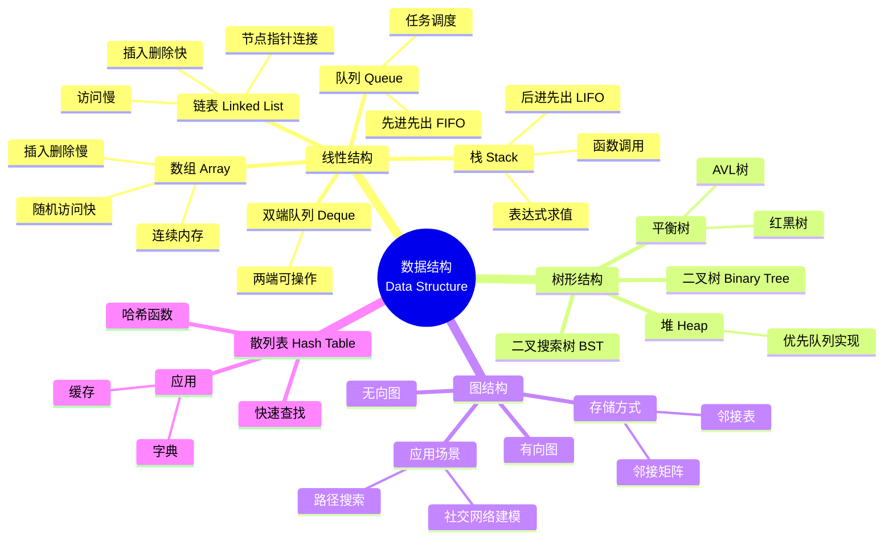

本章建立整门数据结构的分析框架。后续无论学习线性表、栈与队列、树、图、查找还是排序，都可以沿着同一条主线分析：

> **逻辑结构 → 存储结构 → 基本操作 → 算法实现 → 时间复杂度与空间复杂度**

其中，**复杂度分析**和**算法设计题的基本套路**是本章最需要掌握的内容。

| 模块       | 复习优先级 | 核心要求                     |
| -------- | ----- | ------------------------ |
| 数据结构基本概念 | 低     | 能区分逻辑结构、存储结构、数据类型与抽象数据类型 |
| 算法基本概念   | 中     | 掌握算法特性，能够独立分析时间复杂度和空间复杂度 |
| 算法设计题框架  | 高     | 会根据数组、链表、树、图等结构快速选择算法套路  |

---

## 一、数据结构基本概念

### 1. 什么是数据结构

数据结构（Data Structure）研究的是：

1. **数据元素之间存在什么关系**；
2. **这些关系如何在计算机中存储**；
3. **如何对这些数据执行查找、插入、删除、遍历等操作**。

因此，可以把数据结构理解为：

> **数据结构 = 数据元素 + 元素之间的关系 + 对数据的基本操作**

数据结构并不只是“数据放在哪里”，它还会直接影响算法的执行效率。

例如：

* 数组支持快速随机访问，但中间位置插入、删除通常需要移动大量元素；
* 链表不能随机访问，但已知结点位置时插入、删除比较方便；
* 堆能够快速取得当前最大值或最小值；
* 散列表在理想情况下能够实现接近常数时间的查找。

---

### 2. 数据结构中的基本术语

#### 数据

**数据（Data）**是能够被计算机识别、存储和处理的信息。

数据的形式不仅包括数字，还可以包括字符、图像、音频、视频等。

#### 数据元素

**数据元素（Data Element）**是数据的基本单位。

例如学生信息表中的一名学生，可以看作一个数据元素。

#### 数据项

一个数据元素通常由若干更小的数据项组成。

例如：

```text
学生
├─ 学号
├─ 姓名
├─ 年龄
└─ 成绩
```

这里“学生”是数据元素，“学号”“姓名”等是数据项。

#### 数据对象

**数据对象**是性质相同的数据元素的集合。

例如一个班级所有学生组成的集合。

---

### 3. 数据结构的三个层次

分析一种数据结构时，建议始终从以下三个角度考虑。

#### 3.1 逻辑结构

逻辑结构描述的是：

> **数据元素之间在逻辑上的关系，与具体如何存储无关。**

常见逻辑结构包括：

* 线性结构；
* 树形结构；
* 图结构；
* 集合结构。

其中，408 的主要内容集中在线性结构、树和图。

#### 3.2 存储结构

存储结构又称**物理结构**，描述数据在计算机内存中的实际组织方式。

常见存储方式包括：

| 存储方式 | 特点            | 典型结构   |
| ---- | ------------- | ------ |
| 顺序存储 | 数据在连续地址中存放    | 数组、顺序表 |
| 链式存储 | 通过指针建立元素之间的关系 | 链表     |
| 索引存储 | 建立额外索引表       | 索引查找   |
| 散列存储 | 根据关键字直接计算存储位置 | 散列表    |

> **易错点：**
>
> **逻辑结构和存储结构不是一一对应关系。**
>
> 同一种逻辑结构可以采用不同存储方式，例如线性表既可以用顺序表实现，也可以用链表实现。

#### 3.3 数据运算

常见的数据运算包括：

* 创建；
* 销毁；
* 查找；
* 插入；
* 删除；
* 修改；
* 遍历；
* 排序。

学习后续每种数据结构时，都应重点关注：

> **这种结构最适合支持哪些操作？每个操作的时间复杂度是多少？**

---

## 二、常见数据结构分类



### 1. 线性结构

线性结构中的元素具有明显的前后顺序。

常见结构：

* **数组（Array）**

  * 通常采用连续存储；
  * 可以通过下标快速随机访问；
  * 中间位置插入、删除通常需要移动元素。

* **链表（Linked List）**

  * 结点之间通过指针连接；
  * 不要求物理地址连续；
  * 插入、删除较灵活；
  * 无法像数组一样通过下标直接随机访问。

* **栈（Stack）**

  * 后进先出，LIFO；
  * 常用于函数调用、递归、表达式求值等问题。

* **队列（Queue）**

  * 先进先出，FIFO；
  * 常用于 BFS、任务调度等问题。

* **双端队列（Deque）**

  * 两端均可插入、删除。

---

### 2. 树形结构

树形结构表示具有层次关系的数据。

408 中常见：

* 二叉树；
* 二叉搜索树 BST；
* 堆；
* AVL 树；
* 红黑树；
* 哈夫曼树；
* B 树、B+ 树等。

其中，树题往往与**递归、遍历、查找和排序性质**结合。

---

### 3. 图结构

图用于描述更加一般的网络关系。

按照边是否具有方向，可分为：

* 有向图；
* 无向图。

常见存储方式：

* 邻接矩阵；
* 邻接表。

常见应用：

* 连通性判断；
* 路径搜索；
* 最短路径；
* 最小生成树；
* 拓扑排序；
* AOE 网关键路径。

---

### 4. 散列表

散列表（Hash Table）通过**散列函数**将关键字映射到存储地址。

理想情况下可以快速完成：

* 插入；
* 删除；
* 查找。

常用于：

* 字典；
* 缓存；
* 集合；
* 去重；
* 出现性判断。

---

## 三、数据结构与算法的关系

### 1. 什么是算法

算法（Algorithm）是：

> **为解决某类问题而规定的一组有限、明确并且可以执行的步骤。**

数据结构解决的是：

> **数据如何组织。**

算法解决的是：

> **数据如何处理。**

二者相互依赖：

* 数据结构提供“容器”；
* 算法提供“操作方法”；
* 合适的数据结构可以显著提高算法效率；
* 算法设计也必须利用具体数据结构的性质。

例如：

| 数据结构 | 算法或应用        |
| ---- | ------------ |
| 数组   | 快速随机访问       |
| 链表   | 快速插入、删除      |
| 栈    | 表达式求值、函数调用   |
| 队列   | BFS、任务调度     |
| 堆    | 优先队列、Top-K   |
| 图    | BFS、DFS、最短路径 |
| BST  | 有序查找         |

例如：

> 用图表示网络，再使用 BFS，可以在无权图中寻找最短路径。

---

## 四、算法的基本特性

408 中应重点掌握以下五个性质。

### 1. 有穷性

算法必须在执行**有限步**之后结束。

一个永远执行下去的程序不是有效算法。

### 2. 确定性

算法中的每一步都必须具有明确含义。

在给定当前状态后，下一步操作应当确定。

### 3. 可行性

每一个基本操作都必须能够通过有限次已有操作完成。

### 4. 输入

算法可以有：

* 零个输入；
* 一个输入；
* 多个输入。

### 5. 输出

算法至少应产生一个与问题有关的输出结果。

> **记忆：**
>
> **有限、明确、可执行；可以有输入，必须有输出。**

不同教材对术语表述可能略有差异，但核心含义一致。

---

## 五、算法复杂度分析

> **复习优先级：高。**
>
> 复杂度几乎贯穿整个数据结构部分。看到任何算法，都应形成条件反射：
>
> **输入规模是什么？基本操作是什么？执行多少次？额外用了多少空间？**

### 真题考察

复杂度相关选择题在历年 408 中反复出现，例如：

* 2011 年第 1 题；
* 2012 年第 1 题；
* 2013 年第 1 题；
* 2014 年第 1 题；
* 2016 年第 7 题；
* 2017 年第 1 题；
* 2019 年第 1 题；
* 2022 年第 1 题；
* 2025 年第 1 题；
* 2026 年第 6 题。

---

## 六、时间复杂度

设问题的输入规模为 $n$，算法中选定的基本操作执行次数为 $T(n)$。

复杂度分析关注的是：

> **当输入规模不断增大时，算法工作量增长得有多快。**

通常忽略：

* 常数系数；
* 低阶项。

例如：

$$
T(n)=3n^2+5n+7
$$

当 $n$ 足够大时，最高阶项 $n^2$ 决定增长趋势，因此：

$$
T(n)=O(n^2)
$$

### 1. 什么是基本操作

基本操作是为了分析算法复杂度而选定的、能够代表主要工作量的操作，例如：

* 比较一次；
* 赋值一次；
* 循环体执行一次；
* 访问一个数组元素一次。

> **易错点：**
>
> “基本操作”并不要求恰好对应一条 CPU 机器指令。

---

## 七、常用渐近记号

### 1. 大 O

$$
O(f(n))
$$

表示算法运行时间的**渐近上界**。

408 中一般直接用大 O 表示时间复杂度。

---

### 2. 大 Omega

$$
\Omega(f(n))
$$

表示渐近下界。

---

### 3. 大 Theta

$$
\Theta(f(n))
$$

表示算法与 $f(n)$ 同阶，即同时具有对应的渐近上界和渐近下界。

---

## 八、常见时间复杂度大小关系

常见复杂度从低到高：

$$
O(1)
<
O(\log n)
<
O(n)
<
O(n\log n)
<
O(n^2)
<
O(n^3)
<
O(2^n)
<
O(n!)
$$

| 复杂度          | 典型场景                |
| ------------ | ------------------- |
| `O(1)`       | 数组按下标访问             |
| `O(log n)`   | 折半查找、平衡搜索树单次查找      |
| `O(n)`       | 顺序扫描                |
| `O(n log n)` | 归并排序、平均情况下的快速排序     |
| `O(n²)`      | 简单选择排序、最坏情况下的直接插入排序 |
| `O(2ⁿ)`      | 未剪枝的子集枚举等           |
| `O(n!)`      | 全排列枚举               |

<InlineSvg src="/images/data-structure/data-structure-basic-algorithm-001.svg" alt="常见复杂度增长速度比较" />

### 复杂度比较的关键

当 $n$ 足够大时：

* 常数项不重要；
* 常数倍不重要；
* 只保留增长最快的最高阶项。

例如：

$$
10000n+10=O(n)
$$

以及：

$$
n^2+100000n=O(n^2)
$$

---

## 九、常见循环复杂度分析

### 1. 单层循环

```c
for (int i = 0; i < n; ++i) {
    // O(1)
}
```

循环执行约 $n$ 次：

$$
T(n)=O(n)
$$

---

### 2. 两层独立嵌套循环

```c
for (int i = 0; i < n; ++i)
    for (int j = 0; j < n; ++j) {
        // O(1)
    }
```

执行次数约为：

$$
n\times n=n^2
$$

因此：

$$
T(n)=O(n^2)
$$

---

### 3. 三角形循环

```c
for (int i = 0; i < n; ++i)
    for (int j = 0; j <= i; ++j) {
        // O(1)
    }
```

执行次数：

$$
1+2+\cdots+n
=
\frac{n(n+1)}{2}
$$

因此：

$$
T(n)=O(n^2)
$$

---

### 4. 倍增型循环

```c
for (int i = 1; i < n; i *= 2) {
    // O(1)
}
```

设循环执行 $k$ 次：

$$
2^k\approx n
$$

所以：

$$
k\approx \log_2 n
$$

因此：

$$
T(n)=O(\log n)
$$

> **高频判断：**
>
> 如果循环变量每次**乘 2、除 2、乘常数或除常数**，通常应优先考虑对数复杂度。

---

## 十、空间复杂度

空间复杂度描述算法执行过程中所需空间随输入规模变化的增长量级。

应区分两个概念。

### 1. 总空间

包括：

* 输入数据本身；
* 程序运行所需空间。

### 2. 辅助空间

指除了输入数据以外，算法额外使用的空间。

408 中通常更加关注**辅助空间复杂度**。

常见额外空间来源：

* 临时变量；
* 辅助数组；
* 栈；
* 队列；
* 哈希表；
* 递归调用栈。

| 辅助空间复杂度    | 典型情况            |
| ---------- | --------------- |
| `O(1)`     | 只使用常数个临时变量      |
| `O(log n)` | 平衡递归树产生的调用栈     |
| `O(n)`     | 线性辅助数组、线性递归深度   |
| `O(n²)`    | 额外维护一个 n × n 矩阵 |

> **易错点：**
>
> 循环一般主要影响**时间复杂度**；
>
> 递归不仅影响时间复杂度，还必须考虑**最大递归深度对应的调用栈空间**。

---
