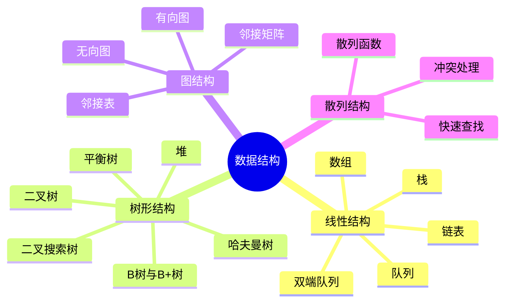

本章是整门数据结构的“分析语言”。后续学习线性表、栈与队列、树、图、查找和排序时，都可以沿着同一条主线展开：

> **逻辑结构 → 存储结构 → 基本操作 → 算法实现 → 时间复杂度 → 空间复杂度**

<Callout type="info" title="复习重点">
本页重点掌握三件事：**逻辑结构与存储结构的区别、算法的基本特性、复杂度的计算方法**。其中复杂度分析是 408 数据结构全程高频考点。
</Callout>

## 1. 数据结构的基本概念

### 1.1 数据、数据元素、数据项与数据对象

| 概念 | 含义 | 例子 |
| --- | --- | --- |
| **数据（Data）** | 能被计算机识别、存储和处理的信息 | 数值、字符、图像、音频等 |
| **数据元素（Data Element）** | 数据的基本单位，通常作为一个整体参与处理 | 学生信息表中的一名学生 |
| **数据项（Data Item）** | 构成数据元素的不可分割的最小单位 | 学号、姓名、成绩 |
| **数据对象（Data Object）** | 性质相同的数据元素的集合 | 一个班级的所有学生 |

例如：

```text
学生（数据元素）
├─ 学号（数据项）
├─ 姓名（数据项）
├─ 年龄（数据项）
└─ 成绩（数据项）
```

### 1.2 什么是数据结构

数据结构研究三个问题：

1. **数据元素之间存在什么关系**；
2. **这些关系如何在计算机中存储**；
3. **如何对数据执行查找、插入、删除、遍历等操作**。

可概括为：

> **数据结构 = 逻辑结构 + 存储结构 + 数据运算**

数据结构不是“把数据放进内存”这么简单。不同组织方式会直接影响算法效率。例如：

- 数组支持按下标随机访问，但中间插入、删除通常需要移动元素；
- 链表不能随机访问，但已知结点位置后插入、删除较方便；
- 堆适合快速取得当前最大值或最小值；
- 散列表在理想情况下可实现接近常数时间的查找。

## 2. 数据结构的三个层次

### 2.1 逻辑结构

逻辑结构描述的是：

> **数据元素之间的逻辑关系，与元素在内存中如何存放无关。**

常见逻辑结构如下：

| 逻辑结构 | 关系特点 | 典型内容 |
| --- | --- | --- |
| 集合结构 | 元素除“同属一个集合”外无明显关系 | 集合 |
| 线性结构 | 元素通常具有一对一的前后关系 | 线性表、栈、队列 |
| 树形结构 | 元素之间通常是一对多的层次关系 | 二叉树、堆、B 树 |
| 图结构 | 元素之间可以是多对多关系 | 有向图、无向图 |

### 2.2 存储结构

存储结构又称**物理结构**，描述逻辑关系在计算机中的实现方式。

| 存储方式 | 核心特点 | 常见例子 |
| --- | --- | --- |
| 顺序存储 | 使用一组地址连续的存储单元 | 数组、顺序表 |
| 链式存储 | 通过指针或链接域表示元素关系 | 链表、链式树 |
| 索引存储 | 在数据之外建立索引 | 索引查找 |
| 散列存储 | 根据关键字通过散列函数计算位置 | 散列表 |

<Callout type="warn" title="高频易错">
**逻辑结构与存储结构不是一一对应关系。** 同一种逻辑结构可以采用不同的存储结构。例如线性表既可以用顺序表实现，也可以用链表实现。
</Callout>

### 2.3 数据运算

常见数据运算包括：

- 创建与销毁；
- 查找；
- 插入；
- 删除；
- 修改；
- 遍历；
- 排序。

学习任意一种数据结构时，都应主动追问：

> **这种结构最擅长支持哪些操作？这些操作的时间复杂度和空间开销分别是多少？**

## 3. 常见数据结构总览


```mermaid
mindmap
  root((数据结构))
    线性结构
      数组
      链表
      栈
      队列
      双端队列
    树形结构
      二叉树
      二叉搜索树
      堆
      平衡树
      哈夫曼树
      B树与B+树
    图结构
      有向图
      无向图
      邻接矩阵
      邻接表
    散列结构
      散列函数
      冲突处理
      快速查找
```

### 3.1 线性结构

- **数组（Array）**：通常连续存储，随机访问快，中间插入和删除代价较大。
- **链表（Linked List）**：结点通过指针连接，不要求物理地址连续，插入删除灵活，但不能按下标直接随机访问。
- **栈（Stack）**：后进先出（LIFO），常用于函数调用、递归、表达式求值。
- **队列（Queue）**：先进先出（FIFO），常用于 BFS、任务调度。
- **双端队列（Deque）**：两端均可插入和删除。

### 3.2 树形结构

树用于表示层次关系。408 中常见：

- 二叉树；
- 二叉搜索树（BST）；
- 堆；
- AVL 树、红黑树；
- 哈夫曼树；
- B 树、B+ 树。

树题经常与**递归、遍历、查找、排序性质**结合。

### 3.3 图结构

图描述更一般的多对多关系。常见考点包括：

- 邻接矩阵与邻接表；
- DFS、BFS；
- 连通性；
- 最短路径；
- 最小生成树；
- 拓扑排序；
- AOE 网关键路径。

### 3.4 散列表

散列表通过**散列函数**把关键字映射到存储位置，常用于：

- 快速查找；
- 去重；
- 出现性判断；
- 字典和缓存。

理想情况下，插入、删除和查找的平均时间可以接近 $O(1)$，但实际性能还取决于散列函数、装填因子和冲突处理方法。

## 4. 数据结构、数据类型与抽象数据类型

### 4.1 数据类型

数据类型规定：

- 数据对象的取值范围；
- 可以施加在这些数据上的操作。

例如 C 语言中的 `int`、`char`、结构体等。

### 4.2 抽象数据类型（ADT）

抽象数据类型强调：

> **描述“数据是什么、可以做什么”，而不关心“内部具体怎么实现”。**

例如“栈”这个 ADT 规定了入栈、出栈、读栈顶等操作，但既可以用顺序存储实现，也可以用链式存储实现。

可以用下面的关系理解：

```text
抽象数据类型（定义功能）
        ↓
具体数据结构（选择实现）
        ↓
具体算法（完成操作）
```

## 5. 算法的基本概念与特性

### 5.1 什么是算法

算法（Algorithm）是：

> **为解决某类问题而规定的一组有限、明确且可执行的步骤。**

数据结构回答“**数据如何组织**”，算法回答“**数据如何处理**”。二者相互依赖：合适的数据结构可以使算法更高效，算法也必须利用数据结构的性质。

### 5.2 算法的五个基本特性

| 特性 | 含义 |
| --- | --- |
| **有穷性** | 算法必须在有限步之后结束 |
| **确定性** | 每一步含义明确，在给定状态下下一步操作确定 |
| **可行性** | 每个基本操作都能通过有限次已有操作完成 |
| **输入** | 可以有零个、一个或多个输入 |
| **输出** | 至少有一个与问题有关的输出 |

记忆：

> **有穷、确定、可行；输入可以没有，输出至少一个。**

<Callout type="warn" title="概念辨析">
“算法”与“程序”不是完全等价概念。程序可以因为等待外部事件等原因长期运行，而算法强调在有限步骤内完成某类问题的求解。
</Callout>

## 6. 时间复杂度的基本思想

> **真题标签**
>
> 复杂度分析是历年高频选择题考点。原文列举了 2011、2012、2013、2014、2016、2017、2019、2022、2025、2026 等年份的相关题目。

设问题规模为 $n$，某个能够代表主要工作量的基本操作执行次数为 $T(n)$。

复杂度关注的是：

> **当 $n$ 增大时，算法工作量的增长趋势。**

通常忽略：

- 常数项；
- 常数系数；
- 低阶项。

例如：

$$
T(n)=3n^2+5n+7
$$

当 $n$ 足够大时，最高阶项 $n^2$ 决定增长趋势，因此：

$$
T(n)=O(n^2)
$$

### 6.1 什么是基本操作

基本操作是为了分析复杂度而选定的、能够反映主要工作量的操作，例如：

- 比较一次；
- 赋值一次；
- 循环体执行一次；
- 访问一个数组元素一次。

它不要求恰好对应一条 CPU 指令。

### 6.2 三种渐近记号

| 记号 | 含义 | 直观理解 |
| --- | --- | --- |
| $O(f(n))$ | 渐近上界 | “增长不会比这个量级更快” |
| $\Omega(f(n))$ | 渐近下界 | “增长至少达到这个量级” |
| $\Theta(f(n))$ | 紧确界 | “增长与这个量级同阶” |

408 中若题目直接问“时间复杂度”，通常按大 $O$ 记号作答。

## 7. 常见时间复杂度与比较

<InlineSvg src="/images/data-structure/data-structure-basic-algorithm-001.svg" alt="常见复杂度增长速度比较" />

常见复杂度从低到高：

$$
O(1)
<
O(\log n)
<
O(n)
<
O(n\log n)
<
O(n^2)
<
O(n^3)
<
O(2^n)
<
O(n!)
$$

| 复杂度 | 典型场景 |
| --- | --- |
| $O(1)$ | 数组按下标访问 |
| $O(\log n)$ | 折半查找、倍增/倍减循环 |
| $O(n)$ | 顺序扫描 |
| $O(n\log n)$ | 归并排序、平均情况下的快速排序 |
| $O(n^2)$ | 两层线性嵌套、简单选择排序 |
| $O(2^n)$ | 未剪枝的子集枚举 |
| $O(n!)$ | 全排列枚举 |

比较复杂度时，抓住“**最高增长阶**”即可。例如：

$$
10000n+10=O(n)
$$

$$
n^2+100000n=O(n^2)
$$

## 8. 循环与递归的复杂度分析

### 8.1 单层线性循环

```c
for (int i = 0; i < n; ++i) {
    // O(1)
}
```

循环约执行 $n$ 次，因此：

$$
T(n)=O(n)
$$

### 8.2 两层独立嵌套循环

```c
for (int i = 0; i < n; ++i)
    for (int j = 0; j < n; ++j) {
        // O(1)
    }
```

基本操作次数约为：

$$
n\times n=n^2
$$

所以：

$$
T(n)=O(n^2)
$$

### 8.3 三角形循环

```c
for (int i = 0; i < n; ++i)
    for (int j = 0; j <= i; ++j) {
        // O(1)
    }
```

执行次数为：

$$
1+2+\cdots+n=\frac{n(n+1)}{2}
$$

所以：

$$
T(n)=O(n^2)
$$

### 8.4 倍增或倍减循环

```c
for (int i = 1; i < n; i *= 2) {
    // O(1)
}
```

若执行 $k$ 次，则：

$$
2^k\approx n
$$

所以：

$$
k\approx \log_2 n
$$

因此：

$$
T(n)=O(\log n)
$$

<Callout type="info" title="快速识别">
循环变量若每次**乘一个大于 1 的常数**或**除一个大于 1 的常数**，通常优先考虑 $O(\log n)$；但若内层工作量也随循环变量变化，还要把各轮工作量求和，不能只看外层循环次数。
</Callout>

### 8.5 不能机械地“数循环层数”

例如：

```c
int sum = 0;
for (int i = 1; i < n; i *= 2)
    for (int j = 0; j < i; ++j)
        ++sum;
```

虽然有两层循环，但总工作量是：

$$
1+2+4+\cdots<2n
$$

因此总时间复杂度仍然是：

$$
O(n)
$$

> **真题标签**
>
> 2022 年第 1 题考查了这一类“外层倍增、内层工作量随外层变量变化”的求和分析。

## 9. 空间复杂度

空间复杂度描述算法在运行过程中所需空间随问题规模增长的量级。

### 9.1 总空间与辅助空间

- **总空间**：输入数据本身 + 程序运行额外需要的空间。
- **辅助空间**：除输入数据外，算法额外使用的空间。

408 中通常更关注**辅助空间复杂度**。

常见额外空间来源：

- 临时变量；
- 辅助数组；
- 栈、队列；
- 散列表；
- 递归调用栈。

| 辅助空间复杂度 | 常见情况 |
| --- | --- |
| $O(1)$ | 只使用常数个临时变量 |
| $O(\log n)$ | 平衡递归产生的调用栈 |
| $O(n)$ | 线性辅助数组或最坏线性递归深度 |
| $O(n^2)$ | 额外维护一个 $n\times n$ 矩阵 |

### 9.2 递归空间要看“最大同时存在的栈帧数”

递归空间复杂度不是把所有递归调用次数相加，而是看**递归最深时同时占用多少层调用栈**。

例如二分递归深度约为 $\log n$，如果每层只使用常数空间，则辅助空间通常为：

$$
O(\log n)
$$

而一条长度为 $n$ 的链式递归最坏可能达到：

$$
O(n)
$$

<Callout type="warn" title="高频易错">
循环主要影响时间复杂度；递归既影响时间复杂度，也可能显著增加空间复杂度。分析递归算法时，必须同时考虑**递归关系**和**最大递归深度**。
</Callout>
