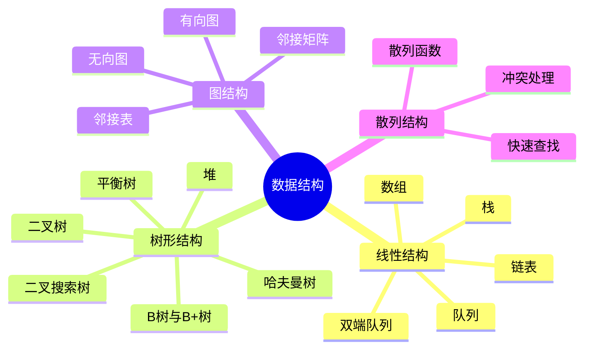

本章是整门数据结构的“分析语言”。后续学习线性表、栈与队列、树、图、查找和排序时，都可以沿着同一条主线展开：

> **逻辑结构 → 存储结构 → 基本操作 → 算法实现 → 时间复杂度 → 空间复杂度**

<Callout type="info" title="408 复习重点">
本页重点掌握三件事：**逻辑结构与存储结构的区别、算法的基本概念、复杂度的计算方法**。复杂度分析既会单独命题，也会贯穿算法设计题。
</Callout>

## 1. 数据结构的基本概念

### 1.1 数据、数据元素、数据项与数据对象

| 概念 | 含义 | 例子 |
| --- | --- | --- |
| **数据（Data）** | 能被计算机识别、存储和处理的信息的集合 | 数值、字符、图像、音频等 |
| **数据元素（Data Element）** | 数据的基本单位，通常作为一个整体参与处理 | 学生信息表中的一名学生 |
| **数据项（Data Item）** | 构成数据元素的、具有独立含义的最小单位 | 学号、姓名、成绩 |
| **数据对象（Data Object）** | 性质相同的数据元素的集合 | 一个班级的所有学生记录 |

例如：

```text
学生（数据元素）
├─ 学号（数据项）
├─ 姓名（数据项）
├─ 年龄（数据项）
└─ 成绩（数据项）
```

### 1.2 数据结构研究什么

数据结构研究的核心不是“把数据放进内存”，而是同时回答三个问题：

1. **数据元素之间有什么逻辑关系？**
2. **这些关系如何在计算机中表示和存储？**
3. **如何高效地完成查找、插入、删除、遍历等操作？**

可概括为：

> **数据结构 = 逻辑结构 + 存储结构 + 数据运算**

同一个问题采用不同的数据组织方式，算法效率可能完全不同。例如：

- 顺序表支持按下标随机访问，但中间插入、删除通常需要移动元素；
- 链表不支持按下标随机访问，但已知目标位置后插入、删除通常只需修改指针；
- 堆适合反复取得当前最大值或最小值；
- 散列表在理想情况下可实现接近常数时间的查找。

## 2. 数据结构的三个层次

### 2.1 逻辑结构

逻辑结构描述：

> **数据元素之间的逻辑关系，与元素在内存中具体怎样存放无关。**

常见逻辑结构如下：

| 逻辑结构 | 元素关系 | 典型内容 |
| --- | --- | --- |
| 集合结构 | 元素除“同属一个集合”外无其他必然关系 | 集合 |
| 线性结构 | 元素通常具有一对一的前后关系 | 线性表、栈、队列 |
| 树形结构 | 元素之间通常是一对多的层次关系 | 二叉树、堆、B 树 |
| 图结构 | 元素之间可以是多对多关系 | 有向图、无向图 |

### 2.2 存储结构

存储结构又称**物理结构**，描述逻辑关系在计算机中的具体实现方式。

| 存储方式 | 核心特点 | 常见例子 |
| --- | --- | --- |
| 顺序存储 | 使用一组地址连续的存储单元，通常通过位置关系体现逻辑关系 | 数组、顺序表 |
| 链式存储 | 存储单元不必连续，通过指针或链接域表示关系 | 链表、链式二叉树 |
| 索引存储 | 在数据之外建立索引项，以索引辅助定位数据 | 索引查找 |
| 散列存储 | 根据关键字通过散列函数计算存储位置 | 散列表 |

<Callout type="warn" title="高频易错：逻辑结构 ≠ 存储结构">
二者不是一一对应关系。同一种逻辑结构可以采用不同的存储结构。例如，线性表既可以用顺序表实现，也可以用链表实现；二叉树既可以链式存储，在特定场景下也可以顺序存储。
</Callout>

### 2.3 数据运算

常见数据运算包括：

- 创建与销毁；
- 查找；
- 插入；
- 删除；
- 修改；
- 遍历；
- 排序。

复习任意一种数据结构时，都应主动追问：

> **它最擅长支持哪些操作？这些操作在当前存储方式下的时间和空间代价是什么？**

## 3. 常见数据结构总览


```mermaid
mindmap
  root((数据结构))
    线性结构
      数组
      链表
      栈
      队列
      双端队列
    树形结构
      二叉树
      二叉搜索树
      堆
      平衡树
      哈夫曼树
      B树与B+树
    图结构
      有向图
      无向图
      邻接矩阵
      邻接表
    散列结构
      散列函数
      冲突处理
      快速查找
```

### 3.1 线性结构

- **数组（Array）**：通常连续存储，随机访问快；中间插入、删除代价较大。
- **链表（Linked List）**：结点通过指针连接，不要求物理地址连续；插入、删除灵活，但不能按下标直接随机访问。
- **栈（Stack）**：后进先出（LIFO），常用于函数调用、递归、表达式求值。
- **队列（Queue）**：先进先出（FIFO），常用于 BFS、任务调度。
- **双端队列（Deque）**：两端都可以插入和删除。

### 3.2 树形、图与散列结构

树适合表示层次关系，图适合表示更一般的多对多关系，散列表适合根据关键字快速定位元素。408 中常见内容包括：

- 树：二叉树、二叉搜索树、堆、AVL 树、红黑树、哈夫曼树、B 树、B+ 树；
- 图：邻接矩阵、邻接表、DFS、BFS、最短路径、最小生成树、拓扑排序、关键路径；
- 散列：散列函数、装填因子、冲突处理、平均查找长度。

散列表在理想情况下，查找、插入和删除的平均时间可接近 $O(1)$，但实际效率取决于散列函数、装填因子与冲突处理策略。

## 4. 数据类型、抽象数据类型与数据结构

### 4.1 数据类型

数据类型通常规定两部分内容：

- 数据对象的取值范围；
- 可以施加在这些数据上的操作。

例如 C 语言中的 `int`、`char`、结构体等。

### 4.2 抽象数据类型（ADT）

抽象数据类型强调：

> **只规定“数据是什么、允许做什么”，不规定“内部必须怎样实现”。**

例如“栈”这个 ADT 规定了入栈、出栈、读栈顶等操作，但具体可以用顺序存储实现，也可以用链式存储实现。

```text
抽象数据类型 ADT（定义功能与操作）
            ↓
具体数据结构（选择存储表示）
            ↓
具体算法（实现每个操作）
```

<Callout type="info" title="理解 ADT 的关键">
ADT 强调“接口与语义”，数据结构强调“表示与组织”。考试中若题目只问“栈具有哪些操作”，重点在 ADT；若问“顺序栈如何判空、判满”，重点已经落到具体实现。
</Callout>

## 5. 算法的基本概念与特性

### 5.1 什么是算法

算法（Algorithm）是：

> **为解决某类问题而规定的一组有限、明确且可执行的步骤。**

数据结构回答“**数据怎样组织**”，算法回答“**数据怎样处理**”。合适的数据结构能够降低算法代价，算法又必须利用数据结构的性质才能达到预期效率。

### 5.2 算法的五个基本特性

| 特性 | 含义 |
| --- | --- |
| **有穷性** | 算法必须在有限步之后结束 |
| **确定性** | 每一步含义明确，在给定状态下执行规则确定 |
| **可行性** | 每个基本操作都能通过有限次已有操作完成 |
| **输入** | 可以有零个、一个或多个输入 |
| **输出** | 至少有一个与问题有关的输出 |

记忆：

> **有穷、确定、可行；输入可以为零个，输出至少一个。**

<Callout type="warn" title="概念辨析：算法与程序">
算法强调“有限步骤内完成求解”。程序是算法的一种具体实现，但程序也可能为了持续提供服务而长期运行，因此二者不能简单等同。
</Callout>

## 6. 时间复杂度：先数基本操作，再看增长阶

> **真题标签**
>
> 复杂度分析是 408 高频选择题考点。典型题型包括线性循环、倍增循环、平方根级循环、嵌套循环以及各轮工作量不相同的求和分析。

设问题规模为 $n$，能够代表主要工作量的基本操作执行次数为 $T(n)$。复杂度关注的是：

> **当 $n$ 增大时，算法工作量的增长趋势。**

例如：

$$
T(n)=3n^2+5n+7
$$

严格地说有：

$$
T(n)=\Theta(n^2)
$$

在 408 常规作答中，通常写作：

$$
T(n)=O(n^2)
$$

### 6.1 什么是基本操作

基本操作是为了复杂度分析而选取的、能反映主要工作量的操作，例如：

- 比较一次；
- 赋值一次；
- 循环体执行一次；
- 访问一个数组元素一次。

它不要求恰好对应一条 CPU 指令。分析时应选取**执行次数随 $n$ 变化且足以代表总工作量**的操作。

### 6.2 三种渐近记号

| 记号 | 数学含义 | 直观理解 |
| --- | --- | --- |
| $O(f(n))$ | 渐近上界 | 增长速度最终不会超过该量级的常数倍 |
| $\Omega(f(n))$ | 渐近下界 | 增长速度最终至少达到该量级的常数倍 |
| $\Theta(f(n))$ | 渐近紧确界 | 与该量级同阶 |

如果题目直接问“时间复杂度”，通常按大 $O$ 记号作答；若题目要求严谨判断上下界或紧确界，则必须区分三者。

### 6.3 最好、平均与最坏情况

同一算法的执行次数可能取决于输入状态。例如顺序查找：

- 最好情况：第一个元素就命中，$O(1)$；
- 最坏情况：最后一个元素才命中或查找失败，$O(n)$；
- 平均情况：在给定概率模型下计算期望代价，通常仍为 $O(n)$。

题目若明确给出“最坏”“平均”等条件，应严格按对应情形分析；没有特别说明时，应结合教材约定和题意判断。

## 7. 常见时间复杂度与循环分析

<InlineSvg src="/images/data-structure/data-structure-basic-algorithm-001.svg" alt="常见复杂度增长速度比较" />

常见复杂度从低到高：

$$
O(1)
<
O(\log n)
<
O(\sqrt n)
<
O(n)
<
O(n\log n)
<
O(n^2)
<
O(n^3)
<
O(2^n)
<
O(n!)
$$

其中 $O(\sqrt n)$ 不是所有教材速记表都会单独列出，但在 408 程序复杂度题中经常出现，不能漏掉。

| 复杂度 | 常见模式 |
| --- | --- |
| $O(1)$ | 常数次操作、数组按下标访问 |
| $O(\log n)$ | 变量每轮乘/除固定常数、折半查找 |
| $O(\sqrt n)$ | 循环条件形如 $i^2<n$，或累加 $1+2+\cdots+k$ 首次达到 $n$ |
| $O(n)$ | 单次顺序扫描 |
| $O(n\log n)$ | 归并排序、平均情况下的快速排序 |
| $O(n^2)$ | 两层线性嵌套、简单选择排序 |
| $O(2^n)$ | 未剪枝的子集枚举 |
| $O(n!)$ | 全排列枚举 |

### 7.1 线性循环

```c
for (int i = 0; i < n; ++i) {
    // O(1)
}
```

循环执行约 $n$ 次，因此：

$$
T(n)=O(n)
$$

### 7.2 独立嵌套循环

```c
for (int i = 0; i < n; ++i)
    for (int j = 0; j < n; ++j) {
        // O(1)
    }
```

基本操作次数为：

$$
n\times n=n^2
$$

因此：

$$
T(n)=O(n^2)
$$

### 7.3 三角形循环：用求和而不是机械乘法

```c
for (int i = 0; i < n; ++i)
    for (int j = 0; j <= i; ++j) {
        // O(1)
    }
```

执行次数为：

$$
1+2+\cdots+n=\frac{n(n+1)}{2}
$$

所以：

$$
T(n)=O(n^2)
$$

### 7.4 倍增或倍减循环：解指数不等式

```c
for (int i = 1; i < n; i *= 2) {
    // O(1)
}
```

若执行 $k$ 次，则大致有：

$$
2^k\approx n
$$

因此：

$$
k\approx \log_2 n
$$

所以：

$$
T(n)=O(\log n)
$$

> **真题标签**
>
> 2011 年第 1 题属于典型的倍增循环复杂度分析。

### 7.5 平方根级循环：先设执行次数 $k$

若循环条件形如：

```c
for (int i = 0; i * i < n; ++i) {
    // O(1)
}
```

退出时满足 $i^2\ge n$，因此执行次数量级为：

$$
k=\Theta(\sqrt n)
$$

于是：

$$
T(n)=O(\sqrt n)
$$

另一类常见写法是每轮增加量逐步变大，例如：

```c
int i = 0, sum = 0;
while (sum < n)
    sum += ++i;
```

因为执行 $k$ 轮后：

$$
1+2+\cdots+k=\frac{k(k+1)}{2}\approx n
$$

所以：

$$
k=\Theta(\sqrt n)
$$

> **真题标签**
>
> 2017 年第 1 题考查了“累计量达到 $n$，反解循环次数”的平方根级复杂度。

### 7.6 外层倍增、内层工作量随外层变化：对每轮工作量求和

```c
int sum = 0;
for (int i = 1; i < n; i *= 2)
    for (int j = 0; j < i; ++j)
        ++sum;
```

虽然代码有两层循环，但总工作量为：

$$
1+2+4+\cdots<2n
$$

因此：

$$
T(n)=O(n)
$$

> **真题标签**
>
> 2022 年第 1 题考查了这一类“外层倍增、内层工作量随外层变量变化”的几何级数求和。

<Callout type="warn" title="不要机械地数循环层数">
嵌套两层循环不一定是 $O(n^2)$。应先写出每一轮的实际工作量，再求总和。复杂度题最稳定的方法是：**设执行次数 → 建立关系式 → 求和或解不等式 → 取渐近量级**。
</Callout>

### 7.7 2025 年典型综合模式

```c
int count = 0;
for (int i = 0; i * i < n; ++i)
    for (int j = 0; j < i; ++j)
        ++count;
```

外层最多执行约 $\sqrt n$ 轮，第 $i$ 轮内层执行 $i$ 次，因此总次数为：

$$
1+2+\cdots+\sqrt n
=
\Theta(n)
$$

故总时间复杂度为：

$$
O(n)
$$

> **真题标签**
>
> 2025 年第 1 题考查了“外层平方根级 + 内层递增工作量”的组合分析。

## 8. 空间复杂度与递归栈

空间复杂度描述算法运行过程中，所需空间随问题规模增长的量级。

### 8.1 总空间与辅助空间

- **总空间**：输入数据本身 + 程序运行额外需要的空间；
- **辅助空间**：除输入数据外，算法额外申请或占用的空间。

408 算法设计题通常更关注**辅助空间复杂度**。

常见额外空间来源：

- 临时变量；
- 辅助数组；
- 栈、队列；
- 散列表；
- 递归调用栈。

| 辅助空间复杂度 | 常见情况 |
| --- | --- |
| $O(1)$ | 只使用常数个临时变量 |
| $O(\log n)$ | 平衡递归产生的调用栈 |
| $O(n)$ | 线性辅助数组、队列，或最坏线性递归深度 |
| $O(n^2)$ | 额外维护一个 $n\times n$ 矩阵 |

### 8.2 递归空间看“最大同时存在的栈帧数”

递归的空间复杂度不是把所有递归调用次数相加，而是看：

> **递归最深时，同时存在多少层尚未返回的调用。**

例如二分递归深度约为 $\log n$，若每层只使用常数空间，则辅助空间为：

$$
O(\log n)
$$

而一条深度为 $n$ 的链式递归最坏可能达到：

$$
O(n)
$$

### 8.3 时间与空间必须分开判断

例如二叉树递归遍历：

- 每个结点通常只访问一次，因此时间复杂度是 $O(n)$；
- 递归栈空间取决于树高 $h$，为 $O(h)$；
- 平衡树上 $h=O(\log n)$，最坏退化链上 $h=O(n)$。

<Callout type="warn" title="高频易错：递归调用次数 ≠ 递归空间">
递归算法可能总共调用很多次，但空间只与“同时未返回的最大调用层数”有关。分析递归算法时，应分别回答：**总共做了多少工作？最深同时保留多少层栈帧？**
</Callout>
