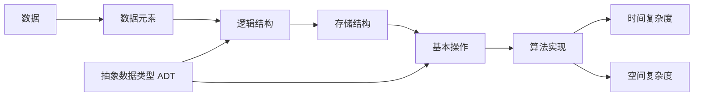

本节建立后续所有章节都要反复使用的分析框架：

> **逻辑结构 → 存储结构 → 基本操作 → 算法实现 → 复杂度评价**

学习某一种数据结构时，不要只记代码。更重要的是回答：**数据之间是什么关系、这种关系怎样落到存储器中、主要操作如何实现，以及这些实现的代价是多少。**

---

## 1.1.1 数据、数据元素、数据项与数据对象

### 数据

**数据（Data）**&#x2060;是能被计算机识别、存储和处理的信息的集合。数字、字符、图像、音频以及各种结构化记录都可以作为数据。

### 数据元素

**数据元素（Data Element）**&#x2060;是数据的基本单位，通常作为一个整体参与处理。

例如，一张学生表中的“一名学生”可以看作一个数据元素。

### 数据项

**数据项（Data Item）**&#x2060;是构成数据元素的、具有独立含义的最小单位。

```text
学生（数据元素）
├─ 学号（数据项）
├─ 姓名（数据项）
├─ 年龄（数据项）
└─ 成绩（数据项）
```

### 数据对象

**数据对象（Data Object）**&#x2060;是性质相同的数据元素的集合，例如“某班全部学生”“某图中的全部顶点”。

### 数据结构

**数据结构（Data Structure）**&#x2060;研究的是数据元素之间的关系，以及这些关系在计算机中的表示与操作。

可以用一条主线概括：

> **数据结构 = 逻辑关系 + 存储表示 + 基本操作**

---

## 1.1.2 数据结构的三个核心层次

### 逻辑结构

逻辑结构描述**数据元素之间在逻辑上的关系**，与数据实际存放在哪里无关。

408 中常见逻辑结构可归纳为：

| 逻辑结构 | 关系特征 | 典型对象 |
| --- | --- | --- |
| 集合结构 | 元素之间除“同属一个集合”外无其他显式关系 | 集合 |
| 线性结构 | 除首尾元素外，每个元素通常只有一个直接前驱和一个直接后继 | 线性表、栈、队列 |
| 树形结构 | 一对多的层次关系 | 树、二叉树 |
| 图结构 | 多对多的网状关系 | 有向图、无向图 |

> **易错点**：散列表不是与“线性、树、图”并列的逻辑结构分类。散列更侧重一种**存储与查找组织方式**。

### 存储结构

存储结构又称**物理结构**，表示逻辑关系如何映射到计算机存储器中。

| 存储方式 | 核心思想 | 典型特点 |
| --- | --- | --- |
| 顺序存储 | 相关元素存放在一段连续地址空间中 | 便于按地址计算位置，通常支持随机访问 |
| 链式存储 | 使用指针或链接信息表示元素之间的关系 | 物理位置可不连续，插入删除更灵活 |
| 索引存储 | 额外建立索引项定位数据 | 以额外空间换取定位效率 |
| 散列存储 | 根据关键字通过散列函数计算存储位置 | 理想情况下查找接近常数级 |

> **关键结论**：逻辑结构和存储结构不是一一对应的。
>
> 同一种逻辑结构可以有不同存储实现。例如线性表既可以使用顺序表，也可以使用链表。

### 数据运算

常见运算包括：

- 创建与销毁；
- 查找与访问；
- 插入与删除；
- 修改；
- 遍历；
- 排序；
- 合并与拆分。

学习后续章节时，建议始终问一句：

> **这种结构最擅长支持什么操作？代价是多少？**

---

## 1.1.3 数据类型与抽象数据类型

### 数据类型

**数据类型（Data Type）**&#x2060;是一组值的集合，以及定义在这些值上的一组操作。

例如 `int` 不仅规定整数的取值范围，还规定整数可以进行加、减、比较等操作。

从抽象层次看，可粗略区分：

- **原子类型**：值不可再分，如整数、字符等；
- **结构类型**：值由若干成分构成，如数组、结构体等。

### 抽象数据类型 ADT

**抽象数据类型（Abstract Data Type, ADT）**&#x2060;强调“对象具有哪些逻辑关系、允许哪些操作”，而不规定“这些操作必须怎样实现”。

例如“栈”这个 ADT 只要求满足后进先出，并支持入栈、出栈、读栈顶等操作；至于底层使用数组还是链表，是实现层面的选择。

```text
ADT Stack
├─ 数据对象：一组同类型元素
├─ 逻辑关系：线性关系
└─ 基本操作
   ├─ InitStack
   ├─ Push
   ├─ Pop
   ├─ GetTop
   └─ Empty
```

因此：

> **ADT 关注“做什么”，具体数据结构实现关注“怎么做”。**

---

## 1.1.4 数据结构与算法的关系

**算法（Algorithm）**&#x2060;是为解决某一类问题而规定的一组有穷、明确并可执行的步骤。

数据结构解决的是“数据怎样组织”，算法解决的是“数据怎样处理”。二者不能割裂：

| 数据组织 | 常见优势或算法联系 |
| --- | --- |
| 数组 / 顺序表 | 随机访问、二分查找、双指针 |
| 链表 | 局部插入删除、指针重排 |
| 栈 | 括号匹配、表达式求值、递归模拟 |
| 队列 | BFS、层序遍历、调度 |
| 堆 | 优先队列、Top-K |
| 二叉搜索树 | 有序查找、中序遍历 |
| 图 | DFS、BFS、最短路径、生成树 |
| 散列表 | 快速查找、去重、出现性判断 |

一个算法效率高不高，往往取决于是否选中了与问题性质匹配的数据结构。

---

## 1.1.5 算法的五个基本特性

### 有穷性

算法必须在执行**有限步**后结束。

### 确定性

算法的每一步含义明确；在给定状态和输入后，下一步操作是确定的。

### 可行性

每个基本操作都能够通过有限次已知操作完成。

### 输入

算法可以有 **0 个或多个输入**。

### 输出

算法必须有 **1 个或多个输出**，输出应与问题求解目标有关。

> **速记**：有穷、确定、可行；输入可无，输出必有。

---

## 1.1.6 算法评价的基本维度

设计算法时通常需要同时考虑：

1. **正确性**：能否对所有合法输入得到正确结果；
2. **可读性**：逻辑是否清晰、是否便于验证和维护；
3. **健壮性**：面对边界输入或异常情况是否仍能合理处理；
4. **效率**：时间开销与空间开销是否满足要求。

在 408 中，效率通常通过**时间复杂度**和**空间复杂度**描述。

---

## 1.1.7 本节知识关系图



> **真题标签｜绪论基本概念**
>
> 本章概念题通常不难，但逻辑结构、存储结构、ADT 与算法特性的表述容易作为选择题干扰项出现。判断时应优先抓“逻辑关系是否依赖具体存储”“操作定义与实现是否分离”等关键词。
