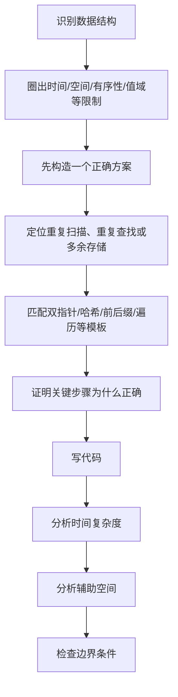

本节不再新增大量算法，而是把“如何从一个正确但较慢的方案，走到满足题目要求的方案”整理成固定流程。

---

## 1.4.1 从暴力法定位优化点

一个可靠的优化思路是先问：

> **重复计算发生在哪里？能否用数据结构、预处理或单调推进消除重复？**

| 场景 | 直接方法 | 常见优化方向 |
| --- | --- | --- |
| 找第 $k$ 小 | 全排序 $O(n\log n)$ | 大根堆维护 Top-K，$O(n\log k)$ |
| 两个升序数组求中位数 | 合并后取中，需要线性辅助空间 | 二分夹逼 |
| 链表倒数第 $k$ 个 | 两次遍历 | 快慢指针一次遍历 |
| 主元素 | 哈希计数，需要 $O(n)$ 空间 | Boyer-Moore，$O(1)$ 空间 |
| 每个位置依赖左右区间 | 对每个位置重新扫描，$O(n^2)$ | 前缀 / 后缀预处理，$O(n)$ |
| 多个有序序列寻找最优组合 | 多重枚举 | 多指针单向推进 |
| 两链表公共结点 | 哈希记录访问结点 | 双指针换头，$O(1)$ 空间 |

---

## 1.4.2 五个常见优化方向

### 消除重复扫描

如果某一段数据被反复扫描，考虑：

- 前缀和 / 后缀和；
- 前缀 / 后缀最大最小值；
- 动态维护当前状态；
- 滑动窗口或双指针。

### 消除重复查找

如果瓶颈是“反复判断一个值是否出现”，考虑：

- 散列表；
- 二分查找；
- BST；
- 堆；
- 直接地址表 / 桶。

### 利用有序性

只要输入已排序，优先考虑：

- 双指针；
- 二分；
- 单向合并；
- 有序序列上的局部推进。

### 减少保存的信息

很多问题不需要保存全部中间结果，只需维护：

- 当前最大 / 最小值；
- 一个候选；
- Top-K；
- 常数个指针；
- 当前层或当前窗口状态。

### 利用原存储空间

如果题目允许修改原数据，可考虑：

- 符号标记；
- 下标映射；
- 原地交换；
- 链表原地逆置。

这类方法常把辅助空间从 $O(n)$ 降为 $O(1)$。

---

## 1.4.3 “设计思想”应该写到什么程度

不要只写：

> 遍历数组即可。

应说明四件事：

1. 从哪里开始扫描；
2. 维护哪些变量或数据结构；
3. 每一步根据什么规则更新；
4. 最终答案如何得到。

例如，一个合格的描述可以是：

> 从数组右端向左扫描，维护当前位置右侧（含当前位置）的最大值和最小值。若当前元素非负，则与后缀最大值相乘取得最优结果；若当前元素为负，则与后缀最小值相乘。每个元素仅处理一次，因此时间复杂度为 $O(n)$，除常数个变量外不使用额外存储，辅助空间复杂度为 $O(1)$。

设计思想的目标是让阅卷者在不看代码时也能判断算法是否正确。

---

## 1.4.4 代码书写规范

### 给关键变量写含义

```c
int cnt = 1;
// cnt 表示当前候选元素尚未被抵消的票数
```

### 给非显然的下标映射写注释

```c
a[v - 1] = -abs(a[v - 1]);
// 用下标 v-1 位置的正负号记录整数 v 是否出现
```

### 给关键循环写“循环结束后成立什么”

```c
// 扫描到 i 时，a[0..i-1] 对应的出现信息已经完成标记
```

### 边界条件写在代码里

常见边界包括：

- 空链表；
- $k$ 超过链表长度；
- 空树；
- 单元素数组；
- 图不连通；
- 候选元素最终不存在。

---

## 1.4.5 复杂度答案不要只写结果

推荐写法：

```text
时间复杂度：O(n)。
数组被线性扫描两次，每次均为 O(n)，因此总体仍为 O(n)。

空间复杂度：O(1)。
除常数个指针和计数变量外，没有使用随 n 增长的辅助存储。
```

如果包含递归，应明确说明递归栈：

```text
空间复杂度：O(h)。
其中 h 为树高，额外空间主要来自递归调用栈。
```

---

## 1.4.6 常见失分点

### 只写代码，不写设计思想

题目明确要求设计思想时，应单独写自然语言说明。

### 没满足题目给定的复杂度

若要求 $O(n)$，则“先排序再扫描”的 $O(n\log n)$ 方案即使正确，也不满足要求。

### 忘记统计辅助空间

递归栈、队列、哈希表、辅助数组都属于辅助空间。

### 修改输入却没有说明

原地哈希、原地逆置等算法会修改输入。题目若要求保持原数据，必须改用其他方案。

### 忽略特殊输入

边界错误往往比主体算法错误更隐蔽。代码完成后应主动检查：

```text
n = 0 / 1？
链表为空？
只有一个结点？
k 是否越界？
图是否可能不连通？
答案是否可能不存在？
```

---

## 1.4.7 考场思考顺序



这套顺序比“上来就硬写最优代码”更稳定。

---

## 1.4.8 章末核心记忆：概念主线

```text
数据
  ↓
数据元素 / 数据项
  ↓
逻辑结构
  ↓
存储结构
  ↓
基本操作
  ↓
算法实现
  ↓
时间复杂度 + 空间复杂度
```

逻辑结构与存储结构不要混淆；ADT 定义的是逻辑对象与操作，不绑定具体实现。

---

## 1.4.9 章末核心记忆：复杂度

常见数量级：

$$
O(1)
< O(\log n)
< O(n)
< O(n\log n)
< O(n^2)
< O(n^3)
< O(2^n)
< O(n!)
$$

分析循环时，**先求关键语句总执行次数**；分析递归时，分别看**总工作量**和**最大递归深度**。

---

## 1.4.10 章末核心记忆：算法题模板

### 数组 / 顺序表

```text
有序        → 双指针 / 二分
值域有限    → 桶 / 下标映射 / 原地标记
左右依赖    → 前缀 / 后缀
超半数元素  → Boyer-Moore
多有序序列  → 多指针
暂无更优解  → 排序后处理
```

### 链表

```text
中点 / 倒数第 k 个 → 快慢指针
逆向处理           → 原地逆置
共享后缀           → 长度对齐 / 双指针换头
环                 → 快慢指针
```

### 树

```text
BST 有序信息 → 中序遍历
按层处理     → BFS
路径 / 高度  → DFS / 递归
```

### 图

```text
遍历 / 连通性 → DFS / BFS
无权最短路    → BFS
非负权最短路  → Dijkstra
全源最短路    → Floyd
最小生成树    → Prim / Kruskal
依赖关系      → 拓扑排序
AOE 网        → 关键路径
```

---

## 1.4.11 最终自检

完成本章后，应能独立回答：

1. 什么是数据结构、逻辑结构、存储结构和 ADT？
2. 为什么同一种逻辑结构可以有不同的存储实现？
3. 算法的五个基本特性是什么？
4. 如何从代码推导 $T(n)$，而不是只凭循环层数猜复杂度？
5. 递归算法的空间复杂度为什么与最大递归深度相关？
6. 面对数组、链表、树、图的算法设计题，第一批候选模板分别是什么？
7. 如何把“正确但慢”的暴力算法优化为满足时间 / 空间限制的方案？

> **本章目标**
>
> 看到一个算法时，能够主动判断“输入规模、关键操作、时间复杂度、辅助空间”；看到一道设计题时，能够主动寻找“数据结构本身提供了什么可以利用的性质”。
