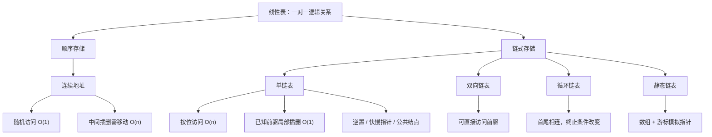

线性表的大题重点通常不在“会不会写一个基本插入函数”，而在于能否利用顺序表或链表的结构性质，设计满足时间、空间限制的算法。

链表算法尤其常见，因为指针可以原地重排结点，题目很容易加入：

- $O(1)$ 辅助空间；
- 一趟扫描；
- 不改变原有数据值；
- 找倒数位置、公共结点或重新链接等限制。

本节按高频模型整理。

---

## 2.4.1 链表题的通用检查框架

写链表算法前，先确认四件事：

```text
1. 是否带头结点？
2. 空表如何表示？
3. 当前指针指向“结点本身”还是“前驱结点”？
4. 改指针前，旧链接是否已经保存？
```

写完后再检查：

```text
空链表？
只有一个结点？
k 越界？
首结点 / 尾结点？
释放后是否仍访问旧指针？
```

---

## 2.4.2 模型一：单链表原地逆置

原链表：

```text
head → a1 → a2 → a3 → NULL
```

逆置后：

```text
head → a3 → a2 → a1 → NULL
```

核心困难在于：

> 把当前结点 `p->next` 改成前驱之前，必须先保存原来的后继，否则剩余链表会丢失。

### 三指针法

```c
void Reverse(Node *head) {
    Node *prev = NULL;
    Node *p = head->next;

    while (p != NULL) {
        Node *next = p->next;  // 先保存原后继
        p->next = prev;        // 反转当前链接
        prev = p;              // prev、p 整体前移
        p = next;
    }

    head->next = prev;
}
```

每个结点只处理一次：

$$
T(n)=O(n)
$$

只使用常数个指针：

$$
S(n)=O(1)
$$

### 逆置的固定动作

```text
保存后继 → 反转链接 → prev 前移 → p 前移
```

后续很多链表重排题都可以把“原地逆置”当作中间步骤。

---

## 2.4.3 模型二：倒数第 $k$ 个结点——快慢指针

若单链表长度未知，要求一趟扫描寻找倒数第 $k$ 个结点，可以维持两个指针之间的固定距离。

### 思想

1. `fast`、`slow` 都从首元结点开始；
2. `fast` 先向前走 $k$ 步；
3. 若不足 $k$ 步就到 `NULL`，说明 $k$ 越界；
4. 然后两个指针同步前进；
5. 当 `fast == NULL` 时，`slow` 恰好指向倒数第 $k$ 个结点。

```c
Node *FindKthFromEnd(Node *head, int k) {
    if (head == NULL || k <= 0)
        return NULL;

    Node *fast = head->next;
    Node *slow = head->next;

    for (int i = 0; i < k; ++i) {
        if (fast == NULL)
            return NULL;
        fast = fast->next;
    }

    while (fast != NULL) {
        fast = fast->next;
        slow = slow->next;
    }

    return slow;
}
```

复杂度：

$$
T(n)=O(n),\qquad S(n)=O(1)
$$

> **真题标签｜2009 年第 42 题：倒数第 $k$ 个结点**
>
> 题目要求“不改变链表且尽可能高效”。固定间距双指针可以在一次线性扫描量级内完成，并只使用常数辅助空间。

---

## 2.4.4 模型三：两个单链表的第一个公共结点

两个**无环**单链表若真正共享某个结点，则从该结点开始，后续链一定完全相同：

```text
A: a1 → a2 ─┐
             ├→ c1 → c2 → NULL
B: b1 → b2 → b3 ┘
```

不可能出现：

```text
先共享同一个结点 → 后面又分叉
```

原因是同一个单链表结点只有一个 `next`。

### 长度对齐法

1. 分别求两个链表长度 $m,n$；
2. 让较长链表先走 $|m-n|$ 步；
3. 两个指针同步前进；
4. 第一次满足 `p == q` 的位置就是第一个公共结点。

```c
Node *FirstCommon(Node *h1, Node *h2) {
    int len1 = Length(h1);
    int len2 = Length(h2);

    Node *p = h1->next;
    Node *q = h2->next;

    if (len1 > len2) {
        for (int i = 0; i < len1 - len2; ++i)
            p = p->next;
    } else {
        for (int i = 0; i < len2 - len1; ++i)
            q = q->next;
    }

    while (p != q) {
        p = p->next;
        q = q->next;
    }

    return p;  // 若无公共结点，最终同时为 NULL
}
```

复杂度：

$$
T(m,n)=O(m+n),\qquad S(m,n)=O(1)
$$

> **真题标签｜2012 年第 42 题：两个单词的公共后缀**
>
> 两个单词使用单链表保存，并允许共享相同后缀。所谓“共同后缀起始位置”本质就是**第一个公共结点**。

> **易错点**
>
> 公共结点判断必须比较**结点地址**：`p == q`。两个结点的数据值相同，并不代表它们是同一个结点。

---

## 2.4.5 模型四：按绝对值去重——值域换时间

若单链表中有 $m$ 个整数，并且题目给出：

$$
|data|\le n
$$

要求对绝对值相同的结点只保留第一次出现者。

如果每遇到一个结点都回头检查之前是否出现过，会产生二重扫描，最坏为 $O(m^2)$。

题目给出的有限值域 $[0,n]$ 可以直接映射到辅助数组：

```c
void RemoveDuplicateAbs(Node *head, int n) {
    bool seen[n + 1];
    for (int i = 0; i <= n; ++i)
        seen[i] = false;

    Node *prev = head;
    Node *p = head->next;

    while (p != NULL) {
        int key = abs(p->data);

        if (seen[key]) {
            Node *del = p;
            prev->next = p->next;
            p = p->next;
            free(del);
        } else {
            seen[key] = true;
            prev = p;
            p = p->next;
        }
    }
}
```

时间复杂度：

$$
O(m+n)
$$

若辅助数组初始化视为 $O(n)$，链表扫描为 $O(m)$。

辅助空间：

$$
O(n)
$$

> **真题标签｜2015 年第 41 题：按绝对值去重**
>
> 这类题的关键不是“链表”本身，而是识别题目额外给出的**有限值域**。用下标记录是否出现，可以用空间换时间，把重复查找消掉。

---

## 2.4.6 模型五：链表交错重排——找中点 + 逆置 + 合并

设带头结点的单链表：

$$
L=(a_1,a_2,\ldots,a_{n-1},a_n)
$$

要求原地重排为：

$$
L'=(a_1,a_n,a_2,a_{n-1},a_3,a_{n-2},\ldots)
$$

如果每次都从头寻找“当前最后一个结点”，会反复扫描，最坏达到 $O(n^2)$。

更高效的做法是把问题拆成三个线性步骤：

```text
找前半段尾结点
→ 后半段原地逆置
→ 两段交替合并
```

### 第一步：找到前半段尾结点并断链

空表和单结点表无需重排。排除这些边界后，让 `slow` 每次走 1 步、`fast` 每次走 2 步，并把循环条件写成“`fast` 还能再走两步”：

```c
Node *slow = head->next;
Node *fast = head->next;

while (fast->next != NULL && fast->next->next != NULL) {
    slow = slow->next;
    fast = fast->next->next;
}

Node *second = slow->next;
slow->next = NULL;
```

此时：

- $n$ 为奇数时，前半段比后半段多 1 个结点；
- $n$ 为偶数时，两段长度相等。

例如：

```text
1 → 2 → 3 → 4 → 5
分成：1 → 2 → 3    和    4 → 5
```

### 第二步：原地逆置后半段

```c
Node *prev = NULL;
Node *p = second;

while (p != NULL) {
    Node *next = p->next;
    p->next = prev;
    prev = p;
    p = next;
}

second = prev;
```

例如：

```text
4 → 5
```

变为：

```text
5 → 4
```

### 第三步：交替合并两段

```c
Node *first = head->next;

while (second != NULL) {
    Node *next1 = first->next;
    Node *next2 = second->next;

    first->next = second;
    second->next = next1;

    first = next1;
    second = next2;
}
```

最终：

```text
1 → 5 → 2 → 4 → 3
```

整个过程中每个结点只参与常数次访问或链接修改，因此：

$$
T(n)=O(n)
$$

只使用常数个辅助指针：

$$
S(n)=O(1)
$$

> **真题标签｜2019 年第 41 题：链表重排**
>
> 题目要求 $O(1)$ 辅助空间且时间尽可能高效。关键是把“反复从尾部取结点”转换成“后半段原地逆置后顺序取结点”，从而消除重复扫描。

---

## 2.4.7 顺序表与链表算法题的选型提示

### 看到顺序表 / 数组

优先检查：

```text
是否有序？
是否能双指针？
值域是否有限？
能否用下标映射？
是否允许修改原数组？
是否需要原地交换？
```

### 看到链表

优先检查：

```text
是否要倒数位置？      → 快慢指针
是否要找中点？        → 快慢指针
是否要逆向处理？      → 原地逆置
是否要公共后缀？      → 长度对齐 / 双指针
是否要重排链接？      → 保存后继后再改指针
是否要求 O(1) 空间？  → 尽量原地改链接，不建数组/栈
```

---

## 2.4.8 线性表高频易错点

### “链表插入、删除一定是 $O(1)$”——错

只有**已经得到相关结点 / 前驱结点**时，真正改指针才是 $O(1)$。

按逻辑位置插入、删除通常仍需要先线性查找：

$$
O(n)
$$

### “顺序表随机访问，所以查找都是 $O(1)$”——错

随机访问指按位置访问：

$$
O(1)
$$

普通按值查找仍为：

$$
O(n)
$$

### “头结点就是第一个数据结点”——错

带头结点时：

```c
head        // 头结点
head->next  // 首元结点
```

### 改指针前没有保存旧后继——高危

链表重排最常见错误不是算法思想错，而是覆盖指针后失去剩余链表。

固定检查：

> **这个链接马上要被改，我还有没有办法找到原来指向的结点？**

### 释放结点后继续访问——错误

```c
free(p);
p = p->next;  // 非法
```

必须先保存后继。

### 循环链表仍用 `NULL` 作为唯一终止条件——错误

循环链表通常需要判断是否回到头结点或起始结点。

### 把“数组 / 链表”与“栈区 / 堆区”绑定——错误

存储结构看的是元素之间如何组织，而不是对象来自哪种内存分配方式。

---

## 2.4.9 全章复杂度速查

| 结构 | 操作 | 时间复杂度 |
| --- | --- | ---: |
| 顺序表 | 按位访问 | $O(1)$ |
| 顺序表 | 普通按值查找 | $O(n)$ |
| 顺序表 | 一般位置插入 | $O(n)$ |
| 顺序表 | 一般位置删除 | $O(n)$ |
| 单链表 | 按位访问 | $O(n)$ |
| 单链表 | 按值查找 | $O(n)$ |
| 单链表 | 已知前驱后插入 | $O(1)$ |
| 单链表 | 已知前驱后删除 | $O(1)$ |
| 单链表 | 按逻辑位置插入 | $O(n)$ |
| 单链表 | 按逻辑位置删除 | $O(n)$ |
| 双向链表 | 已知当前结点删除 | $O(1)$ |
| 单链表 | 原地逆置 | $O(n)$ |
| 单链表 | 倒数第 $k$ 个结点 | $O(n)$ |
| 两单链表 | 第一个公共结点 | $O(m+n)$ |
| 单链表 | 清空 / 销毁数据结点 | $O(n)$ |

---

## 2.4.10 章末知识主线



最终应能不依赖死记代码回答四个问题：

1. **逻辑位置与物理地址之间是什么关系？**
2. **目标元素能否直接定位，还是必须顺序遍历？**
3. **一次插入 / 删除到底花时间在“定位”还是“修改结构”？**
4. **为了获得更快操作，付出了什么空间或维护代价？**

把这四个问题想清楚，顺序表、单链表及其各种变体就可以统一分析。
