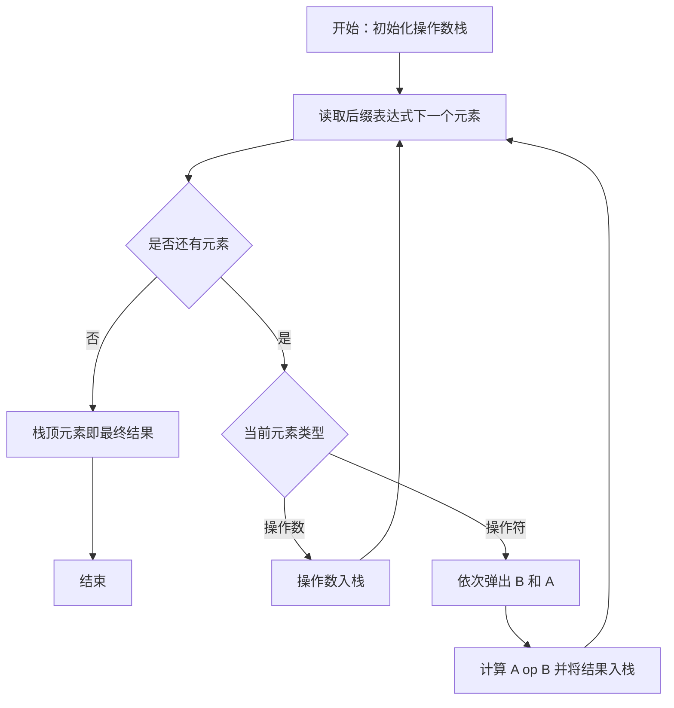
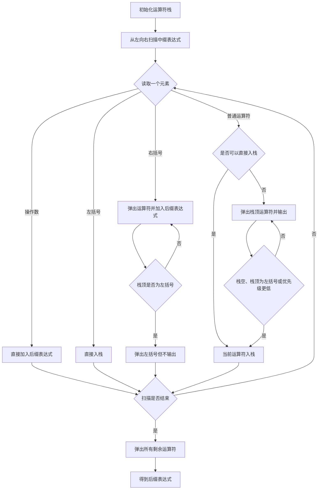

## 十六、栈和队列的应用

> **复习优先级：高。**
>
> 本节属于本章真正的考试重点，尤其包括：
>
> * 表达式树；
> * 中缀表达式求值；
> * 后缀表达式求值；
> * 中缀转后缀；
> * 出栈序列；
> * 卡特兰数。

---

## 十七、二叉表达式树

**二叉表达式树（Expression Tree）**使用二叉树表示表达式：

* 叶结点通常是**操作数**；
* 非叶结点通常是**运算符**。

例如：

```text
(3 + 4) × (5 - 2) ÷ 7
```

运算顺序为：

1. `3 + 4`
2. `5 - 2`
3. `(3 + 4) × (5 - 2)`
4. `((3 + 4) × (5 - 2)) ÷ 7`

因此根结点是 `/`，其左子树代表乘法表达式，右子树是 `7`。

<InlineSvg src="/images/data-structure/data-structure-array-application-001.svg" alt={"ExpressionTree"} />

表达式树反映的是：

> **表达式的运算结构，而不只是字符书写顺序。**

越靠近叶结点的运算通常越早执行，根结点对应整个表达式最后完成的运算。

---

## 十八、前缀、中缀与后缀表达式

对表达式树采用不同遍历方式即可得到不同表达式：

| 树的遍历方式 | 表达式   |
| ------ | ----- |
| 前序遍历   | 前缀表达式 |
| 中序遍历   | 中缀表达式 |
| 后序遍历   | 后缀表达式 |

<InlineSvg src="/images/data-structure/data-structure-array-application-002.svg" alt={"表达式树与前序、中序、后序表达式"} />

例如表达式：

```text
(A + B) * C
```

三种形式分别为：

| 类型    | 表达式           |
| ----- | ------------- |
| 前缀表达式 | `* + A B C`   |
| 中缀表达式 | `(A + B) * C` |
| 后缀表达式 | `A B + C *`   |

<InlineSvg src="/images/data-structure/data-structure-array-application-003.svg" alt={"ExpressionTypes"} />

前缀表达式又称**波兰表达式**。

后缀表达式又称**逆波兰表达式**。

其最大优点是：

> 在已经确定运算符元数的情况下，通常不需要括号也能唯一确定运算顺序。

---

## 十九、中缀表达式求值

中缀表达式是人最习惯书写的形式，例如：

```text
3 + (5 * 2 - 8)
```

但由于存在：

* 运算符优先级；
* 左右结合；
* 括号；

因此计算时通常需要两个栈：

1. **操作数栈**；
2. **运算符栈**。

---

### 1. 基本计算单元

假设运算符栈顶为：

```text
op
```

操作数栈顶依次为：

```text
B
A
```

则执行：

```text
A op B
```

再把结果压回操作数栈。

<InlineSvg src="/images/data-structure/data-structure-array-application-004.svg" alt={"基本计算单元"} />

> **极重要：**
>
> 对减法和除法：
>
> ```text
> 第一次弹出 → 第二操作数 B
> 第二次弹出 → 第一操作数 A
> ```
>
> 应计算：
>
> ```text
> A - B
> A / B
> ```
>
> 不能颠倒。

---

### 2. 求值规则

从左到右扫描中缀表达式。

#### 遇到操作数

直接进入操作数栈。

#### 遇到左括号 `(`

直接进入运算符栈。

#### 遇到右括号 `)`

不断执行栈顶运算，直到遇到左括号。

然后：

```text
弹出左括号，但不参加运算
```

#### 遇到普通运算符

若：

* 运算符栈为空；
* 或栈顶为左括号；
* 或当前运算符优先级更高；

则当前运算符直接入栈。

否则：

> 不断弹出并计算优先级高于或等于当前运算符的栈顶运算符，直到当前运算符可以入栈。

扫描结束后，再把运算符栈中剩余运算全部完成。

<InlineSvg src="/images/data-structure/data-structure-array-application-005.svg" alt={"InfixEvaluation"} />

---

### 3. 示例

求：

```text
3 + (5 * 2 - 8)
```

| 步骤 | 输入  | 操作                | 运算符栈    | 操作数栈     |
| -- | --- | ----------------- | ------- | -------- |
| 1  | `3` | 操作数入栈             |         | `3`      |
| 2  | `+` | 运算符入栈             | `+`     | `3`      |
| 3  | `(` | 左括号入栈             | `+ (`   | `3`      |
| 4  | `5` | 操作数入栈             | `+ (`   | `3 5`    |
| 5  | `*` | 运算符入栈             | `+ ( *` | `3 5`    |
| 6  | `2` | 操作数入栈             | `+ ( *` | `3 5 2`  |
| 7  | `-` | 先执行 `5*2`，再压入 `-` | `+ ( -` | `3 10`   |
| 8  | `8` | 操作数入栈             | `+ ( -` | `3 10 8` |
| 9  | `)` | 执行 `10-8`，删除 `(`  | `+`     | `3 2`    |
| 10 | 结束  | 执行 `3+2`          |         | `5`      |

最终结果：

$$
5
$$

---

## 二十、后缀表达式求值

> **真题考察：** 2018 年第 1 题。

后缀表达式不需要维护运算符栈，只需要一个**操作数栈**。

算法非常固定：

1. 从左向右扫描；
2. 遇到操作数，入栈；
3. 遇到运算符，弹出两个操作数；
4. 完成运算；
5. 将结果重新入栈。

<InlineSvg src="/images/data-structure/data-structure-array-application-006.svg" alt={"后序表达式求值中操作数栈的操作"} />

---

### 运算数顺序

假设读到运算符 `op`。

依次执行：

```text
B = pop()
A = pop()
```

计算：

```text
A op B
```

而不是：

```text
B op A
```

这是考试中的常见失分点。

---

### 流程



---

### 示例

后缀表达式：

```text
3 5 2 * 8 - +
```

| 步骤 | 当前元素 | 操作       | 栈        |
| -- | ---- | -------- | -------- |
| 1  | `3`  | 入栈       | `3`      |
| 2  | `5`  | 入栈       | `3 5`    |
| 3  | `2`  | 入栈       | `3 5 2`  |
| 4  | `*`  | `5*2=10` | `3 10`   |
| 5  | `8`  | 入栈       | `3 10 8` |
| 6  | `-`  | `10-8=2` | `3 2`    |
| 7  | `+`  | `3+2=5`  | `5`      |

最终结果：

$$
5
$$

---

## 二十一、中缀表达式转后缀表达式

> **真题考察：**
> 2012 年第 2 题、2014 年第 2 题、2024 年第 2 题。

中缀转后缀使用：

* 一个运算符栈；
* 一个后缀表达式输出序列。

从左向右扫描中缀表达式。

---

### 1. 操作数

直接输出：

```text
A
```

---

### 2. 左括号

直接入栈：

```text
(
```

---

### 3. 右括号

不断弹出栈顶运算符并输出，直到遇到：

```text
(
```

左括号只出栈：

> **不输出。**

---

### 4. 普通运算符

假设当前运算符为 `op`。

如果：

* 栈为空；
* 栈顶为 `(`；
* 当前运算符优先级高于栈顶；

则：

```text
op 入栈
```

否则：

> 不断弹出优先级高于或等于当前运算符的栈顶运算符并输出，直到可以将当前运算符入栈。

对于普通的左结合运算符：

```text
+ - * /
```

应特别记住：

> **相同优先级也要先弹出栈顶运算符。**

---

### 5. 扫描结束

把运算符栈中剩余运算符依次弹出并加入后缀表达式。

---

### 流程图



---

### 6. 完整示例

中缀表达式：

```text
a/b+(c*d-e*f)/g
```

转换过程：

| 待处理序列             | 运算符栈   | 后缀表达式           | 当前元素 | 操作                  |
| ----------------- | ------ | --------------- | ---- | ------------------- |
| `a/b+(c*d-e*f)/g` |        |                 | `a`  | 输出 `a`              |
| `/b+(c*d-e*f)/g`  |        | `a`             | `/`  | `/` 入栈              |
| `b+(c*d-e*f)/g`   | `/`    | `a`             | `b`  | 输出 `b`              |
| `+(c*d-e*f)/g`    | `/`    | `ab`            | `+`  | `/` 出栈              |
| `+(c*d-e*f)/g`    |        | `ab/`           | `+`  | `+` 入栈              |
| `(c*d-e*f)/g`     | `+`    | `ab/`           | `(`  | `(` 入栈              |
| `c*d-e*f)/g`      | `+(`   | `ab/`           | `c`  | 输出 `c`              |
| `*d-e*f)/g`       | `+(`   | `ab/c`          | `*`  | `*` 入栈              |
| `d-e*f)/g`        | `+(*`  | `ab/c`          | `d`  | 输出 `d`              |
| `-e*f)/g`         | `+(*`  | `ab/cd`         | `-`  | `*` 出栈              |
| `-e*f)/g`         | `+(`   | `ab/cd*`        | `-`  | `-` 入栈              |
| `e*f)/g`          | `+(-`  | `ab/cd*`        | `e`  | 输出 `e`              |
| `*f)/g`           | `+(-`  | `ab/cd*e`       | `*`  | `*` 入栈              |
| `f)/g`            | `+(-*` | `ab/cd*e`       | `f`  | 输出 `f`              |
| `)/g`             | `+(-*` | `ab/cd*ef`      | `)`  | 依次弹出 `*`、`-`，删除 `(` |
| `/g`              | `+`    | `ab/cd*ef*-`    | `/`  | `/` 入栈              |
| `g`               | `+/`   | `ab/cd*ef*-`    | `g`  | 输出 `g`              |
| 结束                | `+/`   | `ab/cd*ef*-g`   |      | 依次弹出 `/`、`+`        |
|                   |        | `ab/cd*ef*-g/+` |      | 完成                  |

最终后缀表达式：

```text
ab/cd*ef*-g/+
```

---

## 二十二、入栈与出栈序列

> **真题考察：**
>
> * 选择题：2009 年第 2 题、2010 年第 1 题、2011 年第 2 题、2013 年第 2 题、2015 年第 2 题、2017 年第 2 题、2018 年第 2 题、2020 年第 2 题、2022 年第 2 题；
> * 解答题：2026 年第 42 题。

这是栈中最经典的题型之一。

例如固定入栈顺序为：

```text
1, 2, 3
```

元素只能按照这个顺序进入栈。

但每次入栈以后，可以：

* 立即出栈；
* 或继续入栈。

例如：

```text
入栈 1
入栈 2
出栈 2
入栈 3
出栈 3
出栈 1
```

对应的出栈序列：

```text
2, 3, 1
```

---

### 1. 判断某个出栈序列是否合法

核心规则只有一句：

> **任何时刻都只能弹出当前栈顶元素。**

<InlineSvg src="/images/data-structure/data-structure-array-application-007.svg" alt={"A B • • • • • • A B • • • B 出栈 A • • • A 出栈 出栈序列： • • • B A • • • A 一定在 B 之后出栈"} />

如果元素 `A` 比 `B` 先入栈，并且在 `B` 入栈时 `A` 仍然没有出栈，那么：

```text
B
A
```

此时 `A` 被 `B` 压在下面。

所以：

> `B` 必须先于 `A` 出栈。

---

### 2. 通用模拟方法

给定：

```text
入栈序列：1 2 3 4 5
目标序列：?
```

可以直接模拟：

1. 不断按规定顺序入栈；
2. 每次入栈后检查栈顶；
3. 若栈顶等于目标序列当前元素，则立即出栈；
4. 重复执行；
5. 最终若目标序列全部匹配，则合法。

伪代码：

```text
初始化空栈 S
i 指向入栈序列
j 指向目标出栈序列

while i 未结束:
    将 input[i] 入栈
    i++

    while 栈非空 且 栈顶 == output[j]:
        出栈
        j++

若 j 已到达目标序列末尾:
    合法
否则:
    不合法
```

---

## 二十三、卡特兰数

> **真题考察：**
>
> * 选择题：2015 年第 2 题；
> * 解答题：2026 年第 42 题。

如果有 \(n\) 个互不相同的元素，按照一个**固定顺序**依次入栈，并要求：

* 每个元素恰好入栈一次；
* 每个元素恰好出栈一次；

那么合法出栈序列的数量是第 \(n\) 个**卡特兰数（Catalan Number）**。

$$
C_n
=
\frac{1}{n+1}\binom{2n}{n}
=
\frac{(2n)!}{n!(n+1)!}
$$

<InlineSvg src="/images/data-structure/data-structure-array-application-008.svg" alt={"卡特兰数及其典型计数问题"} />

前几个卡特兰数：

| \(n\) | \(C_n\) |
| ----: | ------: |
|     0 |       1 |
|     1 |       1 |
|     2 |       2 |
|     3 |       5 |
|     4 |      14 |
|     5 |      42 |
|     6 |     132 |

---

### 1. 为什么是卡特兰数

把：

```text
入栈
```

记作：

$$
+1
$$

把：

```text
出栈
```

记作：

$$
-1
$$

整个过程包含：

$$
n
$$

次入栈和：

$$
n
$$

次出栈。

但是任意时刻都不能从空栈出栈，因此任意前缀都必须满足：

$$
\text{入栈次数}
\ge
\text{出栈次数}
$$

恰好就是卡特兰数对应的经典约束。

---

### 2. 递推关系

卡特兰数还满足：

$$
C_0=1
$$

以及：

$$
C_n
=
\sum_{i=0}^{n-1}
C_iC_{n-1-i},
\qquad n\ge1
$$

---

### 3. 典型等价问题

以下问题的计数结果都经常出现卡特兰数：

* 固定入栈顺序的合法出栈序列数量；
* \(n\) 对括号的合法匹配方案数量；
* 含 \(n\) 个结点的不同二叉树**形状**数量。

> **注意：**
> 如果二叉树的 \(n\) 个结点还带有互不相同的标签，并允许任意标签分配，则不能直接只用 \(C_n\)，还需要进一步考虑标签排列。

---
