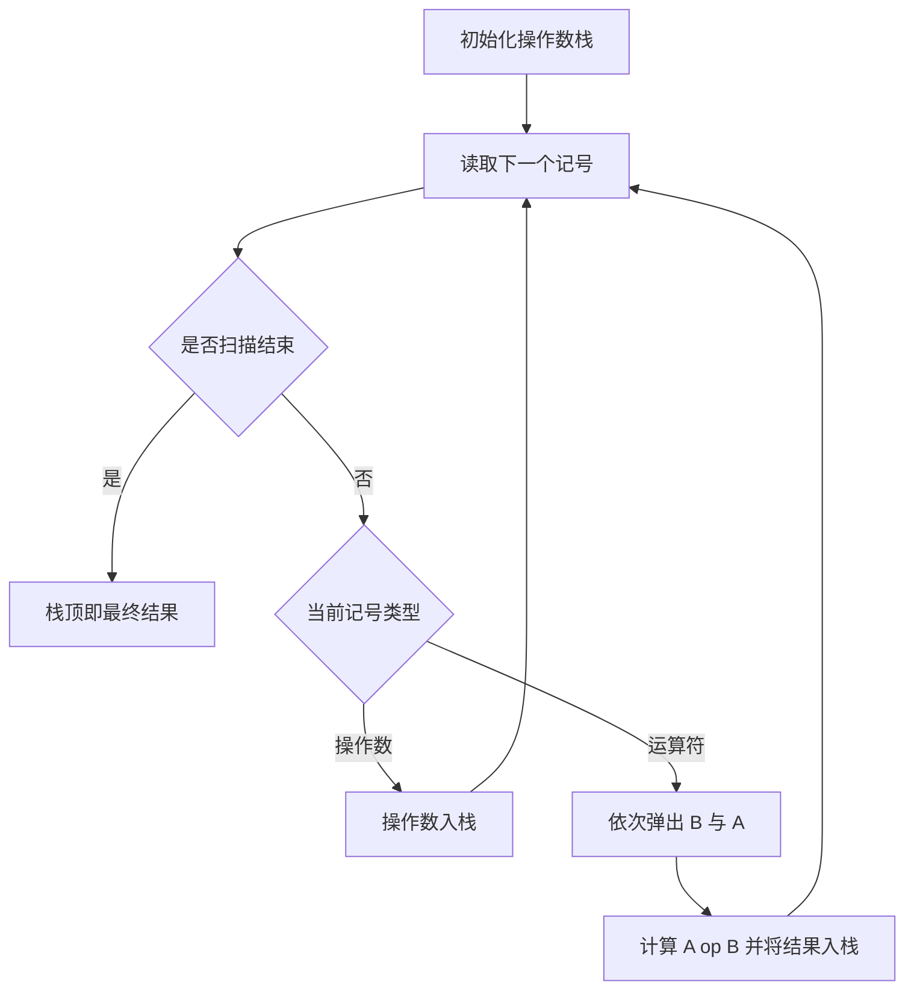
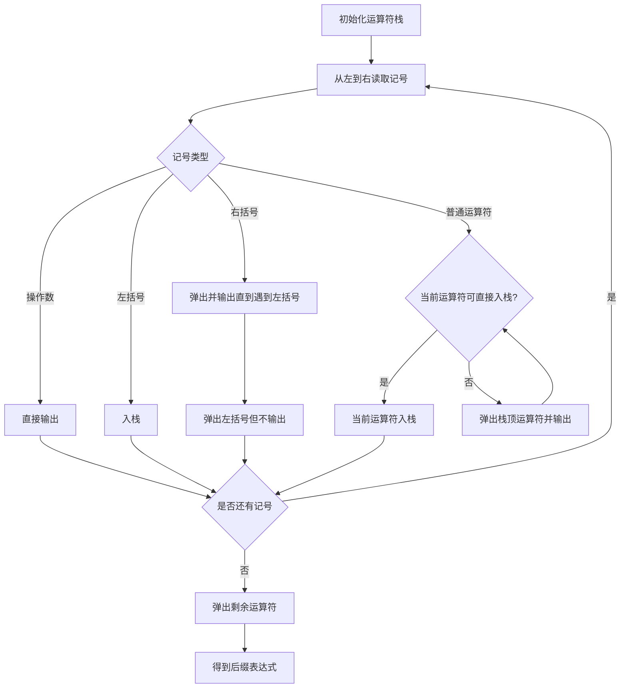

本章真正容易形成综合题的部分，是把“栈的 LIFO 约束”用于具体算法。

<Callout type="info" title="本节高频模型">
重点掌握：**表达式树、后缀求值、中缀求值、中缀转后缀、固定入栈顺序下的合法出栈序列，以及卡特兰数**。
</Callout>

## 16. 栈和队列的应用总览

栈适合处理“**最近产生的信息最先被继续处理**”的问题，例如：

- 函数调用与递归回退；
- 括号匹配；
- 表达式求值；
- 深度优先搜索；
- 回溯。

队列适合处理“**先到先处理**”的问题，例如：

- 缓冲区；
- 任务排队；
- 树的层序遍历；
- 图的广度优先搜索。

本节重点放在 408 中更常直接考查的**表达式与栈序列问题**。

另外，括号匹配也是最典型的栈应用：从左到右扫描，遇到左括号入栈，遇到右括号就检查它是否与栈顶左括号匹配；扫描结束后，只有“全过程未失配且栈最终为空”才说明括号合法。其本质仍是“最近出现、尚未匹配的左括号最先被处理”。

## 17. 二叉表达式树

<InlineSvg src="/images/data-structure/data-structure-array-application-001.svg" alt="ExpressionTree" />

### 17.1 基本结构

**二叉表达式树（expression tree）**&#x2060;用二叉树表示二元表达式：

- 叶结点通常保存**操作数**；
- 非叶结点通常保存**二元运算符**。

例如：

```text
(3 + 4) * (5 - 2) / 7
```

其最后执行的是除法，因此树根是 `/`；根的左子树表示 `(3 + 4) * (5 - 2)`，右子树是 `7`。

表达式树表达的是：

> **运算之间的依赖关系，而不是字符表面的书写顺序。**

### 17.2 从树看运算次序

越靠近叶结点的内部结点，其运算越早具备计算条件；根结点对应整个表达式最后完成的运算。

因此表达式树可以自然解释为什么：

- 前序遍历对应前缀形式；
- 中序遍历对应中缀形式；
- 后序遍历对应后缀形式。

## 18. 前缀、中缀与后缀表达式

<InlineSvg src="/images/data-structure/data-structure-array-application-002.svg" alt="表达式树与前序、中序、后序表达式" />
<InlineSvg src="/images/data-structure/data-structure-array-application-003.svg" alt="ExpressionTypes" />

### 18.1 三种形式

以：

```text
(A + B) * C
```

为例：

| 表达式 | 形式 |
| --- | --- |
| 前缀 | `* + A B C` |
| 中缀 | `(A + B) * C` |
| 后缀 | `A B + C *` |

对应表达式树遍历：

| 遍历 | 得到的表达式 |
| --- | --- |
| 前序 | 前缀表达式 |
| 中序 | 中缀表达式 |
| 后序 | 后缀表达式 |

前缀表达式又称**波兰表达式**，后缀表达式又称**逆波兰表达式**。

### 18.2 前缀与后缀的求值方向

对于二元运算符：

- **后缀表达式**从左向右扫描，遇到运算符时弹出两个操作数；
- **前缀表达式**常从右向左扫描，遇到运算符时弹出两个操作数。

前缀从右向左求值时，第一次弹出的值可作为**左操作数**，第二次弹出的值作为**右操作数**。这与后缀表达式“第一次弹出右操作数”的顺序不同。

### 18.3 为什么前缀/后缀通常不需要括号

在运算符元数已经确定时，运算符与操作数的相对位置已经编码了运算结构，因此通常无需括号也能唯一确定计算顺序。

例如：

```text
A B + C *
```

先由 `A B +` 得到一个结果，再与 `C` 做乘法。

## 19. 中缀表达式求值

### 19.1 为什么通常需要两个栈

人习惯写中缀表达式：

```text
3 + (5 * 2 - 8)
```

但扫描到一个运算符时，可能还不能立即判断它是否应该执行，因为要考虑：

- 运算符优先级；
- 结合性；
- 括号。

经典实现使用：

1. **操作数栈**；
2. **运算符栈**。

### 19.2 一次运算的弹栈顺序

若当前要执行运算符 `op`，操作数栈顶依次弹出：

```text
B = pop()
A = pop()
```

则应计算：

```text
A op B
```

并把结果重新压入操作数栈。

<Callout type="warn" title="减法和除法最容易丢分">
第一次弹出的元素是**右操作数**，第二次弹出的才是**左操作数**。因此是 `A - B`、`A / B`，不能写反。
</Callout>

### 19.3 左结合运算符下的基本扫描规则

<InlineSvg src="/images/data-structure/data-structure-array-application-004.svg" alt="基本计算单元" />
<InlineSvg src="/images/data-structure/data-structure-array-application-005.svg" alt="InfixEvaluation" />

以下先讨论常见的 `+ - * /`，它们都是左结合运算符。

从左到右扫描：

**遇到操作数：**

直接压入操作数栈。

**遇到左括号 `(`：**

直接压入运算符栈。

**遇到右括号 `)`：**

不断执行运算符栈顶运算，直到遇到 `(`；随后弹出 `(`，但括号本身不参与运算。

**遇到普通运算符 `op`：**

当运算符栈顶不是 `(`，且栈顶运算符的优先级**高于或等于**当前 `op` 时，应先执行栈顶运算；重复此过程，直到 `op` 可以入栈。

扫描结束后，把剩余运算符依次执行完。

### 19.4 完整示例

求：

```text
3 + (5 * 2 - 8)
```

| 步骤 | 输入 | 操作 | 运算符栈 | 操作数栈 |
| ---: | --- | --- | --- | --- |
| 1 | `3` | 操作数入栈 |  | `3` |
| 2 | `+` | 运算符入栈 | `+` | `3` |
| 3 | `(` | 左括号入栈 | `+ (` | `3` |
| 4 | `5` | 操作数入栈 | `+ (` | `3 5` |
| 5 | `*` | 运算符入栈 | `+ ( *` | `3 5` |
| 6 | `2` | 操作数入栈 | `+ ( *` | `3 5 2` |
| 7 | `-` | 先算 `5*2`，再压入 `-` | `+ ( -` | `3 10` |
| 8 | `8` | 操作数入栈 | `+ ( -` | `3 10 8` |
| 9 | `)` | 算 `10-8`，弹出 `(` | `+` | `3 2` |
| 10 | 结束 | 算 `3+2` |  | `5` |

最终结果：$5$。

### 19.5 右结合运算符需要单独判断

若题目包含右结合运算符，例如常见记号中的幂运算 `^`，则“相同优先级就弹栈”不再普遍成立。

例如：

```text
a ^ b ^ c
```

右结合意味着：

```text
a ^ (b ^ c)
```

因此处理当前 `^` 时，不能因为栈顶也是 `^` 就立即把栈顶弹出。

> **统一原则：比较优先级的同时，还要看当前运算符的结合性。**

## 20. 后缀表达式求值

<InlineSvg src="/images/data-structure/data-structure-array-application-006.svg" alt="后序表达式求值中操作数栈的操作" />

> **真题标签**
>
> 2018 年第 1 题涉及后缀表达式及其求值思想。

### 20.1 算法

后缀表达式求值只需要**一个操作数栈**：

1. 从左到右扫描；
2. 遇到操作数，入栈；
3. 遇到二元运算符，连续弹出两个操作数；
4. 计算结果并重新入栈；
5. 扫描结束时，栈顶即最终结果。

伪代码：

```text
for token in postfix:
    if token 是操作数:
        push(token)
    else:
        B = pop()
        A = pop()
        push(A token B)
```

### 20.2 流程图


```mermaid
flowchart TD
    A[初始化操作数栈] --> B[读取下一个记号]
    B --> C{是否扫描结束}
    C -->|是| H[栈顶即最终结果]
    C -->|否| D{当前记号类型}
    D -->|操作数| E[操作数入栈]
    E --> B
    D -->|运算符| F[依次弹出 B 与 A]
    F --> G[计算 A op B 并将结果入栈]
    G --> B
```

### 20.3 示例

后缀表达式：

```text
3 5 2 * 8 - +
```

| 当前记号 | 操作 | 栈 |
| --- | --- | --- |
| `3` | 入栈 | `3` |
| `5` | 入栈 | `3 5` |
| `2` | 入栈 | `3 5 2` |
| `*` | `5*2=10` | `3 10` |
| `8` | 入栈 | `3 10 8` |
| `-` | `10-8=2` | `3 2` |
| `+` | `3+2=5` | `5` |

结果为 $5$。

## 21. 中缀表达式转后缀表达式

> **真题标签**
>
> 2012 年第 2 题、2014 年第 2 题、2024 年第 2 题涉及中缀转后缀。

### 21.1 使用的数据结构

需要：

- 一个**运算符栈**；
- 一个**后缀输出序列**。

操作数不需要入运算符栈，能够确定顺序时直接输出。

### 21.2 操作数与括号规则

**操作数：**&#x2060;直接输出。

**左括号 `(`：**&#x2060;直接入栈。

**右括号 `)`：**&#x2060;不断弹出运算符并输出，直到遇到 `(`；最后只弹出 `(`，**不输出括号**。

### 21.3 普通左结合运算符规则

对于 `+ - * /`：

- 若栈空：当前运算符入栈；
- 若栈顶为 `(`：当前运算符入栈；
- 若当前运算符优先级高于栈顶：入栈；
- 否则不断弹出**优先级高于或等于当前运算符**的栈顶运算符并输出，然后再将当前运算符入栈。

因此对左结合运算符：

> **优先级相同，也要先弹出旧运算符。**

例如：

```text
a - b - c
```

应解释为：

```text
(a - b) - c
```

后缀表达式为：

```text
ab-c-
```

### 21.4 扫描结束

扫描完中缀表达式后，将运算符栈中剩余运算符依次弹出并追加到后缀序列。

合法表达式完成后，栈中不应遗留未匹配括号。

### 21.5 流程图


```mermaid
flowchart TD
    A[初始化运算符栈] --> B[从左到右读取记号]
    B --> C{记号类型}
    C -->|操作数| D[直接输出]
    C -->|左括号| E[入栈]
    C -->|右括号| F[弹出并输出直到遇到左括号]
    F --> G[弹出左括号但不输出]
    C -->|普通运算符| H{当前运算符可直接入栈?}
    H -->|是| I[当前运算符入栈]
    H -->|否| J[弹出栈顶运算符并输出]
    J --> H
    D --> K{是否还有记号}
    E --> K
    G --> K
    I --> K
    K -->|是| B
    K -->|否| L[弹出剩余运算符]
    L --> M[得到后缀表达式]
```

### 21.6 完整示例

中缀表达式：

```text
a/b+(c*d-e*f)/g
```

关键过程：

| 当前记号 | 运算符栈（处理后） | 后缀输出 |
| --- | --- | --- |
| `a` |  | `a` |
| `/` | `/` | `a` |
| `b` | `/` | `ab` |
| `+` | `+` | `ab/` |
| `(` | `+ (` | `ab/` |
| `c` | `+ (` | `ab/c` |
| `*` | `+ ( *` | `ab/c` |
| `d` | `+ ( *` | `ab/cd` |
| `-` | `+ ( -` | `ab/cd*` |
| `e` | `+ ( -` | `ab/cd*e` |
| `*` | `+ ( - *` | `ab/cd*e` |
| `f` | `+ ( - *` | `ab/cd*ef` |
| `)` | `+` | `ab/cd*ef*-` |
| `/` | `+ /` | `ab/cd*ef*-` |
| `g` | `+ /` | `ab/cd*ef*-g` |
| 结束 |  | `ab/cd*ef*-g/+` |

最终后缀表达式：

```text
ab/cd*ef*-g/+
```

## 22. 固定入栈顺序与合法出栈序列

> **真题标签**
>
> 2009 年第 2 题、2010 年第 1 题、2011 年第 2 题、2013 年第 2 题、2015 年第 2 题、2017 年第 2 题、2018 年第 2 题、2020 年第 2 题、2022 年第 2 题，以及 2026 年第 42 题涉及入栈/出栈序列及相关计数。

### 22.1 为什么入栈顺序固定，出栈顺序仍不唯一

若固定入栈顺序：

```text
1, 2, 3
```

可以选择：

- 某元素刚入栈就立即出栈；
- 继续压入后续元素后再出栈。

例如：

```text
push 1
push 2
pop  -> 2
push 3
pop  -> 3
pop  -> 1
```

得到：

```text
2, 3, 1
```

所以“入栈次序确定”并不能唯一确定“出栈次序”。

### 22.2 判断合法性的最稳方法：模拟

<InlineSvg src="/images/data-structure/data-structure-array-application-007.svg" alt="A B • • • • • • A B • • • B 出栈 A • • • A 出栈 出栈序列： • • • B A • • • A 一定在 B 之后出栈" />

给定固定入栈序列 `input[]` 和目标出栈序列 `output[]`：

```text
初始化空栈 S
j = 0

依次扫描 input 中每个元素 x:
    push(x)

    while S 非空 且 top(S) == output[j]:
        pop()
        j++

若最后 j == n:
    目标序列合法
否则:
    不合法
```

该方法时间复杂度为 $O(n)$，因为每个元素最多入栈一次、出栈一次。

### 22.3 局部约束

若 `A` 先入栈，而 `B` 后入栈；并且当 `B` 入栈时 `A` 还在栈中，则此时：

```text
B
A
```

`A` 被 `B` 压住，因此必须先弹出 `B`，才能弹出 `A`。

这就是所有栈序列约束的根源：

> **任何时刻都只能弹出当前栈顶。**

### 22.4 递增入栈序列的禁形理解

对于固定入栈顺序：

```text
1, 2, ..., n
```

一个排列若不是合法栈输出，则会出现三个位置 $i<j<k$，满足：

$$
P_j<P_k<P_i
$$

即相对大小模式为 `3-1-2`。

这可作为理论判断，但考试中面对具体序列时，**直接模拟通常更稳**。

## 23. 卡特兰数

<InlineSvg src="/images/data-structure/data-structure-array-application-008.svg" alt="卡特兰数及其典型计数问题" />

> **真题标签**
>
> 2015 年第 2 题及 2026 年第 42 题涉及合法栈序列计数与卡特兰数思想。

### 23.1 固定入栈顺序的合法出栈序列数量

有 $n$ 个互不相同的元素，按固定顺序依次允许入栈；每个元素恰好入栈一次、出栈一次。

合法出栈序列总数为第 $n$ 个**卡特兰数（Catalan number）**：

$$
C_n=\frac{1}{n+1}\binom{2n}{n}
=\frac{(2n)!}{n!(n+1)!}
$$

前几个值：

| $n$ | $C_n$ |
| ---: | ---: |
| 0 | 1 |
| 1 | 1 |
| 2 | 2 |
| 3 | 5 |
| 4 | 14 |
| 5 | 42 |
| 6 | 132 |

### 23.2 为什么会得到卡特兰数

把一次入栈记为 $+1$，一次出栈记为 $-1$。

总过程包含：

- $n$ 次入栈；
- $n$ 次出栈。

任何时刻都不能从空栈继续出栈，因此任意前缀都必须满足：

$$
\text{入栈次数}\ge\text{出栈次数}
$$

并且最终二者相等。这正对应经典卡特兰路径约束。

### 23.3 递推式

卡特兰数满足：

$$
C_0=1
$$

以及：

$$
C_n=\sum_{i=0}^{n-1}C_iC_{n-1-i},\qquad n\ge1
$$

还常用递推比值：

$$
C_{n+1}=\frac{2(2n+1)}{n+2}C_n
$$

### 23.4 2026 真题常见变形：固定首个出栈元素

固定入栈顺序为：

```text
1, 2, ..., n
```

若规定**第一个出栈元素为 1**，则操作前缀只能是：

```text
push(1), pop(1)
```

剩余 $2,3,\ldots,n$ 的合法出栈方式与规模 $n-1$ 的原问题一一对应，所以数量为：

$$
C_{n-1}
$$

若规定**第一个出栈元素为 2**，操作前缀必为：

```text
push(1), push(2), pop(2)
```

此后栈底保留元素 1，剩余过程同样可与规模 $n-1$ 的合法过程建立一一对应，因此数量也为：

$$
C_{n-1}
$$

例如 $n=4$ 时，以 2 开头的合法出栈序列共有：

$$
C_3=5
$$

<Callout type="warn" title="不要把这个结论随意推广到任意首元素">
“首个出栈为 1 或 2 时均为 $C_{n-1}$”是特定结构下的结论。若首个出栈元素固定为更一般的 $m$，需要结合此前压入栈中的元素约束重新计数，不能直接照搬。
</Callout>

### 23.5 常见等价计数模型

经常出现卡特兰数的模型包括：

- 固定入栈顺序的合法出栈序列数；
- $n$ 对括号的合法匹配方式数；
- 含 $n$ 个结点的不同二叉树**形状**数；
- 某些满足“任意前缀不能越界”约束的路径计数。

<Callout type="warn" title="看到二叉树不要无条件乘/套 Catalan">
$C_n$ 统计的是含 $n$ 个结点的不同**二叉树形状**。如果结点还带有互不相同的标签，并允许任意标签分配，还必须继续考虑标签排列，不能只写 $C_n$。
</Callout>
