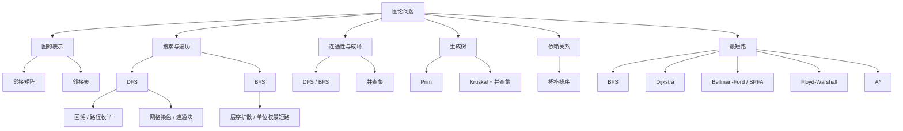

# 图论总结篇

到这里，整个图论模块已经形成了一条完整的学习链：

**图的表示 → DFS / BFS → 网格与连通块 → 并查集 → 最小生成树 → 拓扑排序 → 最短路。**

真正需要掌握的并不是三十多个孤立的题目，而是这些题目背后的几类**图模型、状态含义与算法范式**。

<Callout type="success" title="这一章最重要的目标">

以后看到一道新题，不要先问“它像哪道题”，而要先回答：

1. **节点是什么？边是什么？**
2. **边有没有方向、权值？**
3. **目标是遍历、连通、成环、排序、最小生成树，还是最短路？**
4. **图的规模与稠密度如何？**
5. **有没有负权、边数限制、多源查询等特殊条件？**

只要这五个问题能快速回答，绝大多数基础图论题都能自然落到正确算法上。

</Callout>

---

## 1. 图论知识地图



这张图可以作为整个章节的长期复习框架。

---

## 2. 第一件事：把题目“建成图”

很多图论题并不会直接告诉你“这是一个图”。

真正的第一步通常是：

> **确定节点、边，以及边在什么条件下存在。**

例如：

- 网格中的每个格子可以是节点；
- 单词接龙中的每个单词可以是节点；
- 课程可以是节点，先修关系是有向边；
- 城市可以是节点，道路是带权边；
- 状态搜索中，每一种状态都可以视为节点，一次合法操作就是一条边。

### 2.1 邻接矩阵

设有 $V$ 个顶点，用：

$$
G[i][j]
$$

表示从顶点 $i$ 到顶点 $j$ 的边。

空间复杂度：

$$
O(V^2)
$$

适合：

- 图比较稠密；
- 顶点数不大；
- 需要快速判断任意两点是否直接相邻；
- Floyd、朴素 Prim、朴素 Dijkstra 等矩阵型实现。

### 2.2 邻接表

只记录实际存在的边。

空间复杂度通常为：

$$
O(V+E)
$$

对于稀疏图尤其合适。

<Cards>
  <Card title="邻接矩阵">
    查询任意一条边方便，但空间固定为 $O(V^2)$。
  </Card>
  <Card title="邻接表">
    只保存实际边，遍历某个顶点的邻边更自然，通常也是算法题的默认选择。
  </Card>
</Cards>

### 2.3 有向图与无向图最容易写错的地方

无向边：

$$
u\leftrightarrow v
$$

建图时需要同时加入：

```text
u -> v
v -> u
```

有向边：

$$
u\rightarrow v
$$

只加入：

```text
u -> v
```

很多“算法思路正确但结果错误”的问题，本质上只是**建图方向错了**。

---

## 3. DFS 与 BFS：图论中最基础的两种搜索

DFS 与 BFS 并不只是两个代码模板，而是两种完全不同的搜索顺序。

### 3.1 DFS：沿一条路尽可能向深处走

DFS 的核心过程可以概括为：

```text
进入当前节点
↓
枚举下一节点
↓
递归深入
↓
递归返回
```

典型复杂度：

$$
O(V+E)
$$

适合：

- 连通块；
- 染色；
- 路径枚举；
- 判断可达性；
- 回溯型搜索；
- 树与图上的递归问题。

### 3.2 BFS：按距离一层一层扩散

BFS 的核心结构是**队列**：

```text
起点入队
↓
取队首
↓
访问所有未访问邻居
↓
邻居入队
```

在无权图或所有边权相同的图中，BFS 第一次到达一个节点时，就得到了按边数计算的最短距离。

因此它不仅是遍历算法，也是：

> **单位权最短路算法。**

---

## 4. DFS 两种常见写法，本质差别是什么

DFS 经常出现看起来不同、实际上都正确的写法。

根本区别在于：

> **`dfs(u)` 的语义到底是“处理节点 $u$”，还是“从节点 $u$ 出发继续搜索”。**

### 写法 A：进入 DFS 后处理当前节点

```text
dfs(u):
    visited[u] = true
    for v in adj[u]:
        if not visited[v]:
            dfs(v)
```

### 写法 B：在递归前处理下一节点

```text
dfs(u):
    for v in adj[u]:
        if not visited[v]:
            visited[v] = true
            dfs(v)
```

两者都可以正确，只要：

- 起点初始化一致；
- `visited` 的含义一致；
- 不出现重复访问。

<Callout type="info" title="先定义递归函数的含义">

写递归前先用一句话定义：

> `dfs(u)` 表示什么？

只要定义清楚，递归位置、标记位置以及回溯操作通常都能自然确定。

</Callout>

---

## 5. “递归会回溯”与“题目需要回溯”是两回事

只要使用递归，函数调用结束以后就一定会返回上一层，这从执行过程上说就是“回去”。

但算法题中所说的**回溯**通常是指：

> 在返回上一层时，需要主动撤销当前路径上的状态。

例如枚举所有路径：

```text
path.push(v)
dfs(v)
path.pop()
```

这里的 `pop()` 才是解题意义上的回溯操作。

### 什么时候通常要撤销状态

如果状态描述的是：

- 当前路径；
- 当前选择；
- 当前排列；
- 当前方案；

通常要回溯。

### 什么时候通常不需要撤销

如果 `visited` 表示：

> 这个节点在整个搜索过程中已经永久处理过。

例如岛屿染色、普通连通性搜索，就不应该恢复。

---

## 6. BFS 最重要的细节：入队时就标记

这是整个图论章节中非常值得长期记住的一条规则：

> **一个节点一旦加入 BFS 队列，就应该立即标记为已访问。**

正确顺序：

```text
if v 未访问:
    visited[v] = true
    queue.push(v)
```

而不是：

```text
queue.push(v)

// 等出队才 visited[v] = true
```

如果出队才标记，那么在真正出队之前，多个邻居可能重复把同一个节点加入队列。

这会导致：

- 队列中出现大量重复状态；
- 时间复杂度恶化；
- 某些题直接超时。

---

## 7. 网格图：很多“矩阵题”本质都是图论题

一个 $m\times n$ 的网格可以看成一个图：

- 每个格子是一个顶点；
- 上下左右相邻关系是边。

四方向通常统一写为：

```text
dirs = {(-1,0), (1,0), (0,-1), (0,1)}
```

图中的顶点数：

$$
V=mn
$$

最多只有常数倍边，因此 DFS / BFS 通常都是：

$$
O(mn)
$$

### 7.1 岛屿题真正练的是什么

岛屿系列并不是在反复练同一道题，而是在练四种不同的思想：

| 题型 | 核心思想 |
| --- | --- |
| 岛屿数量 | 统计连通块 |
| 最大岛屿面积 | 搜索过程中维护连通块大小 |
| 孤岛总面积 | 从边界反向标记 |
| 沉没孤岛 | 边界连通区域保留，其余修改 |
| 水流问题 | 从终点集合反向搜索 |
| 建造最大岛屿 | 连通块编号 + 预处理面积 + 邻块去重 |
| 岛屿周长 | 局部贡献 / 共享边计数 |

<Callout type="warning" title="看到网格不要条件反射地 DFS/BFS">

例如“岛屿周长”可以直接统计每个陆地格子的四条边，或利用：

$$
P=4L-2A
$$

其中：

- $L$ 为陆地格子数；
- $A$ 为陆地之间共享边的数量。

有时局部计数比图搜索更简单。

</Callout>

---

## 8. 隐式图：题目里没有边，也可能是图

“字符串接龙”是很典型的例子。

题目没有显式给边，但如果两个字符串只相差一个字符，就可以认为存在边：

$$
word_i\leftrightarrow word_j
$$

这类图叫做**隐式图**：

> 不预先保存全部边，而是在搜索当前状态时动态生成相邻状态。

状态空间搜索、棋盘变换、密码变换、单词变换等问题都大量使用这种思想。

因此做题时不要只寻找“输入里的边”，还要问：

> **一次合法操作是否可以视为一条边？**

---

## 9. 并查集：维护动态连通关系

并查集最核心的两个操作：

```text
find(x)      // 查询 x 所属集合的代表元
union(a, b)  // 合并两个集合
```

它解决的是：

> **不断加入连接关系时，快速判断两个点是否已经连通。**

### 9.1 基本结构

每个集合由一棵树表示，根节点作为代表元。

```text
parent[x] = x
```

表示 $x$ 当前是根。

### 9.2 路径压缩

查找时直接把沿途节点连接到根：

$$
parent[x]\leftarrow find(parent[x])
$$

配合按秩合并或按大小合并，并查集一系列操作的均摊复杂度为：

$$
O(\alpha(V))
$$

其中 $\alpha$ 为反阿克曼函数，在实际数据规模下可以近似理解成常数。

### 9.3 什么时候优先想到并查集

<Cards>
  <Card title="动态连通">
    不断加入边，并反复判断两个点是否属于同一个连通块。
  </Card>
  <Card title="无向图成环">
    加入一条边前，若两端已经在同一集合，则加入后形成环。
  </Card>
  <Card title="Kruskal">
    按边权从小到大选边，并查集负责判断“这条边会不会形成环”。
  </Card>
</Cards>

---

## 10. 冗余连接：并查集为什么特别适合判环

在无向图中加入边 $(u,v)$ 时：

- 如果 `find(u) != find(v)`，连接两个原本不同的连通块；
- 如果 `find(u) == find(v)`，两点原本已经存在路径，再加一条边就形成环。

所以判环可以写成：

```text
if find(u) == find(v):
    当前边是成环边
else:
    union(u, v)
```

### 有向图为什么复杂得多

有向树不仅要求无环，还要求：

- 根节点入度为 $0$；
- 其他每个节点入度为 $1$；
- 所有节点属于同一棵树。

因此“冗余连接 II”必须同时分析：

1. 是否出现入度为 $2$；
2. 删除候选边后是否仍然成环。

这也是一个很典型的经验：

> **算法结构本身不一定难，真正难的是先把题目的结构约束拆清楚。**

---

## 11. 最小生成树：连接所有点的最低总代价

对于连通无向带权图，最小生成树要求：

- 覆盖所有 $V$ 个顶点；
- 只有 $V-1$ 条边；
- 不含环；
- 总边权最小。

核心算法是 Prim 与 Kruskal。

---

## 12. Prim：从“点”扩张生成树

Prim 的视角是：

> **当前生成树已经包含一组顶点，下一步选择离这棵树最近的新顶点。**

经典三步：

### 选择距离当前生成树最近的未加入节点

维护：

$$
minDist[v]
$$

表示顶点 $v$ 到当前生成树的最小边权。

### 将该节点加入生成树

它到当前生成树的最优连接边已经确定。

### 用新节点更新其他未加入节点的 `minDist`

不断扩大当前生成树。

朴素矩阵实现复杂度通常为：

$$
O(V^2)
$$

因此在顶点规模适中、图较稠密时非常自然。

---

## 13. Kruskal：从“边”构造生成树

Kruskal 的视角完全不同：

> **所有边从小到大排序，只要加入当前边不会形成环，就选它。**

步骤：

1. 将所有边按权值升序排序；
2. 依次扫描；
3. 若两个端点属于不同集合，就选中该边；
4. 用并查集合并两个集合；
5. 选够 $V-1$ 条边后结束。

排序占主要复杂度：

$$
O(E\log E)
$$

并查集操作接近线性，因此 Kruskal 特别适合边较少的稀疏图。

### Prim 与 Kruskal 的核心区别

| 对比 | Prim | Kruskal |
| --- | --- | --- |
| 贪心对象 | 顶点 / 当前生成树 | 全局边 |
| 核心维护 | `minDist` | 排序后的边 + 并查集 |
| 典型实现 | $O(V^2)$ | $O(E\log E)$ |
| 常见优势 | 稠密图 | 稀疏图 |

<Callout type="info" title="不要把复杂度背成固定结论">

Prim 也可以使用堆优化，复杂度可做到与稀疏图更匹配的量级。因此“Prim 只适合稠密图”是对常见朴素实现的经验概括，而不是算法本身的绝对限制。

</Callout>

---

## 14. 拓扑排序：处理“先后依赖”

拓扑排序的对象是：

> **有向无环图 DAG。**

如果边：

$$
u\rightarrow v
$$

表示 $u$ 必须发生在 $v$ 之前，那么拓扑排序就是找一个满足所有这种先后约束的线性序列。

典型场景：

- 课程依赖；
- 编译依赖；
- 工作流调度；
- 文件下载依赖；
- 构建系统依赖。

### Kahn 算法两步循环

### 找所有入度为 $0$ 的节点

这些节点当前没有任何前置依赖。

### 删除这些节点及其出边

它指向的节点入度减 $1$，新的零入度节点继续入队。

如果最后处理的顶点数小于 $V$：

$$
processed<V
$$

说明剩余节点互相依赖，图中存在有向环。

复杂度：

$$
O(V+E)
$$

---

## 15. 最短路：先看“边权条件”，再选算法

最短路是整个基础图论中最容易“算法名字记了一堆，但不会选”的部分。

最有效的办法是从条件出发。

### 15.1 统一决策表

| 条件 | 优先算法 | 典型复杂度 |
| --- | --- | --- |
| 无权图 / 所有边权相同 | BFS | $O(V+E)$ |
| 单源、非负权、稠密图 | 朴素 Dijkstra | $O(V^2)$ |
| 单源、非负权、稀疏图 | 堆优化 Dijkstra | $O((V+E)\log V)$ |
| 单源、存在负权边 | Bellman-Ford | $O(VE)$ |
| 负权图，尝试队列优化 | SPFA | 最坏 $O(VE)$ |
| 判断源点可达的负权环 | Bellman-Ford / SPFA 判环 | $O(VE)$ 最坏 |
| 最多经过有限条边 | 分层 Bellman-Ford | $O(KE)$ |
| 所有点对最短路 | Floyd-Warshall | $O(V^3)$ |
| 单目标、可构造有效启发函数 | A* | 取决于启发函数与搜索空间 |

---

## 16. Dijkstra：为什么不能有负权边

Dijkstra 的核心贪心是：

> 从还没有确定最短距离的点里，取当前距离最小的点 $u$，并认为它的最短距离已经最终确定。

这个结论依赖：

$$
w(e)\ge0
$$

如果存在负权边，一个当前距离很大的节点未来可能通过负边，把已经“确定”的节点更新得更小。

因此：

<Callout type="warning" title="Dijkstra 的硬条件">

只要题目可能存在负权边，就不能直接使用标准 Dijkstra。

</Callout>

---

## 17. Bellman-Ford：把最短路理解为反复松弛

设：

$$
dist[v]
$$

表示当前已知从源点到 $v$ 的最短距离。

对边：

$$
u\xrightarrow{w}v
$$

执行松弛：

$$
dist[v]=\min(dist[v],\ dist[u]+w)
$$

Bellman-Ford 对所有边进行最多 $V-1$ 轮松弛。

为什么是 $V-1$？

如果最短路不包含重复顶点，那么一条简单路径最多包含：

$$
V-1
$$

条边。

每完成一轮全边松弛，可以理解为允许最短路再多使用一条边。

这也直接解释了“最多经过 $K$ 条边”的变体为什么可以使用**分层 Bellman-Ford**。

---

## 18. 负权环：为什么最短路可能根本不存在

如果存在一个可从源点到达的环，其总权值：

$$
W_{cycle}<0
$$

那么每绕这个环一圈，总路径长度都会继续减小。

于是可以得到：

$$
d,
\quad d+W_{cycle},
\quad d+2W_{cycle},
\quad \cdots
$$

并且：

$$
\lim_{k\to\infty}(d+kW_{cycle})=-\infty
$$

所以不存在有限意义上的最短路。

### Bellman-Ford 判负环

正常做完 $V-1$ 轮松弛以后，再检查一轮。

如果仍然存在：

$$
dist[v]>dist[u]+w
$$

则说明存在**从源点可达并会影响单源最短路**的负权环。

<Callout type="warning" title="注意题意范围">

“图中存在任意负环”和“源点可达范围内存在负环”不是同一个问题。

如果题目要求检测整张图中的任意负环，需要确保所有连通区域都被纳入检测，例如使用虚拟超级源点连接所有顶点。

</Callout>

---

## 19. SPFA：它是什么，又不是什么

SPFA 可以理解为：

> **只继续处理那些刚刚被成功松弛的节点。**

相比 Bellman-Ford 每轮扫描全部边，它用队列减少很多“明显不会产生更新”的扫描。

但必须记住：

$$
\text{最坏时间复杂度仍然为 }O(VE)
$$

所以 SPFA 不是一个拥有稳定更优复杂度的“升级版 Bellman-Ford”。

在竞赛环境中还可能遇到专门卡 SPFA 的数据。

---

## 20. Floyd-Warshall：动态规划视角下的多源最短路

Floyd 的状态转移可以写成：

$$
d^{(k)}[i][j]
=
\min\left(
 d^{(k-1)}[i][j],
 d^{(k-1)}[i][k]+d^{(k-1)}[k][j]
\right)
$$

其含义是：

> 允许把节点 $k$ 作为中间节点以后，$i$ 到 $j$ 的最短距离是否会变短？

最终得到所有点对最短距离。

复杂度：

$$
O(V^3)
$$

空间复杂度常用二维压缩后为：

$$
O(V^2)
$$

适合：

- 顶点数不大；
- 需要大量任意两点间最短路查询；
- 存在负权边但不存在影响答案的负环。

---

## 21. A*：不是“另一种 Dijkstra”，而是有目标信息的搜索

A* 使用评价函数：

$$
f(n)=g(n)+h(n)
$$

其中：

- $g(n)$：起点到当前节点的真实代价；
- $h(n)$：当前节点到终点的启发式估计；
- $f(n)$：综合优先级。

如果：

$$
h(n)=0
$$

A* 会退化为类似 Dijkstra 的搜索。

如果启发函数能够有效估计“还剩多远”，A* 会优先向目标方向探索，从而显著减少无关状态。

### 保证最优性的关键

常见充分条件之一是启发函数**可采纳**：

$$
0\le h(n)\le h^*(n)
$$

其中 $h^*(n)$ 是从 $n$ 到目标的真实最短距离。

也就是说：

> 启发函数不能高估剩余代价。

网格四方向、每步代价为 $1$ 时，曼哈顿距离：

$$
h(x,y)=|x-x_t|+|y-y_t|
$$

就是典型选择。

---

## 22. 一套真正可执行的图论选型流程

以后拿到题目，可以按下面顺序判断。

### 先判断是不是“搜索 / 连通”问题

只问能否到达、连通块数量、区域面积、是否存在路径：

- DFS；
- BFS；
- 或需要动态合并时用并查集。

### 如果是最短路，先看边权

- 所有边权相同 → BFS；
- 边权非负 → Dijkstra；
- 有负权 → Bellman-Ford / SPFA；
- 所有点对 → Floyd。

### 如果目标是连接所有点且总代价最小

这是最小生成树：

- Prim；
- Kruskal。

### 如果题目描述“依赖、先后、前置条件”

想到 DAG 与拓扑排序。

### 如果不断加边并询问是否连通 / 是否成环

想到并查集。

### 如果状态空间巨大，但目标明确并且能估计剩余代价

考虑 A*。

---

## 23. 高频关键词 → 算法映射

| 题目关键词 | 第一反应 |
| --- | --- |
| 连通块、岛屿、区域 | DFS / BFS |
| 所有路径 | DFS + 回溯 |
| 最少步数、最少操作次数 | BFS |
| 动态连通、合并集合 | 并查集 |
| 加一条无向边是否成环 | 并查集 |
| 连所有节点且总代价最小 | MST |
| 稠密图 MST | Prim 常见 |
| 边列表、稀疏图 MST | Kruskal 常见 |
| 课程依赖、任务依赖 | 拓扑排序 |
| 非负权单源最短路 | Dijkstra |
| 负权单源最短路 | Bellman-Ford |
| 负环 | Bellman-Ford / SPFA 判环 |
| 最多经过 $K$ 条边 | 分层 Bellman-Ford |
| 任意两点最短路 | Floyd |
| 巨大状态空间 + 明确终点 | A* |

这张表适合在复习阶段反复看，最终目标是看到题意后不需要查表也能自然判断。

---

## 24. 复杂度总表

设：

$$
V=\text{顶点数},\qquad E=\text{边数}
$$

| 算法 | 时间复杂度 | 常见空间复杂度 |
| --- | --- | --- |
| DFS | $O(V+E)$ | $O(V)$ 加递归栈 |
| BFS | $O(V+E)$ | $O(V)$ |
| 并查集 | 单次均摊近似 $O(1)$，严格为 $O(\alpha(V))$ | $O(V)$ |
| Prim（朴素） | $O(V^2)$ | 依实现而定 |
| Kruskal | $O(E\log E)$ | $O(V+E)$ |
| 拓扑排序 | $O(V+E)$ | $O(V+E)$ |
| Dijkstra（朴素） | $O(V^2+E)$，常写 $O(V^2)$ | $O(V)$ 或 $O(V^2)$ |
| Dijkstra（堆优化） | $O((V+E)\log V)$ | $O(V+E)$ |
| Bellman-Ford | $O(VE)$ | $O(V)$ |
| SPFA | 最坏 $O(VE)$ | $O(V+E)$ |
| Floyd-Warshall | $O(V^3)$ | $O(V^2)$ |

<Callout type="info" title="复杂度必须结合存图方式理解">

同一个算法使用邻接矩阵、邻接表、优先队列时，最终复杂度可能不同。不要脱离具体实现单独背复杂度。

</Callout>

---

## 25. 最容易犯的 12 个错误

<Cards>
  <Card title="1. 无向边只建一个方向">
    导致图被错误地当成有向图。
  </Card>
  <Card title="2. DFS 忘记 visited">
    图中存在环时可能无限递归。
  </Card>
  <Card title="3. BFS 出队时才标记">
    同一节点可能被重复入队很多次。
  </Card>
  <Card title="4. 路径搜索忘记回溯">
    `path` 会混入其他分支的节点。
  </Card>
  <Card title="5. 染色题错误恢复 visited">
    导致一个连通块被重复搜索。
  </Card>
  <Card title="6. 网格题把对角线也算连通">
    四连通与八连通必须严格区分。
  </Card>
  <Card title="7. 并查集 union 的不是根节点">
    容易破坏集合结构或复杂度。
  </Card>
  <Card title="8. Kruskal 不判环就选边">
    最终得到的就不再是树。
  </Card>
  <Card title="9. 拓扑排序不检查处理节点数">
    会漏掉有向环。
  </Card>
  <Card title="10. Dijkstra 用在负权图">
    贪心正确性直接失效。
  </Card>
  <Card title="11. Bellman-Ford 原地更新有限边数问题">
    同一轮可能偷用了多条边，必须使用上一轮快照。
  </Card>
  <Card title="12. 把 A* 的启发函数随便写大">
    启发函数高估时，可能失去最短路最优性保证。
  </Card>
</Cards>

---

## 26. 图论做题时应该维护什么“状态”

真正决定算法能否写对的，往往不是循环，而是变量含义。

### DFS / BFS

```text
visited[v]
```

表示：

> 节点 $v$ 是否已经进入过搜索体系。

### Dijkstra / Bellman-Ford

```text
dist[v]
```

表示：

> 当前已知从源点到 $v$ 的最优距离。

### Prim

```text
minDist[v]
```

表示：

> 节点 $v$ 到当前生成树的最小连接代价。

### 拓扑排序

```text
indegree[v]
```

表示：

> 当前还没有被移除的前置依赖数量。

### 并查集

```text
parent[v]
```

表示：

> $v$ 当前所在集合的父指针。

<Callout type="success" title="变量语义比代码模板更重要">

如果能够准确说出数组中每个值“在算法执行到当前时刻代表什么”，很多图论算法就不需要死记。

</Callout>

---

## 27. 从“算法模板”升级到“正确性证明”

高质量掌握图论不能停留在“我会写模板”。

至少应该知道每个算法为什么正确。

| 算法 | 正确性的核心理由 |
| --- | --- |
| BFS 最短路 | 按边数分层扩展，先到达即层数最小 |
| DFS 连通块 | 从一个起点会遍历其整个可达集合 |
| 并查集判环 | 两端已连通时再加边必形成无向环 |
| Prim | 每次选择跨越当前割的最轻边 |
| Kruskal | 按权选取不会成环的最轻边，满足割性质 |
| 拓扑排序 | 入度为 $0$ 的点没有剩余前驱约束 |
| Dijkstra | 非负边保证当前最小未确定距离不会再被后续路径降低 |
| Bellman-Ford | 第 $k$ 轮后可得到最多使用 $k$ 条边的最短路径 |
| Floyd | 逐步允许更多中间节点的动态规划 |
| A* | 合适的启发函数下，用 $g+h$ 安全地引导搜索方向 |

当你能把这些理由用自己的话讲出来时，就真正摆脱了机械背模板。

---

## 28. 一套适合复习的学习顺序

如果以后需要快速重新复习图论，可以按下面顺序：

### 第一轮：图与搜索

1. 图的表示；
2. DFS；
3. BFS；
4. 所有可达路径；
5. 岛屿系列。

目标：看到一个图，能够自然完成遍历与连通性处理。

### 第二轮：集合与结构

1. 并查集；
2. 冗余连接；
3. 冗余连接 II；
4. 拓扑排序。

目标：理解连通集合、成环与依赖结构。

### 第三轮：带权图

1. Prim；
2. Kruskal；
3. Dijkstra；
4. Bellman-Ford；
5. SPFA；
6. Floyd；
7. A*。

目标：根据问题目标与边权条件快速选算法。

---

## 29. 模块文档索引

### 图与搜索

- [图论为什么要使用 ACM 模式](./01-图论为什么要使用-ACM-模式)
- [图论理论基础](./02-图论理论基础)
- [深度优先搜索理论基础](./03-深度优先搜索-DFS-理论基础)
- [所有可达路径](./04-所有可达路径-DFS-路径枚举模板)
- [广度优先搜索理论基础](./05-广度优先搜索-BFS-理论基础)

### 网格与连通块

- [岛屿数量：DFS](./06-岛屿数量-DFS-与连通块)
- [岛屿数量：BFS](./07-岛屿数量-BFS-与入队即标记)
- [岛屿的最大面积](./08-岛屿的最大面积)
- [孤岛的总面积](./09-孤岛的总面积)
- [沉没孤岛](./10-沉没孤岛)
- [水流问题](./11-水流问题)
- [建造最大岛屿](./12-建造最大岛屿)
- [岛屿的周长](./13-岛屿的周长)
- [字符串接龙](./14-字符串接龙)
- [有向图的完全联通](./15-有向图的完全联通)

### 并查集与最小生成树

- [并查集理论基础](./16-并查集理论基础)
- [寻找存在的路径](./17-寻找存在的路径)
- [冗余连接](./18-冗余连接)
- [冗余连接 II](./19-冗余连接-II)
- [Prim 算法精讲](./20-Prim-算法精讲)
- [Kruskal 算法精讲](./21-Kruskal-算法精讲)

### DAG 与最短路

- [拓扑排序精讲](./22-拓扑排序精讲)
- [Dijkstra：朴素版](./23-Dijkstra（朴素版）精讲)
- [Dijkstra：堆优化版](./24-Dijkstra（堆优化版）精讲)
- [Bellman-Ford 算法精讲](./25-Bellman-Ford-算法精讲)
- [Bellman-Ford 队列优化：SPFA](./26-Bellman-Ford-队列优化（SPFA）)
- [Bellman-Ford 判断负权回路](./27-Bellman-Ford-判断负权回路)
- [Bellman-Ford 单源有限最短路](./28-Bellman-Ford-单源有限最短路)
- [Floyd 算法精讲](./29-Floyd-算法精讲)
- [A* 算法精讲](./30-A-算法精讲)
- [最短路算法总结篇](./31-最短路算法总结篇)

---

## 30. 最后的做题框架

以后遇到图论题，可以强制自己先写出下面这一组问题：

```text
1. 节点是什么？
2. 边是什么？
3. 有向还是无向？
4. 有权还是无权？
5. 稠密还是稀疏？
6. 要求的是：
   - 可达？
   - 连通块？
   - 成环？
   - 所有路径？
   - 最小生成树？
   - 依赖排序？
   - 最短路？
7. 如果是最短路：
   - 单位权？
   - 非负权？
   - 负权？
   - 负环？
   - 多源？
   - 限制边数？
   - 有明确目标并能设计启发函数？
8. 数据规模允许什么复杂度？
```

这比“凭感觉猜算法”可靠得多。

---

## 31. 终极速查表

| 目标 | 首选思路 |
| --- | --- |
| 遍历整张图 | DFS / BFS |
| 连通块数量 | DFS / BFS |
| 枚举路径 | DFS + 回溯 |
| 无权最短路 | BFS |
| 动态连通 | 并查集 |
| 无向图增边判环 | 并查集 |
| 最小生成树 | Prim / Kruskal |
| 依赖排序 / DAG | 拓扑排序 |
| 非负权单源最短路 | Dijkstra |
| 负权单源最短路 | Bellman-Ford |
| 负环检测 | Bellman-Ford / SPFA |
| 有限边数最短路 | 分层 Bellman-Ford |
| 所有点对最短路 | Floyd |
| 单目标启发式搜索 | A* |

<Callout type="success" title="图论最终应该形成的直觉">

**先建模，再识别结构；先看目标，再看边权；最后才是选择算法和写模板。**

当你能够把一道题从自然语言翻译成“节点、边、状态、约束、目标”以后，图论就不再是一堆零散技巧，而是一套非常统一的建模与搜索方法。

</Callout>
