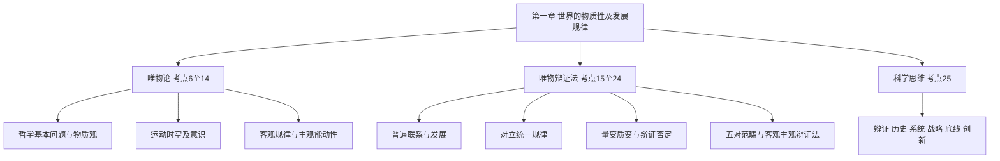

import { Callout } from 'fumadocs-ui/components/callout';

# 第一章 世界的物质性及发展规律

> **全章重点，建议精学。** 所给分类真题文档收录 **43道**，其中 **2017—2026年20道**；肖1000题精简版含 **35条单选、47条多选知识点**。高频主题为**普遍联系与发展、规律与主观能动性、矛盾分析、量变质变、时空及系统思维**。以上是所给题库的收录数量，不等于每一考点在正式考试中的固定命题频率。

## 一、原章知识地图和复习优先级

| 原章板块 | 真题收录分布 | 学习优先级 | 命题方式 |
| --- | --- | --- | --- |
| **考点6—14 唯物论** | 22道（考点10未单列题） | **高** | 科技、人工智能、宇宙探索、自然规律材料，多为概念边界辨析 |
| **考点15—18 普遍联系和三大规律** | 14道（考点18未单列题） | **最高** | 寓言、经济社会案例、诗句、政策举措与原理匹配 |
| **考点19—24 五对范畴、辩证法性质** | 4道（考点19、20未单列题） | **中** | 抓关键词辨别范畴，注意肖1000题拓展 |
| **考点25 六类思维** | 3道，含2025年2道 | **高** | “大农业观”“从后思索法”等新情境的判断 |

<Callout type="info" title="本章通用审题原则">
同一材料可能同时符合多个哲学原理。正确答案必须既是**理论上正确**，又与**题干限定的设问对象和具体事实**有关。多选题尤其不能因为一个选项“课本中出现过”就选。
</Callout>

---

## 第一节 世界的物质性（考点6—14）

## 考点6 哲学基本问题及哲学中的基本派别

### 1. 先分清哲学在问什么

哲学的基本问题是**存在与思维的关系问题**，又称**物质和意识的关系问题**，包含两个不同方面：

| 问题 | 由答案产生的分野 | 判断标准 |
| --- | --- | --- |
| **世界本原是谁？物质还是意识第一性？** | 唯物主义与唯心主义 | 物质第一性＝唯物主义；意识第一性＝唯心主义 |
| **思维能否正确认识存在？二者是否具有同一性？** | 可知论与不可知论 | 承认能够认识世界＝可知论 |
| **世界处于怎样的状态？** | 辩证法与形而上学 | 联系、发展、全面 vs. 孤立、静止、片面 |

尤其注意：**唯物主义不等于辩证法，唯心主义不等于不可知论**。黑格尔哲学虽属唯心主义却有辩证法思想；某些旧唯物主义承认物质第一性却以机械、孤立的方式解释变化。

### 2. 主观／客观唯心主义速辨

- **主观唯心主义**：把个人精神、感觉、心、意念当作本原。例如“心外无物”“存在就是被感知”“万物皆备于我”。
- **客观唯心主义**：把脱离个人的理念、绝对精神、上帝意志等当作世界本原。例如“世界是绝对观念的外化”。
- **古代朴素唯物主义**：用水、火、气、五行等具体物质解释万物本原。
- **近代形而上学唯物主义**：将原子等特定结构形态误当作物质本原，容易作机械决定论解释。
- **辩证唯物主义**：以“客观实在”把握物质，把唯物论、辩证法、实践观与历史观结合起来。

### 3. 真题与肖1000题串联

- **2009-1，答案A**：物质和意识的对立只有在**何者第一性**的意义上才具有绝对性；超出本原问题，意识依赖并反映物质，二者不是毫无联系的实体。
- **2008-1，答案D**：马克思主义哲学区别于唯心主义和旧唯物主义的关键，是**从客观的物质实践活动出发理解世界**；仅说“物质第一性”不足以同时区别旧唯物主义。
- **2001年文理-1，答案D**：认为一切未来都能以初始状态精确预定、排除偶然性的观点属于**机械决定论**。
- **肖1000题多选1—3**：反复区分主观唯心主义、客观唯心主义与机械唯物主义的局限。

**易错警示**：物质“第一性”是世界本原意义上的哲学判断，不是“物质比精神更有价值、更重要”的价值排序。

## 考点7 物质范畴及其理论意义

### 1. 唯物主义物质观的层次升级

| 形态 | 对物质的界定 | 问题或进步 |
| --- | --- | --- |
| 古代朴素唯物主义 | 具体元素或形态 | 有唯物倾向，但混淆具体形态与共同本质 |
| 近代形而上学唯物主义 | 原子等微观结构 | 自然科学基础更强，却容易将具体结构绝对化，且历史领域不彻底 |
| 辩证唯物主义 | **独立于意识而存在、能够被认识的客观实在** | 从共性层面规定物质，与具体科学发现相容 |

**必须准确区分**：

- 物质的**唯一特性**：客观实在性。
- 物质的**根本属性**：运动。
- 运动着的物质的**基本存在形式**：时间和空间。

三种不同问法不能互换。哲学上的“物质”不等于“肉眼可见的东西”，更不等于自然科学中某一种尚未发现的粒子。新的物质结构被发现，只会丰富具体认识，不会推翻客观实在性。

### 2. 四项理论意义

1. 坚持**唯物主义一元论**，反对把意识与物质当作两个独立本原。
2. 坚持**能动反映论与可知论**，反对不可知论；未知不等于原则上不可认识。
3. 体现**唯物论与辩证法统一**，反对机械、静态地理解物质。
4. 体现**唯物主义自然观与历史观统一**，承认社会历史领域同样有物质基础。

### 3. 真题模型：暗物质不等于“不可知”

**2026-17，多选BD**：题目以暗物质不能直接发光、但可以根据引力效应测绘为材料。正确思路是：**不依赖人的意识存在**说明客观实在性；可借助客观效应逐步认识说明可知论。错误思路有两类：①“必须靠直接感知才算客观存在”；②“不能直接看到就永远不可知”。

**肖1000题单选1及多选3—7**要求区分物质概念的共同特性与各种具体物质形态，并反对把意识当作物质的“另一种独立本原”。

## 考点8 物质与运动，运动与静止

### 1. 两组关系，一次分清

- **物质与运动**：运动是物质的运动，物质是运动的承担者；不存在脱离物质的运动，也不存在完全不运动的物质。
- **运动与静止**：运动是**绝对、无条件**的，静止是**相对、有条件**的。静止有两种典型形态：一是空间相对位置暂时不变；二是事物根本性质暂时不变。
- 二者辩证统一：**动中有静，静中有动**。相对静止不是运动消失，而是运动中的相对稳定状态。

### 2. 题目怎么识别

| 典型提示 | 对应原理 | 反向陷阱 |
| --- | --- | --- |
| “风定花犹落，鸟鸣山更幽” | 动静相互依存、相互包含 | 把“静”解释成绝对不动 |
| “舟行洲不行”“鸽飞阁不飞” | 静止是运动在一定条件下的稳定状态 | 把运动与静止完全割裂 |
| “平衡木、直升机悬停” | 绝对运动与相对静止、度及内部协调 | 机械地从“平衡”跳到“辩证否定” |

**对应真题**：2007-1（B）、2013-1（A）、2015-18（ACD）。**肖1000题**单选5—6关注“运动的根本属性”和“运动承担者”；多选12—13衔接时空。

## 考点9 物质运动与时间、空间

### 1. 三条精确对应

| 范畴 | 本质规定 | 特点 |
| --- | --- | --- |
| 时间 | 物质运动的**持续性、顺序性** | **一维性**，具有不可逆的先后次序 |
| 空间 | 物质运动的**广延性、伸张性** | **三维性**（长宽高） |
| 时空与物质运动 | 时间和空间是**物质运动的基本存在形式** | 不存在离开物质运动的纯粹时空，也不存在离开时空的物质运动 |

补充一组重要辨析：**时空的客观实在性是绝对的**，不同物质运动条件下的**具体时空特性是相对的**。具体事物的时空有界限，不能据此推出整个物质世界有终极时空边界。

### 2. 高频真题中的关键词

- **2022-19，多选ABD**：奋斗中的“时间意义”不说明时间由人的感觉创造；时间是物质运动的客观尺度，人们对时间的价值理解可以不同。
- **2020-17，多选ABD**：黑洞照片和科学观测结合物质运动与时空的统一、认识能力的拓展。
- **2016-18，多选ABD**：以诗句测试时间流逝的一维性。
- **2014-17，多选BD**：长江形成演化的历史说明时空测定依赖客观物质过程与科学证据。

肖1000题常见陷阱：“时间空间是人的观察结果”“时间空间是物质的根本属性”“离开时空的物质运动只是暂时的”。正确表达分别为：客观存在、运动是根本属性、物质运动与时空**不可分割**。

## 考点10 物质世界的二重化

虽然所给分类真题未为本考点单列试题，但肖1000题多选14—15将其作为自然与社会关系的辨析点，不能完全略过。

**人的实践活动**促使物质世界出现两种分化：

1. 自然界中分化出**人类社会**：社会依赖自然界，又通过有目的的物质生产活动改造自然界。
2. 客观世界中分化出**主观世界**：人的认知、情感、意志等构成主观世界，但其产生和内容不能脱离客观世界。

**二重分化不是二元本原**：自然界与人类社会相互作用，主观世界源于客观世界，又通过实践反作用于客观世界。人化自然不是变成“纯精神”，人造建筑、人工生态系统仍然是客观物质存在。

**命题技巧**：出现“自然环境—社会生产—政策设计”相互作用时，优先想到实践使自然与社会形成动态、历史的统一，而不是“一切自然联系都是人建立的”。

## 考点11 物质与意识的辩证关系

### 1. 物质决定意识：起源、本质、内容

- **起源**：意识既是自然界长期发展的结果，也是社会历史发展的结果；**劳动和社会实践**对于人类意识形成具有决定性意义。
- **生理基础**：**人脑**是意识活动的物质器官。不能说“意识的来源是人脑”，意识的内容最终来自客观世界。
- **本质**：意识是**客观世界的主观映象**，是客观内容与主观形式的统一。正确观念与错误观念都能从现实生活中找到物质原型，只是反映方式不同。

“鬼神形象”看似不对应现实中的鬼神，但可能是对现实中的人、动物、自然力量等形象加工和歪曲的结果。**能想象鬼神 ≠ 鬼神必然客观存在，也 ≠ 意识纯主观自生**。

### 2. 意识的能动作用四个方面

| 作用 | 核心内容 | 题干信号 |
| --- | --- | --- |
| 目的性、计划性 | 事先确立目标、方案、步骤 | 蓝图、规划、设计 |
| 创造性 | 对表象加工，形成新观念和新模型 | 艺术构图、科学假设、创新构想 |
| 指导实践改造客观世界 | 借助实践使观念变为现实成果 | 设计方案→施工→形成产品 |
| 调控行为和生理活动 | 意识与心理状态影响行动选择、生理反应 | 心理干预、意志训练 |

**决定与反作用不可混**：物质决定意识，是从根源与本原方面说的；意识通过人的实践对物质世界发挥能动反作用，并不是“思想不经过实践就可以直接创造物质”。

### 3. 真题对应

- **2017-2，C**：人脑中的“鬼”“神”形象不能证明现实中有对应的鬼神；观念是对客观事物的主观加工和反映。
- **2010-17，ACD**：《新华字典》词条随社会实践和时代变迁调整，说明意识内容及其表达与现实社会生活相关。
- **2007-17，AD**：龙的组合形象说明主观映象、艺术加工与客观原型的关系。
- **肖1000题多选8—11**：集中训练“客观内容／主观形式”“意识能动性／物质决定性”的辨析。

## 考点12 主观能动性和客观规律性的辩证统一

### 1. 必背定义与三层关系

**规律**：事物变化发展过程中所固有的、内在的、本质的、必然的联系。规律**不因人的意志而转移**，也不由人任意创造、取消或修改。

- **前提**：尊重客观规律是正确发挥主观能动性的**前提**。
- **作用**：人能够认识、利用规律，根据已有客观条件开展有目的的实践；不能把主观能动性理解成“想怎样就怎样”。
- **桥梁**：**实践是二者统一的基础**。认识规律和运用规律均以实践为依托。

**正确发挥能动性的条件**：一切从实际出发；以实践为根本途径；依赖一定的物质条件和物质手段。

### 2. 2026、2025真题三连问

| 真题 | 答案 | 案例中什么是关键 | 一眼排除的选项类型 |
| --- | --- | --- | --- |
| **2026-2** | **D** | 叶片飘落是内部结构、气流阻力、涡流等多种因素共同作用的结果 | 把规律归于纯外因、纯现象或纯偶然 |
| **2026-18** | **AD** | 发现植物基因构成规律并探索培育新作物的方法：尊重规律、发展实践能力 | “人可任意创造联系”“改造客观世界无须改造主观世界” |
| **2025-17** | **CD** | 人类与病毒共演化、人与自然相互作用：自然的先在性与人类实践的能动性 | “社会规律完全由生物规律决定”“人类只能被动适应自然” |

**2017-1，A**：雾霾治理成效与某一时刻空气指数波动不一定完全一致。必须综合各种实际条件，不能用局部、瞬时现象否定整体治理与客观规律。

肖1000题多选16总结了**规律的客观性与条件性**。遇到“规则与规律”的选项，要记住规则可以由人制定，规律则由客观事物自身的联系决定。

### 3. 不选“正确但不切题”的典型

**2022-17，多选BCD**在考点16归类，但同样训练本考点。题干以“有多少汤泡多少馍”说明资源约束，要选**一切从实际出发、适度、具体问题具体分析**。选项若泛泛谈人的主观能动性，即使教科书意义上正确，也未必是在解释这句比喻。

## 考点13 意识与人工智能

### 1. 马克思主义哲学语境下的人机关系

人工智能是人类以技术装置模拟、扩展某些智能活动的结果，是**人的本质力量对象化、现实化**的表现。在本章教材的哲学框架中：

1. 人的意识具有知、情、意等丰富层面，同人的社会实践和社会关系不可分割。
2. 人工智能能够模拟、扩展计算、识别、预测等活动，也能够被赋予一定社会功能，但不等于**独立的人类意识主体**。
3. 人工智能的实现具有物质载体，靠物理计算和实践生产过程实现，不是意识脱离物质器官后独立存在。
4. 科学技术进步可延伸人的感官和认识、实践能力，同时应关注风险与责任。

### 2. 直接考题

- **2025-18，AD**：脑机接口帮助患者控制外部设备，说明人能把意识活动对象化、现实化，并延伸意识器官的功能。不能据此推出机器具有与人完全一样的主体意识。
- **2022-18，CD**：人工智能辅助新材料研发，说明人类在实践中认识和改造物质世界；新材料的出现不改变世界的物质性。错误项通常出现“任意改变物质”“机器超越或代替人类全部认识”。
- **肖1000题多选17—19**：人工智能可模拟、延伸人的部分智能活动，不能据此认定机器成为独立社会实践主体。

> 注意：这里总结的是**指定考研教材和题库所采用的哲学命题口径**，不要直接把考试表述外推成对一切未来人工智能系统的技术能力作永久预测。

## 考点14 世界的物质统一性

**核心结论**：世界真正的统一性在于**物质性**，而物质世界是**多样性的统一**。

- **自然界物质性**：自然存在不依赖人的意识。
- **人类社会物质性**：物质资料生产方式构成社会存在和发展的基础。
- **意识统一于物质**：从意识的发生、内容与反作用看，意识依赖物质世界和实践。

**方法论**：一切从实际出发，实事求是。注意不能把“世界统一于物质”改为“世界统一于意识”“世界统一于某种具体粒子”。

| 真题 | 答案 | 重点判断 |
| --- | --- | --- |
| **2021-17** | **CD** | 宇宙新结构发现证明未知领域仍是客观存在并可以逐步被认识；具体结构有界不代表整个物质世界有界 |
| **2019-17** | **BD** | 虚拟现实的图像环境依赖现实中的技术、机器和实践；“虚拟”不等于“脱离物质的纯精神世界” |

---

## 第二节 世界的普遍联系与变化发展（考点15—18）

## 考点15 事物的普遍联系和变化发展

### 1. 联系的四大特征

| 特征 | 定义核心 | 材料识别 | 容易误判 |
| --- | --- | --- | --- |
| **客观性** | 联系是事物本身固有的，不以意志转移 | 生态链、产业链的实际影响 | 误以为人造联系就不客观 |
| **普遍性** | 事物内部、事物之间、世界整体相互联系 | “牵一发而动全身” | 误选“任何两个事物都直接联系” |
| **多样性** | 直接／间接、内在／外在、必然／偶然等 | 供应链的多路径影响 | 只承认单一联系类型 |
| **条件性** | 联系的发生和变化依赖具体条件 | 水土改变果实性状，改革创造条件 | 认为不管条件如何都能任意转化 |

**“橘逾淮为枳”**&#x2060;首先看条件不同导致结果不同，而非看到“橘”“枳”就跳到对立面转化。

### 2. 发展观与新旧事物

- **变化不一定是发展**：发展是具有前进性、上升性质的变化，实质是**新事物产生、旧事物灭亡**。
- **判断新旧事物的标准**：是否符合客观规律和历史发展方向、是否具有生命力和远大前途，不能只看产生时间、外表新奇或力量大小。
- 新事物在开始时可能力量弱小，但由于顺应历史发展趋势，可能最终战胜旧事物。

### 3. 真题—原理配对

| 题目 | 答案 | 考查点 |
| --- | --- | --- |
| **2019-2** | **A** | 水土环境变化影响橘树：**联系的条件性** |
| **2018-17** | **ACD** | 量子纠缠等科技材料：从实际客观联系出发，不能把科学现象任意归结为精神活动 |
| **2015-17** | **ABD** | 土壤形成受母质、气候、生物、地形、时间影响：普遍联系、多因素作用 |
| **2012-17** | **BCD** | “沉舟侧畔千帆过”：新事物代替旧事物的根本根据与发展趋势 |
| **2007-18** | **ABD** | 柿子留给喜鹊、喜鹊捕虫：生态系统中的相互联系与相互作用 |
| **2006-1** | **C** | “世界上唯一不变的是变”：变化的普遍性与运动发展 |

肖1000题单选15—20与多选20—24重点训练“结构、联系、变化、发展”和条件转化，答题时先锁定**哪个对象发生了联系，哪一条件改变了**。

## 考点16 对立统一规律是事物发展的根本规律

### 1. 为什么它是唯物辩证法的实质与核心

**三层原因**：①揭示事物联系与发展的内在动力；②贯穿量变质变、否定之否定及其他辩证范畴；③提供根本认识方法——**矛盾分析法**。

### 2. 矛盾同一性与斗争性：四句话背熟

| 角度 | 同一性 | 斗争性 |
| --- | --- | --- |
| 定义 | 矛盾双方**相互依存、相互贯通**，在一定条件下相互转化 | 矛盾双方**相互排斥、相互对立** |
| 属性 | **相对的、有条件的** | **绝对的、无条件的** |
| 功能 | 提供相互依存的发展前提、吸收对方有利因素、规定转化可能性 | 促使力量对比变化，为旧统一体向新统一体转变创造条件 |
| 关系 | 与斗争性不可分割 | **斗争性寓于同一性之中**，二者共同推动发展 |

**“对立双方统一”不意味着矛盾消失**；和谐是矛盾的一种特殊表现，仍须在解决矛盾过程中实现。

### 3. 四组容易混淆的分析关系

| 组合 | 正确区分 | 实际运用 |
| --- | --- | --- |
| **内因—外因** | 内因是变化的**根据**，外因是变化的**条件**，外因通过内因起作用 | 同样资源环境下结果不同，注意内部结构与外部约束 |
| **普遍性—特殊性** | 普遍性寓于特殊性中，没有脱离特殊性的抽象普遍性；二者相互联结 | 试点再推广；“白马是马” |
| **主要矛盾—次要矛盾** | 同一复杂过程中的**多组矛盾**，有决定全局发展者 | “抓关键”“牵牛鼻子”，主要在问**解决哪个问题** |
| **矛盾主要方面—次要方面** | **同一组矛盾的两个方面**，事物性质由主要矛盾的主要方面决定 | 判断一件事的性质、主流与支流 |

**两点论与重点论统一**：既不否认次要矛盾和次要方面，也不搞无差别平均用力。

### 4. 历年真题判断法

- **2018-2，A**：“白马非马”割裂**共性与个性、普遍性与特殊性**，不是整体与部分的错误。
- **2022-17，BCD**：“有多少汤泡多少馍”：水资源是实际约束，按资源确定发展规模，指向**实事求是、适度、具体问题具体分析**。
- **2003-16，ABCE**：“和实生物，同则不继”：同一性包含差别，对立面的统一具有创造性；这道早期多选题在资料中含**五个选项**，不应按现代四选项多选习惯改写答案。

### 5. 肖1000题高质量变式

- **“先试点再推广”**：个性中包含共性，普遍性与特殊性相统一；通过实践检验推广条件。
- **新能源汽车行业良性竞争**：矛盾双方既相互竞争又相互促进；不要说“斗争性是事物存在发展的前提”，教材相应表述是**同一性**。
- **“白马非马”式招聘**：局部类型不能否定普遍范畴，首先辨别一般和个别。
- **“大局与局部”“弹钢琴”“牵牛鼻子”**：整体协调结合重点突破，常同时考**系统思维**与**两点论、重点论统一**。

<Callout type="warn" title="答题特别提醒">
题干出现“优势互补、共赢、转化”时，通常侧重矛盾**同一性**；出现“相互排斥、力量消长、旧统一体破裂”时，侧重**斗争性**。出现“主要任务／首要问题”，往往问**主要矛盾**；出现“性质由什么决定／主流”，往往问**主要矛盾的主要方面**。
</Callout>

## 考点17 量变质变规律

### 1. 质、量、度与关节点

- **质**：使一事物区别于其他事物的内在规定性；**质与事物的存在直接同一**。
- **量**：规模、程度、速度、排列次序等方面的规定；一定范围的数量变化不改变事物的质。
- **度**：事物保持其质的稳定性的数量界限；**关节点／临界点**是度的两端或边界，越过界限就会发生质变。

### 2. 量变和质变的辩证关系

1. **量变是质变的必要准备**：没有积累就没有相应的质变。
2. **质变是量变的必然结果**：量变积累到一定程度达到质变所需条件时，出现性质飞跃。
3. **质变为新的量变开辟道路**：变化进入新质态后继续积累。
4. 二者**相互渗透**：总量变中可以发生局部性、阶段性质变；质变过程中也存在新旧因素的数量消长。

**根本区别**：是否突破**度**，而不是“变化快还是慢”“是否能用数字衡量”。

### 3. 题型对照

| 真题 | 答案 | 材料核心 | 对应考点 |
| --- | --- | --- | --- |
| **2016-1** | **B** | 菜肴加盐并非越多越好 | 掌握**度**，防止“过犹不及” |
| **2012-2** | **B** | 多道工序每环节有一定达标率，连续相乘明显下降 | 要重视**量的积累及整体关联** |
| **2011-1** | **C** | 粉笔过长、过短各有代价，寻求合理长度 | 适度原则 |
| **2010-2** | **C** | 溪流坚持冲刷岩石 | 量变积累促成质变 |
| **2001年理-2** | **B** | 过度渲染人物特点使形象失真 | 突破“度”会使事物质态改变 |

肖1000题多选29—33拓展了“不积跬步”“谷堆悖论”“底线思维”等经典模型。

**数学化理解**：若五道独立环节各自达标率为 $90\%$，整体达标率约为

$$
0.9^5=0.59049\approx59\%.
$$

这道2012年材料题的数学事实帮助理解**局部环节的积累会影响整体结果**；但考试时不能把“数值相乘”本身当成哲学规律，应结合选项准确判断量变与质变、局部与整体的关系。

## 考点18 否定之否定规律

资料中此考点未单独列分类真题，但肖1000题多选34—37集中练习，属于**中等优先级、辨析得分点**。

### 1. 辩证否定的“四个关键词”

- **内在性**：否定是事物**自我否定、自我发展**，是内部矛盾运动的结果。
- **发展环节**：否定使旧质向新质飞跃。
- **联系环节**：新事物并非与旧事物毫无联系，而是从旧事物中孕育发展。
- **实质＝扬弃**：既克服消极因素，又保留积极因素；既非全盘否定，也非原封不动照搬。

### 2. 发展的总体趋势

**肯定—否定—否定之否定**形成由两次否定、三个阶段组成的辩证发展过程。更高阶段看似向起点“回复”，但不是简单重复，而是**螺旋式上升、波浪式前进**，体现**前进性和曲折性统一**。

**易错**：“一物外力毁坏另一物”不直接等于辩证自我否定；“新事物一定一路直线增长”也错误。

### 3. 练习启示

- 对待中华优秀传统文化：既传承又实现创造性转化与创新性发展，体现**扬弃**。
- “团结—批评—团结”可以作否定之否定的典型例证；“任何连续三个历史名称”**不自动**构成否定之否定。
- 复辟、挫折、阶段性倒退并不因此否定发展的总体前进性。

---

## 第三节 联系和发展的五对基本范畴（考点19—23）

分类真题为考点21、22、23分别收录1题，考点19、20暂无单列；但肖1000题多选38—41、单选27—30覆盖较全。这组内容宜用**比较表 + 关键词抓取**来学习，不宜投入与矛盾规律相同的背诵时间。

| 范畴 | A与B怎么区分 | 关系与方法论 | 高频线索 |
| --- | --- | --- | --- |
| **考点19 内容与形式** | 内容＝构成要素的总和；形式＝结构及表现方式 | **内容决定形式，形式反作用于内容**；形式具有相对独立性 | 形式主义、同一内容多种表达、载体与表达 |
| **考点20 本质与现象** | 本质＝内在、根本、较稳定的联系；现象＝外在、多变、可感的表现 | 本质决定现象，现象表现本质；要**透过现象看本质** | 科学研究、真象／假象 |
| **考点21 原因与结果** | 原因＝引起某现象的因素；结果＝被引起的现象 | 前后相继不等于因果；因果在联系链条中可转化 | 先后、机制、为什么、结果如何出现 |
| **考点22 必然与偶然** | 必然＝内在、确定的趋势；偶然＝不确定的表现形式 | 必然通过偶然表现；偶然受必然制约且影响具体进程 | 突发扰动、机会、波动与长期趋势 |
| **考点23 现实与可能** | 现实＝当下客观存在；可能＝未来发展的潜在趋势 | 可能在**一定条件**下转化为现实 | 条件是否具备、潜力、创造条件 |

### 考点19 内容与形式——警惕形式主义

内容是决定性方面，但形式具有相对独立性，适当形式可以促进内容发展，不适当形式可以阻碍发展。“同一内容只能对应一种形式”“形式对内容毫无影响”都是错误说法。

**肖1000题多选38**：反对形式主义，不代表否认形式，而是反对形式脱离内容、为形式而形式。

### 考点20 本质与现象——真象、假象和错觉

- **真象与假象都属于客观现象**：真象从正面、直接地表现本质；假象从反面、歪曲地表现本质。
- **错觉属于主观认识层面**：不能把假象和错觉简单等同。
- 任何现象从一定方面表现本质，不能说“假象与本质毫无联系”。

**肖1000题单选27—28、多选39**集中设问上述区别。识题时看选项是否把“假象”写成“主观想象”。

### 考点21 原因与结果——前后不等于因果

因果关系的本质是**引起与被引起**。原因一般在前，结果一般在后，但时间在前不必然是原因，必须有实际的致因机制。同一现象在一组联系中可能是结果，在另一组联系中可能成为原因。

**2013-2，C**：机械工程专家先观察羊吃的草，再据此识别草料，体现正确把握并利用事物之间的客观联系，而非凭空主观臆断。

### 考点22 必然与偶然——偶然不等于无作用

- 必然决定事物发展的**基本方向和总体趋势**。
- 偶然影响发展进程的具体形式、速度、机会和特点，有时会加速或延缓某种趋势的实现。
- **没有脱离偶然的纯粹必然，也没有完全摆脱必然的纯粹偶然**。

**2024-2，C**：厄尔尼诺等异常因素能对气候过程产生不可忽视的影响，正确选项体现**偶然因素会影响发展进程**，而不是“偶然性决定必然趋势”或“偶然可忽略”。

### 考点23 现实与可能——辨别两级不同的“可能”

| 问题 | 区分标准 |
| --- | --- |
| **可能性 vs. 不可能性** | 现实中**有没有**相应的根据和条件 |
| **现实的可能 vs. 抽象的（非现实的）可能** | 在存在一定根据的前提下，**实现条件是否已经充分具备** |

**2007-2，C**：《孟子》“挟泰山以超北海”与“为长者折枝”的对比说明“不能”与“不为”不相同，判断可能性须看客观根据与条件，不能以主观意愿代替。

---

## 第四节 唯物辩证法与科学思维（考点24—25）

## 考点24 唯物辩证法的本质特征和认识功能

### 1. 本质上是批判的、革命的

对任何现存事物都从运动、发展、暂时性的一面去理解。**肯定现存事物时同时看到其否定和发展可能性**，不把任何现存制度或形式当成永恒不变的终点。

### 2. 客观辩证法与主观辩证法

- **客观辩证法**：客观事物本身的联系、矛盾和变化发展规律。
- **主观辩证法**：人类思维把握客观辩证运动的概念、逻辑运动。
- 二者是**被反映与反映**的关系，本质上统一，表现形式不同。不能把它们视作两个彼此独立的世界本原。

**2000年理-3，A**：直接考查“主观辩证法与客观辩证法的关系”。

### 3. 矛盾分析方法是认识事物的根本方法

抓住**具体问题具体分析**这个“活的灵魂”：明确对象、条件、阶段、主要矛盾及矛盾双方力量变化，不能把一般结论无条件机械套用。

肖1000题多选42—44强化“客观辩证法／主观辩证法”“对立统一”“从实际出发”等交叉判断。

## 考点25 学习唯物辩证法，不断增强思维能力

### 1. 六种思维能力及其题干信号

| 思维能力 | 本质要求 | 一看到这些词先联想 |
| --- | --- | --- |
| **辩证思维** | 联系、全面、发展地分析矛盾 | 一分为二、对立统一、扬长避短、具体分析 |
| **历史思维** | 以历史发展过程理解当下、把握趋势 | 以史为鉴、历史文献、历史规律、继往开来 |
| **系统思维** | 从整体、结构、层次与相互作用研究问题 | 全局、多部门协同、系统治理、整体优化 |
| **战略思维** | 着眼全局、长远、总体趋势 | 顶层设计、长远布局、战略主动 |
| **底线思维** | 识别风险临界点、守住不可突破的界限 | 最坏结果、红线、预警、风险防范、度 |
| **创新思维** | 打破陈规、提出新方案、开拓新路径 | 新机制、新方法、打破思维定式 |

**系统的四个基本特征**：整体性、结构性、层次性、开放性。系统各组成部分通过特定结构发生作用，不能把整体等同于零散要素的简单堆叠。

### 2. 辩证逻辑常考的四对方法

| 方法 | 定义与方向 | 混淆风险 |
| --- | --- | --- |
| **归纳与演绎** | 个别→一般；一般→个别 | 归纳不是从一般到一般，演绎不是把经验无条件扩大 |
| **分析与综合** | 分解对象研究要素；在此基础上重新把握整体 | 只分解而不综合，或不分析而空谈整体 |
| **抽象与具体** | 从感性具体形成抽象规定，再把握**思维具体** | 把思维具体误当作未经加工的感官印象 |
| **逻辑与历史** | 理论逻辑反映客观历史进程，但不须逐项复制时间顺序 | 误说二者在每个细节、每个时间环节都必须一致 |

### 3. 真题重点

- **2025-1，C**：大农业观、大食物观强调多元资源、跨领域协调和供给体系整体安排，直接对应**系统思维**。
- **2025-2，B**：“从后思索法”提示历史发展的客观时间顺序与人认识历史的理论顺序**可以不同**。不可将逻辑—历史的统一理解成时间上的逐环节机械重合。
- **2023-1，A**：通过修史立典、以史启智理解历史与未来关系，指向**历史思维**。
- 肖1000题多选45—47：抓“全局／关键／主次／有所为有所不为”，对应系统思维、矛盾分析与两点论重点论统一。

---

## 五、43道分类真题索引：从答案反查知识点

> 与源文档编号一致。此表用于快速二刷，**答案不是对未提供完整题干的独立命题**；请在原分类真题中查看全部备选项和解析。2003年题为五选项历史题型，原样保留答案。

| 考点 | 收录真题（年份-题号：答案） | 常见问题模式 |
| --- | --- | --- |
| 6 哲学基本问题 | 2009-1：A；2008-1：D；2001文理-1：D | 本原问题、实践观、机械决定论 |
| 7 物质范畴 | **2026-17：BD** | 客观实在、暗物质、可知论 |
| 8 物质运动与静止 | 2015-18：ACD；2013-1：A；2007-1：B | 动静辩证统一、平衡 |
| 9 时间和空间 | **2022-19：ABD**；2020-17：ABD；2016-18：ABD；2014-17：BD | 时空客观性、时间一维性 |
| 10 物质世界二重化 | 未单列 | 以肖1000题复习自然与社会、主客观世界 |
| 11 物质和意识 | 2017-2：C；2010-17：ACD；2007-17：AD | 意识本质、主观映象 |
| 12 客观规律和能动性 | **2026-2：D；2026-18：AD；2025-17：CD**；2017-1：A | 规律客观性、尊重规律与实践 |
| 13 人工智能 | **2025-18：AD；2022-18：CD** | 智能机器与人类意识，科技实践 |
| 14 物质统一性 | **2021-17：CD**；2019-17：BD | 自然物质性、虚拟现实 |
| 15 联系和发展 | 2019-2：A；2018-17：ACD；2015-17：ABD；2012-17：BCD；2007-18：ABD；2006-1：C | 联系客观性、条件性、新旧事物 |
| 16 对立统一 | **2022-17：BCD**；2018-2：A；2003-16：ABCE | 矛盾特殊性、普遍与特殊、两点论重点论 |
| 17 量变质变 | 2016-1：B；2012-2：B；2011-1：C；2010-2：C；2001理-2：B | 度、量变累积、质变 |
| 18 辩证否定 | 未单列 | 以肖1000题强化“扬弃” |
| 19 内容与形式 | 未单列 | 形式主义、同一内容多形式 |
| 20 本质与现象 | 未单列 | 真象、假象、错觉 |
| 21 原因与结果 | 2013-2：C | 因果辨析、因果联系的客观性 |
| 22 必然与偶然 | **2024-2：C** | 偶然因素对发展过程的影响 |
| 23 现实与可能 | 2007-2：C | 根据和条件、可能性与不可能性 |
| 24 唯物辩证法的认识功能 | 2000理-3：A | 主观辩证法与客观辩证法 |
| 25 科学思维能力 | **2025-1：C；2025-2：B；2023-1：A** | 系统思维、逻辑历史、历史思维 |

## 六、全章易错选项一览

| 说法 | 判断 | 考点 |
| --- | --- | --- |
| “物质第一性意味着精神在实际生活中毫不重要” | **错**，第一性是本原判断而非价值评判 | 6 |
| “只要看不见，就不具有客观实在性” | **错**，暗物质可以通过引力效应间接认识 | 7 |
| “运动是物质唯一特性” | **错**，运动是根本属性；客观实在性是唯一特性 | 7、8 |
| “相对静止就是完全无运动” | **错**，静止是特殊的运动状态 | 8 |
| “时间和空间由人的感觉产生” | **错**，时空具有客观性 | 9 |
| “人化自然变成主观世界” | **错**，实践改造后的自然仍具有物质性 | 10 |
| “意识产生于人脑，与客观世界无关” | **错**，人脑是器官，客观世界是内容源泉 | 11 |
| “规律可以由人随意创造和消灭” | **错**，人可以认识、利用规律并改变具体条件 | 12 |
| “机器执行智能任务就证明机器有与人完全一样的意识” | **错**，混淆功能模拟与人的社会性意识 | 13 |
| “任何事物之间都存在直接联系” | **错**，联系具有条件性、多样性，存在间接联系 | 15 |
| “主要矛盾等于矛盾的主要方面” | **错**，前者比较多组矛盾，后者比较一组矛盾的两个方面 | 16 |
| “同一性是绝对的、斗争性是相对的” | **错**，二者的条件性与绝对性颠倒 | 16 |
| “量变和质变的区别在于变化速度” | **错**，关键在于是否超出度 | 17 |
| “辩证否定就是全盘抛弃” | **错**，实质为扬弃 | 18 |
| “假象不表现本质，假象就是主观错觉” | **错**，假象是客观现象，错觉是主观认识 | 20 |
| “先后相继的两个事件必定构成因果” | **错**，还必须有引起与被引起关系 | 21 |
| “偶然对发展完全不起作用” | **错**，偶然影响过程、速度与表现形式 | 22 |
| “抽象可能就是完全不可能” | **错**，二者有无现实根据的判断不同 | 23 |
| “主观辩证法是客观辩证法的根源” | **错**，主观辩证法反映客观辩证法 | 24 |
| “系统就是各部分的简单相加” | **错**，系统功能与结构、层次和相互作用有关 | 25 |

## 七、材料分析题可迁移答题模板

虽然本章分类真题多数是选择题，唯物辩证法的原理也常用于材料分析。答案应做到**原理准确 + 材料贴合 + 方法论明确**。

### 模型A：科技创新、资源治理、生态建设

1. **指出原理**：世界具有客观物质性，规律具有客观性，人能够通过实践认识、利用规律。
2. **联系材料**：具体说明科技研究发现了哪些条件、机制或客观联系；采取了哪些实践措施。
3. **给出要求**：从实际出发，尊重规律，在规律允许的条件下发挥主观能动性；统筹系统内部要素与外部环境。

### 模型B：改革中的重点突破与整体推进

1. **指出原理**：事物普遍联系；主要矛盾与次要矛盾相互影响，矛盾各有特殊性。
2. **联系材料**：说明哪个环节是突破口、哪些配套环节需要协同。
3. **给出要求**：坚持两点论与重点论统一，抓重点、带全局，具体问题具体分析。

### 模型C：久久为功、风险防范与发展曲折性

1. **指出原理**：量变是质变的必要准备，质变是量变的必然结果；发展具有前进性与曲折性的统一。
2. **联系材料**：说明积累的过程、临界条件、潜在风险和可能的阶段性波动。
3. **给出要求**：重视渐进积累，掌握适度原则，守住底线；条件成熟时推动积极质变。

## 八、复习检验与优先顺序

自测1｜物质的“唯一特性”“根本属性”“基本存在形式”各是什么？

**答案**：客观实在性；运动；时间和空间（准确说是运动着的物质的基本存在形式）。

自测2｜“先试点再推广”与“抓主要矛盾”为什么不相同？

**答案**：前者重点在个性与共性、特殊性与普遍性的相互联系；后者重点在复杂矛盾体系中识别决定性矛盾。一个材料可能兼有两者，但选择要看设问。

自测3｜“真象”“假象”“错觉”如何区分？

**答案**：真象和假象都是客观现象，分别从正面和歪曲形式表现本质；错觉是主观上的错误认识。

自测4｜给定政策“统筹森林、草原、湿地和农田治理”，为何优先考虑系统思维？

**答案**：治理对象相互联系、相互作用，整体效果依赖要素结构和协同安排，不能孤立地处理单一要素。

自测5｜为什么2024年厄尔尼诺真题不能选“偶然因素决定事物基本发展趋势”？

**答案**：必然性代表起决定作用的基本趋势，偶然性对过程和表现形式发挥不可忽视的影响；二者作用不可互换。

**复习先后**：

1. **第一轮：重理解。** 考点7、9、11、12、15、16、17、25，逐一用自己的话复述原理，并举材料实例。
2. **第二轮：重排错。** 考点6、8、13、14和19—24，使用上方易错选项表训练术语精度。
3. **第三轮：重材料。** 重做2026年暗物质、叶片、植物育种，2025年脑机接口和大食物观，2024年气候偶然性，2022年水资源、时间与人工智能材料题；每题解释**为何其他选项不成立**。
4. **最后查漏**：肖1000题中系统思维、人工智能、辩证否定和五对范畴的多选题，防止只因分类真题未单列就漏学。

## 九、资料对应与统计口径

- 精讲精练：`01-精讲精练/精讲精练-马克思主义基本原理.md`，**第一章 考点6—25**。
- 肖1000题：`02-肖1000题精简版/marxism-principles/01-world-materiality-and-development.md`，精简版**35条单选、47条多选**（知识点摘要，非完整原题）。
- 分类真题：`03-政治分类真题/marxism-principles/第一章-世界的物质性及发展规律.mdx`，**43道**（覆盖早期及较新年份，部分考点没有单列真题）。

归纳采用原始材料中的章节和考点编号，并对近十年的题目优先分析。**题库收录数量不是官方命题频率**，且分类真题来自不同年份和题型规范；具体原题和答案以用户提供的原文件为准。
