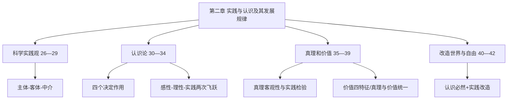
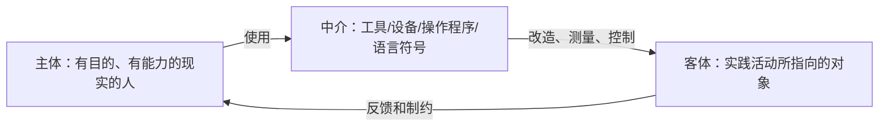
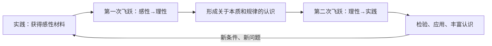

import { Callout } from 'fumadocs-ui/components/callout';

# 第二章 实践与认识及其发展规律

> **复习定位：核心章节，重点攻克“实践决定认识”和“真理—价值”两个题群。** 原分类真题共 **18道**，其中2017—2026年 **10道**；肖1000题精简版单选 **26条**、多选 **33条**。真题按所给文件的**原考点归类**统计：**考点39有6道、考点30有3道，考点32与41各2道**，其余分散。考点26、27、29、35—37、40、42虽然未在本章真题库单列，但在肖1000题中反复训练，不能简单等同于“不会考”。

<Callout type="info" title="本章命题主线">
**主体通过实践作用于客体 → 实践提供认识来源与动力 → 感性与理性认识相互贯通 → 认识返回实践并接受检验 → 坚持真理尺度和价值尺度统一 → 在认识与利用规律中扩大自由。** 真题常给一则科技或社会生活材料，要求在这条链条中定位最贴切的原理。
</Callout>

## 一、原章知识地图与复习权重

| 教材原考点 | 分类真题收录 | 复习优先级 | 高频辨析 |
| --- | ---: | --- | --- |
| 考点26—29 科学实践观、实践结构与形式 | 1 | **高** | 实践与意识活动、主体客体中介、最基本实践形式 |
| 考点30 实践决定认识 | 3 | **最高** | 来源/动力/目的/检验标准四种不同问法 |
| 考点31—34 认识本质和认识运动 | 5 | **高** | 能动反映、感性与理性、非理性因素、反复与无限 |
| 考点35—38 真理及其检验 | 1 | **高（基础）** | 真理客观性、绝对与相对、实践唯一标准 |
| **考点39 真理与价值** | **6** | **最高** | 价值四特征、价值评价、双尺度与AI伦理 |
| 考点40—42 认识与改造、必然与自由、守正创新 | 2 | **高** | 自由不是任性，守正创新需实践支撑 |

**做题顺序建议**：先将考点30的四个“实践是……”背到能秒选，再将考点39的“客体属性—主体需要—实践创造”拆成三个独立判定条件，最后统一练习2024—2026年出现的AI、数字孪生、科学美、竹产业、战争决策类材料。

---

## 第一节 实践及其基本结构（考点26—29）

## 考点26 科学的实践观

### 1. 关键定义和哲学史定位

实践是**人类能动地改造世界的社会性的物质活动**。理解时拆成三个不可遗漏的条件：

1. **人类的活动**：不是动物单纯本能性活动。
2. **能动改造世界**：以目的和意识指导，但不是停留在头脑中的纯粹想象、设想或意愿。
3. **社会性的物质活动**：在特定社会关系中展开，受客观条件与规律制约并造成实际改变。

马克思在《关于费尔巴哈的提纲》中系统阐释实践观点，该著作被称为&#x2060;**“包含新世界观天才萌芽的第一个文件”**。旧唯物主义的不足不在于“完全不承认物质”，而在于没有从**现实、感性的实践活动**理解主体、客体及其历史变化。科学实践观为唯物史观和能动反映论提供关键基础。

| 思想路径 | 怎样理解实践 | 考试判定 |
| --- | --- | --- |
| 康德式道德实践 | 偏重先天理性的道德活动 | 容易脱离物质实践 |
| 黑格尔式实践 | 精神自身的运动和自我实现 | 将精神当作本原 |
| 费尔巴哈旧唯物主义 | 把感性活动简化为直观或日常生物性适应 | 未把实践当作能动改造世界的社会活动 |
| 马克思主义科学实践观 | 人在社会历史条件下能动改造客观世界 | **主体能动性与客观物质性统一** |

**肖1000题定位**：单选1—2；多选1。题目问“马克思主义与其他理论的根本区别”应抓**实践性**；问《提纲》地位，不能误认作《共产党宣言》。

## 考点27 实践的本质和基本特征

### 1. 三大基本特征

| 特征 | 准确内涵 | 错误表达 |
| --- | --- | --- |
| **客观实在性** | 主体、客体、中介是现实的；受客观条件和规律制约；结果改变外在现实 | “有目的，所以实践本质上是主观的” |
| **自觉能动性** | 人有目的、有计划地组织实践，并在实践中发挥创造性 | “有意识的活动都属于实践” |
| **社会历史性** | 实践总处于现实社会关系之中，方式、范围、水平随历史发展变化 | “一个人的实践与社会条件无关” |

实践具有**直接现实性**：能够把观念性的目标转化为现实结果。它是实践区别于纯粹理论思考的显著特征，也是实践能够检验真理的重要根据。注意“直接现实性”不是“任何实践都立刻成功”。

**肖1000题**：单选3（数字孪生的实际应用）、单选4（主体自然能力与精神能力）、单选9（线上展览与实践形式）；多选1—3（是否有实质改造、虚拟实践和物质基础）。

### 2. 数字场景如何分类

- **只在脑中推演方案**：属于认识活动，不等于完整的实践过程。
- **建设并运行数字孪生系统，用其反馈现实水利工程运行**：现实科技条件支撑的实践及其派生形式；虚拟活动并未成为脱离现实的“第三世界”。
- **在线教育、文化传播、科学实验的组织实施**：若实际改变人的社会交往和活动状态，可纳入实践；不能因为产物具有信息、文化属性就否定实践的客观性。

## 考点28 实践的基本结构

### 1. 主体—客体—中介的有机统一

- **主体**：从事实践活动、具有现实主体能力的人。能力不仅包括生理性的自然能力，也包括知识、经验、情感、意志等精神能力。
- **客体**：实践活动实际指向的对象，不等于全部客观世界（未进入实践范围的对象未必成为当前实践客体）。
- **中介**：物质性工具系统（仪器、计算机、雷达等）和语言符号系统，以及使用这些工具的方式方法。它将实践主体和客体现实地联系起来。

**2017-17，多选ABC**：显微镜、冷冻电子显微镜延伸感官、促进生物发现。A是三要素结构，B是中介的联系作用，C是实践条件推动认识发展。**D错误**：科学实验很重要，但**物质生产实践**才是人类最基本的实践活动。此题为跨考点28、29、30的复合命题模板。

**肖1000题**单选4、多选4—5：北斗监测、暗物质间接观测涉及“主体借中介把握客体”；“工具增强感官”不意味着凭借科技可以不受客观规律约束。

## 考点29 实践形式的多样性

### 1. 三种基本类型

| 类型 | 实际指向 | 判断例子 |
| --- | --- | --- |
| **物质生产实践** | 获得生存发展所需资料并生产再生产物质关系 | 农业生产、工业生产；**最基本的实践活动** |
| **社会政治实践** | 调整现实社会政治关系和制度 | 社会政治活动、制度变革 |
| **科学文化实践** | 创造和传播科学文化成果并真实影响世界 | 科学实验、教育、文化创造 |

不要把“创造精神文化产品”误判为“纯意识活动”。科学研究、教书育人、文化生产都有现实的物质条件、操作过程和社会效果。**物质生产实践的基础地位不等于其他实践只是物质生产的被动附属品。**

### 2. 现代拓展：虚拟实践

网络空间、VR和数字孪生拓宽了人类实践形式，但虚拟实践的技术基础、操作主体和现实作用**仍依赖现实实践**；“数字模拟可以辅助预测”≠“数字模拟脱离物质世界自行创造真理”。对“技术发明—中介变化—主体能力提升—社会生活改造”要连贯理解。

---

## 第二节 认识的本质和发展规律（考点30—34）

## 考点30 实践对认识的决定作用

### 1. 四个作用，题干一秒定位

| 作用 | 关键词 | 典型题干 | 不该误选的原理 |
| --- | --- | --- | --- |
| **实践是认识的来源** | “第一手资料”“田间”“亲历”“从做中知” | 必须接触现实对象才能取得认识 | 不等于每个人必须亲自做过所有实验 |
| **实践是认识发展的动力** | “新需求提出新问题”“仪器变好”“实践锻炼能力” | 北斗更高精度、显微镜升级、技术需求 | 不是“人的兴趣/愿望决定客观规律” |
| **实践是认识的目的** | “认识返回生活”“学以致用”“解决实际问题” | 将理论用于生产、建设和治理 | 不等于认识无独立意义 |
| **实践是检验认识真理性的唯一标准** | “是否正确”“实验验证”“经受检验” | 一种假说须通过现实活动核验 | 不能由权威、票数、逻辑自洽代替 |

**“来源”与“动力”尤其容易混淆**：题干强调知识从何而来，优先选来源；强调现实新需求、工具进步、主体能力提高，优先选动力。一本教材属于**间接经验**，间接经验归根到底仍来自前人的实践；接受间接经验不否定实践的最终来源地位。

### 2. 逐题拆解

- **2026-19，多选ACD**：认知随着生活实践发展、认识工具变革和人与外部世界互动加深而演进。具身智能不是导致“人类认知能力系统退化”的必然机制；题干亦无此事实支持。
- **2016-17，多选ACD**：“一沙一世界”涉及工具扩展认识、个性与共性、事物属性多样性。错误项“事物本质随着人的认识变化而改变”把客观对象主观化。
- **2015-1，单选A**：袁隆平“电脑里种不出水稻”突出实践是认识的基础和来源，不是否定理论、计算机技术。第二次飞跃（理性认识回到实践）具有更重要的实践意义。
- **2017-17，多选ABC**也可纳入认识的动力训练：显微镜进步提供认识条件；勿把“工具”与“认识目的”混同。

**肖1000题**：单选5—9、14—16；多选3—5、7—8。易错句：“实践发展的动力是人类好奇心”“认识最终目的是满足求知欲”“只有亲自观察才能有真知”。

## 考点31 认识的本质

### 1. 一句定义、两条对立

**认识的本质：主体在实践基础上对客体的能动反映。**

| 对立关系 | 正确立场 | 错误立场及问题 |
| --- | --- | --- |
| **反映论 vs 先验论** | 唯物主义：从物到感觉、思想；认识来自客观世界 | 唯心主义：从思想或感觉到物，将认识看作先于现实 |
| **能动反映论 vs 直观反映论** | 辩证唯物主义：通过实践理解主体客体的作用，反映有**摹写性和创造性** | 旧唯物主义：认识仅是消极、一次性的镜面复制，不懂实践与辩证发展 |

“摹写性”是认识的内容来自对象，不是凭空编造；“创造性”是人能够通过概括、抽象、推理超出直接感觉，认识隐藏的本质与规律。两者相统一，不能把创造性解释为任意制造事实。

### 2. 命题句式

**2006-2，单选A**：有音乐感的人与没有音乐感的人面对同样音乐获得不同感受，表明认识是**主体与客体相互作用的过程和结果**。不能推出“主体感觉决定客体存在”。

肖1000题单选10、多选6、9：特别防备将“人的认识能力具有能动性”误读为“人创造客体的客观属性”；旧唯物主义**坚持从物到感觉的路线**，其缺点在于不懂实践的决定作用和认识发展性，而不是“没有反映论立场”。

## 考点32 认识的过程

### 1. 第一飞跃：从感性认识到理性认识

| 比较 | 感性认识 | 理性认识 |
| --- | --- | --- |
| 反映对象 | 现象、外部联系、片面属性 | 本质、内部联系、整体及规律 |
| 基本形式 | **感觉、知觉、表象** | **概念、判断、推理** |
| 主要特点 | 直接性、具体性 | 间接性、抽象性 |
| 主要不足 | 停留于表层，不能替代规律分析 | 脱离事实材料会空洞、僵化 |

**感性认识和理性认识辩证统一**：理性认识依赖感性认识；感性认识有待深化为理性认识；两者相互渗透。具体的感性经验常已有概念指导，抽象的理论理解也离不开可感知材料。

达到第一次飞跃的两个条件：①占有**十分丰富且合乎实际的感性材料**；②善于进行**科学抽象和理性思考**（由此及彼、由表及里，去粗取精、去伪存真）。感性材料“多”不意味着自动掌握本质。

### 2. 第二飞跃：从理性认识到实践

将理论与具体实际相结合，通过组织行动把认识转化为改造世界的力量。**这次飞跃更重要**：只有返回实践，认识才能被检验、修正和实现自身目的。理论回到实践须结合具体情况、把握群众条件并选择恰当方法，不等于机械照搬。

**2012-1，单选A**：鹰看得远、狗嗅觉灵敏，但人能识别更复杂的意义，在于**人不仅有感觉还有思维**。选项“人不仅有理性还有非理性”虽可能为真，但不针对题干的感官比较。

**2008-18，多选ABD**：只读书而无实践阅历，难以真正理解书本；“纸上得来终觉浅”“尽信书则不如无书”和不同年龄阅历对格言理解不同，均强调实践经验与认识的联系。选项C重在感性与理性的深化关系，**不是该引言的直接核心**。

**肖1000题**单选11—13、多选10—15：识别“感性—理性”的互相渗透；不要把“直接经验和间接经验”简单对应为“正确经验和错误经验”。

## 考点33 认识过程中的理性因素和非理性因素

### 1. 非理性因素不是“错误因素”

- **理性因素**：逻辑思维、分析与论证等，发挥解释、指导与预见作用。
- **非理性因素**：情感、意志、兴趣、欲望，以及直觉、灵感、顿悟、想象等，能对认识活动发挥**激活、驱动**作用，也可能带来偏见。
- **正确关系**：理性与非理性相互作用；发挥非理性因素的积极动力，但不让主观偏好替代事实和逻辑。

**2026-20，多选BD**：科学家对“科学美”的体察会影响研究取舍，说明创新思维中感性、理性可以相统一，审美情感能激活研究活动。**A错**：感性认识不对认识过程起决定作用，实践才是基础；**C错**：审美本身不能“最能够”揭示自然规律。

**肖1000题**：容易把灵感当作不经实践便能保证真理的神秘天赋；或走向另一极端，认为情感、审美对研究完全无用，均错误。

## 考点34 实践与认识的辩证运动及其规律

### 1. 认识为何既“完成”又“未完成”

一次实践—认识—再实践过程，可以完成对某一具体任务的相对认识，但客体变化、实践条件更新和认识主体能力提高，又打开新的问题。总体规律是：

**实践 → 认识 → 再实践 → 再认识，循环往复、无限发展；认识呈波浪式前进、螺旋式上升。**

- **反复性**：复杂对象可能需要多次反复，不能凭一次失败否定方向，也不能从一次成功推出认识永远完美。
- **无限性**：世界在发展、实践在发展，认识不会一劳永逸。
- **具体的历史的统一**：主观认识要与一定时间、地点、条件下的客观现实和实践相适应，既反对超前空想，也反对因循守旧。

**2014-1，单选B**：爱迪生把每一次试验看作**整个实践过程的一部分**，不是说失败不重要、每一步已是相对真理，体现认识过程的曲折性和实践连续性。

**肖1000题**单选14—17与多选中“找矿新方法”“地震预测条件限制”：题干同时可能出现认识的反复性、发展性、历史局限性，设问若强调“新工具或新需求”，优先落回**考点30动力**。

---

## 第三节 真理、价值及其辩证统一（考点35—39）

## 考点35 真理的客观性

### 1. 真理与规律不是同一范畴

- **真理**：人的认识与客观对象及其规律相符合，是**对客观事物及规律的正确反映**。
- **规律**：事物运动中客观的、本质的、必然的、稳定的联系；不是主体的认识。
- **真理内容具有客观性**，而概念、判断、语言公式等**表达形式具有主观性、多样性**。
- 真理具有**一元性**：同一对象在同一条件下，其真理性认识不能因人的身份或群体好恶而各自相反地同时成立。

| 高分辨率易错句 | 结论 | 理由 |
| --- | --- | --- |
| “多数人赞同的认识天然就是真理” | 错 | 公众认同不能代替客观符合与实践检验 |
| “某种理论对我有用，因此必然为真” | 错 | 把价值判断偷换为真理判断 |
| “同一个定律有不同写法，所以不存在客观真理” | 错 | 主观表达差异不改变反映对象的客观内容 |
| “真理具有客观内容，但表达需要人的概念和语言” | 对 | 内容客观、形式主观 |

**肖1000题**单选18—19、多选部分真理问题：马赫主义“多数人共同经验”和实用主义“有用即真理”虽路径不同，都否认真理的客观性。

## 考点36 真理的绝对性和相对性

### 1. 绝对与相对：同一真理的两个属性

- **绝对性**：任何真理都有不依赖主观意识的客观内容，正确与错误有原则界限；人类认识能够不断逼近无限发展着的客观世界。
- **相对性**：特定认识受条件、范围和历史阶段限制，对对象的把握仍有待深化拓展。
- **辩证统一**：任何真理都有绝对性与相对性；绝对真理寓于相对真理之中并通过相对真理的发展体现。不能把两者看成两批互不相干的“真理”。

错误倾向有两种：**绝对主义**把条件有限的认识说成永远充分、不可发展；**相对主义**把认识有条件推成无客观真理、人人各说各话。肖1000题多选的典型干扰项会把“认识存在局限”偷换为“客观规律有时不存在”。

## 考点37 真理与谬误

真理和谬误在**一定对象、范围、条件**下有明确原则界限：相符合是真理，不符合是谬误。但在条件变化或把局部原理不恰当地无限推广时，两者**可以在一定条件下相互转化**。

**通用例子**：一个经验判断在原有条件下成立，并不代表换了时代、场景仍不需重新检验。真理“可以发展”≠“真理只是主观感觉”；错误认识的出现≠“实践失去检验能力”。

## 考点38 真理的检验标准

### 1. 为什么“只有实践”

检验真理须将**主观认识**与**客观对象**比较、对照。单靠“主观理论内部逻辑一致”不能证明与现实相符，单看客观事物本身又不能自动完成理论核验；具有**直接现实性**的实践能够沟通主客观，因而是**检验真理的唯一标准**。

**2009-2，单选D**：设问“由什么决定”，固定答案是**真理的本性（主客观符合）和实践的特点（直接现实性）**，而不应只泛泛说“实践的功能”。

### 2. 实践标准的确定性与不确定性

| 维度 | 意义 | 常见偷换 |
| --- | --- | --- |
| **确定性（绝对性）** | 只有实践是最终检验标准；凡被实践反复证实的认识具有客观根据 | “还应有权威和多数表决两个最终标准” |
| **不确定性（相对性）** | 每一时期的实践受技术、条件、历史限制，对真理的检验需要发展深化 | “因实践受限，根本没有真理检验标准” |

科学实验可以检验真理，但**实践不只是科学实验**。逻辑证明能够辅助推导和发现矛盾，却不具有替代实践的最终检验资格。肖1000题单选20—21为直接对应题。

## 考点39 真理与价值的辩证统一

<Callout type="warn" title="本章真题最密集的考点">
分类真题按原题库归类，本考点 **6道**：**2019-18、2020-2、2023-18、2024-17、2024-18、2025-19**。特别注意“真理性认识”“价值评价”“价值客观性”“双尺度”的边界。材料换成AI、茶文化、竹产业、基因编辑，解题骨架基本一致。
</Callout>

### 1. 哲学价值是主客体关系，不是一个独立实体

**价值**是客体对个人、群体和社会生活活动所具有的**意义**。它既有**客体的客观性质**作基础，也以**主体需要**为尺度，并在**社会实践中建立、发展和实现**。

| 四个特征 | 判定标准 | 实例 |
| --- | --- | --- |
| **主体性** | 同一客体对不同主体有不同意义；不能离开“对谁有价值” | 竹材对农民、消费者、工匠的意义有差别 |
| **客观性** | 物的客观属性必须能够满足真实需要；不靠任性和想象任意决定 | 想用竹子造任何材料而无物理条件，不能凭愿望成功 |
| **多维性** | 一种客体可有经济、生态、文化、社会等多方面价值 | 竹子可食用、建造、造纸，也具生态作用 |
| **社会历史性** | 主体需要和技术条件变化，潜在价值可通过实践变为现实价值 | 新工艺使旧资源形成新用途 |

**复合判断式**：价值并非“物自身预装好的一份意义”，也并非“人想怎样就怎样”，而是**客体属性 + 主体需要 + 实践创造和具体关系**。审题出现“潜能”“开发”“文化转化”“新用途”，优先联想到**实践使潜在价值成为现实价值**。

### 2. 真理判断与价值评价必须区别

- **真理判断**回答：关于客观事实、性质和规律的认识**是否正确**；其客观内容不随评价主体变动。
- **价值评价**回答：客体及其作用对特定主体**是否有意义、意义多大**；受主体需要、地位、实践关系影响，但有客观标准，并非任性。
- 评价可能有**正确和错误、善和恶、科学和非科学**之别；“不同主体有不同评价”不等于“一切评价都等价”。

**2023-18，多选BD**：《题西林壁》从不同角度看庐山，侧重点是评价主体所处条件及主客体关系导致的差异；并非客体没有自身属性，也非评价无需正确性。

**2020-2，单选D**：人工智能乐观派与悲观派评价不同，属于对**AI技术客观属性及其满足主体需要**所作的价值评价。题目不要求断定双方对客观规律的真理认识谁对谁错。

### 3. 真理尺度和价值尺度：成功实践须同时满足

| 尺度 | 核心问题 | 常见表现 |
| --- | --- | --- |
| **真理尺度** | **合规律性**：尊重客观条件及事物发展规律 | 技术可行、符合科学规律 |
| **价值尺度** | **合目的性**：活动满足合理的人类需要，符合社会进步与人民利益 | 符合伦理、法律、公共利益 |

**成功的实践是真理尺度与价值尺度、合规律性与合目的性的统一。**“技术能做到”只能初步说明实现条件，不代表“因此就该做”；“目的好”也不能抹去客观条件限制。

### 4. 六道真题逐项定位

| 真题及答案 | 核心材料 | 正确解题点 | 反选项陷阱 |
| --- | --- | --- | --- |
| **2025-19 AC** | 竹子用途多，价值不断开发 | 价值随主体、客体及关系变化，实践让潜在价值现实化 | 只由欲望变化决定；客体自然显露属性就自动产生社会价值 |
| **2024-17 ABD** | 生成式AI机遇与侵权、诈骗等风险 | 技术进步应有人民利益尺度；成功实践合规律、合目的 | “科技发展由主观意志决定” |
| **2024-18 ACD** | “一片叶子”成长为“茶文化” | 意识对物质的能动反映；主体实践创造价值；价值与客体属性和满足需求程度有关 | 把价值说成纯主观经验投射 |
| **2023-18 BD** | 横看成岭侧成峰 | 主体处境影响评价；评价随主客体关系而变 | 否定客体固有属性；否定正确与错误之别 |
| **2020-2 D** | AI利弊评价分歧 | 评价客体属性及其对主体需要的意义 | 把价值评价混同真理性评价或任性偏好 |
| **2019-18 ABCD** | 基因编辑潜在伦理和安全风险 | 技术的双重社会作用；必须兼顾两尺度 | 错把科学可行理解为伦理自动正当 |

### 5. 肖1000题补充模型

- 单选23：**真理一元、价值多元**，不能据“价值主体性”否定客观真理。
- 单选24—25：鲜花产业与“金角银边”城市空间强调价值的多维和创造性。
- 多选含“真理与价值统一”“价值评价差异”“价值的客观基础”等：看到“人喜欢”不要直接推出“客体必有现实价值”；看到“同一物有不同用途”也不能直接推出“客体属性由主体创造”。

---

## 第四节 认识世界与改造世界（考点40—42）

## 考点40 认识世界的根本目的在于改造世界

- **认识世界**与**改造世界**相互依赖、相互制约：正确认识能指导有效改造，改造实践又拓展深化认识。
- 认识世界的**根本目的**是改造世界，不意味着纯理论研究和基础科学“没有价值”，而是强调认识最终要进入人类改造世界的整体实践。
- 人类认识与实践活动的**基本矛盾**是主观与客观的矛盾。对社会改造中的实际制约必须具体分析，不能凭理想意图抹杀客观规律。

此考点可与“实践是认识的目的”（考点30）一起背；设问从“认识环节”切入选考点30，从“改造世界的总体目标”切入选本考点。

## 考点41 认识世界和改造世界的过程是从必然走向自由的过程

### 1. 自由不是摆脱规律，而是正确认识并运用规律

**自由＝在认识和利用必然（规律）基础上，通过实际活动获得自觉自主的状态。**

- **认识条件**：了解客观事物和规律，把握可行与不可行的边界。
- **实践条件**：把认识运用于实际活动，有条件地实现目的。
- **必然与自由**：必然不是宿命，规律客观不等于人无能动性；自由不是任性，意志无法废除规律。认识越深、改造能力越强，人的自由程度越可能提高。

**2026-3，单选C**：“兵无常势，水无常形”要求根据变化掌握规律，契合“意志自由只是借助于对事物的认识来作出决定”。“以原则代替现实研究”“理性是唯一尺度”等项错误或不贴题。

**2016-2，单选D**：通过认识自然规律并服务于目标，是**唯物辩证法**自由观；“由自、随心所欲”是**唯意志论**。切勿误判第一观点是机械决定论。

**肖1000题**单选26：反复强调认识必然之后，还须经由实践把认识转化成改造世界的实际能力。

## 考点42 坚持守正创新，实现理论创新和实践创新的良性互动

1. **守正**：坚持正确政治方向、尊重客观规律、坚持已有的真理性认识，避免“创新就是否定一切”。
2. **创新**：在新实践中发现新事实、新联系、新规律，冲破不合时宜的旧观念、旧方法；不能把守正理解为静止照搬。
3. **实践创新 → 理论创新**：新问题、新材料和新经验提供源泉、动力和检验条件。
4. **理论创新 → 实践创新**：理论概括引导实践方向、方法和路径，再接受新实践的检验。

**辨析**：两个创新不是先后封闭、单向因果关系，而是持续**良性互动**；仅提出一个新术语不自动代表理论创新，必须联系解决现实问题的能力与科学性。

---

## 五、跨考点高频判题矩阵

| 题干出现 | 优先考虑 | 检查排除项 |
| --- | --- | --- |
| 数字孪生、VR、模拟预演 | 考点27、29：现实物质基础上的新实践形式 | “虚拟世界完全脱离现实世界” |
| 冷冻电镜、北斗、实验设备升级 | **28+30：实践中介、认识动力** | “科技消灭客体的客观规律” |
| 田间种稻、躬行、调查研究 | **30：认识来自实践** | “间接经验毫无价值” |
| 一种认识经历多次失败修正 | 32、34：两次飞跃、反复性 | “单次失败证明认识活动无意义” |
| 科学美、直觉、灵感、意志 | 33：非理性因素激活作用 | “灵感代替实践和理性证明” |
| 大家都承认、对我有用 | 35：真理客观性 | “多数人赞同即真理” |
| 不同利益主体评价AI、茶、竹、基因 | **39：价值评价与两尺度** | “主观欲望决定价值”“能做等于该做” |
| 认识变化规律并作灵活决策 | 41：自由是认识利用必然 | “自由就是摆脱必然” |

<Callout type="success" title="考前最短背诵链">
**实践三特征**：客观实在、自觉能动、社会历史。**实践三要素**：主体、客体、中介。**实践四作用**：来源、动力、目的、真理标准。**两次飞跃**：感性→理性→实践。**真理**：内容客观、形式主观；绝对相对统一。**价值**：主体性、客观性、多维性、社会历史性。**成功实践**：合规律性+合目的性。**自由**：认识必然+实践改造。
</Callout>

## 六、典型训练与答案理由（据所给真题归纳）

模型一｜仪器进步扩大观察范围：先找哪些概念？

**答案**：中介、实践条件促进认识能力发展、能动反映与客体属性的多样性。若选项说科学实验是最基本的人类实践活动，则排除：最基本的是**物质生产实践**。对应2017-17（ABC）、2016-17（ACD）。

模型二｜同一技术的社会评价为何不同？

**答案**：主要考**价值评价**，客观技术属性与不同主体需要的关系不同；评价具有主体性，但也有客观基础，存在正确与错误之分。对应2020-2（D）、2023-18（BD）。

模型三｜技术可行但可能伤害他人，怎样选？

**答案**：看是否体现真理尺度与价值尺度的统一；技术开发必须受法律伦理、人民根本利益约束。对应2019-18（ABCD）、2024-17（ABD）。

模型四｜认识自由与任性最短区分？

**答案**：自由以规律认识及实践运用为条件，任性/唯意志论把个人意志绝对化。对应2016-2（D）、2026-3（C）。

## 七、复习与材料索引

- **对应精讲精练**：马克思主义基本原理，第二章考点26—42；建议优先精读考点28、30、31—32、35—39、41。
- **对应分类真题**：马原《第二章 实践与认识及其发展规律》，题库编号50—67，共18道；其中价值与真理六题集中在2019、2020、2023、2024、2025年。
- **对应肖1000题精简版**：马原 `02-practice-and-cognition.md`，单选1—26，多选1—33。它是**知识点精简整理**，不是全部原版《肖1000题》题干；本章分析以提供的具体资料为准。

> **题量解释**：上述“18道/59条”仅表示上传资料的收录数量；不代表官方考研政治按章节固定命题数。真题密集的考点39应优先攻克；未单列真题的考点35—37仍是读懂考点39所必须的基础。
