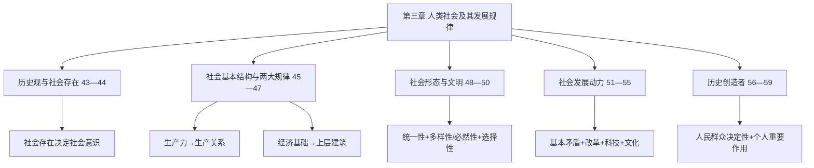

import { Callout } from 'fumadocs-ui/components/callout';

# 第三章 人类社会及其发展规律

> **复习定位：唯物史观的高频概念辨析章。** 所给政治分类真题文件收录 **27道**（2017—2026年 **18道**）；肖1000题精简版 **26条单选+30条多选**。其中**考点44“社会存在与社会意识”8道**，**考点49“社会形态更替”4道**，**考点59“个人的历史作用”4道**。本章一大命题习惯是将“促进、制约、影响”偷换成“根本决定”，或把“人民是历史创造者”曲解为“个人毫无作用”。

<Callout type="info" title="主线先记清：物质生活—基本矛盾—历史主体">
社会存在决定社会意识；**物质生产方式**是社会存在和发展的基础；社会基本矛盾推动社会形态发展；规律通过现实的人有目的的活动实现；**人民群众是历史的创造者**，杰出人物发挥特殊作用，但不能决定历史总方向。
</Callout>

## 一、原章结构、真题权重与做题路线

| 教材考点 | 所给真题收录 | 复习优先级 | 典型命题陷阱 |
| --- | ---: | --- | --- |
| 43 历史观基本问题 | 0 | 基础 | 混淆社会存在与社会意识的决定方向 |
| **44 社会存在与社会意识** | **8** | **最高** | 地理、人口、文化、法律变迁不是最终决定力量 |
| 45 生产力与生产关系 | 2 | **最高（基础）** | 生产工具/所有制/劳动者的地位混淆 |
| 46 经济基础与上层建筑 | 1 | **高** | 经济基础“归根到底决定”≠唯一机械决定 |
| 47 交往与世界历史 | 0 | 理解 | 世界历史形成的基础是生产方式发展变革 |
| 48 社会进步与社会形态 | 1 | **高** | 不是纯直线发展，也不是封闭循环 |
| **49 社会形态更替** | **4** | **最高** | 社会形态标准、统一性/多样性、必然性/选择性 |
| 50 文明及其多样性 | 2 | **高** | 地理环境不是决定力量，文明无高低优劣 |
| 51—53 社会基本矛盾、革命与改革 | 0（相关理论跨考点出现） | **高（框架）** | 根本动力/直接动力/另一重要动力张冠李戴 |
| 54 科学技术的作用 | 2 | **高** | 科技是强大杠杆但不能独立决定社会形态 |
| 55 文化的作用 | 0（考点44中有文化材料） | 中高 | “文化对发展始终积极”错误 |
| 56 群众史观与英雄史观 | 0 | 基础 | 杰出人物贡献≠英雄创造全部历史 |
| 57 唯物史观方法论 | 1 | **高** | 人的本质不是孤立的个人属性 |
| 58 人民群众决定作用 | 2 | **高** | 人民群众概念具有历史性，不能简单等同每一个人 |
| **59 个人历史作用** | **4** | **最高** | 个人影响历史事件，不能改变总进程和总方向 |

**建议路线**：先完成考点44、45、46组成的“决定作用层级表”，再掌握49的四组配对，最后把58—59联系2023和2025真题训练“群众—领袖—历史条件”完整论证。

---

## 第一节 社会存在、社会意识和社会基本结构（考点43—47）

## 考点43 历史观的基本问题与两种根本对立的历史观

### 1. 从哲学基本问题延伸到历史观

哲学基本问题是**思维与存在的关系**；在社会历史领域具体表现为**社会存在与社会意识的关系**，其中“哪个决定哪个”是唯物史观与唯心史观的**根本分界线**。

| 立场 | 最根本判断 | 典型表现 |
| --- | --- | --- |
| **唯物史观** | 社会存在决定社会意识，社会意识具有能动的反作用 | 从生产方式、社会结构、现实利益和实践理解观念和制度 |
| **唯心史观** | 用观念、英雄意志或抽象精神解释社会的根本发展 | 停在思想动机层面，不追问背后的物质条件与经济根源 |

马克思主义创立前虽有朴素唯物历史见解，但**没有形成科学、系统的唯物史观**。唯物史观的重大贡献不仅是“发现经济重要”，更是揭示社会发展有不以个人意志为转移的客观规律，同时承认历史由现实的人通过实践创造。

**肖1000题**单选1；多选涉及两种历史观区别，看到“历史是精神的产物”“观念创造全部制度”应警惕历史唯心主义。

## 考点44 社会存在与社会意识及其辩证关系

<Callout type="warn" title="本章真题数量最多：8道">
所给真题对应**2022-2、2022-20、2021-3、2021-18、2020-19、2015-2、2011-2、2004-2**。一类题围绕**自然环境、人口、生产方式**，另一类题围绕**社会意识的依赖性与相对独立性**，要分开做。
</Callout>

### 1. 社会存在的三项内容与决定性层级

| 要素 | 历史作用 | 绝不能说成 |
| --- | --- | --- |
| **自然地理环境** | 社会生存发展的永恒必要条件，影响资源、生产条件，可加速或延缓社会发展 | “地理条件最终决定社会制度” |
| **人口因素** | 人口数量、质量、结构影响生产和社会发展，受社会生产和制度制约 | “人口是社会性质的决定力量” |
| **物质生产方式** | **社会存在与发展的基础、决定力量**，最集中体现社会生活的物质性 | “只是一种可有可无的社会条件” |

**物质生产方式＝生产力与生产关系的统一**。它通过生产人类生活资料的活动组织人与自然、人与人之间的现实物质关系，是理解社会运动最基础的概念。

**2022-2，单选B**：“人不负青山，青山定不负人”，对应自然作为生产力要素及**合理利用自然促进社会发展**。A“自然自发满足一切要求”、C“人只能被动适应”、D“自然能动补偿人的劳动”都夸大了自然的主体性或抹杀人的实践。

**2021-18，多选AD**：人体免疫系统与气候环境的变化存在联系，反映人与自然相互依存和相互作用；不能把人看成完全凌驾自然或完全摆脱自然规律的主体。

**2011-2，单选D**：社会物质性最集中的体现是**生产方式**，不是地理环境和人口。**2004-2，单选D**：北大荒开垦后生态压力与退耕修复，说明应**合理调节人与自然之间的物质变换**，而不是“回到原始生态”或“人类任何改造活动都遭自然报复”。

**肖1000题**单选2—3、多选1—5：非常关注人口、自然与人类实践的边界；记住“人口影响社会进步的速度”与“生产方式决定社会形态性质”不是一个层级。

### 2. 社会意识的形成及相对独立性

**社会意识**是社会生活的精神方面，是对社会存在的反映，包括社会心理、风俗、价值观、思想体系等。其内容来自社会生活，形成与变化受物质社会条件制约；同时不只是机械复制现实。

相对独立性的三个典型表现：

1. **不完全同步性和不平衡性**：某些观念可滞后于社会经济变化，也可能预见未来趋势；经济水平较高的地区，思想文化发展不一定相应“第一”。
2. **历史继承性与内部互动**：思想、艺术、哲学、法律等有各自发展脉络，彼此作用，能继承改造历史遗产。
3. **对社会存在的能动反作用——最突出表现**：先进社会意识促进社会进步，落后社会意识可能阻碍社会发展。

**必须区分“最突出的表现”与“最常出题的例子”**：

- **2015-2，单选D**：直接考社会意识相对独立性**最突出的表现是对社会存在的能动反作用**。
- **2021-3，单选C**：人工智能新技术已普及，但法律法规一度滞后，说明社会意识与社会存在发展的**不平衡性**。法律“只会滞后”属于绝对化错误。
- **2022-20，多选AB**：网络热词体现**社会心态反映社会生活、社会意识随社会存在变化**。说热词由完全自发反应形成或社会心态决定生活多样性，均不妥。
- **2020-19，多选ABD**：地域文化受自然地理、经济生活影响，又具有相对独立性，不会因交通与网络发展就完全消失。错误项的根源是“文化决定社会性质”的文化决定论。

### 3. 三个常见混淆对照

| 材料 | 正确原理 | 不能推出 |
| --- | --- | --- |
| 新技术出现但立法滞后 | 社会意识与社会存在**不完全同步** | 社会意识必然永远落后于社会存在 |
| 旧俗语、新词汇继续流行 | 社会意识具有**继承性**，反映现实生活 | 语言与社会历史没有关系 |
| 先进理论动员群众实践 | 社会意识具有**能动反作用** | 思想本身替代物质生产来创造社会 |

**肖1000题**单选4—7，多选6—9，以“私有观念出现”“《新华字典》版本变化”“文学随时代发展”“社会意识相对独立”为基础，常将“最终决定”与“反作用”混作同一方向。

## 考点45 生产力与生产关系的矛盾运动及其规律

### 1. 生产力：三个基本要素、一条重要区别

| 生产力要素 | 作用 | 命题易混点 |
| --- | --- | --- |
| **劳动资料（劳动手段）** | 人改造自然所使用的物质资料；生产工具最重要 | **生产工具是区分社会经济时代的客观依据** |
| **劳动对象** | 劳动所指向的物质对象，有自然提供或经过加工的形式 | 不是所有天然存在物都已成为现实劳动对象 |
| **劳动者** | 具有生产经验、劳动技能的人，是生产力中最活跃的因素 | 不等同于“技术工具是最活跃因素” |

科学技术是先进生产力的重要标志和强大推动力量，在生产实践中广泛渗透于劳动者、劳动资料和劳动对象；科技发明必须经过生产应用才能更充分转化为现实生产力。区分：**劳动者最活跃、生产工具标志经济时代、科学技术是先进生产力的重要标志**。

### 2. 生产关系的三项内容

生产关系是人们在物质生产过程中结成的**不以个人意志为转移的经济关系**，包括：

1. **生产资料所有制关系**：在生产关系中**起决定作用**，是判定社会经济结构性质的主要客观依据。
2. 生产中人与人之间的关系。
3. 产品分配关系。

“所有制在生产关系中起决定作用”≠“生产关系反过来决定生产力水平”。两个层次不可互换。

### 3. 两者的矛盾规律

**生产力决定生产关系；生产关系反作用于生产力；生产关系一定要适合生产力状况。**

- 生产力的现实水平、发展要求，归根到底规定了适合何种生产关系。
- 适合生产力的生产关系促进发展，不适合则束缚甚至阻碍生产力。
- **相对适合/不适合是随发展变化的**，不能将一种生产关系永远视为“最先进”。

**2019-3，单选A**：变革时代的“物质生活的矛盾”根本上指**社会生产力与生产关系的现实冲突**；别被经济基础/上层建筑、自然与人、社会存在/社会意识三个近似选项带走。

**2020-18，多选BC**：区块链技术改变交易形式，但人们的社会关系仍多样复杂，且归根到底受生产关系制约；不是“单纯经济关系”或“完全由虚拟信息技术构造的关系”。

**肖1000题**单选8—11、多选10—13：生产力、生产关系各自的组成部分，以及“新质生产力发展需要深化改革”这一**生产关系适应生产力**的典型新材料。

## 考点46 经济基础与上层建筑的矛盾运动及其规律

### 1. 概念分清

| 概念 | 定义 | 典型内容 |
| --- | --- | --- |
| **经济基础** | 一定发展阶段占统治地位的**生产关系的总和** | 生产资料所有制及相应经济关系，不等于生产力的简单总和 |
| **观念上层建筑** | 在经济基础之上的意识形态 | 政治法律思想、道德、艺术、宗教、哲学等 |
| **政治上层建筑** | 与经济基础相适应的政治法律制度、组织和设施 | 国家政权、法律制度、政党、军队、法庭等 |

**政治上层建筑居于主导地位，其核心是国家政权。**“法律观念”主要属观念上层建筑，“法律制度、国家机构”属于政治上层建筑，选项常仅差一个词。

### 2. 经济基础决定上层建筑，上层建筑反作用于经济基础

经济基础决定上层建筑的产生、性质和变化发展；上层建筑服务其经济基础，并可以反过来**促进或阻碍**社会经济发展。适合经济基础发展要求的上层建筑具有积极作用，脱离这种要求则可能成为阻碍。

**2012-18，多选ABC**：将唯物史观诬为“只有经济起作用、文艺法律等都是被动的”，错误在于抹杀多因素的综合作用，把**归根到底的决定作用**曲解为**唯一的机械决定**，把双向反作用歪曲为单向作用。选项D“意识形态始终具有积极作用”本身就是错误的绝对化判断。

**记忆**：经济基础与上层建筑的矛盾运动规律，是与“生产关系一定适合生产力状况”并列的**第二个社会基本规律**。

## 考点47 人类普遍交往与世界历史的形成发展

- **物质交往**是精神交往的基础和根源，**精神交往**又渗透并影响现实交往。
- **世界历史**：民族、国家因社会生产和普遍交往逐步突破孤立状态，形成相互依存的世界整体化历史。
- **生产方式的发展变革**是世界历史形成和发展的**基础**；资本主义生产方式的发展及其对外扩展，在这一转变中发挥重要历史推动作用。
- **普遍交往**是世界历史的**基本特征**，并促进生产力、社会关系、文化交流和人的发展。

**肖1000题**单选13：问“世界历史的形成和发展基础”答**生产方式的发展变革**；问“基本特征”答**普遍交往**。不能凭互联网普及就断言社会关系完全虚拟化（与2020-18相联）。

---

## 第二节 社会进步、社会形态更替与文明（考点48—50）

## 考点48 社会进步与社会形态

### 1. 社会进步兼有横向深化和纵向更替

- **不同社会形态从低到高的更替**：推动生产力发展，是社会进步的重要历史表现。
- **同一社会形态内部的发展**：通过调整、改革、生产力和社会生活进步实现发展，不意味着必须马上更替社会形态。
- 社会进步有**客观规律**，但具体过程常有曲折、停滞与局部倒退；总体趋向进步，既**不是匀速直线**，也**不是封闭循环**。

**2026-1，单选A（①②③）**：“阶梯式递进、不断发展进步”，体现**前进性与曲折性统一、规律性与能动性统一、连续性与非连续性统一**。第④“直线运动或封闭循环”违背辩证发展观。

**肖1000题**单选14—15：社会进步集中表现为社会形态的发展变化，人的全面发展包括体力、智力、个性、交往能力等，其根本标志同自由程度提高相联系。

## 考点49 社会形态更替

<Callout type="warn" title="第二大高频考点：四道真题">
对应**2023-2、2021-2、2018-18、2006-18**。把“划分标准”“社会形态更替一般规律”“各国实际路径”和“人的历史选择”分成独立问答来掌握。
</Callout>

### 1. 定义与划分依据

**社会形态是同生产力发展一定阶段相适应的经济基础与上层建筑的统一体**。按照**经济基础特别是生产关系的性质**，总体人类历史可划分为：

**原始社会 → 奴隶社会 → 封建社会 → 资本主义社会 → 共产主义社会**（社会主义社会是共产主义社会第一阶段）。

- **2023-2，单选C**：问五种社会形态划分依据，是**经济基础尤其生产关系的性质**。生产工具数量、政治统治集团性质、分工范围都不能代替这一标准。
- **2021-2，单选A**：能够从历史汲取经验，是因为历史过程存在**不以个人意志为转移的客观规律**；不说明人类“完全掌握历史规律”。

### 2. “两对统一”答题表

| 一组辩证统一 | 正确含义 | 错误推论 |
| --- | --- | --- |
| **统一性与多样性** | 总体历史有一般规律；各民族国家的具体演变顺序、速度和道路呈多样性，可有历史跨越 | “每个国家都必须逐字逐步复制同一路径”或“任何路径都不受一般规律约束” |
| **必然性与历史选择性** | 历史规律规定基础、范围和可能性空间；现实人民可基于条件和利益作出选择 | “客观必然性否定主观能动性”或“个人可以凭主观愿望决定全部历史” |

**2018-18，多选ABC**：历史选择不是抹去客观必然，而是**在客观提供的可能性空间中发挥主体能动性**；历史选择归根到底是**人民群众的选择**。D“个人意志决定历史客观过程”错误。

**2006-18，多选ACD**：规律性与合目的性统一，人可以加速或减轻转型阵痛，但不能用法令取消总体发展阶段。注意“某个国家可以跨越特定社会形态”与“人类社会总体历史进程不可随意取消”并不矛盾。

### 3. 规律作用方式：社会规律 vs 自然规律

| 维度 | 自然规律 | 社会历史规律 |
| --- | --- | --- |
| 客观性 | 均不以人的意志为转移 | 均不以人的意志为转移 |
| 起作用方式 | 不依赖人的意识、目的仍可发生作用 | **必须通过具有目的和意识的人的实践活动实现** |
| 认识和利用 | 可通过科学认识利用 | 可通过群众实践、制度调整、历史选择认识利用 |

错误说法“社会规律因为通过有意识活动实现，因此不客观”是对“客观”与“自发”的混淆。

**肖1000题**单选16—18、多选中“社会形态更替”题，重点反驳机械决定论与主观意志论两个极端。

## 考点50 文明及其多样性

### 1. 文明定义与多样性根源

**文明**是人类社会实践形成的**物质成果、精神成果和制度成果**的总和，是社会进步的标志，具有丰富多样的民族历史形态。

文明多样性来自不同社会的**自然环境、历史背景、生产方式、民族传统、交往方式**等条件，但这不意味着地理条件最终决定文明兴衰。文明平等、包容，**没有简单的高低优劣之分**；文明之间相互交流、互鉴，不是彼此完全隔离的孤岛。

### 2. 近年两道真题

- **2026-21，多选BC**：河流作为文明成长的自然环境影响共同生活、文化心理，因而可以**加速或延缓**文明进步；“所有文明主要靠河流交流”“地理环境决定文明形态”均把地理条件作用绝对化。
- **2024-19，多选AC**：不同生产生活方式使文明呈不同样态，各文明都有独特贡献，均是人类文明的一部分。拒绝“某种文化基因天生优越”和“各种文明都是隔绝独自发展”。

**肖1000题**单选19：文明强调社会实践的**积极成果**，包括物质、精神和制度，并非文明等于某一文化产品或某一社会制度。

---

## 第三节 社会历史发展的动力（考点51—55）

## 考点51 社会基本矛盾在历史发展中的作用

### 1. “根本动力—直接动力—其他动力”的对照

| 动力及范畴 | 必须背准的提法 | 典型设问 |
| --- | --- | --- |
| **社会基本矛盾** | **社会发展的根本动力**，贯穿各社会形态 | “推动社会历史发展最根本的力量？” |
| 阶级斗争 | **阶级社会发展的直接动力** | 限定“阶级社会” |
| 社会革命 | 社会形态更替的重要手段和决定性环节 | “旧社会制度向新制度转变” |
| **改革** | 推动社会发展的**又一重要动力**，制度自我调整与完善 | “同一社会形态内部深刻调整” |
| 科学技术 | 先进生产力的重要标志、社会进步的**强大杠杆** | “生产方式、生活方式、思维方式发生变革” |
| 文化 | 通过思想指引、精神动力、凝聚力量影响社会 | “社会意识如何促进或阻碍社会发展” |

社会基本矛盾是**生产力与生产关系、经济基础与上层建筑**两对矛盾。社会主要矛盾可以随社会发展阶段发生变化，不能因此说社会基本矛盾消失。

**肖1000题**多选“新质生产力、改革、经济危机与科技进步”，要把“根本动力”与“强大杠杆”区分清楚。2019-3（A）虽归在考点45，也间接应用基本矛盾理论。

## 考点52 阶级斗争、社会革命在社会发展中的作用

- **阶级及阶级斗争不是自古永恒存在**，是人类社会发展到一定历史阶段的产物。
- **阶级斗争是阶级社会发展的直接动力**：涉及不同阶级之间根本利益冲突及社会结构变化。
- **社会革命**作为社会形态变更的重要手段和决定性环节，能够推动生产关系和政治制度深刻变化，并动员、锻炼人民群众。

**辨析**：不是说一切社会发展都靠阶级斗争直接推动，更不能用“革命是动力”覆盖科技、文化、改革和基本矛盾的作用层级。

## 考点53 改革在社会发展中的作用

改革是在一定社会形态内部，为解决**社会基本矛盾**，对不适应生产力和社会发展需要的生产关系、上层建筑进行调整、变革、革新。它可表现为**量变与部分质变**，是一定制度的自我调整和完善。

| 改革 | 社会革命 |
| --- | --- |
| 侧重现存社会制度内部深层次调整和完善 | 可能导致旧社会形态向新社会形态更替 |
| 解决现实矛盾，推动生产力和社会进步 | 实现制度、社会结构的根本变化 |
| **社会发展的又一重要动力** | **社会形态更替的重要手段和决定性环节** |

**肖1000题**单选11：“打通束缚新质生产力发展的堵点”体现**生产关系要适应生产力发展**，而非“制度只需随人的偏好调整”。改革的方向与效果需要从客观矛盾、社会条件及实践来判断。

## 考点54 科学技术在社会发展中的作用

### 1. 科技革命影响三个领域

1. **生产方式**：改变生产力要素配置、劳动方式、产业和经济结构。
2. **生活方式**：改变工作、交往、衣食住行等社会生活条件。
3. **思维方式**：新技术与新认识工具促进科学思维方式转变。

科学技术具有推动社会进步的巨大能力，但**实际社会后果受生产关系、制度、价值选择和应用方式制约**。科技应用既可能造福，也可能带来风险（连接第二章AI、基因编辑的真理与价值双尺度）。

### 2. 真题和典型干扰项

- **2024-3，单选D**：北斗更高精度定位服务由社会实际应用要求推动，说明**社会实践需要是技术进步的根本动力**，而不是研究兴趣、主体意志或单靠研究规范。
- **2010-18，多选CD**：社会危机可能催生科技需要，科技创新推动生产发展；但科技革命不是**摆脱社会危机的根本出路**，也不是划分社会形态的**根本标志**。

**肖1000题**单选20—21、多选中的“元宇宙”等：科技是先进生产力的重要标志，不要简单写成“科技就是生产力中最活跃的因素”（教材明确该表述对应**劳动者**）。

## 考点55 文化在社会发展中的作用

文化作为重要社会意识形式及人类实践成果，可以：

- 为社会发展提供**思想指引**；
- 为社会发展提供**精神动力**；
- 为社会发展提供**凝聚力量**。

文化的影响既可能促进，也可能阻碍发展；既可能加快，也可能延缓发展。一定文化形成、传承和更新要有相应社会生活与物质生产基础。

**肖1000题**单选22（中秋等节日联系全球华人，文化凝聚力）；多选6—9（农业文化、文艺与时代、历史继承性）。**2020-19（ABD）**&#x2060;虽按题库归在考点44，也能训练文化独特性与地理环境的联系。

---

## 第四节 人民群众与历史人物（考点56—59）

## 考点56 两种历史观在历史创造者问题上的对立

- **英雄史观**：把少数领袖、天才或精神意志当作创造历史的根本力量，夸大个人的决定作用，往往脱离社会生产实践与人民群众。
- **群众史观**：人民群众是社会历史实践的主体、历史的创造者；肯定历史人物的重要作用，但把它置于历史规律、客观条件及群众实践之中考察。

两个命题不可混同：①“历史人物发挥重要作用”是正确的；②“伟人决定整个历史总方向”是错误的。后者正是英雄史观型干扰项。

## 考点57 唯物史观考察历史创造者问题的方法论原则

### 1. 现实的人及其本质

马克思在《关于费尔巴哈的提纲》中指出：**人的本质在其现实性上是一切社会关系的总和**。这要求：

1. 人不是抽象的、生来具有不变本质的“孤立个人”。
2. 人兼有自然属性和社会属性，**人的本质属性是社会属性**。
3. 现实的人处在特定的经济、政治、文化和历史关系中，人的本质具有**具体性、历史性和变化发展性**。

**2009-4，单选C**：这是固定问答；选“自然属性和社会属性统一”虽然是有关人的一般正确论断，却未精确回答题干问的“人的本质在其现实性上”。

### 2. 方法论三方面

- 从**现实的人**及其社会关系出发，不从抽象人性推论历史。
- 从**社会历史整体过程**观察各种人的活动及其合力，不把总体历史当作孤立个人活动简单相加。
- 从**人与历史条件之间的统一**出发，历史是现实的人创造的，但活动条件不是随个人意志任意指定。

**肖1000题**单选23—24、多选中历史规律与人的能动性：历史运动规律通过人的有目的实践实现，但历史又不被个体意志自由控制。

## 考点58 人民群众在创造历史过程中的决定作用

### 1. “人民群众”是历史范畴

| 维度 | 正确表述 | 干扰项 |
| --- | --- | --- |
| **质的规定** | 一切对社会历史发展起**推动作用**的人们 | “每一个社会成员在一切时期都属于人民群众” |
| **量的规定** | 社会人口中的**绝大多数** | “少数英雄才是人民群众” |
| **稳定主体** | 从事物质资料生产的劳动群众及其知识分子 | “人民群众内涵在所有时代完全不变” |
| **历史性** | 不同时代可包括不同的阶级、阶层和集团 | “一切剥削阶级成员在任何历史时期必然都不属于人民群众” |

### 2. 人民群众创造历史的三个层次

1. **物质财富的创造者**：生产社会生存发展的物质条件。
2. **精神财富的创造者**：创造思想文化的社会实践源泉，参与精神成果的生产与发展。
3. **社会变革的决定力量**：通过群众运动、生产实践和社会行动推动变革。

人民群众创造历史的活动受既定生产方式、制度、传统及自然条件制约，**历史主体地位与社会条件制约并不矛盾**。

**2018-3，单选B**：以人民为中心的哲学基础，是**人民群众是历史创造者**，而不是把“人的本质”当作对该题最直接的回答。

**2013-18，多选ABD**：人民群众概念的质、量和稳定主体，A、B、D正确；C“任何时期都不包括剥削阶级”忽略该范畴的历史性，例如特定时期对社会进步发挥推动作用的阶层也可能被纳入。

**肖1000题**对应“群众史观、历史创造者、人民根本利益”知识群。做题时看到“群众能决定每一个具体事件中的每一个细节”也要排除，这不是“决定作用”的含义。

## 考点59 个人在社会历史中的作用

<Callout type="warn" title="本章又一重点题群">
原题库收录**2025-3、2023-17、2017-18、2014-18**四题。思维框架一定包含三句话：**个人有作用**；**不同人物作用性质与大小不同**；**无论谁都不能决定历史发展的总进程和总方向**。
</Callout>

### 1. 普通个人、历史人物、杰出人物

| 类别 | 定义 | 作答边界 |
| --- | --- | --- |
| **普通个人** | 在历史上有较一般作用的个体 | 也会对社会产生或大或小的作用，不等于毫无作用 |
| **历史人物** | 某种重大历史事件的倡导者、组织者、领导者或理论文化代表 | 既可能促进也可能阻碍社会发展 |
| **杰出人物** | 在历史人物中，对推动社会历史发展作出积极重要贡献的人 | 发挥特殊重要作用，仍受客观规律和社会条件限制 |

历史人物**可能决定个别历史事件的结局**，但**不能决定和改变历史发展的总进程、总方向**。历史人物出现以及能发挥多大作用，是**历史必然性与个人偶然性**的辩证统一。

### 2. 评价历史人物的方法

- **历史分析方法**：从特定时代、社会条件、发展水平和现实矛盾出发，不能苛求前人完成只有后人条件下才能完成的事。
- **阶级分析方法**：结合人物的社会经济地位、利益关系与所处阶级环境理解其活动。
- **全面、具体地分析功过**：历史人物可能在不同方面具有不同作用，不能“功劳全由一人”“失败全怪一人”。

**2025-3，单选D**：要在特定历史条件下，对人物作具体、全面的历史评价。A“群众与杰出人物历史作用等同”、B“个人改变历史根本方向”、C“逆境作用必大于顺境”均不成立。

### 3. 四道题型组合法

| 真题和答案 | 识别点 | 核心结论 |
| --- | --- | --- |
| **2025-3 D** | 人物评价不能脱离时代条件 | 历史分析、具体全面评价 |
| **2023-17 ABC** | 领导者、权威组织集体行动 | 杰出人物能引领方向、影响事件进程、凝聚群众，但不取代群众创造历史 |
| **2017-18 ABC** | 历史人物作用大小及方向 | 有影响、受历史条件和规律限制；“历史人物都积极”错误 |
| **2014-18 AD** | “活过的人都能照亮后人” | 历史是无数个人活动的合力，个人都有或大或小作用；不等于人人在严格意义上都构成历史的创造者 |

**肖1000题**单选23—26，特别是“英雄出现的必然与偶然”“历史合力论”“人的本质是一切社会关系总和”：三者都不能为“英雄人物完全决定历史”提供依据。

---

## 五、跨章和跨考点的六组“决定作用”辨析

这类题命题经常使用“第一、根本、决定、最活跃”等词换掉准确对象，建议连带第一章和第二章一起记忆。

| 被问什么 | 正确答案 | 错误混搭 |
| --- | --- | --- |
| 社会存在和发展的**基础、决定力量** | **物质生产方式** | 自然地理环境、人口、法律、文化 |
| 区分社会经济时代的**客观依据** | **生产工具** | 所有制结构、国家政权 |
| 生产力中**最活跃的因素** | **劳动者** | 技术设备单独作为最活跃因素 |
| 生产关系中**起决定作用的关系** | **生产资料所有制关系** | 产品分配方式、政治制度 |
| 划分**社会形态的依据** | **经济基础特别是生产关系的性质** | 科技水平、最高领导人、意识形态 |
| 社会历史发展的**根本动力** | **两对社会基本矛盾** | 科学技术、阶级斗争、个别英雄的意志 |
| 阶级社会发展的**直接动力** | **阶级斗争** | 不加社会条件限定的任意斗争 |
| 社会意识相对独立性**最突出表现** | **能动反作用** | 历史继承性、不同步性（虽也是表现，但非“最突出”） |
| 历史的**创造者** | **人民群众** | 少数英雄人物 |

## 六、按命题场景反向定位考点

| 看到的材料 | 优先考虑 | 避免误选 |
| --- | --- | --- |
| 护林员、生态补偿、气候、人口 | 44：自然地理环境是必要条件，人与自然合理物质变换 | 地理环境决定论 / 人完全受自然摆布 |
| 新术语、新法治难题、传统文化 | 44：社会存在决定社会意识 + 相对独立性 | 社会意识只能落后 / 社会意识单向决定生活 |
| 智能农具、新质生产力、所有制改革 | 45：生产力结构、生产关系适应生产力 | 把生产资料所有制等同生产工具 |
| 法律制度、意识形态、国家机构 | 46：经济基础与上层建筑相互作用 | “经济是唯一原因” |
| 五种社会形态、历史跨越、人民的选择 | 49：四组统一和历史规律的客观性 | 绝对必然论 / 任意选择论 |
| 河流文明、文明交流互鉴 | 50：自然条件影响 + 多样平等 | 地理或文明天生优越决定论 |
| 科技升级促进产业、社会危机催生技术 | 54：实践需求动力 + 科技推动经济 | 科技取代所有社会基本矛盾 |
| 以人民为中心、人民主体地位 | 58：群众创造历史 | 英雄决定总方向 |
| 评价历史人物、领袖作用、历史合力 | 57—59：历史条件、群众决定作用、个人影响 | 个人完全无用 / 个别人物决定历史 |

---

## 七、考前练习：关键错项修正

易错一｜“社会意识的相对独立性就是不受经济状况影响”。

**错。**“相对独立”是在总体上**社会存在决定社会意识**的前提下，其发展具有不同步性、历史继承性和能动反作用，并非两者无联系。训练：2021-3（C）、2015-2（D）、2022-20（AB）。

易错二｜“科技是第一生产力，因此社会形态由科技水平划分”。

**错。**&#x2060;科技进步推动生产力，但社会形态的划分依据仍为**经济基础尤其生产关系的性质**。训练：2023-2（C）、2010-18（CD）、2024-3（D）。

易错三｜“社会发展有规律，就无需人民选择和实践”。

**错。**&#x2060;社会规律是客观的，但通过人的有意识的历史活动实现；历史选择须受客观可能性限制，归根到底是**人民群众的选择**。训练：2018-18（ABC）、2006-18（ACD）。

易错四｜“文明都在不同地理环境成长，所以地理环境决定文明高下”。

**错。**&#x2060;地理是永恒必要条件，可促进或延缓，但最终决定力量是物质生产方式。文明具有多样性和平等性，不能作简单优劣排名。训练：2026-21（BC）、2024-19（AC）。

易错五｜“杰出历史人物可能影响重大事件，因此决定全部历史方向”。

**错。**&#x2060;历史人物可能决定个别事件结局，却受时代与客观规律制约，不能决定历史的**总进程和总方向**。社会历史是无数个人活动合力形成，而人民群众是历史创造者。训练：2017-18（ABC）、2023-17（ABC）、2025-3（D）、2014-18（AD）。

## 八、背诵版框架及来源定位

**一张闭环表**：社会存在 → 生产方式 → 生产力与生产关系 → 经济基础与上层建筑 → 社会基本矛盾推动进步 → 社会形态更替的统一性、多样性、必然性与选择性 → 人民群众创造历史，个人发挥重要而受限的作用。

**原资料对应位置：**

- **精讲精练**：《马克思主义基本原理》第三章，**考点43—59**；其中涉及两对基本矛盾、人的本质及历史人物评价的论证应回教材熟读。
- **政治分类真题**：`marxism-principles/第三章-人类社会及其发展规律.mdx`，题库编号**68—94**共27道。
- **肖1000题精简版**：`marxism-principles/03-human-society-and-development.md`，单选**1—26**，多选**1—30**。文件为精简化知识点整理而非完整的原版练习题页，归纳不可误作对完整1000题的逐题统计。

> **命题密度提醒**：原题库有**8道考点44**，题量明显高于其他考点，先学“生产方式与社会意识的逻辑”；考点49、59各4道，适合专项训练。考点51—53虽未单列分类真题，却是正确理解社会发展、解答相关题干所必需的基础，不能略去。
