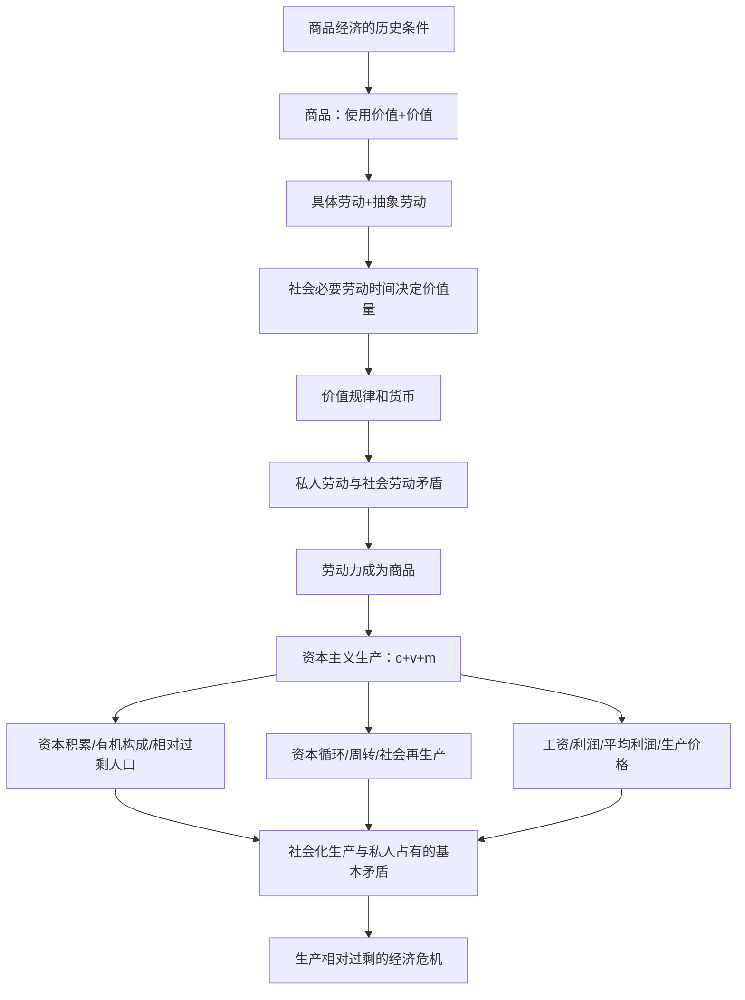
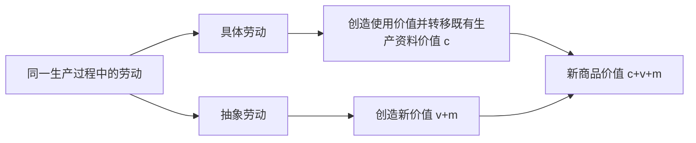

import { Callout } from 'fumadocs-ui/components/callout';

# 第四章 资本主义的本质及规律

> **复习定位：本章是马克思主义政治经济学的核心章节，概念链最长、数字计算最多。** 提供的分类真题文件收录 **33道题**，其中 **2017—2026年17道**；对应的肖1000题**精简版**含 **69条单选知识点、44条多选知识点，共113条**（不是原版肖1000题完整题量）。按提供材料统计，**考点71“资本积累”6道**，**考点61“商品二因素”和考点73“工资与剩余价值分配”各4道**，应优先完整掌握；考点65、67、74、77虽然此分类文件未单列真题，也属于连接整个原理体系的必备基础。

<Callout type="info" title="本章的解题主线：从商品到经济危机">
商品经济条件 → 商品二因素 → 劳动二重性 → 价值量与货币 → 私人劳动和社会劳动的矛盾 → 劳动力成为商品 → **剩余价值生产** → **资本积累、循环、分配** → 资本主义基本矛盾与经济危机 → 政治制度和意识形态。

背结论前要识别题目询问的是**价值的来源**、**价值量的决定**、**剩余价值的生产**、**利润的分配**还是**制度的本质**；这些问题的答案不在同一层次。
</Callout>

## 一、原章考点、真题权重与复习次序

| 原教材考点 | 分类真题道数 | 复习权重 | 优先会做的题型 |
| --- | ---: | --- | --- |
| 60 商品经济产生的历史条件 | 2 | 高 | 简单商品经济的基础、两个前提 |
| **61 商品的二因素** | **4** | **最高** | 非商品识别、使用价值/价值/交换价值 |
| 62 劳动的二重性 | 1 | **最高（枢纽）** | 具体劳动/抽象劳动及其不同作用 |
| 63 商品价值量的决定 | 3 | **最高** | 生产率与单件价值、复杂劳动折算 |
| 64 价值形式与货币 | 1 | 高 | 货币五职能、赊购与支付手段 |
| 65 价值规律及其作用 | 0 | 高（基础） | 价格围绕价值波动与三项作用 |
| 66 私人劳动与社会劳动矛盾 | 2 | **最高（贯通）** | 三组商品经济矛盾的根源 |
| 67 劳动价值论的意义 | 0 | 理解 | 创新所在、对剩余价值论的奠基作用 |
| 68 资本主义经济制度产生 | 1 | 高 | 原始积累途径及本质 |
| 69 劳动力商品与货币转化为资本 | 2 | **最高（基础）** | 劳动力价值构成、特殊使用价值 |
| 70 剩余价值生产 | 3 | **最高** | $c,v,m$、剩余价值率、三种增殖方式 |
| **71 资本积累** | **6** | **最高** | 有机构成、相对过剩人口、自动化 |
| 72 资本循环周转与社会再生产 | 2 | **最高** | 三种职能形式、固定/流动资本、两大部类 |
| **73 工资与剩余价值分配** | **4** | **最高** | 平均利润形成、生产价格计算、工资本质 |
| 74 剩余价值理论的意义 | 0 | 理解 | 剥削本质、科学社会主义的理论基础 |
| 75 基本矛盾与经济危机 | 1 | 高 | 生产相对过剩、根本原因/直接表现 |
| 76 资本主义政治制度及其本质 | 1 | 中 | 形式平等与实质不平等 |
| 77 资本主义意识形态及其本质 | 0 | 基础 | 经济基础与上层建筑、阶级性 |

<Callout type="warn" title="真题数量的解释边界">
以上数字只统计所给《政治分类真题》**本章中被归入某一考点的题目**，不是全国历年该考点实际出现频率，也不等于一章在未来考试中的固定分值。真题密度用来安排复习篇幅；无单列真题的概念不代表可以跳过，尤其价值规律、剩余价值理论和资本主义意识形态等基础环节。
</Callout>

---

## 第一节 商品经济与劳动价值论（考点60—67）

## 考点60 商品经济产生的历史条件

**商品经济**是以交换为目的进行生产的经济形式，与以直接满足自身需要为目的的**自然经济**相区别。商品经济是历史范畴：形成于一定生产力与生产关系条件下，而非有人类社会就有商品经济。

两项**产生条件**应完整记忆：

1. **社会分工的存在**：不同生产者专门生产不同物品，产生相互交换的客观需要。
2. **生产资料和劳动产品属于不同的所有者**：使产品交换具有相应的社会经济基础。

| 形式 | 生产基础 | 劳动形式 | 生产目的 | 常见干扰项 |
| --- | --- | --- | --- | --- |
| 自然经济 | 自给自足的生产组织 | 主要用于本经济单位 | 自用、直接消费 | 把所有劳动产品都视为商品 |
| **简单商品经济** | **生产资料私有制** | **个体劳动** | 交换以取得所需使用价值 | 错选雇佣劳动/公有制 |
| 资本主义商品经济 | 资本主义私人所有制 | **雇佣劳动** | 价值增殖与剩余价值生产 | 混同简单商品经济 |

**真题验证：**&#x2060;2021年多选第19题选 **BC**，问的是商品经济“得以产生”的条件，不能把**商品二因素**和**货币的形成**当作起源条件；2024年多选第20题选 **BC**，强调简单商品经济以**个体劳动、生产资料私有制**为基础。两题选项字母相同，但提问层级不同。

**肖1000题精简版对应**：单选第1—4条、多选第1—3条可与本考点及考点61合练。看到“商品经济产生于资本主义”“所有商品生产都以雇佣劳动为基础”应排除。

## 考点61 商品的二因素：使用价值和价值

### 1. 判定某物是否为商品

**商品的三个必要特征**：①能满足某种需要；②是劳动产品；③**用于交换**。其中“为了交换”最常被题目隐藏在情境里。

| 情境 | 有无使用价值 | 是否劳动产品 | 是否用于交换 | 是否商品 |
| --- | --- | --- | --- | --- |
| 自家种植并自己食用的蔬菜 | 有 | 是 | 否 | **否** |
| 天然泉水尚未进入交换 | 有 | 不是以劳动产品形式提供 | 否 | **否** |
| 作为实物地租直接交给地主的粮食 | 有 | 是 | 不通过商品交换 | **否** |
| 企业生产并出售的手机 | 有 | 是 | 是 | **是** |
| 劳动生产但完全没有任何有用性的废弃物 | 不具备相应使用价值 | 是 | 即使投入劳动也不能实现相应商品价值 | **不能仅凭耗费劳动就认定有价值** |

**2025年多选第20题，答案ABD**：实物租、家用自产品均不是通过交换实现的劳动产品；为了获利而进入交换的农业产品是商品。考题关键不是“谁拥有”“是否封建社会”，而是**是否为交换而提供**。

### 2. 三个价值概念，必须拆开

| 概念 | 本质定义 | 所反映关系 | 关键结论 |
| --- | --- | --- | --- |
| **使用价值** | 满足需要的有用性 | 人与自然的物质关系，商品的自然属性 | 构成财富的物质内容；是交换价值的物质承担者 |
| **价值** | 凝结在商品中的无差别的一般人类劳动 | 商品生产者之间的社会关系，商品特有的社会属性 | **抽象劳动是价值实体**；不同商品可以在质上比较 |
| **交换价值** | 一种使用价值同另一种使用价值交换的数量关系或比例 | 价值在交换中的外在呈现 | **价值是其基础，交换价值是其表现形式** |

> **辨析“唯一源泉”**：人的抽象劳动是**商品价值**的源泉；但**社会财富/使用价值**的形成还依赖自然物质、生产条件。若题干说“劳动是一切社会财富的唯一源泉”，不能等同于“劳动创造价值”。

### 3. 商品二因素的对立统一

- **统一**：作为商品必须同时具有使用价值和价值。使用价值是价值实现的必要物质条件，价值寓于使用价值之中。
- **对立**：买者要获得使用价值须支付货币；卖者要实现价值须让渡使用价值。**不可兼得是交换双方利益实现方式的对立**，不是说“一件商品只能拥有一个因素”。
- **解决方式**：通过商品买卖，使商品生产者得到货币、购买者得到商品，商品内在矛盾在交换中暂时得到解决。

**2013年单选第3题，答案A**：同一件上衣无论谁穿，都体现穿着用途，即使用价值；不能据此断言上衣自用时仍有商品价值。**2012年多选第19题，答案CD**：价值是一般人类劳动的凝结且体现生产者之间的社会关系。**2000年单选第4题，答案D**：研究商品的使用价值，是因为它充当**交换价值的物质承担者**；其他关于使用价值的描述虽然可能正确，但不是这一设问的针对性答案。

**肖题对应**：单选1—8、多选1—3。特别注意题干问“某概念正确描述”还是问“理论研究这一概念的原因”；后者不能只凭一句一般定义选答案。

## 考点62 生产商品的劳动的二重性

<Callout type="info" title="政治经济学的“枢纽”：劳动二重性">
**同一次生产商品的劳动，有具体劳动和抽象劳动两个方面，不是生产者先进行两次不同的劳动。** 劳动二重性决定商品二因素，是理解资本主义剩余价值生产、价值转移和新价值创造的起点。2018年单选第4题选 **C**，直接考查“理解政治经济学的枢纽”。
</Callout>

| 比较项 | **具体劳动** | **抽象劳动** |
| --- | --- | --- |
| 含义 | 在特定生产目的、工具、方法下进行的有用劳动 | 撇开具体形式的一般人类体力与脑力耗费 |
| 与商品的对应关系 | **形成使用价值** | **形成新价值** |
| 所反映的关系 | 人与自然之间 | 商品生产者之间的社会关系 |
| 性质 | 劳动的自然属性 | 商品生产劳动的社会属性 |
| 在资本主义生产中 | 使生产资料原有价值**转移**到产品 | 创造**新的价值 $v+m$** |

**核心陷阱**：“具体劳动创造价值”错；“抽象劳动转移生产资料旧价值”错；“生产资料自动创造新价值”错；“劳动二重性＝两份劳动”也错。

**肖题对应**：单选5—11、23，多选4、21—23。特别需要把“使用价值的源泉”和“价值的实体”区分，不要把“生产资料是价值创造的物质条件”说成“生产资料是新价值创造主体”。

## 考点63 商品价值量的决定

### 1. 定义：社会必要劳动时间，而不是某人的耗时

商品价值量由**生产该商品的社会必要劳动时间**决定，其条件是**现有社会正常生产条件、社会平均劳动熟练程度与劳动强度**。个别生产者笨手笨脚、耗时更长，不能由此决定市场上的商品价值量更大。

在生产其他条件给定、劳动强度和复杂程度相当时：

$$
\text{单件商品价值量}\;\propto\;\text{社会必要劳动时间}
$$

$$
\text{单件商品价值量}\;\propto\;\frac{1}{\text{社会劳动生产率}}
$$

**2023年单选第3题，答案C**：同样时间的劳动形成的**新价值总量**保持不变，但当劳动生产率升高、产量增加时，**单件价值量下降**。不要混淆新价值总量与产品件数、使用价值总量。

### 2. 产量、单位价值、总新价值：分清“部门”和“个别”

假设社会每小时劳动创造的价值等价为120单位，原来每小时做4件，社会劳动生产率翻倍后做8件：

| 条件 | 单位时间的商品件数 | 单件新价值量（演示） | 单位时间新价值总量 |
| --- | ---: | ---: | ---: |
| 原有社会劳动生产率 | 4件 | 30 | 120 |
| 社会劳动生产率提高1倍 | 8件 | 15 | **120** |

这里仅比较**同质同强度劳动创造的新价值**，没有把转移的生产资料价值 $c$ 混入。若只是**一个企业个别劳动生产率提高**、社会必要劳动时间暂不变，则该企业单件个别价值下降、社会价值暂不变，可形成超额剩余价值；这是两类题的主要分水岭。

### 3. 简单劳动和复杂劳动

复杂劳动在相同时间可以形成比简单劳动更多的价值；**复杂劳动折算为倍加的简单劳动**，但并非生产者协商确定、政府事先规定，更不是主观自觉计算。

**2020年单选第3题，答案D**：在商品交换过程中**由社会过程自发实现**。**2008年多选第21题，答案AB**：部门劳动生产率提高，对应单件价值量下降、使用价值数量增加。

**肖题对应**：单选13—16、多选5—7。计算时先标注题目是“社会”还是“个别”，是否保持**劳动时间、劳动强度、复杂程度**一致。

## 考点64 价值形式的发展与货币

四个发展阶段依次为：**简单或偶然的价值形式 → 总和或扩大的价值形式 → 一般价值形式 → 货币形式**。货币是长期交换中**固定充当一般等价物的商品**，并非凭空发明的纸面数字。它的出现使商品交换更便利，但没有消除商品经济内在矛盾。

| 职能 | 判断关键词 | 典型情境 | 容易误选为 |
| --- | --- | --- | --- |
| **价值尺度** | 计价、标价、价格是多少 | 标牌写“售价500元” | 流通手段 |
| **流通手段** | 钱货即时相互让渡 | 付款同时拿货 | 支付手段 |
| **贮藏手段** | 货币作为财富保存，退出流通 | 古典理论中足值金属货币贮藏 | 支付手段 |
| **支付手段** | 赊购、结算债务、延期付款、租金税费 | 先拿商品后付欠款 | 流通手段 |
| **世界货币** | 在世界市场执行货币职能 | 跨国结算中货币的世界性使用 | 单纯流通手段 |

**最基本的两种货币职能**：价值尺度、流通手段。前者在概念上可以是**观念的货币**，后者需要实际充当交换媒介。现代电子货币、银行存款等情境的具体支付安排可以变化，但答考研政治的经典原理题应按考点的理论定义判断。

**2022年单选第3题，答案D**：卖者成为债权人、买者成为债务人，关键词已表明**商品让渡和货币清偿分离**，是支付手段。**肖题**：单选17—20，多选8—12；多选尤其容易把“约定价格”（价值尺度）与“按期清偿”（支付手段）混在一起。

## 考点65 价值规律及其作用

### 1. 规律的内容和表现形式

价值规律是商品生产和商品交换的**基本规律**，要求商品价值量由**社会必要劳动时间**决定，商品交换以价值量为基础按照**等价交换原则**进行。

现实中价格受供求等因素影响，表现为：

$$
\text{价格围绕价值上下波动}
$$

| 层次 | 正确认识 | 错误认识 |
| --- | --- | --- |
| 决定层 | 价值量是价格形成的重要基础 | 价格只由供求决定，与劳动无关 |
| 表现层 | 供求影响价格偏离价值，波动是规律表现形式 | 每笔交换都必须价格严格等于价值 |
| 时间层 | 在反复交换与一定时期的平均中体现规律 | 一次涨价就表明价值规律已失灵 |
| 社会适用层 | 价值规律支配商品经济中的生产和交换 | 价值规律只存在于资本主义 |

### 2. 三个方面的自发作用

1. **自发调节资源配置**：生产资料和劳动力在各部门之间分配比例发生变化。
2. **自发刺激生产力发展**：提高技术、管理效率的生产者会谋求竞争优势。
3. **自发调节社会收入分配**：不同生产者受市场条件影响获利有差异。

**局限性**：生产与资源利用可能自发失衡、社会资源浪费、收入分化。要看到价值规律的客观性，但不能说“市场竞争一定自动实现社会整体最优”。

**肖题**：单选17、多选9—11。特别注意：价值规律**既在商品生产过程发生作用，也在商品流通过程发生作用**。

## 考点66 以私有制为基础的商品经济的基本矛盾

<Callout type="warn" title="基础矛盾与资本主义基本矛盾不是同一个答案">
在**以私有制为基础的商品经济**中，基本矛盾是**私人劳动和社会劳动的矛盾**；在**资本主义社会**中，基本矛盾是**生产社会化和生产资料资本主义私人占有之间的矛盾**。题干的对象不同，选项答案也不同。
</Callout>

| 矛盾 | 表现形式 | 更根本的层级 |
| --- | --- | --- |
| 使用价值 ↔ 价值 | 商品有用不等于能够卖掉并实现价值 | 商品的二因素 |
| 具体劳动 ↔ 抽象劳动 | 私人具体劳动是否得到社会承认 | 商品生产劳动的两个方面 |
| **私人劳动 ↔ 社会劳动** | 私人生产是否满足社会分工形成的真实需要 | **私有制商品经济的基本矛盾** |

私人劳动获得社会承认通常通过**商品交换**。如果生产的产品卖不出去，说明私人劳动不能按预期转化为社会承认的劳动：商品的使用价值和价值矛盾暴露，生产者可能陷入经营失败。

**2019年单选第4题，答案B**，要求直接识别私人劳动和社会劳动的基本矛盾。**2011年单选第3题，答案D**：“商品向货币惊险跳跃”，重在商品实现价值的困难及其对生产者命运的影响。**肖题**：单选10—12、21—25，多选13。

## 考点67 马克思劳动价值论的理论和实践意义

**知识定位**：

- 科学揭示**价值的源泉和社会本质**，把商品交换背后的人与人的生产关系呈现出来。
- 劳动二重性的发现为**剩余价值理论**提供基础；不是说马克思最早发现“一切劳动都会创造价值”。
- 认识商品经济一般规律，为理解包括社会主义市场经济在内的现实经济活动提供分析方法；不能把价值规律简单当作“资本主义特有”。
- 区分**价值创造、财富形成和财富分配**，不以“某要素分到了收入”直接推断“该要素创造新价值”。

**肖题**：单选23、多选14；其干扰项常把**价值分配**倒推为**价值创造**，或者把劳动价值论的创新说成“首次提出劳动创造价值”。

---

## 第二节 资本主义经济制度的产生与剩余价值生产（考点68—70）

## 考点68 资本主义经济制度的产生

### 1. 资本主义生产关系如何出现

发展途径可概括为两条：**小商品生产者两极分化**，以及**商人、高利贷者转化为产业资本家**。生产关系形成需要大量能够自由出卖劳动力的人，以及集中在少数人手中的货币财富与生产资料。

### 2. 资本原始积累的本质和途径

**本质**：生产者与生产资料相分离，使劳动者成为可供雇佣的劳动者、生产资料和货币财富集中于资本所有者手中。主要依靠**暴力性剥夺农民土地**和**殖民掠夺等野蛮手段**；这不同于资本主义经济制度建立后依靠剩余价值进行资本积累的过程。

| 比较点 | 资本原始积累 | 资本积累 |
| --- | --- | --- |
| 历史位置 | 资本主义生产方式的形成过程 | 资本主义生产方式确立以后的再生产过程 |
| 主要机制 | 暴力剥夺与原始财富集中 | **剩余价值的资本化** |
| 最常见干扰 | 说成“资本家通过雇佣劳动攫取剩余价值的日常过程” | 说成“暴力圈地就是资本积累的全部含义” |

**2017年多选第19题，答案CD**：剥夺农民土地、殖民掠夺才是题目所问的原始积累主要途径。**肖题**多选15对应资本主义生产关系形成的两条途径，别把**形成生产关系的途径**与**原始积累的暴力手段**混为同一问法。

## 考点69 劳动力成为商品与货币转化为资本

### 1. 劳动力成为商品的两个条件

- 劳动者具有**人身自由**，可以作为自由人支配自己的劳动力；
- 劳动者没有作为生产经营所必需的**生产资料**，因而需要靠出卖劳动力维持生活。

资本主义商品生产相较简单商品生产的标志之一，是**劳动力普遍成为商品**。**劳动力**是劳动者的劳动能力，**劳动**是能力的现实使用，资本家在市场上购买的是**劳动力**，不是已发生的劳动。

### 2. 劳动力商品的价值和特殊使用价值

劳动力商品价值主要由三类生活资料价值决定：

1. 维持劳动者本人正常生存所需生活资料；
2. 维持劳动者家庭、实现劳动力延续再生产所需生活资料；
3. 教育、训练劳动者所耗费用。

其价值构成还含有**历史和道德的因素**：不同国家和时代的社会生活条件、习俗、劳动者需要并不完全相同。

**决定性特殊性**：劳动力的**使用价值就是劳动**，劳动力在生产中可以创造**大于其自身价值的新价值**。因此购买劳动力这种特殊商品，才使原先用于交换的货币转化为资本。

在资本主义分析中，资本不是物自身的神秘属性，而是**能够带来剩余价值的价值**，体现资本家对雇佣劳动的特定生产关系。

**2010年单选第4题，答案C**：劳动力商品在被使用时**创造超过自身价值的新价值**；**2009年多选第22题，答案ACD**：劳动力价值构成涵盖本人、家庭维持和教育训练。**肖题**：单选26—34、多选16—20。

## 考点70 生产剩余价值是资本主义生产方式的绝对规律

### 1. 生产过程的二重性：劳动过程与价值增殖过程

资本主义生产过程既是生产使用价值的**劳动过程**，又是资本所追求的**价值增殖过程**。劳动过程具有工人在资本家监督下劳动、产品归资本家所有的特点；价值增殖发生在必要劳动时间以外的**剩余劳动时间**中。

若用 $c$ 表示被转移的生产资料价值，$v$ 表示预付给雇佣劳动者的可变资本，$m$ 表示工人在剩余劳动时间创造的剩余价值，则：

$$
W=c+v+m
$$

$$
\text{劳动者新创造的价值}=v+m
$$

这里“创造 $v$”指活劳动新生产出相当于劳动力价值的部分，**不是简单地把工资支出当作旧价值原封不动转移**。生产资料通过具体劳动转移价值，但不创造额外的新价值；剩余价值的源泉是**雇佣工人的剩余劳动**。

### 2. 不变资本和可变资本

| 资本种类 | 典型实物形态 | 在生产中的价值变化 | 考题抓手 |
| --- | --- | --- | --- |
| **不变资本 $c$** | 机器、厂房、原材料等生产资料 | **原有价值转移**到产品，本身不增殖 | 一次转移还是逐步转移不决定是否属$c$ |
| **可变资本 $v$** | 购买劳动力的资本 | 劳动力使用创造&#x2060;**$v+m$**&#x2060;新价值，其中有剩余价值 | 剩余价值不是从$c$中生出 |

> **资本划分依据**：$c/v$ 按**在剩余价值生产中的作用**划分；“固定资本/流动资本”按**价值周转方式**划分。这是两套相互交叉的分类，千万不要认为“不变资本＝固定资本”。

### 3. 剩余价值率：公式与经典真题

$$
m'=\frac{m}{v}\times100\%
=\frac{\text{剩余劳动时间}}{\text{必要劳动时间}}\times100\%
$$

**2016年单选第3题，答案A（200%）**。某企业预付资本100万元，其中**固定资本60万元，流动资本40万元；流动资本中仅10万元用于购买劳动力**，生产结束总资本120万元。按题目设定，$m=120-100=20$万元，$v=10$万元：

$$
m'=\frac{20}{10}\times100\%=200\%
$$

**为什么20%错误？** 把总资本100万元当作分母，计算成利润率而不是剩余价值率。

**为什么50%错误？** 把全部流动资本40万元当作可变资本；但流动资本里含原材料等**流动不变资本**。

### 4. 三种经常相混的剩余价值生产方式

| 类别 | 手段 | 必要劳动时间/剩余劳动时间变化 | 理解案例 |
| --- | --- | --- | --- |
| **绝对剩余价值** | 延长工作日或加强劳动强度等 | 必要劳动时间不变，剩余劳动延长 | 8小时工作日变10小时，必要劳动4小时不变 |
| **相对剩余价值** | 全社会劳动生产率提高，使劳动力价值下降 | 工作日长度可不变，必要劳动缩短、剩余劳动延长 | 8小时仍不变，必要劳动由4小时降至2小时 |
| **超额剩余价值** | **个别企业**率先改进技术，使个别价值低于社会价值 | 个别企业在竞争中暂时获得额外收益 | 别家单件社会价值10元，本企业个别价值8元 |

**自编示例**：原来8小时中必要劳动4小时、剩余劳动4小时，$m'=100\%$。

- 采用绝对剩余价值方法，工作日延长到10小时，必要劳动仍4小时：$m'=6/4=150\%$。
- 采用相对剩余价值方法，工作日维持8小时，必要劳动缩短到2小时：$m'=6/2=300\%$。

两种方法本质上都要**增加剩余劳动量**，只是时间结构的改变机制不同。个别资本家追逐**超额剩余价值**推动劳动生产率普遍提高，进而有条件使整个资本家阶级获得**相对剩余价值**。

### 5. 自动化、机器人是否成为剩余价值的新源泉？

**不能。** 自动化设备、机器人可以提高使用价值产出、提高活劳动生产率，机器所包含的旧价值随损耗逐步转移到产品；其本身并不因此成为独立创造新价值、剩余价值的主体。自动化条件下尚有研发、维护、编程、组织等人的劳动，在资本主义生产关系下分析仍应区分**活劳动与机器转移价值**。不能因某一生产环节少见直接劳动者，就断定剩余价值源泉发生改变。

**2015年单选第3题，答案A**：率先“机器换人”表明资本**技术构成**上升，不能选“机器人创造剩余价值”。**2022年多选第21题，答案AB**：资本主义生产组织伴随生产力发展，其历史进步和内在矛盾并存；本题从《共产党宣言》引述生产力发展，不能把资本主义作用说成“永久消除自身矛盾”。

**肖题**：单选29—44、51—54；多选19—28。高频错项通常把“生产效率提高”偷换为“新价值的创造主体发生改变”。

---

## 第三节 资本积累、循环、周转与社会再生产（考点71—72）

## 考点71 资本积累

<Callout type="info" title="本章题量最高：资本积累6道">
分类真题分别落在**2021-20、2018-19、2017-20、2015-3、2015-20、2009-7**。集中考**三种资本构成、生产自动化与有机构成、相对过剩人口、影响积累规模的因素**。其中2021、2018、2017三道在近十年窗口之内。
</Callout>

### 1. 再生产与资本积累

再生产是生产过程的连续重复：

- **资本主义简单再生产**：资本家消费全部剩余价值，生产规模维持不变；揭示物质资料再生产与资本主义生产关系再生产同时进行。
- **资本主义扩大再生产**：把部分剩余价值转化为资本，扩大下一轮生产。
- **资本积累**＝**剩余价值资本化**。剩余价值是资本积累的源泉，资本积累是扩大再生产的重要源泉。

**影响积累规模的四因素（2018年多选第19题，答案ABCD）**：①对工人的剥削程度；②社会劳动生产率高低；③所用资本与所费资本的差额；④预付资本大小。注意只要求“影响”，不要求四者作用方向完全相同。

### 2. 资本技术构成、价值构成和有机构成——最难的三分法

| 构成 | 定义 | 表达形式 | 如何判断题目 |
| --- | --- | --- | --- |
| **技术构成** | 由生产技术水平决定的生产资料与劳动力的**物质比例** | 设备数量、材料用量与劳动者数量之比 | 机器数量增多、用工减少、自动化程度提高 |
| **价值构成** | 不变资本与可变资本的**价值比例** | $c:v$ | 机器或原料的**价格**涨跌、工资价值变化，即使工艺不变 |
| **有机构成** | 由技术构成**决定并反映其变化**的资本价值构成 | 特定意义上的$c:v$ | 技术变革引起与之相联系的资本价值构成变化 |

**2021年多选第20题，答案ACD**：服装厂机器取代人力，**技术构成改变**，并引发**有机构成改变**；同时布料价格下跌也改变资本的**价值构成**。选项“资本积累构成”不是本题标准三分法中的概念，不能因含“积累”二字就选。

**2009年单选第7题，答案B**：仅铁矿石价格上涨，增加预付资本、改变的是**资本价值构成**，没有给出技术用量改变，不得答技术或有机构成。

### 3. 资本积累的后果：有机构成提高与相对过剩人口

资本家追逐剩余价值、采用新技术，通常使每名劳动者推动更多生产资料。**资本有机构成提高是一种发展趋势**，与此同时可变资本在资本总额中的相对份额趋于下降，形成资本对劳动力的**相对需求不足**。

**相对过剩人口**不是绝对意义上“劳动人口总量过多”，而是**相对于资本增殖需要而言出现劳动者供给过剩**。常见形态：

- **流动的过剩人口**：随现代工业扩张和收缩而吸收、排出；
- **潜在的过剩人口**：例如农业中部分劳动力随产业转换可能进入就业市场；
- **停滞的过剩人口**：就业不稳定、劳动条件不充分的劳动者。

**2017年多选第20题，答案BCD**：机器人广泛应用使资本有机构成提高，体现一定历史条件下不以个人主观意志为转移的一般趋势、与资本逐利本性相联系，并是相对过剩人口的重要形成因素；**不是**“提高有机构成就必然消灭贫困”。

**2015年多选第20题，答案ABC**：资本积累产生相对过剩人口，但不能据此推断任何时期“失业人数必然无限单调增长”；还须结合周期性、劳动者供求、产业与就业结构。

### 4. 资本积聚与资本集中

| 概念 | 形成方式 | 原有社会资本总量是否因此直接增加 | 关键词 |
| --- | --- | --- | --- |
| **资本积聚** | 单个资本通过剩余价值资本化逐渐扩大 | 直接同新的资本积累相联系 | 内部积累、逐步长大 |
| **资本集中** | 大资本吞并小资本、多个资本联合 | **现存资本重新组合，本身不直接增加社会资本总量** | 兼并、收购、联合、股份制、信用 |

**资本集中最有力的杠杆**通常表述为**竞争和信用**。两者均能扩大个别资本，但形成途径不同；不能把“资本集中”简单解释为“新创造更多剩余价值”。

### 5. 资本积累一般规律与复习纠错

资本积累过程中资本财富集中和劳动者相对贫困化趋势之间存在联系，但题目把规律直接改写成“任何时期所有工人的**实际工资**必然下降”属于过度绝对化。需区别**相对贫困化、绝对贫困化、资本主义周期中的失业现象**；考题一般不要求直接据某一工资统计值认定积累规律被推翻。

**肖题**：单选45—48、55—57，多选29—33。本考点的核心组合是“剩余价值资本化＋技术/价值/有机三分＋相对过剩人口”。

## 考点72 资本的循环周转与社会再生产

### 1. 产业资本循环的三阶段与三种职能形式

产业资本在循环中依次经历**购买—生产—销售**三阶段，分别承担货币资本、生产资本、商品资本的职能。

$$
G\;\text{—}\;W\;(A,P_m)\;\cdots\;P\;\cdots\;W'\;\text{—}\;G'
$$

其中$G$为预付货币，$A$为劳动力，$P_m$为生产资料，$P$为生产过程，$W'$为含剩余价值的商品，$G'$为价值增殖后的货币；这里的符号是理解模型的辅助，并非要求死记特定教材的所有字母。

| 循环阶段 | 职能形式 | 资本活动 | 易错辨析 |
| --- | --- | --- | --- |
| 购买 | **货币资本** | 购买劳动力与生产资料，准备生产 | 不等于“借贷资本” |
| 生产 | **生产资本** | 雇佣劳动与生产资料结合、生产剩余价值 | 真正发生剩余价值生产的环节 |
| 销售 | **商品资本** | 出售商品，实现包含的价值与剩余价值 | 卖不出去则价值难以实现 |

**产业资本循环连续进行的两个条件**：

1. **空间上并存**：资本总量同时分布于货币资本、生产资本、商品资本三种职能形式；
2. **时间上继起**：各种形式按照循环阶段不断依次转换。

**2020年多选第20题，答案ACD**：空间并存的是**货币资本、生产资本、商品资本**，借贷资本不是产业资本循环三种职能形式之一。

### 2. 周转速度受什么影响？

资本周转是资本循环的周而复始。影响快慢的关键是**周转时间**与**生产资本中的固定资本、流动资本的构成**。周转时间又包括生产时间和流通时间。

| 分类 | 资本例子 | 周转特征 |
| --- | --- | --- |
| 固定资本 | 机器设备、建筑物 | 以实物长期参与多次生产，价值随损耗逐次转移 |
| 流动资本 | 原料、燃料、辅助材料、用于劳动力的资本 | 通常在一次生产过程内完成价值周转 |

**两条坐标系对比**：

| 资本形态 | 在$c/v$划分中 | 在固定/流动划分中 |
| --- | --- | --- |
| 机器设备 | 不变资本$c$ | 固定资本 |
| 原材料 | 不变资本$c$ | **流动资本** |
| 购买劳动力的资本 | 可变资本$v$ | **流动资本** |

这张表可直接击破“不变资本就是固定资本”“流动资本全部创造剩余价值”两个常见错项。

### 3. 社会总资本再生产：价值补偿与实物补偿

社会总产品既需要在价值上完成销售回收，也需要在实物上获得生产再继续所需的生产资料和消费资料，这构成社会再生产的**核心问题**。

- **价值补偿**：社会总产品各部分在销售后，以货币形式收回价值。
- **实物补偿**：相应生产资料与生活消费品在实物上被替换、供应到需要的部门。
- **两大部类**：第Ⅰ部类生产生产资料，第Ⅱ部类生产生活消费资料，二者及各自内部必须保持相应比例。

经典的**简单再生产**比例关系：

$$
\mathrm{I}(v+m)=\mathrm{II}c
$$

理解而非死记：第Ⅰ部类工人和资本家需要第Ⅱ部类的生活资料，第Ⅱ部类的生产资本需要第Ⅰ部类提供生产资料，因此互相交换的两部分在价值上应匹配。扩大再生产还需要为**新增不变资本和新增可变资本**留出物质与价值条件，不能机械沿用简单再生产式。

**2014年单选第3题，答案B**：题干是企业因**产品积压**而倒闭，直接考查**商品卖不出去、无法完成价值补偿**；不要因为“社会再生产需要价值补偿和实物补偿两方面”就误选C“实物补偿”。**肖题**单选49—50、58，多选34—36。

---

## 第四节 工资、剩余价值分配及经济危机（考点73—75）

## 考点73 工资与剩余价值的分配

### 1. 资本主义工资的本质

**资本主义工资的本质是劳动力价值或价格**，但在外观上表现为“劳动的价格”，从而掩盖了工人在必要劳动时间之外仍创造剩余价值的事实。常见形式为**计时工资和计件工资**。

| 问法 | 应答 | 排除 |
| --- | --- | --- |
| 资本家在市场上购买什么 | **劳动力** | 已经实现的“劳动”本身 |
| 工资的本质 | **劳动力的价值或价格** | 劳动全部成果的等价物 |
| 工资表面上表现为何物的价格 | **劳动的价格** | 劳动力作为商品的理论实质 |
| 工资制度隐藏了什么 | 必要劳动/剩余劳动的区别和剥削关系 | 不能据按时支付工资即判断不存在剩余价值 |

**2012年单选第3题，答案按所给题库为B，但存在资料校对问题。** 分类真题的该条标记为答案B，然而从题干及经典理论判断，正确概念应该是**劳动力价值或价格**，而题库中的B选项原文是“工人劳动的价值或价格”，二者不一致。复习以**概念正确性**为准，不要机械记忆这一条的选项字母；具体题目、选项和答案见下方“资料校验提醒”。

### 2. 剩余价值转化为利润

商品价值为$W=c+v+m$。资本家把全部垫付资本视为成本、把$m$看作成本以外的增加额，这就形成**利润$p$**&#x2060;的外观：

$$
W=k+p,\qquad k=c+v
$$

$$
\text{剩余价值率}\ m'=\frac{m}{v}\times100\%,
\qquad
\text{利润率}\ r=\frac{m}{c+v}\times100\%
$$

在一般分析前提下，$c>0$时，**利润率小于剩余价值率**。**利润是剩余价值的转化形式**，不是从机器设备与雇佣劳动两者“平等共同创造”得来。

### 3. 平均利润与生产价格

不同部门资本**有机构成、资本周转条件**不同，原有利润率各不相同。资本竞争与转移促使部门间利润率趋于平均，**等量资本追求等量利润**，于是**价值转化为生产价格**。

$$
\text{生产价格}=\text{生产成本}+\text{平均利润}
$$

$$
P_{\mathrm{production}}=(c+v)\,(1+\bar r)
$$

其中$\bar r$为平均利润率，本式用于**题目给出成本与平均利润率、且无特殊周转设定**的简化计算。

**2017年单选第3题，答案D**：生产一辆车耗费生产资料15万元、工资5万元，成本价格为20万元，平均利润率10%，生产价格：

$$
20\times(1+10\%)=22\text{万元}
$$

**核心理论辨析**：

- 利润率平均化主要由**不同生产部门之间的竞争**促成，不是同部门内每家企业利润完全相等。
- 一部门实际获得的平均利润可以**高于或低于本部门工人创造的剩余价值**，因为社会总剩余价值经过竞争发生部门间分配。
- **全社会总利润与总剩余价值的关系**在理论上可揭示剩余价值的总体来源，但不代表**每个企业利润＝本企业剩余价值**。
- **生产价格**不同于**商品价值**，也不同于随意的市场成交价。价值规律并未因生产价格形成而消失，而是其表现形式发生变化。

**2019年多选第19题，答案AC**：平均利润形成说明某企业劳动者创造的剩余价值可能由其他资本家分得，产业资本家有共同的阶级利益；不同部门与同部门竞争机制不可混同。**2023年多选第19题，答案ABC**：产业资本、农业资本、商业资本可获得平均利润；**借贷资本所得通常以利息形态体现**，不能机械纳入题目列举的平均利润资本种类。

### 4. 三组计算与关键词联动

| 题目给定 | 求解对象 | 公式/判据 |
| --- | --- | --- |
| 总产出价值、预付资本价值、其中工资支出 | 剩余价值率 | **先**算$m$，**再**用$m/v$；不要用$m/(c+v)$ |
| 每次预付资本、有机构成$c:v$和$m'$ | 剩余价值 | 根据比例求$v$，再算$m=m'v$ |
| 生产资料价值、工资成本、平均利润率 | 生产价格 | $(c+v)(1+\bar r)$ |
| 单个企业首先降低个别商品生产耗时 | 超额剩余价值 | 个别价值低于社会价值，领先优势可暂时存在 |

**自编练习A**：资本预付100万元，有机构成$c:v=4:1$，$m'=150\%$。则$v=20$万元，$m=30$万元，利润率$r=30\%$，绝不能把$150\%$误作利润率。

**自编练习B**：资本预付100万元，$c:v=3:1$，$m'=200\%$。则$v=25$万元，$m=50$万元，利润率$r=50\%$。

**肖题**：单选52—54、59—63，多选37—40。重点识别“工资是劳动价格的外观”“平均利润的跨部门再分配”“生产价格的数学形式”。

## 考点74 马克思剩余价值理论的意义

马克思剩余价值理论阐明了资本主义生产的直接目的及雇佣劳动与资本之间的剥削关系，揭示**资本增殖从何而来**，使对资本主义社会经济结构、阶级关系和历史趋势的分析有了科学基础。

| 常见表述 | 是否正确 | 理由 |
| --- | --- | --- |
| 剩余价值理论揭示资本主义剥削的经济根源 | 正确 | 解释雇佣劳动者创造的剩余价值被资本家占有 |
| 劳动二重性理论是理解政治经济学的枢纽 | 正确 | 属于劳动价值论的重要创新，不等于剩余价值论的全部内容 |
| 科学技术是独立于雇佣劳动之外的剩余价值源泉 | 错误 | 混淆生产率提升、生产资料价值转移和新价值创造 |
| 资本家取得利润就证明资本直接创造价值 | 错误 | 利润作为剩余价值的转化形式掩盖来源 |

**肖题**多选41与相关剩余价值理论题组。此考点虽无独立分类真题，但连接考点62、69、70、73，不能孤立背一个定义。

## 考点75 资本主义基本矛盾与经济危机

### 1. 资本主义基本矛盾

资本主义生产日益社会化，但生产资料和生产成果的占有依然具有资本主义私人占有性质，即**生产社会化与生产资料资本主义私人占有的矛盾**。它是资本主义社会基本矛盾，也是其经济危机反复出现的**根本原因**。

### 2. 经济危机的现象、实质、根源

| 层次 | 标准答案 | 不要混同 |
| --- | --- | --- |
| **本质特征** | **生产相对过剩** | 不是社会所有需要都得到满足后的绝对过剩 |
| **根本原因** | **资本主义基本矛盾** | 不是仅仅“货币出现”“人类需求不足” |
| 重要具体表现 | 企业产品滞销、生产缩减、失业增加等 | 不是资本主义社会完全不再生产 |
| 生产与消费冲突 | 生产扩大的冲动与劳动群众有支付能力的需求相对不足之间的冲突 | 不能把消费能力受限视为独立于基本矛盾的终极原因 |
| **周期性** | 资本主义基本矛盾运动的阶段性所致 | 不能认为一次政策调控即可永远根除 |

**危机为什么是“相对过剩”？** 工厂中产品过剩是相对于**有支付能力的需求**而非相对于人们的客观生活需要而言。社会可能仍有大量未满足需要，却因价值实现障碍出现库存、减产和失业。

**2016年多选第19题，答案ABC**：群众消费能力受到限制、资本积累与扩大生产均有关联，根本上仍要回到资本主义基本矛盾；错误选项把“社会绝对消费能力”当作危机根源。

**2014年单选第3题**还可与再生产联系：销售中断→价值补偿困难→再生产受阻。**肖题**：单选64—67、多选与资本积累后果相关的29—32。

---

## 第五节 资本主义政治制度和意识形态（考点76—77）

## 考点76 资本主义政治制度及其本质

资本主义国家上层建筑的主要部分包括政治制度、法律制度和意识形态。政治制度可提供一定历史阶段的制度规范、法律保障与政治管理机制，评价时要坚持**历史进步性与阶级局限性相统一**。

1. **国家的本质**：在资本主义社会，国家机器维护资本主义生产关系和资产阶级统治；国家有政治统治职能和社会管理职能，后者归根到底服务于前者。
2. **民主制度**：议会、选举、政党政治、分权制衡等提供一定民主政治形式，但其阶级本质和资本力量影响不因形式而消失。
3. **法律制度**：资本主义宪法体现私有制、主权在民、分权制衡、人权等原则；法律形式上的普遍平等不必然产生社会经济地位上的实际平等。
4. **辩证评价**：不能说资本主义政治制度从未促进社会进步，也不能仅依据“法律规定平等”就否认经济权力对政治实践的影响。

**2010年多选第19题，答案ACD**：狐狸与仙鹤“同用一个盘子喝汤”的寓言提示**形式上的平等可能掩盖事实上的不平等**。这一题既考哲学意义的形式与内容，又考政治制度的阶级与利益结构分析。**肖题**单选68—69、多选43—44。

## 考点77 资本主义意识形态及其本质

意识形态属于社会意识的组成部分，是社会经济基础在思想观念层面的反映。资本主义意识形态在总体上**为资本主义经济基础服务**，集中体现资产阶级利益和价值取向，但不宜粗暴说成其中所有思想文化成果都没有历史价值。

| 考试常见结论 | 对错判定 |
| --- | --- |
| 资本主义意识形态在整体上维护资本主义经济基础 | 正确 |
| 资本主义意识形态是所有社会成员利益无差别的一致表现 | 错误 |
| 资本主义意识形态具有阶级属性，也要放在历史条件下分析其发展 | 正确 |
| 法治、民主等制度形式因具有历史局限性而从未产生任何进步作用 | 错误 |

**肖题**多选45。和第三章的“社会存在决定社会意识、社会意识具有相对独立性”联动复习，可防止陷入绝对化表述。

---

## 六、跨考点题型模型：审题时依次作五个判断

| 模型 | 设问信号 | 必须调用的知识 | 高频失误 |
| --- | --- | --- | --- |
| 商品识别 | 是否属于商品；自用/租金/销售 | 使用价值＋劳动产品＋用于交换 | 只要是劳动产品便认定有商品价值 |
| 概念对应 | “枢纽”“源泉”“实体”“物质承担者” | 劳动二重性、抽象劳动、使用价值 | 混淆价值创造与使用价值生产 |
| 生产率变化 | 同一劳动时间、单位商品、社会或个别 | 社会必要劳动时间；社会和个别劳动生产率区分 | 个别提高等同社会提高 |
| 计算题 | 剩余价值率、利润率、生产价格 | $m/v$、$m/(c+v)$、$(c+v)(1+\bar r)$ | 分母错用全部预付资本或流动资本 |
| 资本构成/自动化 | 技术、价格、有机构成、机器人 | 技术构成、价值构成、有机构成 | 把机器当新价值源泉 |
| 再生产/分配 | 资本三种职能、固定流动、平均利润 | 产业资本三形态、两大部类、跨部门竞争 | 不变资本等同固定资本；平均利润视为本企业创造 |
| 制度与危机 | 相对过剩、根本原因、形式平等 | 资本主义基本矛盾、阶级属性 | 用消费不足替代基本矛盾作根本解释 |

### 1. 一张表区分八组最易混概念

| 易混组 | A概念 | B概念 | 记忆锚点 |
| --- | --- | --- | --- |
| 使用价值/价值 | 有用性，自然属性 | 一般人类劳动凝结，社会属性 | “能用”≠“具有商品价值” |
| 具体劳动/抽象劳动 | 创造使用价值、转移旧价值 | 形成新价值 | **同一次劳动的两个方面** |
| 私人劳动/社会劳动 | 生产由私人决策组织 | 生产在社会分工中相互联系 | 商品交换验证私人劳动的社会性 |
| 价值/交换价值 | 劳动凝结的社会属性 | 价值表现出来的交换比例 | 基础/形式 |
| 社会生产率/个别生产率 | 影响社会必要劳动时间 | 决定领先企业有无超额收益 | 先找“社会”还是“某企业” |
| 剩余价值率/利润率 | $m/v$ | $m/(c+v)$ | 剥削程度/预付资本增殖比例 |
| 价值构成/有机构成 | 价值比率 $c:v$ | 由技术构成决定并反映其变化的价值比率 | 价格涨≠技术改变 |
| 资本积聚/资本集中 | 剩余价值不断积累 | 原有资本兼并组合 | 新增积累/存量重新组合 |

### 2. 考前必须能独立算出的四类数值题

**题型Ⅰ：已知商品新价值及可变资本。** 若预付资本80万、完成一个生产周期后按题设实现20万剩余价值，其中工资资本10万，则$m'=20/10=200\%$；$r=20/80=25\%$。注意题目有无跨期资本周转或折旧条件。

**题型Ⅱ：已知技术改进前后产量。** 若社会每单位时间生产8件提高到16件，劳动时间和强度不变，则单位新价值下降到原来的$1/2$，单位时间新价值总量不变。

**题型Ⅲ：已知有机构成与剩余价值率。** 若预付120万、$c:v=5:1$，则$v=20$万；$m'=100\%$时$m=20$万，利润率为$20/120=16.67\%$（题设未另给周转条件）。

**题型Ⅳ：已知平均利润率。** 若一件产品成本价25万，平均利润率12%，则生产价格$25\times1.12=28$万；题干如果另给市场供求条件，生产价格并不自动等于每次成交价格。

---

## 七、原创自测：把最常见干扰项一次性排除

<Callout type="info" title="练习使用方法">
下列为依据原书考点重新设计的**独立原创判断与选择题**，不是抄录肖1000题或真题题干。先做题，后对照解析；多选允许不止一个正确答案。
</Callout>

**1｜单选**：一个农户把自家种的水果全部供家人食用。判断其是否属于商品，最具决定性的要素是：A.是否有使用价值；B.是否投入劳动；C.是否用于交换；D.是否属于农业生产。
**答案：C。** 商品需用于交换；具有使用价值和劳动投入仍不必然是商品。

**2｜多选**：同一劳动过程生产服装并创造新价值，下列正确的是：A.具体劳动生产衣服这种使用价值；B.具体劳动转移棉布旧价值；C.抽象劳动形成新价值；D.机器设备独立创造新增价值。
**答案：ABC。** 机器作为生产资料参与价值转移，不能直接等同活劳动的新价值创造。

**3｜单选**：同一部门的社会劳动生产率加倍，在劳动时间与强度等条件保持不变时，单件商品新价值量一般：A.加倍；B.不变；C.减半；D.取决于某企业工资多少。
**答案：C。** 社会必要劳动时间随社会生产率提高而缩短。

**4｜多选**：企业采购更多机器人替换部分工人，同时原材料市场价格大幅下降。可能改变的有：A.资本技术构成；B.资本价值构成；C.资本有机构成；D.活劳动创造新价值这一理论源泉。
**答案：ABC。** 机器替人改变技术条件及相关有机构成，原料价格变化可直接影响价值构成，价值源泉理论没有因机器人出现而改变。

**5｜单选**：资本家预付总资本100万元，其中购买劳动力20万元。一轮生产实现剩余价值40万元，剩余价值率为：A.40%；B.50%；C.100%；D.200%。
**答案：D。** $40/20=200\%$；40%计算的是利润率。

**6｜多选**：资本循环顺利进行的必要条件是：A.三种职能形式在空间上并存；B.三种职能形式在时间上继起；C.所有资本都同时处在生产阶段；D.出售商品不受市场影响。
**答案：AB。** 资本需要同时分配于不同环节，并依次完成转换。

**7｜单选**：某资本家生产商品的成本为30万元，已知市场平均利润率为10%，按题目简化模型，其生产价格为：A.30万；B.31万；C.33万；D.40万。
**答案：C。** $30\times(1+10\%)=33$万元。

**8｜多选**：关于资本主义经济危机，下列正确的有：A.本质特征是生产相对过剩；B.根本原因在于资本主义基本矛盾；C.劳动群众消费能力受限可构成现实矛盾表现；D.由于社会总需求已充分满足才会出现危机。
**答案：ABC。** “相对”所针对的是有支付能力的需求，绝非所有社会生活需要已被满足。

---

## 八、原分类真题逐题速查（33道）

此表依据用户资料《03-政治分类真题/马克思主义基本原理/第四章》原文的**年份—题号—所给答案**生成复习索引，每行只提供一个识别线索，不复制整道题及解析。先用概念推导，再到原题核对选项；个别源文件存在疑点时，以教材概念为准。

| 编号 | 原题（年份—题号） | 原文件标记答案 | 所属考点与复习抓手 |
| ---: | --- | --- | --- |
| 95 | 多选题 2024-20 | **BC** | 60 · 简单商品经济基础与形成条件 |
| 96 | 多选题 2021-19 | **BC** | 60 · 简单商品经济基础与形成条件 |
| 97 | 多选题 2025-20 | **ABD** | 61 · 商品/非商品判别及二因素 |
| 98 | 单选题 2013-3 | **A** | 61 · 商品/非商品判别及二因素 |
| 99 | 多选题 2012-19 | **CD** | 61 · 商品/非商品判别及二因素 |
| 100 | 单选题 文、理 2000-4 | **D** | 61 · 商品/非商品判别及二因素 |
| 101 | 单选题 2018-4 | **C** | 62 · 劳动二重性是理论枢纽 |
| 102 | 单选题 2023-3 | **C** | 63 · 社会劳动生产率、价值量、复杂劳动 |
| 103 | 单选题 2020-3 | **D** | 63 · 社会劳动生产率、价值量、复杂劳动 |
| 104 | 多选题 2008-21 | **AB** | 63 · 社会劳动生产率、价值量、复杂劳动 |
| 105 | 单选题 2022-3 | **D** | 64 · 货币的支付手段 |
| 106 | 单选题 2019-4 | **B** | 66 · 私人劳动与社会劳动 |
| 107 | 单选题 2011-3 | **D** | 66 · 私人劳动与社会劳动 |
| 108 | 多选题 2017-19 | **CD** | 68 · 资本原始积累途径 |
| 109 | 单选题 2010-4 | **C** | 69 · 劳动力商品的特性与价值构成 |
| 110 | 多选题 2009-22 | **ACD** | 69 · 劳动力商品的特性与价值构成 |
| 111 | 多选题 2022-21 | **AB** | 70 · 剩余价值率/资本主义生产 |
| 112 | 单选题 2016-3 | **A** | 70 · 剩余价值率/资本主义生产 |
| 113 | 单选题 2008-5 | **D** | 70 · 剩余价值率/资本主义生产 |
| 114 | 多选题 2021-20 | **ACD** | 71 · 有机构成与相对过剩人口 |
| 115 | 多选题 2018-19 | **ABCD** | 71 · 有机构成与相对过剩人口 |
| 116 | 多选题 2017-20 | **BCD** | 71 · 有机构成与相对过剩人口 |
| 117 | 单选题 2015-3 | **A** | 71 · 有机构成与相对过剩人口 |
| 118 | 多选题 2015-20 | **ABC** | 71 · 有机构成与相对过剩人口 |
| 119 | 单选题 2009-7 | **B** | 71 · 有机构成与相对过剩人口 |
| 120 | 多选题 2020-20 | **ACD** | 72 · 资本三形态/社会再生产 |
| 121 | 单选题 2014-3 | **B** | 72 · 资本三形态/社会再生产 |
| 122 | 多选题 2023-19 | **ABC** | 73 · 工资/平均利润/生产价格 |
| 123 | 多选题 2019-19 | **AC** | 73 · 工资/平均利润/生产价格 |
| 124 | 单选题 2017-3 | **D** | 73 · 工资/平均利润/生产价格 |
| 125 | 单选题 2012-3 | **B** **（见校对提醒）** | 73 · 工资/平均利润/生产价格 |
| 126 | 多选题 2016-19 | **ABC** | 75 · 经济危机成因 |
| 127 | 多选题 2010-19 | **ACD** | 76 · 形式平等与事实不平等 |

---

## 九、资料校对、考前检查与跨章串联

### 1. 原资料中的一处需要警惕的答案标记

分类真题的 **2012年单选第3题（考点73）**，题干询问“资本主义工资的本质”，而原题答案标记为 **B**，原文B选项却表述为“工人劳动的价值或价格”。按照精讲精练与本章其他对应练习，**工资的本质应是劳动力的价值或价格**；“劳动的价值或价格”只是在工资形式上造成的假象。故此处**暂保留原文件的选项标记并明确标注存在矛盾**，避免以明显冲突的字母结论误导复习。建议对照官方真题和权威答案再决定是否修正题库标注。

### 2. 六个常见“多选题一错整组错”的词语

- **“唯一”**：劳动是**价值**的唯一源泉，不是全部**社会财富**的唯一源泉。
- **“全部”**：资本主义生产所用的生产资料价值并非全部一次性转移；固定资本通常逐步转移。
- **“自动”**：科学技术推动劳动生产率，技术本身不自动成为剩余价值的独立源泉。
- **“根本”**：经济危机的根本原因是**资本主义基本矛盾**，不是某次供需失衡本身。
- **“消灭”**：资本主义经济政策、技术升级和形式民主不能据此推论根本矛盾被彻底消灭。
- **“必然”**：有机构成提高与相对过剩人口形成有理论联系，但不能直接推出每年失业人数必然同比上涨。

### 3. 与前后三章的联动

| 对应章节 | 关联逻辑 | 跨章做题关键 |
| --- | --- | --- |
| 第一章 唯物辩证法 | 商品内在矛盾、价值形式发展、经济危机 | 区分矛盾的不同层级及其转化 |
| 第二章 实践和认识 | 经济理论从商品交换和生产实践中抽象出规律 | 不能以局部个案否认社会必要劳动时间等客观规律 |
| 第三章 唯物史观 | 生产力与生产关系矛盾运动、经济基础决定上层建筑 | 资本主义制度及危机根源属于社会基本矛盾分析 |
| 第五章 资本主义发展及趋势 | 自由竞争、垄断、全球化与资本主义新变化 | 先理解利润和资本积累，再学习垄断利润与国家垄断资本主义 |

### 4. 本章复盘顺序

第一遍：先完成**考点61—63—66**，不看答案说清“使用价值—具体劳动—私人劳动”与“价值—抽象劳动—社会劳动”的结构。

第二遍：攻克**考点69—73**，能手算$m'$、$r$、生产价格，辨认有机构成、产业资本三种职能形态和固定/流动资本。

第三遍：把**考点60、64、65、67、68、74—77**放回整章知识链，做2024、2023、2022、2021、2020、2019、2018、2017等年的所有对应真题，纠正选项中的概念替换。

> **资料来源与口径**：所给压缩包中的《精讲精练—马克思主义基本原理》第四章、政治分类真题马原第四章和《肖1000题精简版》马原第四章。本章为原创复习归纳，题型映射限于压缩包提供的分类，未将“精简知识点”冒充原书完整题目。公式遵从本知识库既有 Fumadocs/MDX 使用方式。
