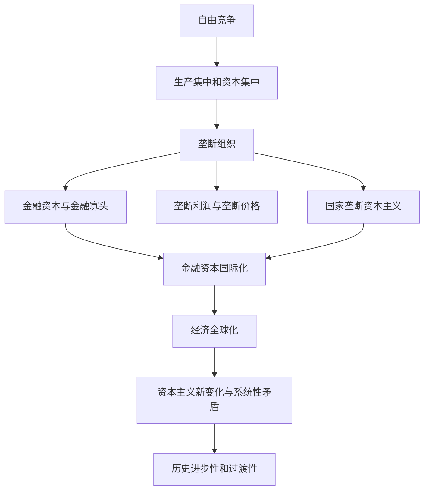

import { Callout } from 'fumadocs-ui/components/callout';

# 第五章 资本主义的发展及其趋势

> **复习定位：高频综合选择题章。** 所给分类真题收录 **16道**，其中**2017—2026年10道**；《肖1000题精简版》收录单选知识点11条、多选知识点33条，合计44条。**考点81（6道）是本章最高频**，其次为考点79（4道）、考点78（3道）。考点82、83未被所给分类文件单列真题，仍要掌握其与考点81相衔接的核心结论。

<Callout type="info" title="本章的主线">
自由竞争推动生产、资本集中 → 垄断形成但竞争不消失 → 金融资本、金融寡头与垄断利润 → 国家垄断资本主义、国际垄断与全球化 → 当代资本主义在制度框架内调整 → 历史进步性与基本矛盾并存 → 向更高社会形态过渡是长期过程。
</Callout>

## 一、题量分布与复习优先级

| 原考点 | 分类真题 | 重点等级 | 必须掌握的辨析 |
| --- | ---: | --- | --- |
| 78 资本主义从自由竞争到垄断 | 3 | **高** | 垄断与竞争；金融寡头；垄断价格与价值规律 |
| 79 垄断资本主义的发展 | 4 | **高** | 国家垄断形式；金融自由化与金融创新；国际协调边界 |
| 80 经济全球化及其影响 | 1 | **高（近年）** | 动因、主要表现、受益差异与风险 |
| **81 二战后资本主义的变化及其实质** | **6** | **最高** | 法人资本所有制、职业经理、劳资关系、变化根源 |
| 82 当代资本主义变化的新特征 | 0 | 中 | 国际金融资本的垄断、产业空心化、结构变化 |
| 83 世界大变局下资本主义的矛盾与冲突 | 0 | 中 | 经济发展失调、政治体制失灵、社会融合失效 |
| 84 资本主义的历史地位和发展趋势 | 2 | **高** | 过渡性与长期性并不矛盾 |

> 统计口径是提供资料中的 `ExamQuestion` 条目，而非考研政治全部年份、全部试卷的客观频率。肖1000题的44条是**精简版知识点条目**，不是完整原版的44道练习题。无单列真题的考点仍可能被其他考点综合考查。

---

## 考点78 资本主义从自由竞争到垄断

### 1. 从集中到垄断：因果链不能倒置

资本主义的发展经历**自由竞争资本主义**和**垄断资本主义**两大阶段；私人垄断资本主义与国家垄断资本主义是垄断资本主义的不同形式。生产集中、资本集中随竞争发展，到一定阶段促使少数大企业通过协议或联合操纵生产、销售与价格，从而形成垄断。

| 容易混淆的概念 | 准确含义 | 选择题提示 |
| --- | --- | --- |
| **生产集中** | 生产资料、劳动力和生产规模集中于少数企业 | 强调工厂、产量、劳动力和市场份额的集中 |
| **资本集中** | 通过兼并、联合使既有资本聚合 | 强调大资本吞并小资本、联合或收购 |
| **资本积累** | 把剩余价值再转化为资本 | 强调剩余价值资本化，属于第四章基础 |
| **资本积聚** | 单个资本因自身积累而扩大 | 强调依靠积累扩大单个资本规模 |
| **垄断** | 少数大企业通过联合、协议控制市场以获取高额利润 | 不是“整个行业已经没有竞争” |

垄断形成的三个基本原因：**生产和资本高度集中**、巨大企业规模本身限制竞争、竞争各方为了避免两败俱伤而达成联合。初级垄断形式可以是短期价格协定；卡特尔、辛迪加、托拉斯和康采恩等形式不同，**操纵市场、取得高额垄断利润的本质相同**。

### 2. 垄断没有消灭竞争

**原因分三层：**&#x2060;首先，资本主义私有制和商品经济仍存在，竞争的经济基础未消失；其次，垄断企业必须借助竞争维持、扩大其支配地位；最后，社会生产部门众多，没有一家垄断企业可以控制所有活动。

**竞争范围分四组：**&#x2060;垄断组织内部、垄断组织之间、垄断组织与非垄断企业之间、非垄断企业之间。与自由竞争相比，垄断条件下的竞争在**目的**（争夺高额垄断利润和支配地位）、**手段**（经济手段之外还可能动用非经济手段）、**范围**（从国内扩展到国际、从经济领域扩展到其他领域）上都更复杂。

<Callout type="warn" title="高频错误选项">
“垄断消除了自由竞争的经济条件”“垄断必然缓和市场竞争”“非垄断企业之间不再竞争”均不符合本章原理。**2006年多选第22题：ABC**，把“垄断使竞争趋于缓和”作为排除项。
</Callout>

### 3. 金融资本、金融寡头：三种联系，三种影响方式

- **金融资本**：工业垄断资本与银行垄断资本融合形成的垄断资本，主要借助**金融联系、资本参与、人事参与**形成。
- **金融寡头**：在金融资本基础上形成、控制经济命脉并对国家政权施加决定性影响的少数垄断资本家或集团。
- **经济控制**靠“**参与制**”（持股、层层控制企业）；**政治控制**主要靠同政府的“**个人联合**”；政策咨询机构、媒体和其他上层建筑领域是施加影响的渠道。

**2011年多选第18题：ABC。**“借媒体实现**国民思想意识的一元化**”不是可认定已经实现的控制结果；要区别“施加影响”和“实现绝对统一”。

### 4. 垄断利润、垄断高价与低价

垄断利润的实质是凭借垄断地位得到的、**超过平均利润的高额利润**，其最终来源仍是劳动人民创造的剩余价值，而**不是垄断凭空创造了新价值**。常见获取途径：加强剥削本国劳动者；通过垄断价格取得其他企业的一部分利润；从其他国家获取利润；利用国家再分配取得收入。

| 概念 | 判断关键词 | 注意 |
| --- | --- | --- |
| **垄断高价** | 垄断企业销售商品时高于生产价格的定价 | 卖方凭垄断地位得利 |
| **垄断低价** | 垄断企业购买原料时低于生产价格的定价 | 买方凭垄断地位得利 |
| **成本价格** | 资本家耗费的不变资本与可变资本，即 $k=c+v$ | 成本核算的下限，不等于商品价值 |
| **生产价格** | 成本价格加平均利润，即 $P=k+\overline p$ | 不等于成本价格 |
| **商品价值** | $W=c+v+m$ | 来自劳动价值论的范畴 |

**2023年单选第4题：A，成本价格。**&#x2060;问的是企业为避免**净亏损**在该简化理论题中可接受的最低价；达到生产价格意味着还可取得平均利润，故不能将生产价格当作“不亏损”的最低界限。若有数值题，先确认问“回收成本”“平均利润”还是“垄断利润”，再选比较基准。

**垄断价格不否定价值规律：**&#x2060;从全社会的理论总量上，商品价值仍由社会必要劳动时间决定；垄断价格改变的是价值和剩余价值**在不同资本之间的分配**及价值规律的表现形式，不增加社会已创造的价值总量。1998年理科多选第15题 **ACD**；不选“价格围绕价值或生产价格波动”，因为此处所考的是垄断阶段的价格形成特点。

**肖1000精简版对应：**&#x2060;单选1—6、多选1—8。至少能解释“为什么垄断与竞争共存”和“为什么垄断高价不是价值的新来源”两道开放式自测题。

---

## 考点79 垄断资本主义的发展

### 1. 国家垄断资本主义的定义与形成原因

**国家垄断资本主义＝资本主义国家政权与私人垄断资本相融合的形式**，并不意味着它已经变成社会主义。出现原因：①社会化大生产要求在更大范围支配生产资料；②经济波动和危机深化，单靠私人资本难以应付；③统筹利益、缓和社会矛盾的需求。其存在反映资本主义生产关系的**局部调整**，不是基本制度性质的根本改变。

### 2. 五种形式和微观规制三分类

| 主要形式 | 典型识别场景 | 反向排除 |
| --- | --- | --- |
| ①国家所有、直接经营企业 | 国家持有企业并经营 | 不等于天然具有社会主义性质 |
| ②国家与私人共同所有、合营 | 公私共同出资 | 不等于私人资本完全退出 |
| ③国家参与私人资本再生产 | 政府订单、补贴、福利支出带动市场需求 | 与宏观总量调节有所区别 |
| ④**宏观调节** | 财政政策、货币政策调节总供需 | 不属于微观规制三类型 |
| ⑤**微观规制** | 规范竞争行为、公共事业价格和社会经济秩序 | 不是“公众生活规制”这个命题干扰项 |

微观规制三类：**反托拉斯法、公共事业规制、社会经济规制**。反托拉斯法管市场垄断与不正当竞争；公共事业规制主要针对电力、供水、交通等自然垄断产业；社会经济规制关注消费者权益、劳工保护、生态、食品安全等。**2015年多选第21题：ABD**，错误项是“公众生活规制”；概念不要自行扩充为第四类。

国家垄断资本主义具有两面作用：一定程度上适应社会化大生产、改善经济调节和部分民生；但从本章理论立场看，它依然服务于私人垄断资本的统治及利润获取，**不能根本消除资本主义基本矛盾**。

### 3. 金融自由化、金融创新和金融化

**2023年多选第20题：AC。**&#x2060;20世纪70年代布雷顿森林体系解体之后，金融垄断资本壮大的两项重要制度条件是**金融自由化、金融创新**；加强管制与金融危机频繁发生不属于该题要找的促进性制度条件。

- **金融自由化**：放松利率、外汇及金融机构业务限制等，推动跨市场经营。
- **金融创新**：衍生品、证券化和融资技术、金融机构业务组织的创新。
- **金融化**：金融业和金融资产在经济及利润分配中的比重扩大，虚拟经济发展与实体经济的关系愈发复杂。

区别：金融创新是**工具与方式**，金融自由化是**规则与制度环境**；金融危机是金融化可能引发的风险后果，不能偷换为它得以形成的制度基础。

### 4. 资本输出、国际垄断同盟与经济协调

垄断资本向国际扩展的**三种形式**：借贷资本输出、生产资本输出、商品资本输出。基本动因：在国外谋求高额利润、转移部分非关键技术形成优势、拓展销售市场、确保原料与能源供给。资本输出对输入国可能带来资金、就业、技术和市场机会，也可能造成债务、依赖、产业受制和环境代价，不能笼统说“纯受益”或“只有危害”。

| 国际化概念 | 主要内容 | 陷阱 |
| --- | --- | --- |
| **跨国公司** | 资本跨境生产经营的重要组织载体 | 不能把所有跨国经营都等同国际卡特尔 |
| **国际垄断同盟** | 各国垄断组织以协议在经济上分割市场、巩固垄断 | 早期常见国际卡特尔；当代教材强调国家垄断资本主义国际联盟 |
| **国际经济协调机制** | 国际金融、贸易及区域合作机构 | 能促进协调，但不能确保消除全球危机 |

**2020年多选第21题：ABD。**&#x2060;国际经济机构可以加强经济联系、推动商品和服务贸易以及资本技术流动；**“有效应对全球性危机”**&#x2060;用语过强。**2006年多选第22题：ABC**同时考查垄断资本主义的基本特征：垄断组织起决定作用、金融寡头统治、资本输出重要性，另外还有国际垄断同盟与领土瓜分等历史特征。

**肖题对应：**&#x2060;单选7—8；多选9—15（按所给精简版单多选编号）。复习时从“定义—形式—作用—局限”四列回忆，比死背散句更稳固。

---

## 考点80 经济全球化及其影响

**本考点是近年新题着重落点：2024年多选第21题，答案ABD。**

### 1. 经济全球化表现与动因

三方面表现：**生产全球化、贸易全球化、金融全球化**。形成与迅速发展的主线是：

1. **科学技术进步和生产力发展**提供物质基础与根本推动力，信息技术降低信息传递和协调成本。
2. **跨国公司**为国际分工、跨国组织生产提供组织载体。
3. **各国经济体制变革及国际经济组织的发展**为跨境要素流动、贸易投资提供制度与组织条件。

> 2024年试题中的信息技术、国际分工与比较优势、市场开放都应选；“**广大发展中国家成为主要受益者**”则夸大了既有全球收益分配状况，故不选C。注意区别全球化**总体促进生产力**与**国家间收益不平等**两个命题。

### 2. 双刃剑判断模型

| 正面效应 | 潜在负面效应 | 解题原则 |
| --- | --- | --- |
| 要素跨境流动与社会分工扩大 | 收益分配存在不平衡 | 不把发展中国家一律视为主要受益者 |
| 促进生产力、贸易与技术传播 | 资源环境代价及产业风险 | 全球化是客观趋势，不等于只有好处 |
| 有利于一些发展中国家参与全球生产网络 | 经济波动跨境传导、外部依赖风险 | 不归咎全球化本身是**一切危机**的原因 |

**肖题对应：**&#x2060;多选16—18（全球化动因、影响、利弊），尤其要练“绝对化断言”和“不同受益主体”的排除法。

---

## 考点81 第二次世界大战后资本主义的变化及其实质

<Callout type="info" title="本章最应优先掌握的考点">
所给分类真题**6道**集中在2013、2014、2017、2018、2022、2025年，覆盖**所有制、管理阶层、劳动结构、劳资关系和变化原因**。属于典型“基础概念套现实新材料”的选择题群。
</Callout>

### 1. 资本所有制：按照历史阶段排序

| 时段 | 主要所有制形式 | 题目关键词 |
| --- | --- | --- |
| 资本主义发展初期 | 私人资本所有制 | 单个资本家直接占有与经营 |
| 19世纪末20世纪初 | 私人股份资本所有制 | 股份公司、资本所有权与控制权分离 |
| **二战以后** | **法人资本所有制**成为占主导地位的形式；国家资本所有制发挥重要作用 | 企业法人/机构法人作为主要股东，经理层负责经营 |

**2017年单选第4题：B，法人资本所有制。**&#x2060;注意“国有企业存在”不等于“国家资本所有制是当代资本主义的主导形式”。法人资本所有制在本教材框架下仍属资本雇佣劳动的资本主义关系。

### 2. 经理控制与阶级结构：别把持股、决策参与当成制度性质转换

- 资本所有权与经营控制权相分离；资本家可能以持有有价证券、获取收益为主要活动，成为食利者。
- **高级职业经理**负责大企业日常经营，是其经营活动的实际控制者：**2022年单选第4题选A**。
- **知识型、服务型劳动者增加**，劳动方式日益专业化、管理化，并不意味着劳动雇佣关系已经消失。

**2018年多选第20题：ABD。**“职工持股和参与决策使劳动者成为资本家集团的重要力量”错误；参与治理与成为占有生产资料、支配剩余价值的资本家集团成员不是同一概念。

**2025年多选第21题：BCD。**&#x2060;现代设备、管理方式变化说明生产关系随生产力进行调整、阶级层级结构发生变化，但**不能直接推导“资本主义生产资料所有制性质正在发生根本转变”**。凡遇“根本改变资本主义本质”的选项优先警惕。

### 3. 劳资关系、收入分配及劳动隶属形式

本教材列出的缓和劳资关系的三类激励制度：**职工参与决策、终身雇佣、职工持股**。福利制度与薪酬调整是另一组相关变化；这些变化不等于资本对劳动的支配关系已经消失。

**2013年多选第20题：ABD**，认准“三项制度”，不把试卷里的“职工选举管理者”误当成所列基本制度。劳动由形式上隶属于资本逐步走向**实质上隶属于资本**，联系机器生产体系和个人技能不再决定整体生产结果的变化。

### 4. 变化原因：根本、重要、外部影响要分层

| 命题问法 | 正确层级 |
| --- | --- |
| **根本推动力量** | **科学技术革命与生产力发展** |
| 重要推动力量 | 工人阶级争取自身权益的斗争 |
| 重要外部影响 | 社会主义制度显示的影响 |
| 推动因素 | 改良主义政党的改革 |

**2014年单选第4题：C**。若四个选项均是教材列出的因素，只有问“根本推动力量”才能锁定科技革命和生产力发展。

### 5. 变化的表现并不等于制度更替

此外还包括国家经济调节、金融化与危机形态、法治与社会政策变化。**判断句：二战后资本主义在制度基本框架内发生了调整，资本主义经济规律和基本矛盾没有被根本消除。**

**肖题对应：**&#x2060;单选9—10、多选19—26；与上述2013—2025真题交叉练习。复习尤其要关注“变化≠性质根本变化”“经营控制权≠法律所有权”。

---

## 考点82 当代资本主义变化的新特征

这部分在给定分类真题中**没有独立题目**，建议作为考点81的**延伸辨析**掌握，而不必在初轮投入与考点81同等时长。

- **科技创新加速生产方式变化**：产业结构调整、生产组织和劳动形式变化、新经济业态出现。
- **国际金融资本垄断的影响扩大**：金融寡头化、金融国际化、经济虚拟化与产业空心化。依本教材表述，这是当代资本主义**最突出、最鲜明、最主要的特征**。
- **阶级阶层结构复杂多样**：专业技术人员、知识劳动者及多样化雇佣方式等。
- **国际经济政治关系中的权力失衡**：部分发达国家凭借综合优势推行霸权主义和强权政治。

**鉴别题：**“新经济形态出现”属于科技创新引发的生产方式变化；“金融垄断寡头化”属于国际金融垄断资本主义影响。两者同属新变化，但具体归类不同。**肖题单选第11条、多选27—29**直接对应国际金融资本垄断及当代新变化。

## 考点83 世界大变局下资本主义的矛盾与冲突

教材概括为三组：①**经济发展失调**（虚拟与实体经济失衡、债务风险、福利压力）；②**政治体制失灵**（治理僵局、政党与国家利益张力等）；③**社会融合机制失效**（极端思潮、社会流动受阻、社会矛盾激化）。

这组知识点更适合用来解释综合材料题中描述的现象。**深层原因仍应回扣资本主义基本矛盾**，不能把个别政策失误、某次金融创新或某个企业的经营问题简单当作制度性矛盾的唯一根源。所给分类真题暂未按考点83独立列题，首轮以三个标题和各自典型表现为主。

---

## 考点84 资本主义的历史地位和发展趋势

### 1. 一分为二认识历史地位

资本主义曾极大解放和发展社会生产力：科学技术转为生产力，逐利与竞争推动生产扩大，相关政治和意识形态结构在特定历史条件下促进了社会进步。与此同时，它仍存在**生产社会化与生产资料资本主义私人占有的矛盾**，表现为经济危机、财富分化及社会冲突。

**2021年单选第4题：D。**&#x2060;马克思关于资本主义在发展生产力时也准备新社会物质条件的论述，说明它是**历史的、过渡性的生产方式**，而非永久不变或完全阻碍生产力。

### 2. “历史必然”与“短期消亡”完全不同

按本章理论，社会主义取代资本主义具有历史趋势意义，但过程**长期、复杂、曲折**，原因至少包括：资本主义仍有一定**自我调节能力**，不同国家经济政治发展**不平衡**，其生产关系仍可在一定阶段内**容纳生产力的发展**。

**2019年多选第20题：ABD。**&#x2060;不要选择“任何社会形态都有绝对稳定性”，因为这违背社会形态的历史性和变化发展规律。

### 3. 综合辨析：四句话同时成立

1. 资本主义创造过巨大历史进步，**不等于**其基本矛盾永远可解。
2. 国家垄断、福利与企业治理制度能作局部调整，**不等于**资本主义所有制性质改变。
3. 发展存在不平衡且有自我调节空间，**不等于**社会形态更替有绝对稳定性。
4. 社会主义替代资本主义的历史趋势，**不等于**可以预报某国的具体转变时间表。

---

## 二、16道分类真题速查：复习时先遮住答案自测

| 年份—题号 | 答案 | 对应考点 | 最值得记的出题转换 |
| --- | --- | --- | --- |
| 2023-4 | A | 78 | 防净亏损最低价＝成本价格 |
| 2011-18 | ABC | 78 | 经济参与制、政治个人联合、政策机构 |
| 1998理-15 | ACD | 78 | 垄断价格并未否定价值规律 |
| 2023-20 | AC | 79 | 金融创新＋金融自由化 |
| 2020-21 | ABD | 79 | 国际协调不能保证有效应对全球性危机 |
| 2015-21 | ABD | 79 | 微观规制三类型 |
| 2006-22 | ABC | 79 | 垄断资本主义基本特征 |
| 2024-21 | ABD | 80 | 全球化驱动因素及发展中国家受益差异 |
| 2025-21 | BCD | 81 | 生产方式变化不等于私有制性质根本改变 |
| 2022-4 | A | 81 | 大公司实际经营控制者＝高级职业经理 |
| 2018-20 | ABD | 81 | 阶层结构变化≠工人成为资本家集团 |
| 2017-4 | B | 81 | 当代占主导地位的法人资本所有制 |
| 2014-4 | C | 81 | 新变化的根本推动力量是生产力与科技 |
| 2013-20 | ABD | 81 | 缓和劳资关系的三项激励制度 |
| 2021-4 | D | 84 | 资本主义历史过渡性 |
| 2019-20 | ABD | 84 | 替代趋势的历史长期性 |

## 三、做题时的“极限词”排雷与复习检查

| 题干中的绝对化说法 | 正确判断 |
| --- | --- |
| 垄断意味着**不再竞争** | 错：竞争更复杂、更激烈 |
| 垄断高价能够**增加全社会价值总量** | 错：是价值、剩余价值的重新分配 |
| 国家垄断资本主义**已经改变资本主义本质** | 错：是资本主义制度框架内的局部调整 |
| 国际经济组织可**有效消除全球性危机** | 错：协调有作用但有局限 |
| 经济全球化中**发展中国家普遍成为主要受益者** | 错：收益存在不均衡 |
| 法人资本所有制等于**高级职业经理拥有全部资本所有权** | 错：所有权与经营控制权应分别判断 |
| 资本主义有调整空间，所以**永远不会被取代** | 错：历史趋势与长期性可以并存 |

<Callout type="success" title="本章完成标准">
能独立口述“垄断形成与竞争共存的三原因”“金融寡头经济/政治控制的两条路径”“国家垄断资本主义五形式与三规制”“资本主义新变化的四个原因”“历史必然与长期性的关系”，并能不看答案解释2023-4、2024-21、2025-21、2019-20的干扰项，即达到本章主要选择题复习要求。
</Callout>

**材料依据：**&#x2060;所提供《精讲精练·马克思主义基本原理》第五章考点78—84；《政治分类真题·马原》第五章条目128—143；《肖1000题精简版·马原》第五章单选1—11、多选1—33。所有题号及答案按附件整理，未将精简版条目数视为原版原题总数。
