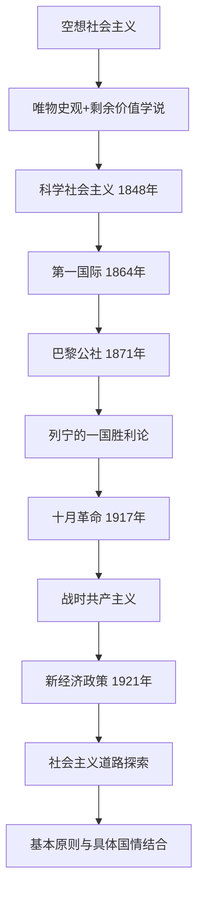

# 第六章 社会主义的发展及其规律

> **复习定位：时间线与理论辨析并重。** 本章对应分类真题 **11道**，其中2017—2026年 **6道**；《肖1000题精简版》单选8条、多选18条，合计26条。题目分散在考点85—91，但**考点88（3道）**&#x2060;涉及政策对比及社会主义建设道路探索，适合重点讲透；其次需熟练掌握考点85的“两大发现”、考点87的“一国胜利论”、考点90—91的“原则与本国实际相结合”。

<Callout type="info" title="本章时间线和思想线是同一条链">
空想社会主义的产生与发展 → 唯物史观、剩余价值学说奠定科学社会主义基础 → 1848年《共产党宣言》 → 1864年第一国际 → 1871年巴黎公社 → 列宁“一国胜利论” → 1917年十月革命 → 战时共产主义 → 1921年新经济政策 → 探索符合国情的社会主义建设道路。
</Callout>

## 一、真题密度和学习任务

| 原考点 | 真题道数 | 复习重点 |
| --- | ---: | --- |
| 85 社会主义从空想到科学 | 2 | 早期著作、三大空想社会主义者、唯物史观与剩余价值学说 |
| 86 第一国际与巴黎公社 | 1 | 无产阶级政权的基本经验 |
| 87 十月革命胜利与第一个社会主义国家 | 1 | 资本主义发展不平衡与一国胜利 |
| **88 社会主义在苏联的实践** | **3** | **战时共产主义 vs 新经济政策**，列宁建设社会主义的新构想 |
| 89 科学社会主义基本原则的主要内容 | 1 | 核心命题、无产阶级政党与社会主义的基本原则 |
| 90 正确把握科学社会主义基本原则 | 1 | 原理与本国实际、时代特征相结合 |
| 91 社会主义建设的长期性和道路多样性 | 2 | 多样性三原因、长期性四因素、反对模式教条化 |

---

## 考点85 社会主义从空想到科学

### 1. 三个阶段、三个代表、两项理论发现

| 历史阶段 | 核心代表与作品 | 考试抓手 |
| --- | --- | --- |
| 16—17世纪早期空想社会主义 | 托马斯·莫尔1516年发表《乌托邦》 | 《乌托邦》是空想社会主义开山之作 |
| 18世纪空想平均共产主义 | 摩莱里、马布利等 | 提出过渡设想，尚非科学理论 |
| **19世纪初批判的空想社会主义** | **圣西门、傅立叶、欧文** | **科学社会主义的直接思想来源** |
| **1848年** | **马克思、恩格斯发表《共产党宣言》** | **科学社会主义问世的标志** |

科学社会主义理论创立的**两大基石**：**唯物史观与剩余价值学说**。前者科学揭示社会历史发展规律与推动力量；后者揭示资本主义剥削的经济机制和内在矛盾。这使对新社会的展望从伦理批判与主观愿望转向对社会规律的分析。

<Callout type="warn" title="题干问“两大基石”时，不要改选相近学说">
**2011年多选第20题：CD（唯物史观＋剩余价值理论）**。阶级斗争学说、劳动价值论具有重要理论地位，却不是这道题所问“社会主义由空想变为科学的两大理论基石”的固定答案。
</Callout>

### 2. 空想社会主义的贡献与缺陷

**贡献**：对资本主义制度展开深刻批判；对理想社会作出有启发性的设想，成为早期无产阶级社会意识的重要先声。

**缺陷**可以按“为何灭亡—谁来实现—如何实现”三问记忆：

1. 看出资本主义问题，却未科学揭示其**经济根源**。
2. 呼吁新的社会，却未找到能够推翻旧制度的**现实阶级力量**。
3. 描绘美好社会，却未找到通往目标的**现实道路**。

**2016年多选第21题：AC。**&#x2060;科学社会主义超越空想社会主义，在于揭示资本主义必然灭亡的经济根源，找到现实道路；“批判资本主义”“描绘理想社会”在空想社会主义阶段已存在，不能作为独有超越性；“细致描绘未来社会”反而不符合科学方法。

**肖题对应：**&#x2060;单选1—3、多选1—2。把“开山之作”“直接思想来源”“科学诞生标志”“理论基石”做成四张卡片，防止这些不同问法相互替代。

---

## 考点86 第一国际与巴黎公社

- **1864年第一国际**（国际工人协会）成立。马克思是其理论与组织活动的核心人物之一；它促进马克思主义传播及与工人运动结合，并初步确立其在工人运动中的指导地位。
- **1871年巴黎公社革命**是无产阶级夺取政权的**第一次伟大尝试**；它并不是建立世界上第一个社会主义国家的革命，后者应对应十月革命。

### 1. 巴黎公社的四项经验

1. 革命取得成功并保持胜利成果，需要**革命武装**。
2. 不能简单沿用旧国家机器，要**打碎旧国家机器，建立新型国家政权**。
3. 新政权应成为**为人民服务的机关**。
4. 必须发挥**无产阶级政党的政治领导作用**。

**2021年多选第21题：ABCD**。四种表述共同构成教材总结，不能因它们关注政权建设、军队建设和党的建设等不同层面而排除。

### 2. 防止公仆变主人的两项措施

**公职人员选举制和撤换制**；**取消高薪制，使公职人员薪酬受到严格限制**。考试常将其与“苏维埃代表大会制度”“已建立成熟政党领导体系”等属于其他历史阶段的内容混淆。

**肖题对应：**&#x2060;单选4、多选3—5。顺便理解“第一国际精神的产儿”不等于“第一国际直接发起并领导巴黎公社革命”。

---

## 考点87 十月革命胜利与第一个社会主义国家的建立

### 1. 俄国十月革命回答了怎样的问题

马克思、恩格斯分析了资本主义矛盾与无产阶级的历史使命。列宁在帝国主义阶段进一步提出：**经济和政治发展不平衡是资本主义的绝对规律**，因此社会主义革命**可能首先在少数甚至一个资本主义国家内取得胜利**，即“一国胜利论”。它不是说“任意国家在任何条件下必然先胜利”，而是说明世界资本主义发展不平衡造成革命突破的可能性。

**2025年单选第4题：C，资本主义各国发展极不平衡。**&#x2060;不选“国际无产阶级大联盟已经形成”，也不选“工人革命意识与经济发展水平必然正相关”；后者恰恰不符合发展不平衡条件下的现实问题。

### 2. 三个常见历史判断

| 表述 | 结论 |
| --- | --- |
| 社会主义从空想变为科学 | 19世纪中叶，唯物史观与剩余价值学说及《共产党宣言》 |
| 无产阶级夺取政权的第一次伟大尝试 | **1871年巴黎公社** |
| 社会主义从理想变为现实，建立第一个社会主义国家 | **1917年俄国十月革命** |

**肖题对应：**&#x2060;单选5。特别区分“一个或者几个国家可能首先胜利”与“只有先在所有发达国家同时胜利才可能建国”。

---

## 考点88 社会主义在苏联的实践

<Callout type="info" title="本章最大得分抓手：两种政策的反向对照">
出题可同时考查“战时共产主义的内容”“新经济政策为何出现”“新经济政策的标志性措施”“列宁的思想方法”。做题前先确定政策所处**战争时期或和平建设时期**。
</Callout>

### 1. 列宁时期社会主义建设探索的三阶段

1. **1917年11月至1918年春**：巩固新生苏维埃政权。
2. **1918年夏至1921年春**：面对外国武装干涉和国内战争，实施**战时共产主义政策**。
3. **1921年3月起**：俄共（布）十大决定转向**新经济政策**，以发展商品经济、恢复生产和改善工农联盟为重要取向。

### 2. 战时共产主义 vs 新经济政策（必须完整背）

| 对比维度 | **战时共产主义政策** | **新经济政策** |
| --- | --- | --- |
| 背景 | 国内战争、外国武装干涉，临时性非常措施 | 战争结束、经济与政治危机严重，转入和平建设 |
| 农产品征集 | **余粮收集制** | **粮食税制取代余粮收集制** |
| 商品交换 | **取消商品货币关系** | **恢复商品货币关系、允许私人自由贸易** |
| 经济主体 | 高度集中与强制性措施 | 允许私人小工业、部分国家资本主义形式 |
| 核心特征 | 面向战争需要的临时集中 | **发展商品经济** |
| 历史作用 | 保卫新生苏维埃政权 | 活跃经济、恢复生产，开始更符合俄国国情的探索 |

**2023年多选第21题：AB**，战时共产主义的主要政策是余粮收集制、取消商品货币关系。选“发展多种所有制”等内容，会把新经济政策与战时政策混淆。

**2011年单选第4题：B**，新经济政策之所以被肯定，关键不是它已经形成成熟、完整的社会主义模式，而是**从俄国具体情况出发探索社会主义建设道路**。

### 3. 列宁对社会主义建设规律的探索

新经济政策期间，列宁的重要认识包括：

- 社会主义建设是一个**长期探索、不断实践**的过程。
- **发展生产力、提高劳动生产率**具有重要位置。
- 在**多种经济成分并存**条件下，可以利用商品、货币与市场。
- 可以学习和利用资本主义的有益因素来建设社会主义。

**2017年多选第21题：ABCD**。本题四项并列正确；答题关键在于理解“运用市场机制”并不等于放弃社会主义目标，也不是对任何既定模式一成不变地照搬。

列宁晚年的建设构想还包括：以合作社引导农民、发展大工业与电气化、提高文化教育水平、改善党和国家机构、反对官僚主义、健全民主法制。这组属于**进一步扩展认识**，首轮先掌握上面的四句核心。

### 4. 苏联模式的历史定位

苏联模式形成于20世纪20年代末至30年代初，是**特定历史条件**下形成的制度与治理安排，不能被当作社会主义制度的唯一具体形式。评估某种模式的成败，应区分社会主义基本原则与某种历史条件下的**具体实现模式**。

**肖题对应：**&#x2060;单选6、多选6—12。重点做反向判断：“取消粮食税制”“只凭照搬经典作家具体方案”“一项具体苏联模式等于科学社会主义本身”均为典型误判方向。

---

## 考点89 科学社会主义基本原则的主要内容

### 1. 核心命题与“为何”

**“资本主义必然灭亡，社会主义必然胜利”是科学社会主义的核心命题**，根本依据在于社会发展规律，不是某次局部政策变动。在本教材框架下，概括原则时应沿着**社会发展方向—阶级力量—革命与国家政权—社会经济制度—党的领导—最终目标**来理解。

### 2. 十项原则的结构化记忆

| 层次 | 具体内容 |
| --- | --- |
| 历史趋势 | 资本主义必然灭亡，社会主义必然胜利 |
| 革命力量 | 无产阶级承担历史使命；无产阶级革命和建立新型国家政权 |
| 经济组织 | 生产资料公有制，按社会需要组织生产，有计划地指导和调节生产，社会主义阶段实行按劳分配 |
| 自然与文化 | 尊重自然规律，促进人与自然和谐；发展社会主义先进文化 |
| 政治领导 | **无产阶级政党是先锋队，社会主义事业坚持党的领导** |
| 发展目标 | 解放发展生产力，逐步消除剥削与两极分化，实现共同富裕和社会进步，最终迈向共产主义 |

<Callout type="warn" title="问阶级属性与先进性的逻辑">
**2015年单选第4题：B**。马克思主义政党以**工人阶级为基础**；“政党即整个工人阶级”“政党的先进性决定工人阶级先进性”均属倒置或等同。政党的阶级性与先进性有关，但不能机械互换其逻辑位置。
</Callout>

**肖题对应：**&#x2060;单选7、多选13。不要把原则列表当成“所有国家、所有时代都适用同一张具体操作清单”。

---

## 考点90 正确把握科学社会主义基本原则

**三项要求同时成立：**

1. **坚持原则**，不因现实问题否定科学社会主义的基本立场。
2. **结合本国国情与时代条件**，创造性解决革命、建设、改革中出现的实际问题。
3. **不断发展理论**，在新的实践中丰富对社会主义规律的认识。

**2019年多选第21题：ACD。**&#x2060;题干强调中国现代化道路不是对任何一种现成模板的直接复制。其启示是：科学社会主义继承人类优秀文化成果、不是凝固教条，在不同时代体现不同内容和形式。**“科学社会主义与资本主义生产方式没有必然联系”**&#x2060;与科学社会主义建立在对资本主义现实运动分析之上的理论前提冲突，故排除。

| 经常出现的错误表述 | 正确说法 |
| --- | --- |
| 坚持原则＝直接套用经典著作给出的全部具体措施 | 原则是基本遵循，不是现成的万能政策配方 |
| 结合本国实际＝抛弃科学社会主义原则 | 原则与创造性运用并不对立 |
| 理论需发展＝基本立场和科学方法必然根本改变 | 发展理论不等于否定其科学基础 |

**肖题对应：**&#x2060;多选14。能够在不给示例的情况下解释“坚持科学原则”和“走自己的路”为何能够同时成立，就达到了此考点的训练目标。

---

## 考点91 社会主义建设过程的长期性和发展道路的多样性

### 1. 长期性的四个原因

- 经济文化基础相对薄弱的国家建设社会主义，受**生产力发展状况**制约。
- **经济基础与上层建筑**的发展和协调需要时间。
- 国际力量对比与国际环境可能带来长期压力与挑战。
- 执政党探索社会主义发展道路、提高对建设规律的认识，需要实践和经验积累。

注意：历史发展存在困难，**不能**由此推导“社会主义没有前进方向”；过程的曲折性与历史发展的前进性可以并存。

### 2. 多样性的三个主要原因（真题直接对应）

| 影响层面 | 对应的教材说法 | 题目典型陷阱 |
| --- | --- | --- |
| **决定不同特点的基础** | 各国**生产力发展状况、社会发展阶段**不同 | 把地理、人口差异当作决定因素 |
| **重要条件** | 历史文化传统差异 | 误认为所有国家文化背景应被同化 |
| **现实原因** | **时代与实践不断发展** | 误认为建成社会主义后不需继续探索 |

**2018年多选第21题：ABD。**&#x2060;题干考的是具体原因的归类，人口和地理条件可能构成国情背景，但不是这里要求的“决定性因素”。

**2013年多选第21题：ABCD。**&#x2060;应完整掌握四组“不等于”：坚持社会主义不等于坚持唯一模式；发展社会主义不等于拒绝学习其他文明成果；改革某种模式不等于抛弃社会主义；某种模式遭遇挫折不等于整个社会主义事业失败。

### 3. 探索本国道路的方法

**坚持科学态度、从当时当地出发、吸收人类优秀文明成果**。避免机械套用他国制度、把个别发展经验无限上升为普遍规律，也避免脱离基本原则的任意变更。

**肖题对应：**&#x2060;多选15—18。建议完成“某国探索发展道路”的材料题时先找：①该国生产力阶段；②历史文化约束；③时代变化；④具体制度选择是否符合基本原则。

---

## 二、11道分类真题交叉复盘

| 年份—题号 | 答案 | 考点 | 一句话解题依据 |
| --- | --- | --- | --- |
| 2016-21 | AC | 85 | 科学社会主义找到经济根源和现实道路 |
| 2011-20 | CD | 85 | 唯物史观＋剩余价值理论 |
| 2021-21 | ABCD | 86 | 巴黎公社的四项历史经验 |
| 2025-4 | C | 87 | 资本主义经济政治发展不平衡 |
| 2023-21 | AB | 88 | 战时共产主义：余粮收集、取消商品货币 |
| 2017-21 | ABCD | 88 | 列宁探索社会主义建设的四个方向 |
| 2011-4 | B | 88 | 新经济政策从俄国国情出发 |
| 2015-4 | B | 89 | 马克思主义政党以工人阶级为基础 |
| 2019-21 | ACD | 90 | 坚持原则而不照搬模板 |
| 2018-21 | ABD | 91 | 发展阶段、文化传统、时代实践导致道路多样 |
| 2013-21 | ABCD | 91 | 模式多样、可以学习其他文明成果 |

## 三、考场易混句一眼辨识

| 说法 | 应如何修正 |
| --- | --- |
| 科学社会主义的直接思想来源是18世纪空想平均共产主义 | **19世纪初批判的空想社会主义** |
| 社会主义从空想到科学只靠批判资本主义 | 还要**唯物史观和剩余价值学说** |
| 巴黎公社已经建成世界上第一个社会主义国家 | 第一社会主义国家来自**十月革命** |
| 只允许在所有资本主义发达国家同时革命 | 列宁依据发展不平衡提出**一个或几个国家首先胜利可能性** |
| 战时共产主义允许私人自由贸易和粮食税 | **新经济政策**的内容 |
| 新经济政策意味着放弃社会主义道路 | 是**结合俄国国情探索建设道路** |
| 科学社会主义原则提供各国全部具体制度和方法 | 基本原则需**创造性结合本国条件** |
| 苏联具体模式失败等于社会主义原则失效 | **具体历史模式与基本原则不是同一层级** |

<Callout type="success" title="本章完成标准">
能脱口而出“空想→科学的两大发现”“巴黎公社四项经验”“一国胜利论的理论依据”“战时共产主义与新经济政策五维比较”“社会主义道路多样性三个原因”，再用题干判断2025-4、2023-21、2019-21的选项。
</Callout>

**材料依据：**&#x2060;所提供《精讲精练·马克思主义基本原理》第六章考点85—91；《政治分类真题·马原》第六章条目144—154；《肖1000题精简版·马原》第六章单选1—8、多选1—18。
